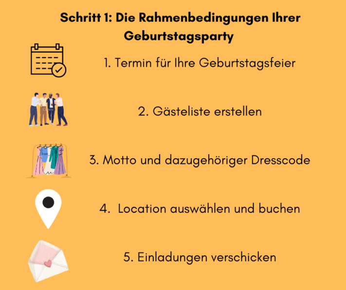
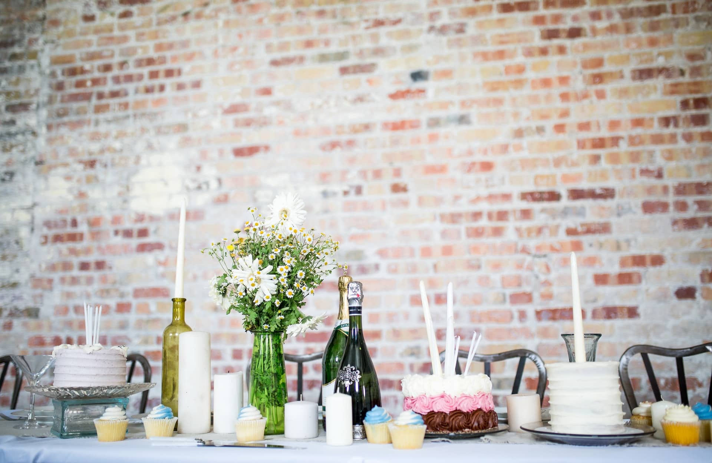

Você vai comemorar seu aniversário em breve ou quer organizar uma festa de aniversário para seus entes queridos? Para que sua festa seja única e fique na memória dos seus convidados por muito tempo, um planejamento detalhado é indispensável. Da escolha de um local dos sonhos até alimentação e música – a organização antecipada de todos os aspectos importantes da sua festa cria as condições perfeitas para uma celebração de sucesso. Não importa se é aniversário marcante, festa temática ou festa infantil: com nosso guia, você pode organizar e realizar qualquer festa.

## Passo 1: Os parâmetros básicos da sua festa de aniversário

Os primeiros passos para planejar uma festa de aniversário devem ser dados cerca de **oito semanas** antes do evento. O objetivo inicial é definir os pontos principais.

## Planejando a data da festa de aniversário

Antes de começar a planejar os detalhes da sua festa, você precisa definir uma data para a comemoração. Não se prenda necessariamente à data exata do seu aniversário, mas considere a disponibilidade dos seus convidados. Se você for comemorar com muitos adultos que trabalham, o ideal é escolher uma data no **final de semana** (sexta ou sábado). Assim, seus convidados podem aproveitar a festa ao máximo e ainda terão tempo no dia seguinte para descansar e arrumar tudo. Uma festa no final de semana também facilita a vinda de convidados que moram mais longe.

Se você está planejando uma **festa infantil**, uma tarde durante a semana também pode ser adequada. Se o aniversariante e a maioria dos convidados forem adultos, a comemoração pode começar à noite e se estender até altas horas. Ao escolher a data, leve em consideração feriados e pergunte com antecedência sobre a disponibilidade dos amigos e familiares mais próximos.

## Criando a lista de convidados para sua festa de aniversário

Depois de definir a data da sua festa, é importante começar cedo a montar a lista de convidados. Decida se prefere comemorar em um círculo íntimo com amigos e familiares próximos ou em um evento maior. Uma **mistura variada de parentes, amigos, colegas de trabalho e outros conhecidos** pode ser vantajosa. Além disso, certifique-se de que haja harmonia entre os convidados e evite possíveis conflitos. Seja qual for sua escolha, uma lista de convidados feita com antecedência traz clareza e facilita outros passos do planejamento, como a escolha do local ou o cálculo de comida e bebida.

## Tema e dress code

Tanto o **tema** quanto o **dress code** não são obrigatórios, mas podem dar um toque especial à sua festa. Um tema interessante e criativo oferece um direcionamento para o planejamento, como a escolha do local e do cardápio. Um dress code correspondente pode orientar o estilo dos convidados, garantindo que ninguém se sinta desconfortável por estar inadequado. Assim, o dress code pode criar um clima mais descontraído e contribuir positivamente para o andamento da festa.

Se você procura inspiração para temas e dress codes, aqui vão algumas ideias:

- **Baile de máscaras** – ambiente misterioso como na antiga Veneza
- **Estrelas de Hollywood** – tapete vermelho para seus convidados
- **Festa dos anos 90** – looks ousados e batidas marcantes
- **Tema de filmes ou séries** – de Disney a “La Casa de Papel”
- **Circo** – artistas, tigres e domadores como convidados
- **Carnaval** – foliões do Reno ou samba do Brasil
- **Super-heróis** – convide os heróis da Marvel e DC

## Escolhendo e reservando o local da festa

Um dos pontos mais importantes da sua festa é o local onde você vai comemorar com seus queridos. O local certo é o que torna sua festa inesquecível!

A escolha pode ser desafiadora, pois as opções parecem infinitas. Considere que o local deve combinar não só com seus convidados, mas também com as condições climáticas da **estação** e, se for o caso, com o tema da festa. Faça primeiro uma lista de critérios que o local deve atender. Pense também na possibilidade de fazer a festa em casa, ao ar livre ou em um local público. Assim, você economiza com **aluguel** e pode investir o orçamento em outras áreas. Se optar por um local externo, use seus critérios para restringir as opções.

Local diferenciado para uma festa de aniversário: alugar uma casa de férias para uma pool party.

Para festas de aniversário, são opções **restaurantes, bares ou clubes**, mas também espaços mais acessíveis como **salões de associações, quiosques de churrasco e salões de eventos**. Para aniversários marcantes, locais especiais como uma **vinícola**, **castelo** ou **casa de férias** podem ser considerados. Nesse caso, pense também no transporte e acomodação dos convidados. Ao decidir pelo local, leve sempre em conta o número de convidados e as previsões do tempo. O espaço deve ser suficiente para todos e, se possível, ter uma pista de dança. Reserve o local o quanto antes, pois os mais populares costumam ser reservados com semanas ou até meses de antecedência.

## Enviando os convites

Depois de definir a data, a lista de convidados e o local, os pontos principais da festa estão resolvidos. Agora é hora de preparar os convites para sua festa inesquecível! Com a lista pronta, você tem todos os convidados à mão.

**Dica: Save the Date**  
Para festas maiores, é útil enviar um convite “save the date” meses antes. Assim, aumenta a chance de que mais convidados possam se programar, reservar a data e conseguir folga.

Convites personalizados são uma ótima oportunidade para informar não só a data e o local da festa, mas também o tema, se houver. Se quiser, personalize cada convite para cada convidado. Isso causa uma boa impressão, aumenta a expectativa para a festa e pode aumentar o número de confirmações. Lembre-se de incluir todas as informações importantes e já definidas no convite e estabeleça um prazo para as respostas. Assim, você tem segurança para planejar e pode reagir a recusas a tempo. Também é útil perguntar sobre alergias e hábitos alimentares e se os convidados virão acompanhados de parceiros ou filhos.

## Passo 2: Os detalhes da sua festa

Depois de definir os pontos principais, é hora de cuidar dos detalhes da sua festa. O planejamento antecipado é especialmente importante nesta etapa. Por isso, pelo menos um mês antes da festa, organize pontos básicos como alimentação e música.

## Planejando a alimentação da festa de aniversário

A parte mais importante de toda festa é a alimentação dos convidados. Afinal, não importa o quão boa tenha sido a festa: ninguém vai querer lembrar de uma comemoração em que saiu com fome e sede. Se você comemorar em um **restaurante**, o planejamento é fácil: basta combinar o cardápio e as bebidas com o restaurante.

Se a festa for em casa ou em outro local, a responsabilidade pela alimentação é sua. Para garantir que haja comida e bebida suficiente, fique atento ao número de convidados. Dependendo do caso, você pode cozinhar, contratar um serviço de buffet ou pedir que os convidados tragam pratos e bebidas.

### Cuidando da alimentação dos convidados por conta própria

Assumir a alimentação dos convidados exige bastante trabalho e um cálculo cuidadoso das quantidades. Para festas maiores, faça as compras, asse bolos e prepare pratos duráveis um ou dois dias antes. Considere também hábitos alimentares, restrições e preferências dos convidados.

Se não tiver ajudantes, você mesmo terá que servir comida e bebida durante a festa. Mas lembre-se: você é o centro das atenções! Para festas com mais de 10 pessoas, recomenda-se: divirta-se, aproveite o momento com seus queridos e não passe o dia na cozinha.

### Contratando um serviço de buffet

Principalmente para festas maiores, contratar um buffet poupa tempo e estresse. Informe o número de convidados ao buffet e ele montará uma oferta adequada ao seu gosto. Se o orçamento for apertado, uma opção mais econômica é contratar um food truck, que serve pratos deliciosos no local. Considere o estilo e o tema da festa e garanta opções para todos os convidados. Algumas sugestões saborosas:

- Recepção com espumante e petiscos
- Finger food e saladas
- Buffet de churrasco
- Hambúrguer e batata frita
- Pizza e massa
- Bolos e sobremesas

### Pedindo ajuda aos convidados

Uma solução prática e econômica é pedir aos convidados que tragam comida e bebida. Assim, rapidamente se forma um buffet variado com saladas, petiscos, bolos e outras delícias. Além disso, isso poupa aos convidados a busca por presentes.

Mesmo assim, você deve planejar a parte da alimentação que seria demais pedir a um convidado, como bebidas em grande quantidade e pratos quentes. Antes das compras, vale a pena perguntar sobre as preferências dos convidados. Se a festa tiver um tema, alinhe o cardápio a ele.

## Música animada e programação variada

Depois de cuidar da alimentação, pense também na animação da festa. Música animada e uma programação variada são essenciais para manter o clima alto astral. Afinal, ninguém quer uma festa marcada pelo silêncio e conversas monótonas.

Se o local tiver bons alto-falantes, você mesmo pode montar uma playlist animada. Para uma experiência inesquecível, contrate uma banda ao vivo ou DJ, que vai animar e colocar todos para dançar. Talvez você conheça músicos ou DJs entre seus amigos e economize com isso.

Uma banda ao vivo é destaque em qualquer grande festa de aniversário.

Além de boa música, um programa variado pode valorizar sua festa. Sugestões populares:

- Jogos de festa ou quiz
- Discursos e falas curtas
- Apresentação de slides com fotos engraçadas do aniversariante
- Cantar juntos ou competição de karaokê
- Cabine de fotos ou mural para registrar lembranças da festa

Dependendo do orçamento, há inúmeras possibilidades. Seja criativo e garanta momentos inesquecíveis com uma combinação de música e entretenimento.

## Decoração e estrutura do local da festa

Para que o local da festa também impressione visualmente, pense na decoração e na estrutura. Seja em casa ou em um local alugado: ambientes bem decorados sempre agradam e fazem os convidados se sentirem bem. Considere decoração de mesa, iluminação festiva, flores, arranjos ou guirlandas – tudo pode ser adaptado ao tema da festa.

Além da decoração, para festas fora de restaurantes, pense também na estrutura. Para festas no jardim, por exemplo, é possível alugar tendas, mesas e bancos em empresas especializadas. Em festas organizadas por conta própria, verifique se há pratos, copos e talheres suficientes. O local também deve ter banheiros suficientes para todos.

## Passo 3: Os últimos preparativos para sua festa de aniversário

A festa está chegando e todos os detalhes já estão definidos? Então, cerca de uma semana antes, é hora dos preparativos finais para o grande dia.

### Preparativos finais e compras

Com o grande dia se aproximando, use o tempo restante para os últimos preparativos e compras. Se a festa for em um local alugado, entre em contato com o responsável e alinhe os preparativos no local. Se for organizar tudo sozinho, comece a arrumar o espaço, buscar equipamentos alugados e resolver as últimas pendências. Mantenha contato com os convidados, principalmente se eles estiverem ajudando no planejamento. Peça ajuda se necessário e informe sobre mudanças inesperadas com antecedência.

### Checagem final

Faltando poucos dias para a festa, faça uma checagem final. Você pensou em tudo? A comida está encomendada ou comprada? O local está pronto? Siga cada item da sua [lista de verificação](https://de.wikihow.com/Eine-Geburtstagsparty-planen) e veja se tudo está planejado.

Faltou algo? Sem problemas! Muitas coisas podem ser resolvidas até poucos dias antes. Se tudo estiver pronto e não houver mais pendências, então está tudo certo para sua festa – só nos resta desejar uma comemoração inesquecível!

## Conclusão

Organizar e planejar uma festa de aniversário – o que para muitos parece fácil, na prática pode ser um processo demorado e trabalhoso. Quem quer uma festa única e inesquecível precisa cuidar de todos os detalhes com antecedência. Com tanta coisa para fazer, é fácil esquecer alguém, pedir pouca comida e bebida ou perder o controle do orçamento.

Para evitar esses contratempos e esperar pela festa com tranquilidade, nós da SeaTable desenvolvemos um [Planejador de Festas](), que permite preparar sua festa de forma clara e estruturada, sempre de olho nos convidados. Experimente gratuitamente, basta [registrar-se]().
