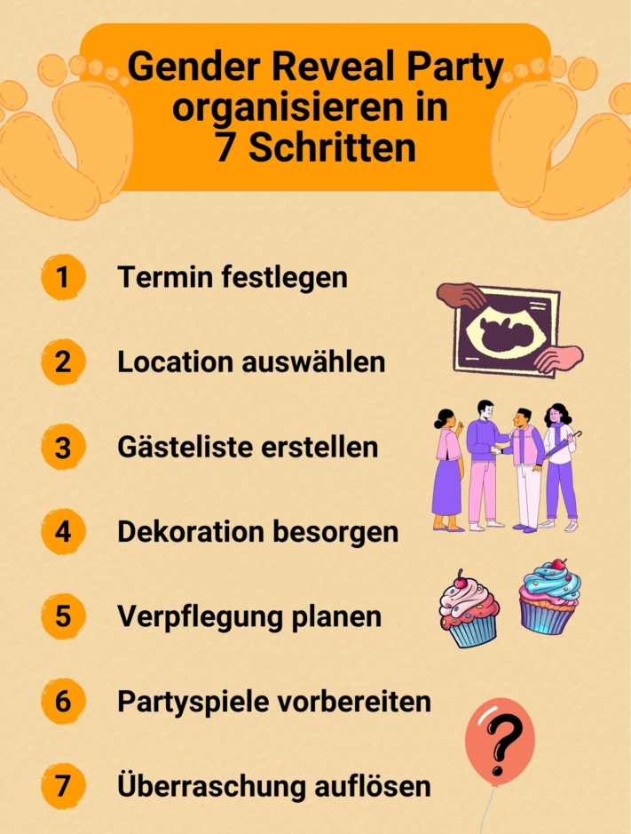
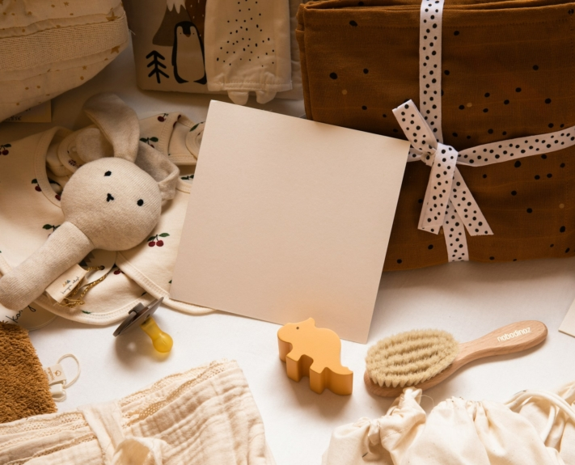

Ein Baby ist auf dem Weg und Sie möchten das gebührend feiern? Dann ist eine **Gender Reveal Party** das Richtige für Sie. Bei diesem Trend aus den USA wird das Geschlecht des Babys auf imposante Weise enthüllt. Wenn Sie solch eine **Babyparty** organisieren möchten, müssen Sie genauestens planen, wie Sie Dekoration, Essen und Programm aufeinander abstimmen.

Hier erfahren Sie, worauf Sie bei der Organisation achten sollten, damit Ihre Gender Reveal Party zu einem einmaligen Erlebnis wird.

## Was ist eine Gender Reveal Party?

Im Mittelpunkt der Gender Reveal Party steht die **Enthüllung des Geschlechts** des Babys. Die werdenden Eltern feiern gemeinsam mit Freunden und Verwandten die baldige Geburt des Kindes – und zwar mit viel Tamtam. Denn Deko, Speisen und Spiele sind bis ins kleinste Detail durchgeplant, um die Vorfreude auf die Bekanntgabe des Geschlechts zu steigern.

Um diese Frage dreht sich die ganze Feier.

Die eigentliche Enthüllung geschieht auf spektakuläre Weise. Zum Beispiel können Sie eine Torte anschneiden, die rosa oder hellblaue Füllung enthält, oder einen Luftballon zum Platzen bringen, der mit Konfetti in der jeweiligen Farbe gefüllt ist.

## Wer übernimmt die Organisation der Gender Reveal Party?

Grundsätzlich gibt es **zwei Optionen**, wer sich um die Organisation der Gender Reveal Party kümmert. Das hängt davon ab, wen der Anwesenden Sie mit der Geschlechtsenthüllung überraschen möchten.



### Überraschung für die werdenden Eltern

Die baldigen Eltern bestimmen eine **Vertrauensperson**, die als einzige das Geschlecht des Babys kennt und alle Besorgungen übernimmt, welche sich um den großen Moment drehen. Mit Zustimmung der Eltern bekommt diese Person einen Umschlag vom Frauenarzt, der zuvor das Geschlecht des Kindes auf einen Zettel geschrieben hat. Nun besteht die Aufgabe neben der Organisation darin, sich nicht zu verplappern. Dadurch wird der Moment der Enthüllung für die Eltern besonders emotional.

### Überraschung für die Gäste

Möchten die Eltern das Geschlecht ihres Kindes in Ruhe erfahren, können sie die Party als Bekanntgabe für die Gäste feiern. Natürlich können in die Planung auch Freunde und Verwandte involviert werden, um die Arbeit zu teilen. Tabu ist für sie aber alles, was den Moment der Enthüllung vorwegnehmen könnte.

## 7 Schritte zu Ihrer perfekten Babyparty

Sie möchten eine Gender Reveal Party für sich oder Ihre Freunde schmeißen, wissen aber nicht, was alles organisiert werden muss? Hier finden Sie einen Überblick, welche Aufgaben Sie auf dem Weg zu einem erfolgreichen Event erwarten.

Mit der richtigen Organisation wird Ihre Feier ein unvergessliches Ereignis.

## 1\. Termin festlegen

Wann Ihre Party steigen soll, hängt von den Wünschen der baldigen Eltern ab. Möchten diese das Geschlecht ihres Kindes sofort nach der Sicherstellung durch den Arzt erfahren, bietet sich ein Termin zwischen der **20\. und 30. Schwangerschaftswoche** an.

Es ist aber auch möglich, die Enthüllung des Geschlechts mit dem **Babyshower**, bei dem traditionell die Eltern und das Baby beschenkt werden, zusammenzulegen. Damit würde die Feier eher in das **letzte Schwangerschaftsdrittel** fallen.

Beachten Sie auch die Verfügbarkeit Ihrer Gäste. Damit möglichst viele kommen können, bietet sich die Feier an einem **Wochenende** an.

Achten Sie darauf, dass Sie die Feier nicht zu kurzfristig vor der Geburt planen.

## 2\. Location auswählen

Ob heimelig **im eigenen Zuhause** oder in einer **gemieteten Eventlocation** – Ihre Babyparty kann überall ein Hit werden. Wofür Sie sich letztlich entscheiden, hängt vor allem von der Jahres- und Tageszeit sowie von der Anzahl der Gäste ab. Wenn Sie besonders großen Wert auf schöne Fotos oder spezielle Überraschungen mit farbigem Rauch oder Feuerwerk legen, bietet sich eine Feier im **Garten oder Park** an.

## 3\. Gästeliste erstellen

Eine Gender Reveal Party ist eine intime und persönliche Angelegenheit. Daher sollten Sie nur **Menschen aus dem engsten Freundes- und Verwandtenkreis** einladen. Wenn die werdenden Eltern Sonderwünsche haben, sollten Sie diese natürlich berücksichtigen.

Mit einer **Gästeliste** verschaffen Sie sich einen ersten Überblick und können die weiteren Planungsschritte an die Anzahl der zu erwartenden Gäste anpassen.



Schicken Sie die Einladungen frühzeitig raus und legen Sie eine **Deadline für eine Zu- oder Absage** fest. Erfragen Sie auch, ob Partner oder Kinder mitkommen werden. Außerdem sollten Sie kurz erklären, wie eine Gender Reveal Party abläuft, damit die Gäste sich auf das Event vorbereiten können.

## 4\. Dekoration besorgen

Die Dekoration ist das A und O der Feier. Denn der entscheidende Hinweis auf das Geschlecht des Babys versteckt sich traditionsgemäß in einem der Deko-Stücke. Die ganze Dekoration bedient sich an einem von Ihnen ausgewählten **Farbschema**. Das können entweder klassisch **Rosa** für ein Mädchen und **Hellblau** für einen Jungen sein oder andere Farben, die mit dem Klischee brechen. Wichtig ist nur, dass vor der Enthüllung allen klar ist, welche Farbe für welches Geschlecht steht.

Entscheiden Sie sich für eine passende Farbkombination.

Gern genutzte Deko-Elemente sind **Luftballons**, **Girlanden** oder **Pompons**. Achten Sie auch auf kleine Details wie die **Tischdeko**. Diese kann zum Beispiel aus Babyartikeln wie Schnullern oder Babyflaschen bestehen. Bedienen Sie sich an thematisch passenden [Deko-Sets](https://www.babybellyparty.de/gender-reveal-party/?p=1) oder basteln Sie die Blickfänger selbst. Letzteres kostet viel Zeit, ist aber freier und persönlicher in der Gestaltung.

## 5\. Verpflegung planen

Natürlich darf auch zur Dekoration passendes Essen nicht fehlen. Sollten Sie sich dafür entscheiden, zu Kaffee und Kuchen einzuladen, ist ein gut gefüllter **Sweet Table** ein Muss. Dabei spiegelt sich das von Ihnen ausgewählte Farbschema in den Süßspeisen wider. Kuchen, Cookies oder Cupcakes mit farbiger Glasur laden zum Naschen ein.

Bieten Sie eine leckere Auswahl an Speisen an.

Ob Sie selbst den Kochlöffel schwingen oder einen Caterer für Ihre Gender Reveal Party beauftragen wollen, müssen Sie sich früh genug überlegen. Es kann helfen, wenn Sie die Gäste in die Essensplanung miteinbeziehen und diese selbstgemachte Speisen mitbringen. Damit sparen Sie sich Zeit und Geld. Außerdem ist etwas Selbstgemachtes ein schönes Geschenk, an dem sich alle Gäste erfreuen.

## 6\. Partyspiele vorbereiten

Nicht nur die eingeladenen Kinder dürfen sich über passende Spiele zum Thema freuen. Um die Vorfreude noch zu steigern, können Sie Ihre Gäste in Teams aufteilen und in Minispielen gegeneinander antreten lassen. Wie wäre es zum Beispiel mit:

- Geschlecht des Babys raten
- Stadt-Land-Fluss mit thematisch passenden Kategorien wie Babyname, Babynahrung oder Kuscheltiere
- Windeln wechseln auf Zeit
- Kinderlieder am Text erraten
- Babyfotos den Gästen zuordnen

Besonders motiviert sind die Gäste, wenn sie für ihren Sieg eine **kleine Belohnung** bekommen. Das können Süßigkeiten oder kleine Geschenke sein. Lustig sind auch Gutscheine, die den werdenden Eltern zugutekommen, zum Beispiel “Ein Gutschein für einmal Babysitten”.

## 7\. Überraschung auflösen

Der Moment, auf den alle gewartet haben, ist endlich gekommen. Wird es ein Junge, ein Mädchen oder zu aller Überraschung Zwillinge? Gestalten Sie den Augenblick der Enthüllung besonders schön und lassen Sie sich von folgenden Ideen inspirieren.

### Gender Reveal Party mit Ballons

Sehr beliebt sind Ballons. Eine Möglichkeit ist es, einen schwarzen Ballon mit Glitter in der für das Geschlecht ausgewählten Farbe zu füllen und ihn dann aufzupusten. Mit einer Nadel oder einem Dartpfeil können die werdenden Eltern die Überraschung platzen lassen.

Das Geschlecht des Babys wird mit einem Knall enthüllt.

Wer etwas mehr von dem Bild der Enthüllung haben möchte, kann sich auch für eine weitere Option entscheiden. Packen Sie **Heliumballons** in der richtigen Farbe in eine Box und lassen Sie diese öffnen. Die Luftballons steigen in den Himmel und tragen somit die Nachricht vom Geschlecht des Babys mit sich hinaus in die Welt.

### Miteinbeziehen der Gäste

Besonders schön ist es für die Gäste, wenn sie in die Bekanntgabe des Geschlechts miteinbezogen werden. Eine Möglichkeit, wie Sie dies umsetzen können, ist die Ausgabe von blickdichten Säckchen an alle Gäste. In diesen befindet sich **Pulver** in der jeweiligen Farbe. Nach einem Countdown werfen alle den Inhalt in die Luft und können sich an dem erscheinenden Farbbild erfreuen.



### Eine süße Überraschung

Der Klassiker unter den Gender Reveals ist die **Torte**. Bestellen oder backen Sie eine mehrstöckige Torte, die je nach Geschlecht eine farbige Creme-Füllung oder farbige Schokodrops enthält. Von außen passt sich die Torte dem Farbschema der Dekoration an. So wird erst mit dem Anschneiden das Geschlecht des Kindes enthüllt.

Genießen Sie eine leckere Überraschung.

## Erinnerungen festhalten

Eine Gender Reveal Party ist nicht nur für die werdenden Eltern ein einzigartiges Ereignis. Halten Sie den Tag mit Fotoaufnahmen fest, damit er für immer in Erinnerung bleibt. Dafür bietet es sich an, einen **Fotografen** zu buchen, welcher die vielen glücklichen Momente ablichtet. Alternativ können die Gäste selbst aktiv werden. Verteilen Sie **Einmal- oder Sofortbildkameras** an die Anwesenden, womit diese nach Lust und Laune den Tag in all seinen Facetten festhalten können.

Halten Sie die Feier in Bildern fest.



## Alternative Ideen für Ihre Babyparty

Möchten Sie mit Freunden und Verwandten die Schwangerschaft feiern, aber eine Gender Reveal Party sagt Ihnen nicht zu? Kein Problem, denn hier finden Sie ein paar **Alternativen**, welche anderen Meilensteine Sie auf dem Weg zur Geburt des Kindes feiern können.

### Babyshower

Lassen Sie es Geschenke regnen! Traditionell wird diese **Babyparty** von Freundinnen der werdenden Mutter organisiert und findet mit weiblichen Bekannten und Verwandten statt. Die Gäste bringen **Geschenke** für die werdenden Eltern und das Baby mit.

Schenken Sie Dinge, die nützlich für die erste Zeit mit dem Kind sind.

Finden Sie vorher heraus, worüber sich Mutter und Vater freuen würden, und erstellen Sie eine **Wunschliste**. Gern gesehene Geschenke sind zum Beispiel Windeln, Babynahrung oder Wellnessgutscheine für die Eltern.

### Name Reveal Party

Wie wird das Neugeborene heißen? Laden Sie Freunde und Verwandte ein und lassen Sie diese ihre favorisierten **Namensvorschläge** abgeben. Sie können die Feier entweder nutzen, um den bereits gewählten Namen bekanntzugeben, oder Sie lassen sich von den Vorschlägen inspirieren.

### Geburtstermin-Party

Hier geht es ums Schätzen. Lassen Sie Ihre Gäste anhand des Bauchumfangs der werdenden Mutter den **Geburtstermin** vorhersagen. Wer am nächsten dran ist, darf als erster offizieller Besuch nach der Geburt das Baby sehen. Außerdem kriegt der Gewinner eine Urkunde als bester Geburtstermin-Vorhersager. Genauso können Vorhersagen über die **Größe** oder das **Gewicht** des Neugeborenen getroffen werden.

## Online-Planer für Ihre Babyparty

Damit Ihre Gender Reveal Party ein voller Erfolg wird, bedarf es einer umfangreichen Organisation. Um Ihnen diese zu erleichtern, hat das Team von SeaTable eine [praktische Vorlage]() für die Planung Ihrer Babyparty erstellt. Diese können Sie nach Belieben an Ihre Bedürfnisse anpassen.

Wenn Sie SeaTable dafür nutzen möchten, [registrieren]() Sie sich einfach kostenlos. Die Vorlage finden Sie [hier]().
