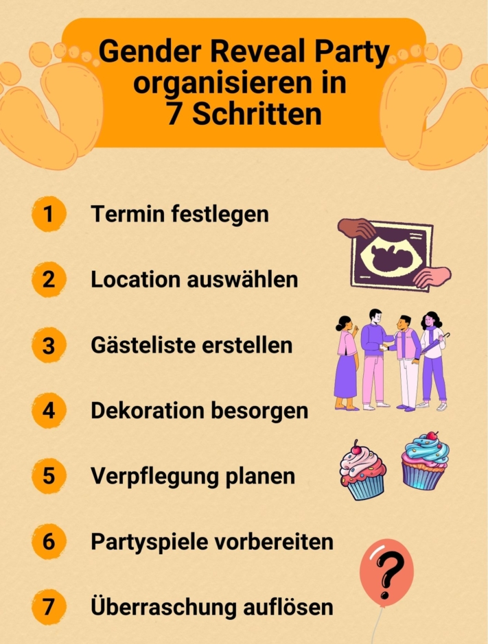
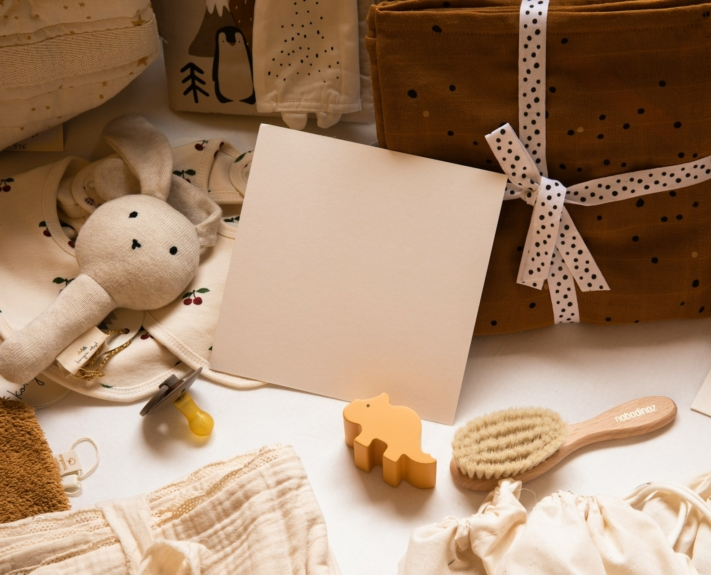

A baby is on the way and you want to celebrate in style? Then a **gender reveal party** is the right thing for you. This trend from the USA involves revealing the gender of the baby in an impressive way. If you want to organize such a **baby shower**, you need to plan carefully how to coordinate the decorations, food and program.

Here you can find out what you should bear in mind when organizing your Gender Reveal Party to make it a unique experience.

## What is a Gender Reveal Party?

The Gender Reveal Party focuses on the **unveiling of the** baby's **gender**. The parents-to-be celebrate the imminent birth of the child together with friends and relatives - with a lot of fanfare. The decorations, food and games are planned down to the smallest detail to heighten the anticipation of the gender reveal.

The whole celebration revolves around this question.

The actual unveiling is done in a spectacular way. For example, you can cut a cake that contains pink or light blue filling, or burst a balloon filled with confetti in the respective color.

## Who will organize the Gender Reveal Party?

There are basically **two options** for who takes care of the organization of the Gender Reveal Party. This depends on who of those present you would like to surprise with the gender reveal.

### Surprise for the parents-to-be

The soon-to-be parents appoint a **person of trust** who is the only one who knows the sex of the baby and who will take care of all the errands relating to the big moment. With the parents' consent, this person receives an envelope from the gynecologist, who has previously written the baby's gender on a piece of paper. Now the task, apart from the organization, is not to blab. This makes the moment of revelation particularly emotional for the parents.

### Surprise for the guests

If the parents would like to find out the gender of their child in peace, they can celebrate the party as an announcement for the guests. Of course, friends and relatives can also be involved in the planning in order to share the work. However, anything that could anticipate the moment of the reveal is taboo for them.

## 7 steps to your perfect baby shower

Would you like to throw a gender reveal party for yourself or your friends, but don't know what all needs to be organized? Here you will find an overview of the tasks that await you on the way to a successful event.

With the right organization, your celebration will be an unforgettable event.

## 1\. set a date

When your party should take place depends on the wishes of the parents-to-be. If they would like to find out the sex of their child immediately after the doctor has confirmed it, a date between the **20th and 30th week of pregnancy** is ideal.

However, it is also possible to combine the gender reveal with the **baby shower**, at which the parents and the baby are traditionally presented with gifts. This would make the celebration more likely to take place in the **last trimester of pregnancy**.

Also consider the availability of your guests. So that as many people as possible can come, it is best to hold the party at a **weekend**.

Make sure that you do not plan the celebration too close to the birth.

## 2\. select location

Whether in the comfort of **your own home** or in a **rented event location** - your baby shower can be a hit anywhere. What you ultimately decide on depends mainly on the time of year and day, as well as the number of guests. If you are particularly keen on beautiful photos or special surprises with colored smoke or fireworks, a party in the **garden or park** is a good choice.

## 3\. create a guest list

A gender reveal party is an intimate and personal affair. You should therefore only invite **people from your closest circle of friends and relatives**. If the parents-to-be have any special requests, you should of course take these into account.

A **guest list** gives you an initial overview and allows you to adapt the next planning steps to the number of guests expected.



Send out the invitations early and set a **deadline for accepting or canceling** them. Also ask whether partners or children will be coming along. You should also briefly explain how a Gender Reveal Party works so that guests can prepare for the event.

## 4\. get decoration

The decorations are the be-all and end-all of the celebration. This is because the crucial clue to the baby's gender is traditionally hidden in one of the decorative pieces. The entire decoration is based on a **color scheme** of your choice. This can either be classic **pink** for a girl and **light blue** for a boy or other colors that break the stereotype. The only important thing is that everyone knows which color stands for which gender before the unveiling.

Decide on a suitable color combination.

**Balloons**, **garlands** and **pompoms** are popular decorative elements. Also pay attention to small details such as **table decorations**. These can consist of baby items such as pacifiers or baby bottles, for example. Help yourself to themed [decoration sets](https://www.babybellyparty.de/gender-reveal-party/?p=1) or make the eye-catchers yourself. The latter takes a lot of time, but is freer and more personal in its design.

## 5\. plan catering

Of course, food to match the decorations should not be missing. If you decide to invite guests for coffee and cake, a well-stocked **Sweet Table** a must. The color scheme you choose is reflected in the desserts. Cakes, cookies or cupcakes with colored icing invite you to snack.

Offer a delicious selection of dishes.

Whether you want to cook yourself or hire a caterer for your Gender Reveal Party is something you need to think about early on. It can help if you involve your guests in the meal planning and have them bring their own homemade food. This will save you time and money. Plus, something homemade makes a lovely gift that all guests will enjoy.

## 6\. prepare party games

It's not just the invited children who can look forward to games to match the theme. To increase the anticipation even more, you can divide your guests into teams and have them compete against each other in mini-games. How about, for example:

- Guess the sex of the baby
- City-country-river with thematically matching categories such as baby name, baby food or cuddly toys
- Changing diapers for a limited time
- Guess children's songs from the lyrics
- Assign baby photos to guests

Guests are particularly motivated if they receive a **small reward** for their victory. This could be sweets or small gifts. Vouchers that benefit the parents-to-be are also fun, for example "A voucher for one babysitting session".

## 7\. dissolve surprise

The moment everyone has been waiting for has finally arrived. Will it be a boy, a girl or, to everyone's surprise, twins? Make the moment of the unveiling extra special and let the following ideas inspire you.

### Gender Reveal Party with balloons

Balloons are very popular. One option is to fill a black balloon with glitter in the color chosen for the gender and then blow it up. The parents-to-be can pop the surprise with a pin or a dart.

The sex of the baby is revealed with a bang.

If you want a little more of the image of the reveal, you can also opt for another option. Pack **helium balloons** in the right color in a box and have them opened. The balloons will rise into the sky, carrying the news of the baby's gender out into the world.

### Involving the guests

It is especially nice for the guests if they are included in the announcement of the gender. One way of doing this is to hand out opaque bags to all guests. These contain **powder** in the respective color. After a countdown, everyone throws the contents into the air and can enjoy the color image that appears.



### A sweet surprise

The classic gender reveal is the **Cake**. Order or bake a multi-tiered cake with a colored cream filling or colored chocolate drops, depending on the gender. The outside of the cake matches the color scheme of the decoration. The gender of the child is only revealed when the cake is cut.

Enjoy a delicious surprise.

## Capturing memories

A gender reveal party is not just a unique event for the parents-to-be. Capture the day with photos so that it will be remembered forever. The best way to do this is to use a **Photographers** who will take pictures of the many happy moments. Alternatively, guests can get active themselves. Hand out **Disposable or instant cameras** to those present, allowing them to capture the day in all its facets as they please.

Capture the celebration in pictures.



## Alternative ideas for your baby shower

Would you like to celebrate your pregnancy with friends and family, but a gender reveal party doesn't appeal to you? No problem, because here are a few **alternatives** for celebrating other milestones on the way to the birth of your child.

### Babyshower

Let it rain presents! Traditionally, this **Baby shower** organized by friends of the expectant mother and takes place with female acquaintances and relatives. The guests bring **Gifts** for the parents-to-be and the baby.

Give gifts that are useful for the first time with the child.

Find out in advance what mom and dad would be happy to receive and create a **wish list**. Popular gifts include diapers, baby food or wellness vouchers for the parents.

### Name Reveal Party

What will the newborn be called? Invite friends and relatives and let them **suggest** their favorite **names**. You can either use the ceremony to announce the name you have already chosen or let the suggestions inspire you.

### Due date party

This is all about guessing. Have your guests predict the **date of birth** based on the circumference of the mother-to-be's belly. Whoever is closest will be the first official visitor to see the baby after the birth. The winner will also receive a certificate for being the best birth date predictor. Predictions can also be made about the **size** or **weight** of the newborn.

## Online planner for your baby shower

In order for your gender reveal party to be a complete success, it requires extensive organization. To make this easier for you, the SeaTable team has created a [practical template](https://seatable.io/en/vorlage/bpczhtg6q9ql10dcgly_wa/) for planning your baby shower. You can customize it to suit your needs.

If you would like to use SeaTable for this, simply [register]() free of charge. You can find the template [here](https://seatable.io/en/vorlage/bpczhtg6q9ql10dcgly_wa/).
