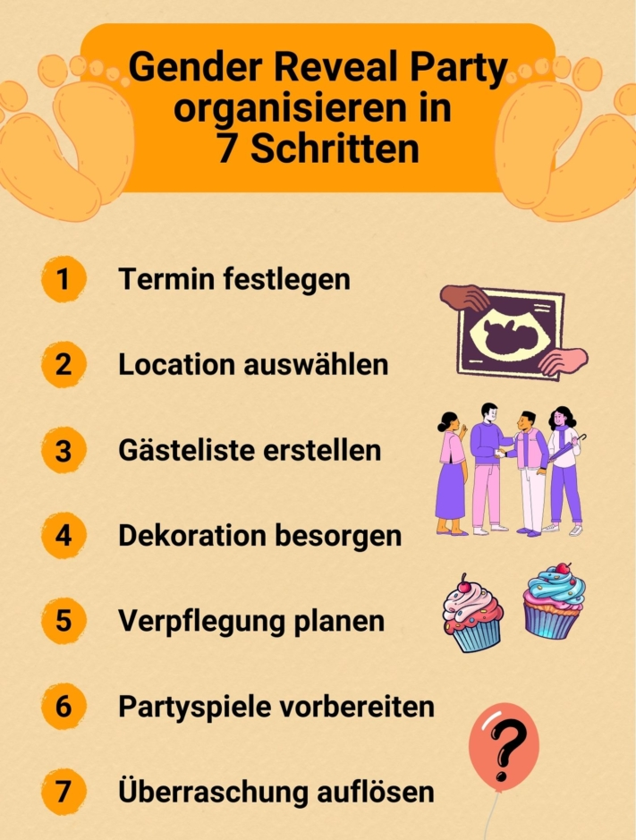
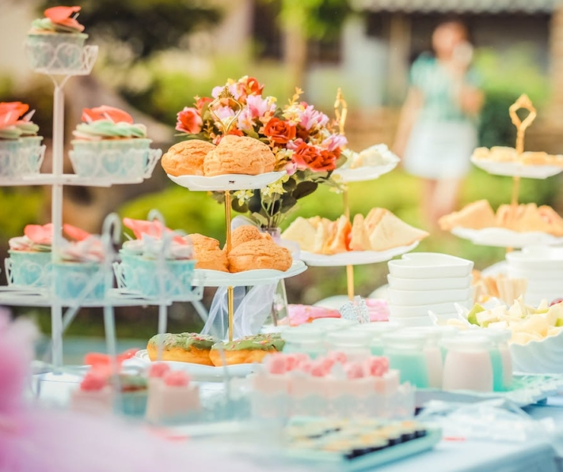
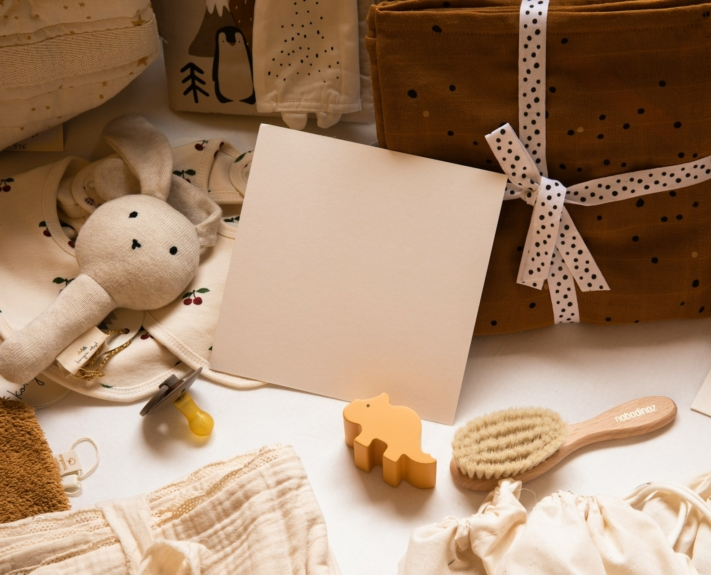

Un bébé est en route et vous voulez fêter cela comme il se doit ? Dans ce cas, une **Gender Reveal Party** est faite pour vous. Cette tendance venue des États-Unis consiste à dévoiler le sexe du bébé de manière imposante. Si vous souhaitez organiser une telle **fête de bébé**, vous devez planifier minutieusement la manière dont vous allez coordonner la décoration, la nourriture et le programme.

Découvrez ici les points à prendre en compte lors de l'organisation pour que votre Gender Reveal Party soit une expérience unique.

## Qu'est-ce qu'une Gender Reveal Party ?

La Gender Reveal Party est centrée sur la **révélation du sexe** du bébé. Les futurs parents fêtent la naissance imminente de leur enfant avec leurs amis et leur famille - et avec beaucoup de faste. En effet, la décoration, la nourriture et les jeux sont planifiés dans les moindres détails afin d'augmenter l'impatience de l'annonce du sexe.

Toute la fête tourne autour de cette question.

La révélation proprement dite se fait de manière spectaculaire. Par exemple, vous pouvez couper un gâteau qui contient un fourrage rose ou bleu clair, ou faire éclater un ballon rempli de confettis de la couleur correspondante.

## Qui se charge de l'organisation de la Gender Reveal Party ?

En principe, il **y a deux options** pour savoir qui s'occupera de l'organisation de la Gender Reveal Party. Cela dépend de la personne présente que vous souhaitez surprendre avec la révélation du sexe.

### Surprise pour les futurs parents

Les futurs parents désignent une **personne de confiance** qui est la seule à connaître le sexe du bébé et qui se charge de toutes les courses relatives à ce grand moment. Avec l'accord des parents, cette personne reçoit une enveloppe du gynécologue, qui a préalablement inscrit le sexe de l'enfant sur un papier. Outre l'organisation, la tâche consiste maintenant à ne pas faire de gaffe. Cela rend le moment de la révélation particulièrement émotionnel pour les parents.

### Surprise pour les invités

Si les parents souhaitent connaître le sexe de leur enfant en toute tranquillité, ils peuvent organiser la fête comme une annonce pour les invités. Bien entendu, les amis et la famille peuvent être impliqués dans la planification afin de partager le travail. Mais ce qui est tabou pour eux, c'est tout ce qui pourrait anticiper le moment de la révélation.

## 7 étapes pour une fête de bébé parfaite

Vous souhaitez organiser une Gender Reveal Party pour vous ou vos amis, mais vous ne savez pas tout ce qu'il faut organiser ? Vous trouverez ici un aperçu des tâches qui vous attendent sur la voie d'un événement réussi.

Avec une bonne organisation, votre fête sera un événement inoubliable.

## 1\. fixer la date

Le moment où votre fête doit avoir lieu dépend des souhaits des futurs parents. Si ces derniers souhaitent connaître le sexe de leur enfant dès que le médecin l'a sécurisé, un rendez-vous **entre la 20e et la 30e semaine de grossesse** s'impose.

Mais il est également possible de faire coïncider la révélation du sexe avec la **baby shower**, au cours de laquelle on offre traditionnellement des cadeaux aux parents et au bébé. Ainsi, la fête se déroulerait plutôt au cours du **dernier trimestre de la grossesse**.

Tenez également compte de la disponibilité de vos invités. Pour qu'un maximum de personnes puissent venir, l'idéal est de faire la fête pendant un **week-end**.

Veillez à ne pas planifier la fête trop peu de temps avant la naissance.

## 2\. choisir un lieu

Que ce soit **dans** le confort **de votre propre maison** ou dans un **lieu événementiel loué**, votre fête de bébé peut être un succès partout. Votre choix dépendra surtout de la période de l'année, du moment de la journée et du nombre d'invités. Si vous tenez particulièrement à de belles photos ou à des surprises spéciales avec de la fumée colorée ou des feux d'artifice, une fête dans **le jardin ou dans un parc** s'impose.

## 3\. établir la liste des invités

Une Gender Reveal Party est une affaire intime et personnelle. C'est pourquoi vous ne devriez inviter que **des personnes appartenant à votre cercle d'amis et de parents les plus proches**. Si les futurs parents ont des souhaits particuliers, vous devriez bien sûr en tenir compte.

Une **liste d'invités** vous permet d'avoir une première vue d'ensemble et d'adapter les autres étapes de la planification au nombre d'invités attendus.



Envoyez les invitations suffisamment tôt et fixez une **date limite pour une acceptation ou un refus**. Demandez également si le partenaire ou les enfants seront présents. Enfin, expliquez brièvement comment se déroule une Gender Reveal Party afin que les invités puissent se préparer à l'événement.

## 4\. se procurer des décorations

La décoration est l'alpha et l'oméga de la fête. En effet, l'indice décisif sur le sexe du bébé se cache traditionnellement dans l'une des pièces de la décoration. Toute la décoration se sert d'un **schéma de couleurs** que vous avez choisi. Il peut s'agir **du rose** classique pour une fille et **du bleu clair** pour un garçon ou d'autres couleurs qui rompent avec les clichés. L'important, c'est qu'avant la révélation, tout le monde sache clairement quelle couleur représente quel sexe.

Décidez de la combinaison de couleurs qui vous convient.

Les **ballons**, **les guirlandes** ou les **pompons** sont des éléments de décoration très appréciés. Veillez également aux petits détails comme la **décoration de la table**. Celle-ci peut par exemple être composée d'articles de puériculture comme des tétines ou des biberons. Utilisez des [kits de décoration](https://www.babybellyparty.de/gender-reveal-party/?p=1) thématiques ou bricolez vous-même les objets qui attirent le regard. Cette dernière solution demande beaucoup de temps, mais elle permet une décoration plus libre et plus personnelle.

## 5\. planifier les repas

Bien entendu, la nourriture assortie à la décoration ne doit pas manquer. Si vous décidez d'inviter des personnes à prendre un café et un gâteau, un panier bien garni est indispensable. **Sweet Table** est un must. Dans ce contexte, le schéma de couleurs que vous avez choisi se reflète dans les desserts. Les gâteaux, cookies ou cupcakes au glaçage coloré sont une invitation au grignotage.

Proposez une délicieuse sélection de plats.

Vous devez réfléchir suffisamment tôt à la question de savoir si vous voulez vous mettre aux fourneaux ou faire appel à un traiteur pour votre Gender Reveal Party. Il peut être utile d'impliquer les invités dans la planification du repas et de leur demander d'apporter des plats qu'ils ont préparés eux-mêmes. Vous économiserez ainsi du temps et de l'argent. De plus, quelque chose de fait maison est un beau cadeau qui fera plaisir à tous les invités.

## 6\. préparer des jeux de fête

Les enfants invités ne sont pas les seuls à pouvoir se réjouir de jeux adaptés au thème. Pour augmenter encore l'anticipation, vous pouvez diviser vos invités en équipes et les faire s'affronter dans des mini-jeux. Que diriez-vous par exemple de

- Deviner le sexe du bébé
- ville-campagne-fleuve avec des catégories thématiques comme le nom de bébé, la nourriture pour bébé ou les peluches
- Changer les couches à temps
- Deviner des chansons pour enfants à partir des paroles
- Attribuer les photos de bébé aux invités

Les invités sont particulièrement motivés s'ils reçoivent une **petite récompense** pour leur victoire. Il peut s'agir de friandises ou de petits cadeaux. Il est également amusant d'offrir des bons aux futurs parents, par exemple "Un bon pour une fois de baby-sitting".

## 7\. résoudre la surprise

Le moment que tout le monde attend est enfin arrivé. S'agira-t-il d'un garçon, d'une fille ou, à la surprise générale, de jumeaux ? Rendez le moment de la révélation particulièrement beau et laissez-vous inspirer par les idées suivantes.

### Fête du Réveil du Genre avec ballons

Les ballons sont très populaires. Une possibilité consiste à remplir un ballon noir de paillettes de la couleur choisie pour le sexe, puis à le gonfler. Avec une aiguille ou une fléchette, les futurs parents peuvent faire éclater la surprise.

Le sexe du bébé est révélé avec fracas.

Pour ceux qui veulent un peu plus de l'image du dévoilement, une autre option est possible. Emballez **des ballons d'hélium** de la bonne couleur dans une boîte et faites-la ouvrir. Les ballons s'élèvent dans le ciel et portent ainsi la nouvelle du sexe du bébé avec eux dans le monde entier.

### Impliquer les invités

Il est particulièrement agréable pour les invités d'être impliqués dans l'annonce du sexe. Une manière de réaliser cela est de distribuer des petits sacs opaques à tous les invités. Ceux-ci contiennent de la **poudre** de la couleur correspondante. Après un compte à rebours, tous lancent le contenu en l'air et peuvent profiter de l'image colorée qui apparaît.



### Une douce surprise

Le classique parmi les Gender Reveals est la **Gâteau**. Commandez ou préparez un gâteau à plusieurs étages contenant une garniture de crème colorée ou des pépites de chocolat colorées, selon le sexe. De l'extérieur, le gâteau s'adapte au schéma de couleurs de la décoration. Ainsi, le sexe de l'enfant ne sera révélé qu'au moment de la découpe.

Profitez d'une délicieuse surprise.

## Garder des souvenirs

Une Gender Reveal Party n'est pas seulement un événement unique pour les futurs parents. Immortalisez la journée en prenant des photos pour qu'elle reste à jamais gravée dans votre mémoire. Pour ce faire, il est judicieux d'utiliser un **Photographes** qui prendra des photos des nombreux moments de bonheur. Sinon, les invités peuvent être actifs eux-mêmes. Distribuez **Appareils photo jetables ou instantanés** aux personnes présentes, ce qui leur permet d'immortaliser à leur guise la journée sous toutes ses facettes.

Immortalisez la fête en images.



## Idées alternatives pour votre baby shower

Vous souhaitez fêter votre grossesse avec vos amis et votre famille, mais une Gender Reveal Party ne vous convient pas ? Pas de problème, car vous trouverez ici quelques **alternatives** pour célébrer d'autres étapes importantes sur le chemin de la naissance de votre enfant.

### Soirée bébé

Faites pleuvoir les cadeaux ! Traditionnellement, cette **Fête de bébé** organisé par des amies de la future maman et se déroule avec des connaissances et des proches de sexe féminin. Les invités apportent **Cadeaux** pour les futurs parents et le bébé.

Offrez des objets qui seront utiles pour les premiers temps avec l'enfant.

Déterminez au préalable ce qui ferait plaisir à la mère et au père et dressez une **liste de souhaits**. Les couches, la nourriture pour bébé ou les bons de bien-être pour les parents sont par exemple des cadeaux très appréciés.

### Nom de la fête Reveal

Quel sera le nom du nouveau-né ? Invitez vos amis et votre famille et laissez-les **proposer** leurs **noms** préférés. Vous pouvez soit profiter de la fête pour annoncer le nom déjà choisi, soit vous laisser inspirer par les propositions.

### Fête de la naissance

Il s'agit ici de faire des estimations. Demandez à vos invités de prédire la **date de l'accouchement** en fonction du tour de ventre de la future maman. La personne la plus proche sera la première à voir le bébé après la naissance. De plus, le gagnant recevra un certificat de meilleur prédicteur de date de naissance. Il est également possible de prédire la **taille** ou le **poids** du nouveau-né.

## Planificateur en ligne pour votre baby shower

Pour que votre fête Gender Reveal soit une réussite totale, une organisation importante est nécessaire. Pour vous faciliter la tâche, l'équipe de SeaTable a créé un [modèle pratique]() pour l'organisation de votre fête de bébé. Vous pouvez l'adapter à vos besoins.

Si vous souhaitez utiliser SeaTable à cet effet, il vous suffit de [vous inscrire]() gratuitement. Vous trouverez le modèle [ici]().
