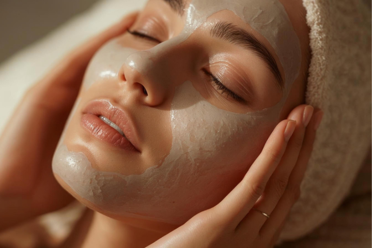
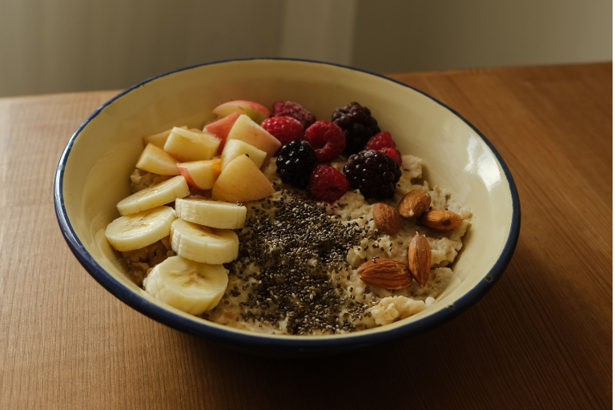
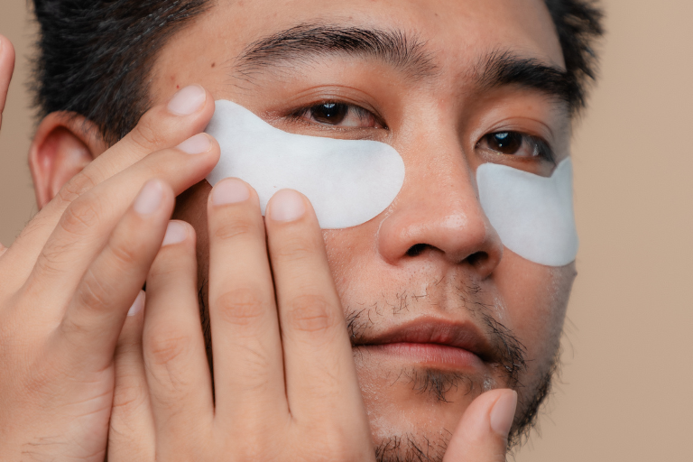

Vous parcourez les réseaux sociaux, vous voyez des photos « avant-après » et vous vous demandez comment les autres parviennent soudain à paraître tellement plus sûrs d’eux et rayonnants ? Il est alors temps de vous plonger dans les conseils de « glow-up » et de travailler étape par étape à votre relooking personnel. Dans cet article, nous vous présentons les meilleurs conseils de « glow-up » et vous dévoilons comment faire rayonner votre éclat personnel, étape par étape.

## Points clés à retenir

- Un « glow-up » va au-delà de l’apparence physique : il résulte de la combinaison entre soins de la peau, style et état d’esprit.
- La routine l’emporte sur la motivation, car seules des habitudes régulières mènent à des résultats durables. 
- Une routine de soins de la peau simple, composée de quelques produits de base, peut déjà faire toute la différence. 
- Des outils numériques, comme un agenda « glow-up », vous aident à visualiser vos projets et à vous y tenir.

## Qu'est-ce qui se cache vraiment derrière un « glow-up » ?

Beaucoup de gens assimilent le « glow-up » à l'apparence physique. Une nouvelle coiffure, une nouvelle garde-robe, peut-être un programme de remise en forme : la métamorphose est terminée. Cette vision est toutefois trop réductrice et peut vous empêcher d’obtenir les résultats souhaités malgré vos efforts. Un véritable « glow-up » ne se produit que lorsque vous **considérez ensemble le corps, le style et l’état d’esprit**. Seule cette interaction garantit que le changement opère de l’intérieur vers l’extérieur, et non l’inverse. 

Peut-être connaissez-vous vous-même ce sentiment : vous investissez dans de nouveaux vêtements ou dans une routine de soins coûteuse, mais la confiance en soi ne vient tout simplement pas. La raison n’est que rarement due à un produit inadapté ou à un vêtement mal choisi, mais plutôt à l’absence de routine sous-jacente. Si vous mettez en pratique des conseils de « glow-up » sans plan ni introspection, votre motivation s’évanouit généralement au bout de quelques jours seulement.

Un bon « glow-up » commence donc par un état des lieux honnête. Posez-vous d’abord **la question de savoir ce que vous souhaitez vraiment changer – et surtout, pourquoi**. La réponse à cette question vous accompagnera tout au long du processus et constituera la véritable base de résultats durables.

## La routine de soins de la peau comme fondement

Une routine de soins de la peau bien pensée fait partie des conseils de « glow-up » les plus efficaces qui soient, car une peau saine est la base d’un teint éclatant. Il ne s’agit pas de posséder le plus grand nombre possible de produits, mais de suivre rigoureusement les bonnes étapes.

### Routine du matin et routine du soir au quotidien

Une **routine de soins de la peau efficace suit un principe simple en 3 étapes : nettoyer, hydrater, protéger**. Le matin, un nettoyage doux suffit, suivi d’une crème hydratante et d’une protection solaire avec un indice de protection suffisant. Le soir, le nettoyage peut être plus approfondi ; en cas de maquillage épais ou d’application importante de crème solaire, un double nettoyage est même recommandé. Vous pouvez ensuite utiliser un soin contenant des principes actifs tels que le rétinol ou la niacinamide, adapté aux besoins spécifiques de votre peau.

La régularité est plus importante que le nombre de produits. Une routine matinale et une routine du soir simples, que vous suivez réellement tous les jours, vous apporteront davantage qu’une routine complexe dont les produits finissent par prendre la poussière sur une étagère au bout de deux semaines.



### Produits de soins de la peau pour débutants

Si vous débutez dans le domaine des soins de la peau, ne vous laissez pas intimider par la multitude de produits disponibles. Pour commencer, les trois produits de base mentionnés ci-dessus suffisent amplement. Ces produits constituent la base sur laquelle vous pourrez ensuite construire votre routine. 

En effet, une erreur fréquente parmi les premiers conseils de « glow up » en matière de soins de la peau est ce qu’on appelle la « surcharge », c’est-à-dire le fait d’essayer de commencer directement avec dix produits différents. Cela surmène votre peau et vous empêche d’identifier les réactions liées à chaque ingrédient. **Commencez par établir les bases avant de les élargir progressivement**, par exemple avec un sérum que vous adaptez spécifiquement à votre type de peau.

### Routine de soins de la peau pour hommes

Une routine de soins de la peau pour hommes tire également profit de la structure plutôt que de la diversité. De plus, la peau des hommes est souvent un peu plus épaisse que celle des femmes et, en raison du rasage régulier, souvent plus sujette aux irritations. Un soin après-rasage adapté ainsi que des produits sans parfum trop prononcé vous aideront à apaiser votre peau sans la solliciter davantage. 

Une bonne routine de soins pour les hommes n’a pas besoin d’être compliquée : un nettoyage doux après le rasage, un après-rasage apaisant sans parfum trop fort et une crème hydratante légère avec un indice de protection solaire suffisent amplement. Vous n’avez pas besoin d’un rituel complexe en dix étapes pour cela. C’est précisément cette réduction à l’essentiel qui rend tant de conseils de « glow up » pour les hommes si faciles à mettre en pratique au quotidien.

## Style personnel et charisme

Outre les soins de la peau, votre style personnel joue également un rôle visible dans le processus de « glow-up ». Les vêtements, la posture et le charisme constituent la partie visible de votre transformation extérieure. Considérez le style comme l’expression de votre personnalité et non comme un déguisement derrière lequel vous vous cachez. 

Un bon point de départ pour gagner en charisme :

- Faites le tri dans votre garde-robe et **débarrassez-vous des vêtements** que vous ne portez de toute façon jamais. 
- Privilégiez la **coupe plutôt que la quantité** : quelques pièces bien ajustées donnent souvent une impression de plus grande qualité qu’une armoire débordante remplie de compromis.
- Choisissez **des couleurs qui conviennent à votre teint**.
- Soyez attentif(ve) à votre **posture et à vos expressions faciales** au quotidien.
  
Le charisme ne tient pas uniquement aux vêtements. Votre posture et vos expressions faciales influencent au moins autant la première impression que votre tenue. Une posture droite est un signe de confiance en soi, souvent avant même que vous n’ayez prononcé un seul mot. Votre style extérieur ne paraîtra vraiment authentique que s’il correspond à votre développement intérieur. C’est l’un des conseils essentiels pour un « glow-up » que beaucoup sous-estiment, et il fait déjà le lien avec le prochain élément clé : votre état d’esprit.

## La force mentale grâce au développement personnel

Le développement personnel est au cœur d’un « glow-up » durable et mérite au moins autant d’attention que les changements extérieurs. La force mentale ne se construit pas du jour au lendemain, mais grâce à de petites actions répétées. En maintenant une nouvelle routine pendant plusieurs semaines, vous accumulez de petites réussites qui renforcent votre confiance en vous pas à pas. Ces réussites n’ont pas besoin d’être spectaculaires. Souvent, il suffit déjà de mettre en œuvre une habitude simple de manière cohérente pour éprouver un sentiment de maîtrise et de progrès. 

Pour cultiver un état d’esprit sain, il est particulièrement important de ne pas **faire dépendre votre estime de soi de facteurs extérieurs**, mais de la puiser en vous-même et dans vos propres progrès. En parvenant à ce changement de perspective, vous posez sans doute le fondement le plus important pour tous les autres conseils de « glow-up » présentés dans cet article.



Notez chaque jour trois choses pour lesquelles vous êtes reconnaissant, aussi insignifiantes soient-elles. Cet exercice simple vous aide à vous concentrer sur ce qui va déjà bien. Grâce au [journal de gratitude]() de SeaTable, vous pouvez consigner cette habitude sous forme numérique et relire vos notes à tout moment. »



## Les facteurs liés au mode de vie qui favorisent votre « glow-up »

Votre « glow-up » dépend en grande partie de facteurs qui, à première vue, n’ont pas grand-chose à voir avec les soins de la peau ou le style, mais qui constituent en réalité la base de l’aspect de votre peau et de votre énergie :

- **Alimentation :** une consommation excessive de sucre peut avoir un impact négatif sur l’aspect de votre peau, tandis qu’une hydratation suffisante et une alimentation riche en vitamines nourrissent votre peau de l’intérieur.
- **Fitness et activité physique :** une activité physique régulière favorise la circulation sanguine, réduit le stress et a un effet positif à long terme sur la peau et l’humeur.
- **Sommeil :** c’est pendant le repos nocturne que votre peau se régénère le plus intensément. Il est prouvé qu’il existe un lien entre le manque de sommeil et une peau impure et fatiguée.
- **Détox numérique :** Prendre consciemment du recul par rapport aux médias numériques réduit le stress, améliore la qualité de votre sommeil et crée un espace propice à une véritable introspection, loin des comparaisons sur les réseaux sociaux.



SeaTable propose également un [modèle de détox numérique](), qui vous permet de suivre votre temps passé devant les écrans et vos habitudes numériques. Vous pouvez ainsi gérer de manière plus consciente le temps que vous passez sur votre smartphone et vos autres appareils numériques, et créer progressivement davantage d'espace pour des moments hors ligne.



## Comparaison des conseils « glow-up » pour les filles et les garçons

Les principes de base d’un « glow-up » sont les mêmes quel que soit votre sexe ; les différences résident plutôt dans les aspects sur lesquels vous mettez l’accent.

Les conseils de « glow-up » pour les filles peuvent par exemple porter sur les soins de la peau, prévoir régulièrement des journées sans maquillage et développer son propre style. Essayez différents looks, coiffures et styles vestimentaires, et identifiez ce dans quoi vous vous sentez vraiment à l’aise. Même de petits détails, comme des ongles soignés, des accessoires assortis ou une couleur de cheveux adaptée à votre personnalité, peuvent transformer votre look. L’important est de ne pas suivre toutes les tendances, mais de découvrir ce qui vous va vraiment.

Les conseils de « glow up » pour les hommes mettent souvent l’accent sur une routine de soins simple. Un soin de la peau basique, une barbe bien entretenue ou un rasage régulier et une coupe de cheveux adaptée constituent déjà une bonne base. Au lieu d’utiliser de nombreux produits différents, vous pouvez vous concentrer sur quelques produits qui vous conviennent. Vos vêtements et votre style personnel jouent également un rôle important. Privilégiez plutôt des basiques bien coupés et des pièces uniques qui soulignent votre style personnel.

## 5 astuces pour ancrer de nouvelles habitudes dans votre quotidien

La motivation seule suffit rarement à maintenir une nouvelle routine sur le long terme. Après les premiers jours d’enthousiasme, le quotidien reprend le dessus, et c’est précisément là que de nombreuses résolutions bien intentionnées échouent. Si vous souhaitez vraiment intégrer vos conseils « glow up » dans votre quotidien, vous avez besoin d’une méthode. Ces cinq astuces vous y aideront :

1. **Commencez par une seule habitude :**
Commencez par instaurer une seule nouvelle habitude, au lieu de bouleverser d’emblée toute votre vie. Ce n’est que lorsque cette routine sera bien ancrée que vous pourrez en ajouter une autre. Vous éviterez ainsi de vous surmener et vous gagnerez progressivement en assurance.
2. **Fixez-vous des objectifs clairs :**
Des objectifs clairs vous aident à visualiser vos progrès. Formulez concrètement ce que vous souhaitez atteindre, plutôt que de garder en tête des intentions vagues telles que « vivre plus sainement ».
3. **Faites preuve de discipline sans vous mettre la pression :**
À long terme, la discipline fonctionne nettement mieux sans pression excessive. Soyez indulgent envers vous-même si une journée ne se déroule pas parfaitement, et reprenez simplement le lendemain.
4. **Associez vos nouvelles habitudes à vos routines existantes :** 
Par exemple, liez directement votre routine de soins de la peau au brossage de dents, de sorte qu’un horaire fixe et un déclencheur clair déclenchent automatiquement la nouvelle habitude.
5. **Consignez vos progrès :**
Notez vos objectifs et vos progrès au même endroit, plutôt que de vous fier à votre mémoire. Vous pourrez ainsi identifier des tendances et rester motivé pour continuer, même les jours de stress.



Grâce au [Habit Tracker]() de SeaTable, vous pouvez noter vos habitudes, suivre vos progrès et mieux garder un œil sur vos routines quotidiennes.



## Glow-Up Planner de SeaTable

Pour que tous ces conseils « glow up » ne restent pas de simples bonnes résolutions, jetez un œil au [Glow-Up Planner]() de la plateforme sans code SeaTable. Il rassemble en un seul et même endroit votre routine de soins de la peau, votre programme de remise en forme et votre plan nutritionnel, ainsi que vos moments d’introspection et vos objectifs. Au lieu de jongler entre plusieurs applications de prise de notes et des bouts de papier, vous voyez d’un seul coup d’œil les habitudes que vous avez déjà adoptées et les points sur lesquels vous pouvez encore vous améliorer. 



Vous adaptez le Planner à vos objectifs personnels, que vous souhaitiez travailler sur vos soins de la peau, votre état d’esprit ou votre mode de vie dans son ensemble. Vous transformez ainsi une idée vague en un plan concret et clair pour votre « glow-up » personnel.

## Conclusion

Un « glow-up » est un processus et non un événement ponctuel. En considérant votre corps, votre style et votre état d’esprit comme un tout, en mettant en œuvre de petites mesures de manière cohérente et en documentant vos progrès, vous obtiendrez davantage à long terme qu’en suivant des tendances à court terme. Au final, les meilleurs conseils de « glow-up » sont ceux que vous intégrez réellement dans votre quotidien et que vous maintenez pendant des semaines. Commencez dès aujourd’hui par un premier petit pas et posez les bases de votre transformation personnelle.

## FAQ



Vous remarquerez souvent les premiers changements visibles, notamment au niveau de votre peau ou de votre éclat général, dès deux à quatre semaines après avoir suivi le programme de manière rigoureuse, à condition de respecter votre routine de soins de la peau quotidiennement. Les effets plus profonds sur la confiance en soi et l'état d'esprit se développent généralement sur une période plus longue de plusieurs mois, car ils s'appuient sur de petits succès répétés et ne se produisent pas du jour au lendemain. La patience et la constance comptent ici plus que la rapidité.





Pour commencer, trois produits de soin suffisent amplement : un nettoyant doux, une crème hydratante et un écran solaire avec un indice de protection suffisant. Cette base répond aux besoins fondamentaux de presque tous les types de peau et convient à tous, quel que soit le type de peau. Vous pourrez ensuite ajouter progressivement d’autres produits, tels que des sérums ou des gommages, dès que vous aurez établi votre routine de base. Vous éviterez ainsi des dépenses inutiles et les irritations liées à l’utilisation simultanée d’un trop grand nombre de nouveaux produits.





Un modèle numérique tel que le Glow-Up Planner de SeaTable regroupe votre routine de soins de la peau, votre activité physique, votre alimentation et votre introspection en un seul et même endroit, et vous permet de visualiser vos progrès en un coup d’œil. Cette vue d’ensemble vous aide à structurer vos habitudes, à détecter les rechutes à un stade précoce et à rester motivé(e) sur le long terme, plutôt que de vous perdre dans une multitude de notes, d’applications et de petits bouts de papier.





Oui, le « glow-up » s'adresse tout autant aux hommes qu'aux femmes, même si les priorités concrètes sont souvent légèrement différentes. Vous vous concentrez souvent sur une routine de soins de la peau simple, en quelques étapes seulement, sur un après-rasage adapté aux irritations dues au rasage et sur des vêtements fonctionnels plutôt que variés. Ici aussi, c’est avant tout la régularité qui importe, et non le nombre de produits ou de vêtements utilisés.

