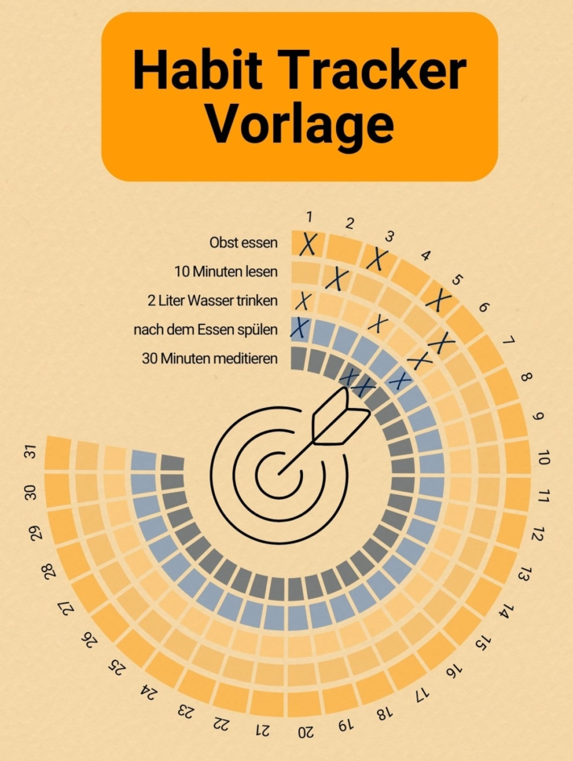

Making **good resolutions** for the new year has become a habit for many people. But every year we are disappointed when we fail to keep our resolutions. It takes a strong will to integrate new habits into our lives. **Habit trackers** are available to make this process easier.

They keep motivation high and also create ambition to maintain good behaviors or break a bad habit. Find out how a habit tracker works and what you need to know to create a habit tracker according to your wishes in this article.

## What can a habit tracker do?

Building new habits and changing bad ones - a habit tracker can help you with this. In its most basic form, this is a **list with checkboxes** in which you document every day over a period of one month whether you have carried out an action or not. Have you resolved to meditate every day? Then always put a tick in the box if you have actually kept your resolution on that day. If you maintain your Habit Tracker regularly, you will get a picture that shows your **progress**.

Your Habit Tracker could look like this.

There are no limits to your imagination when **designing** your Habit Tracker. For example, work with different **colors** and fonts or simply implement your ideas online with the [Habit Tracker from SeaTable](#Vorlage_fuer_Ihren_digitalen_Habit_Tracker). You should not only write down your desired habits, but also your previous habits. Tracking helps you to become aware of the habits that you have taken for granted up to this point.



But remember: Your Habit Tracker is not made to last forever. The aim is to develop a **routine** so that you no longer need to record your activity at some point.

## Why it helps to record your progress

In addition to the goal of learning habits and integrating them into your everyday life, tracking has some useful side effects. For example, you can benefit from being able to see your **successes** and **setbacks** without distortion. This way, you don't give excuses a chance and can **reflect on** your results.

In addition, the quickly recognizable successes boost your self-confidence and encourage you to continue with **motivation** and **discipline**. With a habit tracker, you quickly develop the ambition to keep up the winning streak.



Probably the biggest advantage is **building routines**. By becoming aware of your progress, you can internalize your habits. The Habit Tracker proves this first and foremost. After all, regularly ticking off your to-dos is also a habit.

## Which habits you can track

Whether it's little things in everyday life or turning your whole life upside down - basically anything is possible. Of course, they should be habits that you consider **worthwhile** and that you can grow with. Or simply something that you enjoy. The rule is: if you want to aim high, you have to start small. You can always improve later.

Think about habits that will **improve your everyday life** and can be integrated into it. Also become aware of which habits you already have and whether they need changing. Whether you want to get rid of bad habits or learn new ones, you will find inspiration here:

You can swap bad habits for good ones.

### Introducing new habits with the Habit Tracker

- **Health**: exercise three times a week, eat more fruit, drink two liters of water a day
- **Productivity**: get up at 6 a.m., use less social media, get clothes ready for the next day every evening
- **Learning objectives**: read for 10 minutes, learn five new words in a foreign language, watch videos in a foreign language
- **Household**: washing up straight after meals, taking out the garbage once a week, clearing the desk
- **Mentality**: Meditate for 30 minutes, go for a walk, give someone a compliment

## Change habits

Many **unpleasant patterns of behavior** have become established in our everyday lives and have quietly and secretly become habits. Getting rid of them or, ideally, turning them into good habits takes a lot of time and energy. But with a **plan**, you can succeed.

This plan will help you to achieve your goals.

### Set target

All beginnings are difficult. The first question you need to ask yourself is what your **goal** should be. What do you want to achieve by changing your habits? This question is important to clarify your **motivation**. Now think about what you want to record with your habit tracker. To start with, you should have no more than **five habits**, two of which you want to learn. In terms of time, it makes sense to concentrate on **one month** at first.

Don't take on too much, because a quick setback could lead to you dropping all your good intentions again. You can also make tracking easier if you set a specific time of day to write it down or tick everything off immediately after the activities.

### Creating commitment

Don't keep your plans to yourself. By telling your friends or relatives about your goals, you create additional **commitment**. You are no longer only accountable to yourself, but also want to be able to tell people you trust about your successes.

### Establish a routine

Carrying out your behaviors regularly requires strong **self-discipline**. However, there are tips to help you integrate habits into your everyday life more quickly.

James Clear's bestseller contains useful tips.

The following tips are from James Clear's book **The 1% Method** ( _Atomic Habits_) and can make your habit tracker even more effective.



To make a desirable action more binding, you should link it to the place and time of execution.




Habits that are already automated can make it easier for you to learn new habits. Simply perform a current habit and a new habit one after the other.




Not all habits that you want to learn will give you pleasure. It can therefore help to work with a reward system. Perform a task that you don't like and then reward yourself with something that you find easy and fun.




If an activity takes less than two minutes, you can do it immediately as it requires little energy and effort. At the beginning of your tracking journey, it makes sense to start small. Habits that you can do in two minutes are motivating and offer the opportunity to expand them as you wish.



### Celebrating progress

The longer you hold on to a habit, the easier it will be for you to carry it out. It usually takes around two to three months for a new habit to become **automatic**. But it's a long journey and you should celebrate every milestone along the way. To make it easier for you to achieve your goals, you can add **mini-habits** to your habit tracker. These are stages on your way to your goal.

For example, resolve to read 30 pages every day. However, if you don't manage this, it's no reason to give up completely. Start by reading five pages a day and try to **increase** slowly. Set yourself a minimum that you definitely want to achieve in one day, then you can be happy about everything you achieve beyond that.

### Overcoming setbacks

Anyone who makes progress will also have to cope with setbacks. Not carrying out your habits is not the end of the world. It can happen quickly if you simply wanted to take on too many good intentions and they now overwhelm you. Take the time to reflect on **why** you were unable to achieve your goals.

Are there too many habits? Then adjust them or **reduce the workload**. Don't like an activity after all? That can happen too. You don't always like a habit as much as you thought you would, and that's okay. Once you realize the reason for your stumble, it's important to continue with a revised habit tracker. Because if you give up, all your efforts will be wasted. So remind yourself why you want to change your habits and find a new **source of motivation**.

### Automate habits

And you've reached your goal! You have always maintained your habit tracker and the habits have become firmly integrated into your everyday life. That's great - but achieving goals takes time. According to the latest [studies](https://onlinelibrary.wiley.com/doi/abs/10.1002/ejsp.674), it takes an average of **66 days** to build a habit. However, it's not so much how long a behavior is performed, but how often.

## Create a habit tracker

As already mentioned, there are no limits to the design of your Habit Tracker. Customizing it by hand can help to create additional commitment through personalization and provide additional motivation with the work you have already invested.

You can design your Habit Tracker by hand or with templates.

If you like it practical and simple, you can also use an **app** or **online template**. These are usually less creative, but bundle all habits in a clear and structured way. Compared to notebooks and paper calendars, **digital habit trackers** can be flexibly adapted if your habits change.

## Template for your digital habit tracker

In order not to lose sight of your goal, you need a simple and effective solution to track your habits and progress. SeaTable offers you this with a [free template]() that you can customize according to your personal needs. The Habit Tracker is integrated into a bullet journal that offers even more exciting ways to organize and change your life.

If you would like to use SeaTable for your habit tracker, simply [register]() for free. You can find the corresponding template with lots of inspiration and sample habits [here]().
