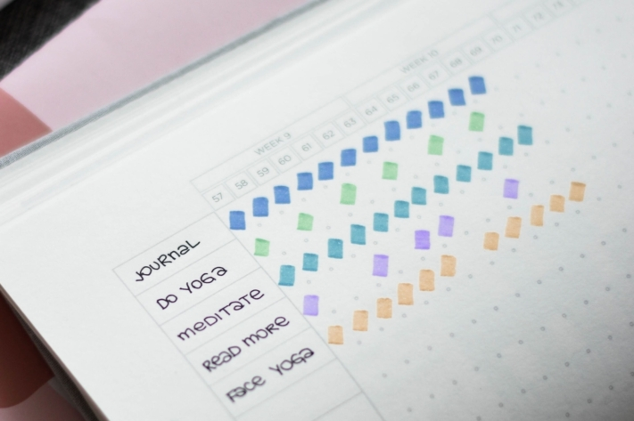

Hacer **propósitos** de Año Nuevo se ha convertido en un hábito para muchas personas. Pero todos los años nos decepcionamos cuando no cumplimos nuestros propósitos. Se necesita una gran voluntad para integrar nuevos hábitos en nuestras vidas. Existen **seguidores** de hábitos que facilitan este proceso.

Mantienen alta la motivación y también crean la ambición de mantener un buen comportamiento o romper un mal hábito. Este artículo explica cómo funciona un seguidor de hábitos y lo que necesitas saber para crear un seguidor de hábitos según tus deseos.

## ¿Qué puede hacer un rastreador de hábitos?

Crear nuevos hábitos y cambiar los malos: un registro de hábitos puede ayudarle a conseguirlo. En su forma más básica, se trata de una **lista con casillas de verificación** en la que documentas cada día durante un periodo de un mes si has llevado a cabo una acción o no. ¿Te has propuesto meditar todos los días? Marque siempre la casilla si ha cumplido su propósito ese día. Si mantienes tu registro de hábitos con regularidad, obtendrás una imagen que muestra tus **progresos**.

Tu Rastreador de Hábitos podría tener este aspecto.

No hay límites a su imaginación a la hora de **diseñar** su Seguidor de hábitos. Por ejemplo, trabaje con diferentes **colores** y tipos de letra o simplemente ponga en práctica sus ideas en línea con el Seguidor de hábitos [de SeaTable](#Vorlage_fuer_Ihren_digitalen_Habit_Tracker). No sólo debes anotar tus hábitos deseados, sino también tus hábitos anteriores. El seguimiento le ayuda a tomar conciencia de los hábitos que ha dado por sentados hasta el momento.



Pero recuerda: Tu Seguidor de hábitos no está hecho para durar para siempre. El objetivo es desarrollar una **rutina** para que en algún momento ya no necesites registrar tu actividad.

## Por qué es útil registrar tus progresos

Además del objetivo de aprender hábitos e integrarlos en tu vida cotidiana, el seguimiento tiene algunos efectos secundarios útiles. Por ejemplo, puedes beneficiarte de poder ver tus **éxitos** y **contratiempos** sin distorsiones. Esto significa que no tienes que poner excusas y puedes **reflexionar sobre** tus resultados.

Además, los éxitos rápidamente reconocibles aumentan la confianza en ti mismo y te animan a continuar con **motivación** y **disciplina**. Con un seguidor de hábitos, desarrollarás rápidamente la ambición de mantener la racha ganadora.



Probablemente la mayor ventaja sea la **creación de rutinas**. Al ser consciente de tus progresos, puedes interiorizar tus hábitos. El propio Rastreador de hábitos lo demuestra. Al fin y al cabo, marcar regularmente las tareas pendientes también es un hábito.

## Qué hábitos puede seguir

Ya se trate de pequeñas cosas de la vida cotidiana o de dar un vuelco a toda tu vida, básicamente todo es posible. Por supuesto, deben ser hábitos que consideres que **merecen la pena** y con los que puedas crecer. O simplemente algo que te guste. La regla es: si quieres apuntar alto, tienes que empezar poco a poco. Siempre puedes mejorar más adelante.

Piense en hábitos que **mejoren su vida cotidiana** y puedan integrarse en ella. Date cuenta también de qué hábitos tienes ya y si es necesario cambiarlos. Tanto si quieres deshacerte de malos hábitos como aprender otros nuevos, aquí encontrarás inspiración:

Puedes cambiar los malos hábitos por los buenos.

### Introducir nuevos hábitos con el Rastreador de hábitos

- **Salud**: hacer ejercicio tres veces por semana, comer más fruta y beber dos litros de agua al día.
- **Productividad**: levantarse a las 6 de la mañana, utilizar menos las redes sociales, preparar la ropa para el día siguiente todas las noches.
- **Objetivos de aprendizaje**: leer durante 10 minutos, aprender cinco palabras nuevas en una lengua extranjera, ver vídeos en una lengua extranjera
- **Hogar**: fregar los platos inmediatamente después de comer, sacar la basura una vez a la semana, recoger el escritorio
- **Mentalidad**: Meditar durante 30 minutos, dar un paseo, hacer un cumplido a alguien...

## Cambiar los hábitos

Muchas **pautas de comportamiento desagradables** se han instalado en nuestra vida cotidiana y se han convertido en hábitos silenciosa y secretamente. Deshacerse de ellos o, en el mejor de los casos, convertirlos en buenos hábitos requiere mucho tiempo y energía. Pero con un **plan**, puede tener éxito en este empeño.

Este plan le ayudará a alcanzar sus objetivos.

### Fijar objetivo

Todos los comienzos son difíciles. La primera pregunta que debes hacerte es cuál debe ser tu **objetivo**. ¿Qué quieres conseguir cambiando tus hábitos? Esta pregunta es importante para aclarar tu **motivación**. Ahora piensa en lo que quieres registrar con tu seguidor de hábitos. Para empezar, no debería haber más de **cinco hábitos**, dos de los cuales deberían ser recién aprendidos. En cuanto al tiempo, lo lógico es concentrarse en **un mes** al principio.

No asuma demasiadas cosas, porque un contratiempo rápido podría hacerle abandonar de nuevo todos sus buenos propósitos. También puedes facilitar el seguimiento si fijas un momento específico del día para anotarlo o marcarlo todo inmediatamente después de las actividades.

### Crear compromiso

No te guardes tus planes para ti. Al contar tus objetivos a tus amigos o familiares, creas un **compromiso** adicional. Ya no sólo eres responsable ante ti mismo, sino que también quieres poder contar tus éxitos a personas de confianza.

### Establecer una rutina

Llevar a cabo sus comportamientos con regularidad requiere una gran **autodisciplina**. Sin embargo, hay consejos que te ayudarán a integrar más rápidamente los hábitos en tu vida cotidiana.

El bestseller de James Clear contiene consejos útiles.

Los siguientes consejos proceden del libro de James Clear **El método del 1%** _(Atomic Habits_) y pueden hacer que tu rastreador de hábitos sea aún más eficaz.



Para que una acción deseable sea más vinculante, debe vincularla al lugar y al momento de ejecución.




Los hábitos que ya están automatizados pueden facilitarle el aprendizaje de nuevos hábitos. Basta con realizar un hábito actual y un hábito nuevo uno detrás de otro.




No todos los hábitos que desea aprender le proporcionarán placer. Por eso puede ser útil trabajar con un sistema de recompensas. Realiza una tarea que no te guste y luego prémiate con algo que te resulte fácil y divertido.




Si una actividad le lleva menos de dos minutos, puede realizarla inmediatamente, ya que requiere poca energía y esfuerzo. Al principio de su viaje de seguimiento, tiene sentido empezar poco a poco. Los hábitos que puedes hacer en dos minutos son motivadores y te ofrecen la oportunidad de ampliarlos a tu gusto.



### Celebrar el progreso

Cuanto más tiempo mantenga un hábito, más fácil le resultará llevarlo a cabo. Un nuevo hábito suele tardar entre dos y tres meses en **automatizarse**. Sin embargo, se trata de un largo camino y debes celebrar cada hito como es debido. Para que le resulte más fácil alcanzar sus objetivos, puede añadir **minihábitos** a su registro de hábitos. Son etapas en el camino hacia tu objetivo.

Por ejemplo, proponte leer 30 páginas cada día. Sin embargo, si no lo consigue, no es motivo para abandonar por completo. Empieza leyendo cinco páginas al día e intenta **aumentarlo** poco a poco. Fíjate un mínimo que quieras alcanzar en un día, y luego alégrate de todo lo que consigas más allá.

### Superar los contratiempos

Cualquiera que progrese también tendrá que hacer frente a los contratiempos. No llevar a cabo tus hábitos no es el fin del mundo. Puede ocurrir rápidamente si simplemente has querido asumir demasiadas buenas intenciones y ahora te abruman. Tómate tu tiempo para reflexionar sobre **por qué** no has podido alcanzar tus objetivos.

¿Hay demasiados hábitos? Entonces ajústelos o **reduzca la carga de trabajo**. ¿Al final una actividad no es de su agrado? Eso también puede ocurrir. No siempre te gusta un hábito tanto como pensabas, y no pasa nada. Una vez que te hayas dado cuenta de la razón de tu tropiezo, es importante que continúes con un seguimiento revisado del hábito. Porque si te rindes, todos tus esfuerzos serán en vano. Así que recuérdate a ti mismo por qué quieres cambiar tus hábitos y encuentra una nueva **fuente de motivación**.

### Automatizar hábitos

¡Y has alcanzado tu objetivo! Has mantenido siempre tu rastreador de hábitos y éstos se han integrado firmemente en tu vida cotidiana. Eso es estupendo, pero alcanzar los objetivos lleva su tiempo. Según los últimos [estudios](https://onlinelibrary.wiley.com/doi/abs/10.1002/ejsp.674), se tarda una media de **66 días** en crear un hábito. Sin embargo, no se trata tanto de cuánto tiempo se lleva a cabo un comportamiento, sino de con qué frecuencia.

## Crear un registro de hábitos

Como ya se ha mencionado, no hay límites para el diseño de tu Seguidor de Hábitos. La personalización a mano puede ayudar a crear un compromiso adicional a través de la personalización y proporcionar una motivación adicional con el trabajo que ya has invertido.

Puedes diseñar tu Seguidor de hábitos a mano o con plantillas.

Si te gusta lo práctico y sencillo, también puedes utilizar una **aplicación** o una **plantilla en línea**. Suelen ser menos creativas, pero agrupan todos los hábitos de forma clara y estructurada. En comparación con los cuadernos y calendarios de papel, **los rastreadores de hábitos digitales** pueden adaptarse con flexibilidad a medida que cambian tus hábitos.

## Plantilla para el registro digital de hábitos

Para no perder de vista tu objetivo, necesitas una solución sencilla y eficaz para hacer un seguimiento de tus hábitos y progresos. SeaTable te lo ofrece con una [plantilla gratuita]() que puedes personalizar según tus necesidades personales. El Seguidor de hábitos se integra en un diario de viñetas, que ofrece formas aún más interesantes de organizar y cambiar tu vida.

Si desea utilizar SeaTable para su seguimiento de hábitos, sólo tiene que [registrarse]() gratuitamente. Puede encontrar la plantilla correspondiente con mucha inspiración y ejemplos de hábitos [aquí]().
