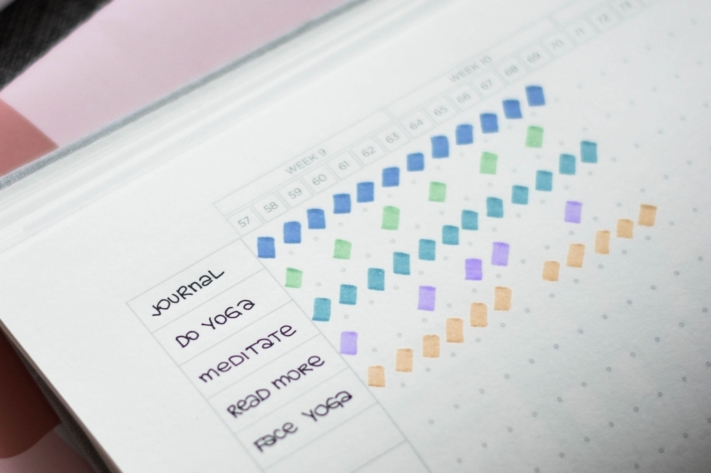
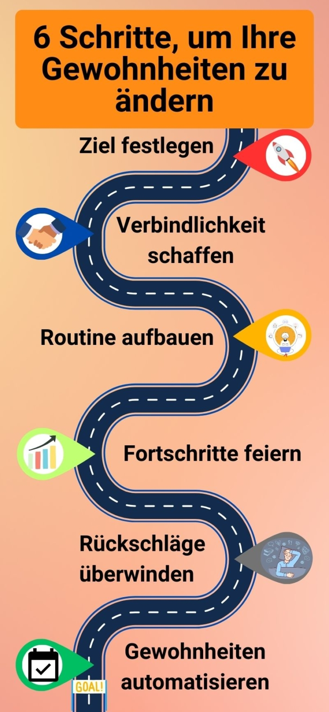
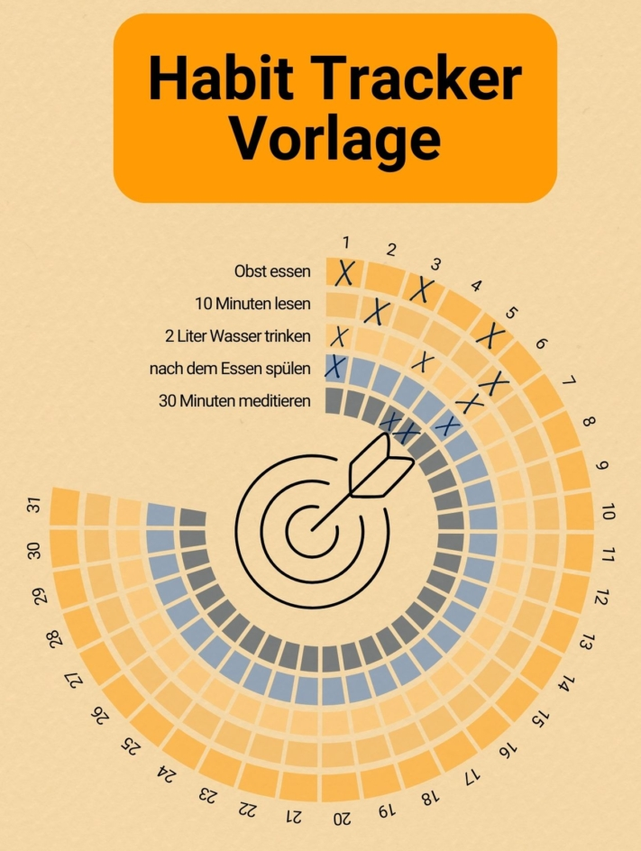

Prendre **de bonnes résolutions** pour la nouvelle année est devenu une habitude pour de nombreuses personnes. Mais chaque année, on est déçu de ne pas réussir à tenir ses bonnes résolutions. Il faut en effet faire preuve de beaucoup de volonté pour intégrer de nouvelles habitudes dans notre vie. Pour faciliter cette démarche, il existe des **Habit Tracker**.

Ils maintiennent la motivation à un niveau élevé et suscitent en outre l'ambition de maintenir les bons comportements ou de se débarrasser d'une mauvaise habitude. Vous découvrirez dans cet article comment fonctionne un Habit Tracker et ce que vous devez savoir pour créer un Habit Tracker à votre convenance.

## Que peut faire un Habit Tracker ?

Construire de nouvelles habitudes et changer les mauvaises - c'est ce que vous aide à faire un Habit Tracker. Dans sa version la plus basique, il s'agit d'une **liste avec des cases à cocher** dans laquelle vous documentez chaque jour, sur une période d'un mois, si vous avez effectué une action ou non. Vous avez décidé de méditer tous les jours ? Dans ce cas, cochez toujours la case si vous avez effectivement respecté votre résolution ce jour-là. Si vous entretenez régulièrement votre Habit Tracker, il en résultera une image qui montrera vos **progrès**.

Voici à quoi pourrait ressembler votre Habit Tracker.

Votre imagination n'a pas de limite pour la **conception** de votre Habit Tracker. Travaillez par exemple avec différentes **couleurs** et polices de caractères ou concrétisez simplement vos idées en ligne avec l'[Habit Tracker de SeaTable](#Vorlage_fuer_Ihren_digitalen_Habit_Tracker). Ce faisant, ne notez pas seulement les habitudes que vous souhaitez adopter, mais aussi celles que vous avez déjà adoptées. Le suivi vous aidera à prendre conscience des habitudes que vous aviez perçues jusqu'alors comme allant de soi.



Mais n'oubliez pas : Votre Habit Tracker n'est pas fait pour durer. L'objectif est de développer une **routine** afin qu'à un moment donné, vous n'ayez plus besoin d'enregistrer votre activité.

## Pourquoi il est utile de noter ses progrès

Outre l'objectif d'apprendre des habitudes et de les intégrer dans votre quotidien, le suivi a quelques effets secondaires utiles. Profitez par exemple de la possibilité de voir vos **succès**, mais aussi vos **échecs**, sans être déformé. Vous n'aurez ainsi aucune chance de vous trouver des excuses et vous pourrez **vous** livrer à **une réflexion sur** vos résultats.

En outre, les succès rapidement identifiables renforcent la confiance en soi et incitent à continuer de **manière** **motivée** et **disciplinée**. Avec un Habit Tracker, vous développez rapidement une ambition de ne pas laisser la série de victoires s'interrompre.



Le plus grand avantage est sans doute la **mise en place de routines**. En prenant conscience de vos progrès, vous pouvez intérioriser vos habitudes. C'est ce que prouve le Habit Tracker en lui-même. Après tout, le fait de cocher régulièrement vos "to-do" est également une habitude.

## Les habitudes que vous pouvez suivre

Qu'il s'agisse de petits détails du quotidien ou d'un changement de vie, tout est possible. Il doit bien sûr s'agir d'habitudes que vous considérez comme **souhaitables** et qui vous permettent de grandir. Ou simplement quelque chose qui vous plaît. Le principe est le suivant : pour atteindre des sommets, il faut commencer petit. Vous pourrez toujours vous améliorer par la suite.

Réfléchissez à des habitudes qui **améliorent votre quotidien** et qui peuvent y être intégrées. Prenez également conscience des habitudes que vous avez déjà et si elles ont besoin d'être modifiées. Qu'il s'agisse d'abandonner de mauvaises habitudes ou d'en acquérir de nouvelles, vous trouverez ici de l'inspiration :

Vous pouvez remplacer les mauvaises habitudes par de bonnes.

### Introduire de nouvelles habitudes avec Habit Tracker

- **Santé**: faire du sport trois fois par semaine, manger plus de fruits, boire deux litres d'eau par jour
- **Productivité**: se lever à 6 heures du matin, utiliser moins les médias sociaux, préparer chaque soir des vêtements pour le lendemain
- **Objectifs d'apprentissage**: lire pendant 10 minutes, apprendre cinq nouveaux mots d'une langue étrangère, regarder des vidéos en langue étrangère
- **Ménage**: faire la vaisselle juste après le repas, sortir la poubelle une fois par semaine, libérer le bureau
- **Mentalité**: méditer 30 minutes, faire une promenade, complimenter quelqu'un

## Changer les habitudes

De nombreux **comportements désagréables** se sont installés dans notre vie quotidienne et sont devenus discrètement des habitudes. S'en débarrasser ou, dans le meilleur des cas, en faire une bonne habitude vous demandera beaucoup de temps et d'énergie. Mais avec un **plan**, vous y parviendrez.

Ce plan vous aidera à atteindre vos objectifs.

### Définir l'objectif

Tout début est difficile. Tout d'abord, vous devez vous demander quel doit être votre **objectif**. Que voulez-vous atteindre en changeant vos habitudes ? Cette question est importante pour clarifier la **motivation**. Réfléchissez ensuite à ce que vous souhaitez enregistrer avec votre Habit Tracker. Au début, il ne devrait pas y avoir plus **de cinq habitudes**, dont deux nouvelles. En termes de temps, il est judicieux de se concentrer d'abord sur **un mois**.

N'en faites pas trop, car un revers rapide pourrait vous faire abandonner toutes vos bonnes intentions. En outre, il est plus facile de suivre les activités si vous fixez un moment précis de la journée pour les noter ou si vous cochez tout directement après les activités.

### Créer des obligations

Ne gardez pas vos projets pour vous. En parlant de vos objectifs à vos amis ou à votre famille, vous créez un **engagement** supplémentaire. Vous n'avez plus seulement des comptes à rendre à vous-même, mais vous voulez aussi pouvoir parler de vos succès à des personnes de confiance.

### Construire une routine

Adopter un comportement régulier demande une grande **autodiscipline**. Il existe cependant des conseils qui vous aideront à intégrer plus rapidement des habitudes dans votre quotidien.

Le best-seller de James Clear contient des conseils utiles.

Les conseils suivants sont tirés du livre **La méthode 1%** (en anglais _Atomic Habits_) de James Clear et peuvent rendre votre Habit Tracker encore plus efficace.



Pour rendre une action souhaitable plus contraignante, associez-la au lieu et à l'heure de son exécution.




Les habitudes déjà automatisées peuvent vous faciliter l'apprentissage de nouvelles habitudes. Il vous suffit d'exécuter successivement une habitude actuelle et une nouvelle habitude.




Les habitudes que vous souhaitez acquérir ne vous procurent pas toutes du plaisir. C'est pourquoi il peut être utile de travailler avec un système de récompense. Exécutez une tâche que vous n'aimez pas et récompensez-vous ensuite avec quelque chose que vous trouvez facile et agréable.




Si une activité dure moins de deux minutes, vous pouvez la faire immédiatement, car elle demande peu d'énergie et d'efforts. Au début de votre parcours de suivi, il est judicieux de commencer petit. Les habitudes que vous pouvez réaliser en deux minutes sont motivantes et offrent la possibilité de les étendre à volonté.



### Célébrer les progrès

Plus vous vous accrochez à une habitude, plus il vous sera facile de la mettre en pratique. En général, il faut environ deux à trois mois pour qu'une nouvelle habitude devienne un **automatisme**. Mais c'est un long chemin et vous devriez célébrer chaque étape comme il se doit. Pour vous aider à atteindre vos objectifs, vous pouvez ajouter **des mini-habitudes** à votre Habit Tracker. Ce sont des étapes sur votre chemin vers votre objectif.

Par exemple, décidez de lire 30 pages par jour. Si vous n'y parvenez pas, ce n'est pas une raison pour abandonner complètement. Commencez par lire cinq pages par jour et essayez d'**augmenter** progressivement. Fixez-vous un minimum de ce que vous voulez faire en un jour, vous pourrez alors vous réjouir de tout ce que vous ferez en plus.

### Surmonter les échecs

Celui qui fait des progrès doit aussi faire face à des échecs. Ne pas appliquer ses habitudes n'est pas la fin du monde. C'est vite arrivé si vous avez tout simplement voulu prendre trop de bonnes résolutions et qu'elles vous dépassent maintenant. Prenez le temps de réfléchir aux **raisons pour lesquelles** vous n'avez pas pu atteindre vos objectifs.

Les habitudes sont-elles trop nombreuses ? Alors adaptez-les ou **réduisez la charge de travail**. Une activité ne vous convient pas ? Cela peut aussi arriver. Une habitude ne vous plaît pas toujours autant que vous l'aviez imaginée, et c'est normal. Une fois que vous avez compris pourquoi vous avez trébuché, il est important de continuer avec un Habit Tracker révisé. Car si vous abandonnez, tous vos efforts seront perdus. Rappelez-vous donc pourquoi vous voulez changer vos habitudes et trouvez une nouvelle **source de motivation**.

### Automatiser les habitudes

Et voilà, vous avez atteint votre but ! Vous avez toujours entretenu votre Habit Tracker et les habitudes se sont fermement intégrées dans votre quotidien. C'est formidable - mais atteindre ses objectifs prend du temps. Selon des [études](https://onlinelibrary.wiley.com/doi/abs/10.1002/ejsp.674) récentes, il faut en moyenne **66 jours** pour mettre en place une habitude. Cependant, ce n'est pas tant la durée d'exécution d'un comportement qui compte que sa fréquence.

## Créer un Habit Tracker

Comme nous l'avons déjà mentionné, il n'y a pas de limites à la conception de votre Habit Tracker. La fabrication individuelle à la main peut aider à créer un engagement supplémentaire grâce à la personnalisation et à se motiver encore plus avec le travail déjà investi.

Vous pouvez concevoir votre Habit Tracker à la main ou avec des modèles.

Ceux qui aiment la praticité et la simplicité peuvent aussi utiliser une **application** ou un **modèle en ligne**. Ceux-ci sont généralement moins créatifs, mais regroupent toutes les habitudes de manière claire et structurée. Par rapport aux carnets de notes et aux calendriers papier, **les Habit Tracker numériques** sont adaptables de manière flexible lorsque vos habitudes changent.

## Modèle pour votre Habit Tracker numérique

Pour ne pas perdre de vue votre objectif, vous avez besoin d'une solution simple et efficace pour suivre vos habitudes et vos progrès. C'est ce que vous propose SeaTable avec un [modèle gratuit]() que vous pouvez adapter à vos besoins personnels. Habit Tracker est intégré à un Bullet Journal, qui offre encore d'autres possibilités passionnantes d'organiser et de changer votre vie.

Si vous souhaitez utiliser SeaTable pour votre Habit Tracker, il vous suffit de [vous inscrire]() gratuitement. Vous trouverez [ici]() le modèle correspondant avec de nombreuses inspirations et des exemples d'habitudes.
