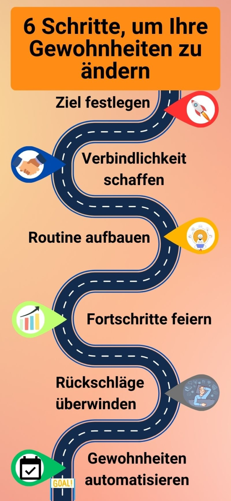

Принятие новогодних **резолюций** стало привычкой для многих людей. Но каждый год мы разочаровываемся, когда нам не удается выполнить свои решения. В конце концов, чтобы внедрить новые привычки в нашу жизнь, нужна сильная воля. Чтобы облегчить этот процесс, существуют **трекеры привычек**.

Они поддерживают высокую мотивацию, а также создают стремление сохранить хорошее поведение или отказаться от вредной привычки. В этой статье рассказывается о том, как работает трекер привычек и что нужно знать, чтобы создать трекер привычек в соответствии с вашими пожеланиями.

## Что может сделать трекер привычек?

Формирование новых привычек и изменение плохих - в этом вам поможет трекер привычек. В самом простом виде это **список с флажками**, в котором вы каждый день в течение месяца фиксируете, выполнили вы то или иное действие или нет. Вы решили медитировать каждый день? Тогда всегда ставьте галочку, если вы действительно выполнили свое решение в этот день. Если вы будете регулярно вести свой трекер привычек, то получите картину, которая покажет ваш **прогресс**.

Ваш трекер привычек может выглядеть следующим образом.

При **оформлении** своего Habit Tracker ваша фантазия не ограничена. Например, работайте с разными **цветами** и шрифтами или просто реализуйте свои идеи в режиме онлайн с помощью [Habit Tracker от SeaTable](#Vorlage_fuer_Ihren_digitalen_Habit_Tracker). Вы должны записывать не только желаемые привычки, но и свои предыдущие. Отслеживание поможет вам осознать те привычки, которые вы до сих пор считали само собой разумеющимися.



Но помните: Ваш Habit Tracker не предназначен для того, чтобы работать вечно. Цель - выработать **привычный режим**, чтобы в какой-то момент вам больше не нужно было записывать свою активность.

## Почему полезно записывать свой прогресс

Помимо цели выработать привычки и внедрить их в свою повседневную жизнь, отслеживание имеет и ряд полезных побочных эффектов. Например, вам поможет возможность видеть свои **успехи** и **неудачи** без искажений. Это значит, что вам не придется оправдываться и вы сможете **осмыслить** свои результаты.

Кроме того, быстро узнаваемые успехи укрепляют вашу уверенность в себе и побуждают к дальнейшей **мотивации** и **дисциплине**. С помощью трекера привычек вы быстро выработаете в себе стремление продолжать победную серию.



Наверное, самое большое преимущество - это **создание привычек**. Осознавая свой прогресс, вы сможете укоренить свои привычки. Habit Tracker доказывает это в первую очередь. В конце концов, регулярно отмечать свои дела - это тоже привычка.

## Какие привычки вы можете отслеживать

Будь то мелочи в повседневной жизни или переворачивание всей жизни с ног на голову - в принципе, все возможно. Конечно, это должны быть привычки, которые вы считаете **достойными** и с которыми вы можете развиваться. Или просто то, что вам нравится. Правило гласит: если вы хотите достичь высоких целей, начните с малого. Позже вы всегда сможете совершенствоваться.

Подумайте о привычках, которые **улучшат вашу повседневную жизнь** и могут быть интегрированы в нее. Также осознайте, какие привычки у вас уже есть и нужно ли их менять. Если вы хотите избавиться от вредных привычек или научиться новым, вы найдете здесь вдохновение:

Вы можете поменять плохие привычки на хорошие.

### Внедрение новых привычек с помощью Habit Tracker

- **Здоровье**: занимайтесь спортом три раза в неделю, ешьте больше фруктов, пейте два литра воды в день
- **Продуктивность**: вставать в 6 утра, меньше пользоваться социальными сетями, каждый вечер готовить одежду к следующему дню
- **Учебные задачи**: читать в течение 10 минут, выучить пять новых слов на иностранном языке, смотреть видео на иностранном языке
- **Домашнее хозяйство**: мыть посуду сразу после еды, выносить мусор раз в неделю, убирать со стола
- **Менталитет**: медитируйте 30 минут, прогуляйтесь, сделайте кому-нибудь комплимент

## Измените привычки

Многие **неприятные модели поведения** прочно вошли в нашу повседневную жизнь и тихо и незаметно превратились в привычки. Чтобы избавиться от них или, в лучшем случае, превратить их в хорошие привычки, требуется много времени и сил. Но, имея **план**, вы можете добиться успеха в этом деле.

Этот план поможет вам достичь поставленных целей.

### Установите цель

Любое начало дается нелегко. Первый вопрос, который вы должны задать себе, - какая у вас должна быть **цель**. Чего вы хотите добиться, изменив свои привычки? Этот вопрос важен для того, чтобы прояснить вашу **мотивацию**. Теперь подумайте, что вы хотите записывать в трекере привычек. Для начала у вас должно быть не более **пяти привычек**, две из которых должны быть вновь приобретенными. Что касается времени, то сначала имеет смысл сосредоточиться на **одном месяце**.

Не берите на себя слишком много, потому что быстрая неудача может привести к тому, что вы снова забросите все свои благие намерения. Вы также можете облегчить себе задачу, если вы выделите определенное время в день, чтобы записывать или отмечать все сразу после выполнения дел.

### Создать обязательства

Не держите свои планы в тайне. Рассказывая о своих целях друзьям или родственникам, вы создаете дополнительные **обязательства**. Теперь вы не только отвечаете перед собой, но и хотите иметь возможность рассказать о своих успехах людям, которым вы доверяете.

### Установите распорядок дня

Регулярное следование своим привычкам требует сильной **самодисциплины**. Однако есть советы, которые помогут вам быстрее внедрить привычки в свою повседневную жизнь.

Бестселлер Джеймса Клира содержит полезные советы.

Следующие советы взяты из книги Джеймса Клира " **Метод 1%** " _(Atomic Habits_) и могут сделать ваш трекер привычек еще более эффективным.



Чтобы сделать желаемое действие более обязательным, следует привязать его к месту и времени выполнения.




Привычки, которые уже доведены до автоматизма, могут облегчить вам освоение новых привычек. Просто выполняйте текущую и новую привычки одну за другой.




Не все привычки, которые вы хотите освоить, будут приносить вам удовольствие. Поэтому может помочь система поощрений. Выполните задание, которое вам не нравится, а затем вознаградите себя чем-то, что вам кажется легким и веселым.




Если занятие занимает менее двух минут, его можно выполнять сразу, так как оно не требует больших затрат энергии и сил. В начале пути к отслеживанию имеет смысл начать с малого. Привычки, которые вы можете выполнить за две минуты, мотивируют и дают возможность расширить их по своему усмотрению.



### Празднование прогресса

Чем дольше вы придерживаетесь привычки, тем легче вам будет ее выполнять. Обычно на то, чтобы новая привычка стала **автоматической**, уходит около двух-трех месяцев. Однако это долгий путь, и вам следует должным образом отмечать каждую веху. Чтобы вам было легче достигать своих целей, вы можете добавить **мини-привычки** в свой трекер привычек. Это этапы на пути к цели.

Например, решите читать по 30 страниц каждый день. Однако если вам это не удается, это не повод полностью сдаваться. Начните с чтения пяти страниц в день и старайтесь постепенно **увеличивать** этот показатель. Установите для себя минимум, которого вы непременно хотите достичь за день, и тогда вы сможете радоваться всему, чего достигнете сверх этого.

### Преодоление неудач

Каждый, кто добивается успехов, сталкивается с неудачами. Невыполнение привычек - это не конец света. Это может произойти быстро, если вы просто захотели взять на себя слишком много благих намерений, и теперь они переполняют вас. Потратьте время на размышления о том, **почему** вы не смогли достичь своих целей.

Слишком много привычек? Тогда скорректируйте их или **уменьшите нагрузку**. Какое-то занятие вам не по душе? Такое тоже может случиться. Не всегда привычка нравится вам так сильно, как вы думали, и это нормально. Как только вы поймете причину своего срыва, важно продолжить работу над привычкой. Ведь если вы сдадитесь, все ваши усилия пойдут насмарку. Поэтому напомните себе, почему вы хотите изменить свои привычки, и найдите новый **источник мотивации**.

### Автоматизируйте привычки

И вы достигли своей цели! Вы постоянно ведете свой трекер привычек, и эти привычки прочно вошли в вашу повседневную жизнь. Это замечательно, но достижение целей требует времени. Согласно последним [исследованиям](https://onlinelibrary.wiley.com/doi/abs/10.1002/ejsp.674), на формирование привычки уходит в среднем **66 дней**. Однако важно не столько то, как долго поведение выполняется, сколько то, как часто оно выполняется.

## Создайте систему отслеживания привычек

Как уже говорилось, нет никаких ограничений для дизайна вашего Habit Tracker. Индивидуальный подход может помочь создать дополнительную заинтересованность благодаря персонализации и обеспечить дополнительную мотивацию к уже проделанной работе.

Вы можете создать свой Habit Tracker вручную или с помощью шаблонов.

Если вы любите практичность и простоту, можно воспользоваться **приложением** или **онлайн-шаблоном**. Они обычно менее креативны, но зато четко и структурированно фиксируют все привычки. По сравнению с блокнотами и бумажными календарями, **цифровые трекеры привычек** можно гибко адаптировать, если ваши привычки меняются.

## Шаблон для цифрового трекера привычек

Чтобы не потерять из виду свою цель, вам нужно простое и эффективное решение для отслеживания своих привычек и прогресса. SeaTable предлагает вам это с помощью [бесплатного шаблона](), который вы можете настроить в соответствии с вашими личными потребностями. Трекер привычек интегрирован в пулевой журнал, который предлагает еще больше интересных способов организовать и изменить свою жизнь.

Если вы хотите использовать SeaTable для отслеживания своих привычек, просто [зарегистрируйтесь]() бесплатно. Соответствующий шаблон с большим количеством вдохновения и примеров привычек вы найдете [здесь]().
