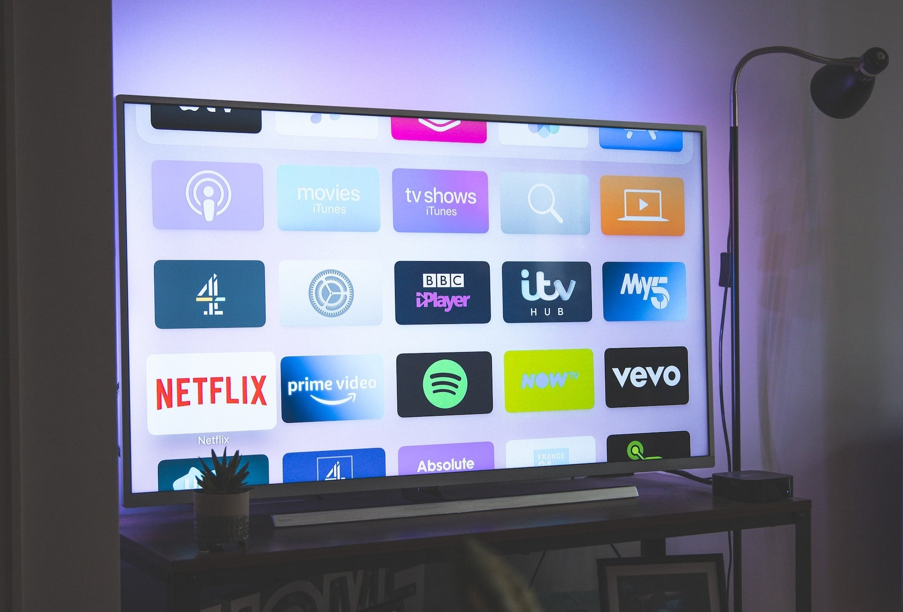
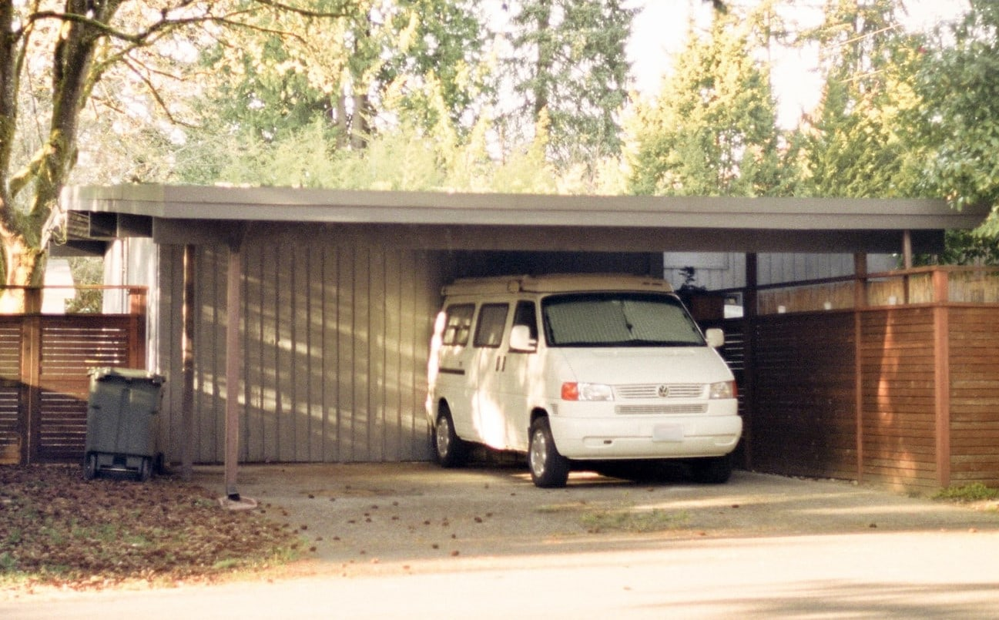

Keeping track of your spending is sometimes not that easy. It happens far too often that the money is simply gone at the end of the month and you can hardly remember what you actually spent it on. This is exactly when a **budget book** comes to the rescue and brings order to the financial chaos!

## Good reasons for a budget book

### Document expenses with a budget book

Let's be honest: how often do you check your bank statements and add up what you've spent money on? As long as the account is not in the red, we usually shy away from the effort and perhaps don't want to know exactly. Because if we saw how much shopping trips, going out with friends or smoking cost in the long run, we might question our lifestyle.

In addition to unavoidable fixed costs, smaller cost traps can also add up to considerable sums. You should take action at the latest when you realize that there is hardly anything left over after deducting all costs. With a budget book, you can keep a complete record of what you spend your money on. Get an overview of your running costs so that you can be sure that your money won't simply disappear without a trace.

### Uncovering unnecessarily high expenditure

Do you have less money left over at the end of the month than you thought? This may be due to particularly high expenditure in a certain area. In many households, the highest expenses can be attributed to the areas of housing, insurance, mobility and telecommunications. By keeping an overview of your expenses, you can quickly identify the highest costs in your budget book and consider whether you can make savings here.

### Long-term planning thanks to the budget book

Are you regularly surprised by unexpected debits to your account? A budget book allows you to accurately forecast your income and expenditure and plan your budget (e.g. for vacations) in the long term. This way, you always know how much you have left until the end of the month or year and there is no risk of running out of money before then.

## What you should record in the budget book

A budget book usually contains all the expenses that a person or family has per month or year. These are divided into **fixed costs** and **variable costs**.

- Fixed costs are fixed payments that you have to make regularly or that are automatically debited from your account, for example rent payments, insurance, electricity, internet and telephone costs, subscriptions and many other recurring costs.
- Variable costs, on the other hand, are not fixed, but are usually incurred individually and therefore always vary in amount. Every purchase, every meal in a restaurant and every one-way ticket are included. These costs are sometimes higher, sometimes lower.

If you wish, you can add your monthly **income** to your budget book. This includes your monthly fixed salary and variable income from side jobs, sales, credit notes or gifts. You can then calculate the financial **surplus** that you have left after deducting all costs. You can save this or plan for long-term investments.

## How to create a budget book

So there is every reason to create a budget book and check your expenses. It's up to you what exactly this looks like: you can list your expenses **manually on paper** or record your costs, invoices and receipts digitally. A **digital solution** is generally recommended due to the simpler data analysis. For example, you can use Excel or SeaTable for your budget book.

### Example: Budget book with SeaTable

The no-code database SeaTable offers you an excellent way to create your budget book - with an intuitive user interface and many functions that go beyond a classic **spreadsheet** such as Excel. Not only can you easily access your data in the cloud from any device, but you can also use **statistics**, **formulas**, **groupings** and **filters** to analyze your data.

You can easily enter all your expenses in your digital budget book. Using the example of a family of four, we have created a [free template](https://seatable.io/en/vorlage/kqecvuxbrganzgw0w1skgq/) that contains all the important points:

- Category, frequency and type of output
- Amount of the issue and upload of the invoice
- Date, month and cost unit of issue

Whether it's shopping, rent and utilities, car insurance or tutoring for your son - with SeaTable you can keep track of all your costs. With the help of [single-selection columns](https://seatable.io/en/docs/auswahlspalten/anlegen-einer-einfachauswahl-spalte/), you can **categorize**, **filter** and **group** your expenses individually. For a chronological order in your budget book, simply **sort** your expenses by [date](https://seatable.io/en/docs/datum-dauer-und-personen/die-datum-spalte/). You can list your monthly **income** and calculate your surplus **budget** in two additional tables.

If you would like to use the template for your budget book, [simply register for free]() in SeaTable. You can then import the [template](https://seatable.io/en/vorlage/kqecvuxbrganzgw0w1skgq/) into your workspace and adapt it flexibly to your needs.

## 12 tips to help you save money

Once you have set up your budget book, you should analyze the available data, draw conclusions and think about **potential savings**. We have put together 12 unbeatable tips on how you can reduce your costs so that you have more money for the finer things in life.

### 1\. check contracts and change provider

Many of the most expensive things in our lives are debited from our account every month. Electricity, internet, cell phone contracts, insurance and much more. You should review these **fixed costs** at least once a year. We recommend **comparing providers** via popular online portals such as Check24 or Verivox.

Scrutinize your current contracts, look around for cheaper alternatives if necessary and cancel **expensive old contracts**. Many providers are fighting for new customers - and often you don't even have to switch providers: a lucrative offer from the competition can also persuade your current provider to improve your **conditions**.

### 2\. cancel unnecessary subscriptions

Do you have streaming subscriptions to Amazon Prime, Netflix and Sky? But let's be honest - how often do you really manage to watch a movie or a whole series in your everyday life? Check whether you really use certain **streaming services** or can actually do without them. The same applies to music streaming services such as Spotify and Deezer or even **newspapers** and **magazines** that you have subscribed to. Even if it's only a few euros per month, the amounts in your budget will add up over time.

Unnecessary streaming subscriptions can be expensive.

### 3\. do sport free of charge

In addition to entertainment subscriptions, **memberships to gyms, sports clubs or dance schools** are also fixed monthly costs. But you know what it's like: once you've signed up, you quickly lose motivation and only show up sporadically. You can save yourself these running costs by exercising at home with simple aids such as dumbbells or elastic bands or by doing **exercises with your own weight**: Sit-ups, squats and push-ups don't cost a penny. You can also move your cardio training on the bike or treadmill from the gym to the fresh air for free.



### 4\. invite friends home

Game nights, parties or cooking something delicious together: **Activities at home** are almost always cheaper than going out. Together with friends, you can easily save money by reducing visits to restaurants, bars and clubs and [organizing parties at](https://seatable.io/en/vorlage/cedsmqybrkwqohspoicw-a/) home instead, where each guest contributes a few snacks or drinks. You might even have more fun at home, you can choose the music and the guest list yourself and your budget will thank you for it.

### 5\. rent out unused living or storage space

Have your children moved out, have you sold your car or do you hardly use your basement? If you have more living or storage space than you need, it makes sense to rent it out. You can rent out a vacant **room** to travelers on a short-term basis via portals such as AirBnB or - if a shared flat is an option for you - permanently to subtenants.



The same applies if a **garage**, **parking space** or **basement room** that you don't need is part of your home. In the long term, [renting out real estate](https://seatable.io/en/hausverwaltung/) can bring in a lot of income that will please your household budget.

### 6\. use public transportation, carpooling and car sharing

Especially in larger cities, **owning a car** is hardly worthwhile for many people. After purchasing a car, you are constantly faced with the costs of fuel, maintenance, insurance and parking. This is why **car-sharing services** are becoming increasingly popular. If you are planning to travel a longer distance, you can use various **online car-sharing services** to pick up passengers or have yourself chauffeured.

Do without your own car and rent out the parking space - this way you save costs and generate income at the same time.

If your home is well connected to **public transport**, you can use it more often or do without a car altogether. Taking the bus and train not only saves you money, but also keeps you fit thanks to the walks between your home and the stops.

### 7\. buy used goods

You don't necessarily have to buy new items for your home or closet. **Second-hand items** in good to mint condition often cost less than half the price and are easier on your budget. Browse through **second-hand stores**, **flea markets** or **online marketplaces** in your area. To save money in this way, however, you will need a little more patience than you would for a shopping trip.

{{< warning headline="Attention: cost trap!" text="Old refrigerators, washing machines and other electrical appliances can often be bought very cheaply. But with these appliances in particular, it is important to consider the costs over their entire lifetime. An appliance that costs 200 euros more when new, but lasts ten years longer and uses 20 percent less electricity, can save you far more than 200 euros. It is therefore better to opt for high-quality electrical appliances. LED lamps also cost more to buy, but consume only around a tenth of the electricity of conventional light bulbs." />}}

Also look out for **special offers** from retailers. A [price comparison](https://seatable.io/en/vorlage/fsbfwc4fqocgqed7vczq9g/) can be worthwhile, especially if you are considering an expensive new purchase.

### 8\. avoid impulse purchases

Before you buy something, stop and think about whether you really need it. For **smaller purchases in the store**, put the item back after you have looked at it and look around the store for another 5 minutes. In most **online stores**, you can first add your object of desire to the shopping cart or write it on a wish list. If you haven't forgotten about the item after a while and still want it, then buy it.

Before making any **major purchases**, take a few days to calculate your budget in your budget book and compare prices. This will ensure that you can really afford the expenditure and don't fall for a supposed bargain without thinking.

### 9\. own brands instead of expensive branded products

Most supermarket chains have **their own brands** produced, which are significantly cheaper than branded products that are advertised expensively. However, private labels are often produced in exactly the same factories and with the same ingredients as the more expensive branded products. If you increasingly opt for private labels, you can save up to 30 percent on your purchases without compromising on quality.

Ready meals for every lunch break can be expensive. Here you can save not only with own brands, but also with home-cooked meals.

### 10\. pre-cook food for the lunch break

If you buy expensive ready meals at the supermarket every lunch break, order food to the office or eat at the takeaway around the corner, you're losing around 5 to 10 euros per working day. This can quickly add up to 150 euros a month. Instead, cook larger quantities of food in advance and heat up your favorite dishes during your lunch break. This will give you more budget for other things in your household budget.

[In this article, you will learn how Meal Prep can help you get through the week not only cheaper, but also healthier.](https://seatable.io/en/meal-prep-gesund-und-guenstig-essen-vorkochen/)

### 11\. avoid dietary supplements

Clever fitness gurus and their companies use enticing marketing to make us believe that we need to supplement our diet with special supplements, for example to build muscle, boost our metabolism or strengthen our immune system. Billions are spent on protein powders and vitamin pills, most of which are completely superfluous.

Instead, make sure you eat a balanced diet, get enough exercise and lead a healthy lifestyle, then you can do without the supposed miracle cures that only end up adding to your household budget.



### 12\. an end to expensive vices

Bad habits such as the regular consumption of **alcohol, cigarettes or coffee** can quickly cost you over 100 euros per month. However, there are several methods you can use to [change](https://seatable.io/en/habit-tracker-gewohnheiten-aendern/) your [habits](https://seatable.io/en/habit-tracker-gewohnheiten-aendern/) in the long term. With willpower and the support of friends and family, you may be able to get rid of expensive vices without which you can live healthier and save a lot of money in the long run.

At the same time, you can establish positive habits: For example, simply drinking water instead of expensive **energy drinks** is good for your health. Your budget will rejoice - especially if you avoid bottled water and use **tap water** instead.

## Your perfect budget book with SeaTable

As you can see: Keeping track of your expenses and living costs only has advantages. With a budget book, you always stay in control and know exactly where your money has gone. SeaTable adapts to your needs. If you currently use Excel for your budget book, you can simply import your tables into SeaTable. You can [register for free]() and try out SeaTable!

If you would like to use our template, take a look at our [Finance](https://seatable.io/en/vorlagen/finanzen/) template area. There are many more use cases for how SeaTable can make your everyday life easier.
