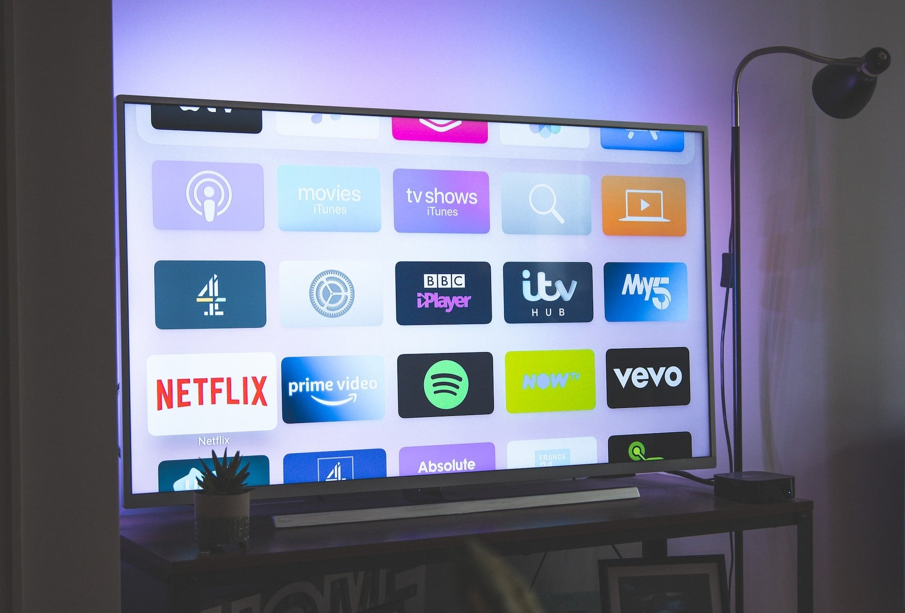

A veces no es fácil controlar los gastos. Ocurre con demasiada frecuencia que el dinero desaparece a final de mes y apenas se recuerda en qué se ha gastado. Es precisamente entonces cuando un **libro de** presupuestos viene al rescate y pone orden en el caos financiero.

## Buenas razones para un libro de presupuesto

### Documentar los gastos con un libro de presupuesto

Seamos sinceros: ¿con qué frecuencia compruebas tus extractos bancarios y sumas en qué te has gastado el dinero? Mientras la cuenta no esté en números rojos, solemos rehuir el esfuerzo y quizá no queramos saberlo con exactitud. Porque si viéramos cuánto cuestan a la larga los viajes de compras, las salidas con amigos o fumar, podríamos cuestionarnos nuestro estilo de vida.

Además de los costes fijos inevitables, las pequeñas trampas de costes también pueden sumar sumas considerables. Debería tomar medidas como muy tarde cuando se dé cuenta de que apenas le queda nada después de deducir todos los gastos. Con un libro de presupuesto, puedes llevar un registro completo de en qué gastas tu dinero. Hazte una idea general de tus gastos corrientes para estar seguro de que tu dinero no desaparece sin dejar rastro.

### Descubrir gastos innecesariamente elevados

¿Le sobra menos dinero a final de mes de lo que pensaba? Puede deberse a gastos especialmente elevados en un determinado ámbito. En muchos hogares, los gastos más elevados pueden clasificarse en vivienda, seguros, movilidad y telecomunicaciones. Si lleva un registro de sus gastos, podrá identificar rápidamente los gastos más elevados de su presupuesto y considerar si puede ahorrar en ellos.

### Planificación a largo plazo gracias a un libro de presupuestos

¿Le sorprenden a menudo los cargos inesperados en su cuenta? Una libreta presupuestaria le permite prever con exactitud sus ingresos y gastos y planificar su presupuesto (por ejemplo, para las vacaciones) a largo plazo. Así siempre sabrá cuánto le queda hasta final de mes o de año y no correrá el riesgo de quedarse sin dinero antes.

## Lo que debe anotar en el libro de presupuesto

Un libro de presupuestos suele contener todos los gastos que una persona o familia tiene al mes o al año. Se dividen en **gastos fijos** y **gastos variables**.

- Los gastos fijos son pagos fijos que tiene que hacer regularmente o que se cargan automáticamente en su cuenta, por ejemplo, pagos de alquiler, seguros, electricidad, gastos de Internet y teléfono, suscripciones y muchos otros gastos recurrentes.
- Los costes variables, en cambio, no son fijos, sino que suelen contraerse individualmente y, por tanto, siempre varían en su cuantía. Se incluyen cada compra, cada comida en un restaurante y cada entrada. Estos costes son a veces más altos, a veces más bajos.

Si lo desea, puede añadir sus **ingresos** mensuales a su libro de presupuesto. Esto incluye tu salario fijo mensual y los ingresos variables procedentes de trabajos paralelos, ventas, notas de crédito o regalos. A continuación, puedes calcular el **excedente** financiero que te queda después de deducir todos los gastos. Puedes ahorrarlo o planificarlo para inversiones a largo plazo.

## Cómo crear un libro de presupuesto

Así que todo habla a favor de crear un libro de presupuesto y controlar tus gastos. La forma exacta de hacerlo depende de ti: puedes enumerar tus gastos **manualmente en papel** o registrar tus gastos, facturas y recibos digitalmente. Por lo general, se recomienda una **solución digital** porque el análisis de los datos es más sencillo. Por ejemplo, puede utilizar Excel o SeaTable para su libro de presupuesto.

### Ejemplo: Presupuesto con SeaTable

La base de datos sin código SeaTable le ofrece una excelente oportunidad para crear su libro de presupuestos, con una interfaz de usuario intuitiva y muchas funciones que van más allá de una **hoja de cálculo** clásica como Excel. No solo puedes acceder fácilmente a tus datos en la nube desde cualquier dispositivo final, sino que también puedes utilizar **estadísticas**, **fórmulas**, **agrupaciones** y **filtros** para analizar tus datos.

Puedes introducir fácilmente todos tus gastos en tu libro de presupuesto digital. Utilizando el ejemplo de una familia de cuatro miembros, hemos creado una [plantilla gratuita]() que contiene todos los puntos importantes:

- Categoría, frecuencia y tipo de salida
- Importe de la emisión y carga de la factura
- Fecha, mes y unidad de coste de emisión

Ya se trate de la compra, el alquiler y los servicios públicos, el seguro del coche o las clases particulares de su hijo, con SeaTable podrá llevar un registro de todos sus gastos. Con la ayuda de [columnas de selección única](), puede **clasificar**, **filtrar** y **agrupar** sus gastos individualmente. Para un orden cronológico en su libro de presupuesto, simplemente **ordene** sus gastos por [fecha](). En dos tablas adicionales puede enumerar sus **ingresos** mensuales y calcular su **presupuesto de** excedentes.

Si desea utilizar la plantilla para su libro de presupuesto, [sólo tiene que registrarse gratuitamente]() en SeaTable. A continuación, podrá importar la [plantilla]() a su espacio de trabajo y personalizarla para adaptarla a sus necesidades.

## 12 consejos para ahorrar

En cuanto haya creado su libro de presupuesto, debe analizar los datos disponibles, sacar conclusiones y pensar en **posibles ahorros**. Hemos reunido 12 consejos inmejorables sobre cómo puedes reducir tus gastos para tener más dinero para las cosas buenas de la vida.

### 1\. comprobar los contratos y cambiar de proveedor

Muchas de las cosas más caras de nuestra vida se cargan en nuestra cuenta cada mes. Electricidad, internet, contratos de telefonía móvil, seguros y mucho más. Conviene revisar estos **gastos fijos** al menos una vez al año. Te recomendamos que **compares proveedores** a través de portales como Check24 o Verivox.

Revise sus contratos actuales, busque alternativas más baratas si es necesario y cancele los **antiguos contratos caros**. Muchos proveedores luchan por captar nuevos clientes, y a menudo ni siquiera es necesario cambiar de proveedor: una oferta lucrativa de la competencia también puede persuadir a su proveedor actual para que mejore sus **condiciones**.

### 2\. cancelar las suscripciones innecesarias

¿Tiene suscripciones de streaming de Amazon Prime, Netflix y Sky? Pero seamos sinceros: ¿con qué frecuencia consigues realmente ver una película o una serie entera en tu día a día? Comprueba si realmente utilizas determinados **servicios** de streaming o puedes prescindir de ellos. Lo mismo se aplica a los servicios de streaming de música, como Spotify y Deezer, o incluso a los **periódicos** y **revistas** a los que esté suscrito. Aunque solo sean unos euros al mes, las cantidades de tu presupuesto se irán acumulando con el tiempo.

Las suscripciones innecesarias de streaming pueden resultar caras.

### 3\. hacer deporte gratuitamente

Además de las suscripciones a espectáculos, las **cuotas de gimnasios, clubes deportivos o escuelas de baile** también forman parte de los gastos fijos mensuales. Pero ya sabes lo que pasa: una vez que te has apuntado, enseguida pierdes la motivación y sólo acudes esporádicamente. Puedes ahorrarte estos gastos corrientes haciendo ejercicio en casa con medios sencillos, como mancuernas o bandas elásticas, o haciendo **ejercicios con tu propio peso**: Los abdominales, las sentadillas y las flexiones no cuestan un céntimo. También puedes trasladar gratis del gimnasio al aire libre tu entrenamiento cardiovascular en bicicleta o cinta de correr.



### 4\. invitar a amigos a casa

Noches de juegos, fiestas o cocinar algo delicioso juntos: **Las actividades en casa** son casi siempre más baratas que salir. Junto con tus amigos, puedes ahorrar dinero fácilmente reduciendo las visitas a restaurantes, bares y discotecas y [organizando en su lugar fiestas en]() casa en las que cada invitado contribuya con algunos aperitivos o bebidas. Puede que incluso te diviertas más en casa, tú mismo puedes elegir la música y la lista de invitados, y tu presupuesto te lo agradecerá.

### 5\. Alquilar el espacio vital o de almacenamiento no utilizado.

¿Se han mudado sus hijos, ha vendido su coche o apenas utiliza su sótano? Si tienes más espacio habitable o de almacenaje del que necesitas, tiene sentido alquilarlo. Puedes alquilar una **habitación** vacía a viajeros a corto plazo a través de portales como AirBnB, por ejemplo, o -si un piso compartido es una opción para ti- a subarrendatarios de forma permanente.



Lo mismo ocurre si en su casa hay un **garaje**, un **aparcamiento** o **un sótano** que no necesita. [Alquilar una propiedad]() puede generar muchos ingresos a largo plazo, lo que complacerá el presupuesto de tu hogar.

### 6\. utilizar el transporte público, el coche compartido y el coche compartido

Especialmente en las grandes ciudades, **tener un coche** apenas merece la pena para mucha gente. Después de comprar un coche, hay que hacer frente constantemente a los gastos de combustible, mantenimiento, seguro y aparcamiento. Por eso son cada vez más populares los **sistemas de coche compartido**. Si tiene previsto recorrer una distancia larga, puede utilizar varias **agencias de coches compartidos en línea** para recoger pasajeros o pedir que le lleven con chófer.

Prescinde de tu propio coche y alquila la plaza de aparcamiento: así ahorras costes y generas ingresos al mismo tiempo.

Si tu casa está bien comunicada con el **transporte público**, puedes utilizarlo más a menudo o prescindir por completo del coche. Coger el autobús y el tren no sólo te ahorra dinero, sino que te mantiene en forma gracias a los paseos entre tu casa y las paradas.

### 7\. comprar bienes usados

No tiene por qué comprar cosas nuevas para su casa o su armario. Los **artículos de segunda mano** en buen estado suelen costar menos de la mitad y son más asequibles. Echa un vistazo en las **tiendas de segunda mano**, **mercadillos** o **mercados online** de tu barrio. Para ahorrar dinero de esta forma, sin embargo, necesitarás un poco más de paciencia que para ir de compras.

{{< warning headline="Atención: ¡trampa de costes!" text="Los frigoríficos, lavadoras y otros electrodomésticos viejos suelen ser muy baratos. Pero en el caso de estos electrodomésticos en particular, es importante tener en cuenta los costes a lo largo de toda su vida útil. Un electrodoméstico que cuesta 200 euros más cuando es nuevo, pero dura diez años más y consume un 20% menos de electricidad, puede ahorrarle mucho más de 200 euros. Por tanto, es mejor optar por electrodomésticos de alta calidad. Las bombillas LED también son más caras, pero sólo consumen una décima parte de electricidad que las bombillas convencionales." />}}

Busca también **ofertas especiales** de los comercios. [Comparar precios]() puede merecer la pena, sobre todo si estás pensando en hacer una nueva compra cara.

### 8\. evitar las compras impulsivas

Antes de comprar algo, párate a pensar si realmente lo necesitas. Para las **compras más pequeñas en la tienda**, deja el artículo en su sitio después de haberlo mirado y echa un vistazo a la tienda durante otros 5 minutos. En la mayoría de las **tiendas online**, primero puedes añadir tu objeto de deseo a la cesta de la compra o escribirlo en una lista de deseos. Si al cabo de un rato no te has olvidado del artículo y sigues deseándolo, entonces cómpralo.

Antes de hacer **compras importantes**, tómate unos días para calcular tu presupuesto en la libreta de gastos y comparar precios. Así te asegurarás de que realmente puedes permitirte el gasto y no caerás en una supuesta ganga sin pensar.

### 9\. marcas propias en lugar de productos de marca caros

La mayoría de las cadenas de supermercados hacen producir sus **propias** marcas, que son bastante más baratas que los productos de marca que se anuncian caros. Sin embargo, las marcas blancas suelen producirse exactamente en las mismas fábricas y con los mismos ingredientes que los productos de marca más caros. Si opta cada vez más por las marcas blancas, puede ahorrar hasta un 30% en sus compras sin sacrificar la calidad.

Los platos precocinados para cada almuerzo pueden resultar caros. Aquí puedes ahorrar no solo con marcas propias, sino también con comidas caseras.

### 10\. preparar la comida para el almuerzo

Si compras platos precocinados caros en el supermercado cada mediodía, pides comida para llevar a la oficina o comes en el restaurante de la esquina, estás malgastando entre 5 y 10 euros por jornada laboral. Esto puede suponer hasta 150 euros al mes. En lugar de eso, cocina grandes cantidades de comida con antelación y calienta tus platos favoritos durante la pausa para comer. Así tendrás más presupuesto para otras cosas.

[En este artículo, descubrirás cómo el Meal Prep no sólo puede ayudarte a pasar la semana de forma más económica, sino también más saludable.]()

### 11\. abstenerse de tomar suplementos dietéticos

Los astutos gurús del fitness y sus empresas utilizan un marketing tentador para hacernos creer que necesitamos complementar nuestra dieta con suplementos especiales, por ejemplo para ganar músculo, aumentar el metabolismo o reforzar el sistema inmunitario. Se gastan miles de millones en proteínas en polvo y píldoras vitamínicas, la mayoría de las cuales son completamente superfluas.

En lugar de eso, asegúrate de seguir una dieta equilibrada, hacer suficiente ejercicio y llevar un estilo de vida saludable, y entonces podrás prescindir de las supuestas curas milagrosas que sólo acaban engrosando tu presupuesto doméstico.



### 12\. fin de los vicios caros

Los malos hábitos, como el consumo habitual de **alcohol, cigarrillos o café**, pueden costarle rápidamente más de 100 euros al mes. Sin embargo, hay varios métodos que puede utilizar para [cambiar]() sus hábitos a largo plazo. Con fuerza de voluntad y el apoyo de amigos y familiares, podrá deshacerse de vicios caros sin los cuales podrá vivir más sano y ahorrar mucho dinero a largo plazo.

Al mismo tiempo, puedes establecer hábitos positivos: Por ejemplo, beber agua en lugar de **las** caras **bebidas energéticas** es bueno para la salud. Tu presupuesto se alegrará, sobre todo si renuncias al agua embotellada y utilizas **agua del grifo** en su lugar.

## Su presupuesto perfecto reserve con SeaTable

Como puede ver: Controlar tus gastos y costes de vida sólo tiene ventajas. Con un libro de presupuesto, siempre tendrá el control y sabrá exactamente a dónde ha ido a parar su dinero. SeaTable se adapta a sus necesidades. Si actualmente utiliza Excel para su libro de presupuesto, puede simplemente importar sus tablas a SeaTable. Puede [registrarse gratuitamente]() y probar SeaTable.

Si desea utilizar nuestra plantilla, eche un vistazo a nuestra área de plantillas de [Finanzas](). Hay muchos más casos de uso en los que SeaTable puede facilitarle el día a día.
