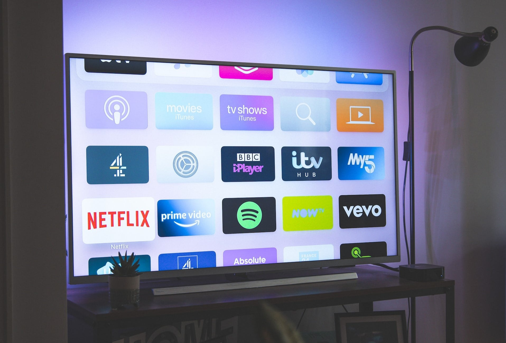

¿Pierde a menudo de vista sus gastos? ¿Le suena que el saldo de su cuenta haya bajado a final de mes y apenas pueda recordar en qué gastó su dinero? Es precisamente entonces cuando un **libro de presupuesto** viene al rescate y pone orden en el caos financiero.

## Buenas razones para un libro de presupuesto

### Documentar los gastos con un libro de presupuesto

Seamos sinceros: ¿con qué frecuencia comprueba sus extractos bancarios y suma en qué se ha gastado el dinero? Mientras la cuenta no esté en números rojos, solemos rehuir el esfuerzo y quizá no queramos saberlo con exactitud. Porque si viéramos cuánto cuestan a la larga **las salidas de compras**, **las salidas con amigos o el tabaco**, podríamos cuestionarnos nuestro estilo de vida.

Además de los costes fijos inevitables, las **pequeñas trampas de costes** también pueden sumar cantidades considerables. Debería tomar medidas como muy tarde cuando se dé cuenta de que apenas le queda nada después de deducir todos los gastos. Con un libro de presupuesto, puede llevar un registro completo de en qué gasta su dinero. Hágase una idea general de sus **gastos corrientes** para estar seguro de que su dinero no desaparece sin dejar rastro.

### Descubrir gastos innecesariamente elevados

¿Le sobra menos dinero a final de mes de lo que pensaba? Puede deberse a gastos especialmente elevados en un determinado ámbito. En muchos hogares, los gastos más elevados pueden clasificarse en **vivienda, seguros, movilidad y telecomunicaciones**. Si lleva un registro de sus gastos, podrá identificar rápidamente los gastos más elevados de su libro de presupuesto y considerar si puede ahorrar en ellos.

### Planificación a largo plazo gracias a un libro de presupuestos

¿Le sorprenden a menudo los cargos inesperados en su cuenta? Un libro de presupuesto le permite **prever con exactitud sus ingresos y gastos** y planificar su presupuesto (por ejemplo, para las [vacaciones]()) a largo plazo. Así siempre sabrá cuánto le queda hasta final de mes o de año y no correrá el riesgo de quedarse sin dinero antes.

## Lo que debe anotar en el libro de presupuesto

Un libro de presupuestos suele contener todos los gastos que una persona o familia tiene al mes o al año. Se dividen en **gastos fijos** y **gastos variables**.

- Los gastos fijos son pagos fijos que tiene que hacer regularmente o que se cargan automáticamente en su cuenta, por ejemplo, pagos de alquiler, seguros, gastos de [energía](), Internet y teléfono, suscripciones y muchos otros gastos recurrentes.
- Los costes variables, en cambio, no son fijos, sino que suelen contraerse individualmente y, por tanto, siempre varían en su cuantía. Se incluyen cada [compra](), cada comida en un restaurante y cada billete individual. Estos costes son a veces más altos, a veces más bajos.

Si lo desea, puede añadir sus **ingresos** mensuales a su libro de presupuesto. Esto incluye su salario fijo mensual y los ingresos variables procedentes de trabajos paralelos, ventas, notas de crédito o regalos. Como diferencia puede calcular el **excedente** financiero que le queda después de deducir todos los gastos. Puede ahorrarlo o destinarlo a [inversiones]() a largo plazo.

## Cómo crear un libro de presupuesto

Así que todo habla a favor de crear un libro de presupuesto y controlar sus gastos. La forma exacta de hacerlo depende de usted: puede enumerar sus gastos **manualmente en papel** o registrar sus costes, facturas y recibos digitalmente. Por lo general, se recomienda una **solución digital** porque el análisis de los datos es más sencillo. Por ejemplo, puede utilizar Excel o SeaTable para su libro de presupuesto.

### Ejemplo: Libro de presupuesto con SeaTable

La base de datos sin código [SeaTable]() le ofrece una excelente oportunidad para crear su libro de presupuestos, con una interfaz de usuario intuitiva y muchas funciones que van más allá de una **hoja de cálculo** clásica como Excel. No solo puede acceder fácilmente a sus datos en la nube desde cualquier dispositivo, sino que también puede utilizar **estadísticas**, **fórmulas**, **agrupaciones** y **filtros** para analizar sus datos.

Puede introducir fácilmente todos sus gastos en su libro de presupuesto digital. Utilizando el ejemplo de una familia de cuatro miembros, hemos creado una [plantilla gratuita]() que contiene todos los puntos importantes:

- Categoría, frecuencia y tipo de gasto
- Importe del gasto y carga de la factura
- Fecha, mes y responsable del gasto



Ya se trate de la compra, el alquiler y los servicios públicos, el seguro del coche o las clases particulares de su hijo, con SeaTable podrá llevar un registro de todos sus gastos. Con la ayuda de [columnas de selección única](), puede **clasificar**, **filtrar** y **agrupar** sus gastos individualmente. Para un orden cronológico en su libro de presupuesto, simplemente **ordene** sus gastos por [fecha](). En dos tablas adicionales puede enumerar sus **ingresos** mensuales y calcular su **presupuesto** excedente.

Si desea utilizar la plantilla para su libro de presupuesto, [sólo tiene que registrarse gratuitamente]() en SeaTable. A continuación, podrá importar la plantilla a su espacio de trabajo y personalizarla para adaptarla a sus necesidades.

## 12 consejos para ahorrar

En cuanto haya creado su libro de presupuesto, debe analizar los datos disponibles, sacar conclusiones y pensar en **posibles ahorros**. Hemos reunido 12 consejos inmejorables sobre cómo puede reducir sus gastos para tener más dinero para las cosas buenas de la vida.

### 1\. Comprobar los contratos y cambiar de proveedor

Muchas de las cosas más caras de nuestra vida se cargan en nuestra cuenta cada mes. Electricidad, internet, contratos de telefonía móvil, seguros y mucho más. Conviene revisar estos **gastos fijos** al menos una vez al año. Le recomendamos que **compare proveedores** a través de portales como Check24 o Verivox.

Revise sus contratos actuales, busque alternativas más baratas si es necesario y cancele los **antiguos contratos caros**. Muchos proveedores luchan por captar nuevos clientes, y a menudo ni siquiera es necesario cambiar de proveedor: una oferta lucrativa de la competencia también puede persuadir a su proveedor actual para que mejore sus **condiciones**.

### 2\. Cancelar las suscripciones innecesarias

¿Tiene suscripciones de streaming de Amazon Prime, Netflix y Sky? Pero seamos sinceros: ¿con qué frecuencia consigue realmente ver una película o una serie entera en su día a día? Compruebe si realmente utiliza determinados **servicios de streaming** o puede prescindir de ellos. Lo mismo se aplica a los servicios de streaming de música, como Spotify y Deezer, o incluso a los **periódicos** y **revistas** a los que esté suscrito. Aunque solo sean unos euros al mes, las cantidades de su libro de presupuesto se irán acumulando con el tiempo.

Las suscripciones innecesarias de streaming pueden resultar caras.

### 3\. Hacer deporte gratuitamente

Además de las suscripciones a espectáculos, las **cuotas de gimnasios, clubes deportivos o escuelas de baile** también forman parte de los gastos fijos mensuales. Pero ya sabe lo que pasa: una vez que se ha apuntado, enseguida pierde la motivación y sólo acude esporádicamente. Puede ahorrarse estos gastos corrientes haciendo ejercicio en casa con medios sencillos, como mancuernas o bandas elásticas, o haciendo **ejercicios con su propio peso**: Los abdominales, las sentadillas y las flexiones no cuestan un céntimo. También puede trasladar gratis del gimnasio al aire libre su entrenamiento cardiovascular en bicicleta o cinta de correr.



### 4\. Invitar a amigos a casa

Noches de juegos, fiestas o cocinar algo delicioso juntos: **Las actividades en casa** son casi siempre más baratas que salir. Junto con sus amigos, puede ahorrar dinero fácilmente reduciendo las visitas a restaurantes, bares y discotecas y [organizando en su lugar fiestas en casa]() en las que cada invitado contribuya con algunos aperitivos o bebidas. Puede que incluso se divierta más en casa, usted mismo puede elegir la música y la lista de invitados, y su libro de presupuesto se lo agradecerá.

### 5\. Alquilar el espacio vital o de almacenamiento no utilizado

¿Se han mudado sus hijos, ha vendido su coche o apenas utiliza su sótano? Si tiene más espacio habitable o de almacenaje del que necesita, tiene sentido alquilarlo. Puede alquilar una **habitación** vacía a viajeros a corto plazo a través de portales como AirBnB, por ejemplo, o -si un piso compartido es una opción para usted- a subarrendatarios de forma permanente.



Lo mismo ocurre si en su casa hay un **garaje**, un **aparcamiento** o **un sótano** que no necesita. [Alquilar una propiedad]() puede generar muchos ingresos a largo plazo, lo que complacerá su libro de presupuesto.

### 6\. Utilizar el transporte público, los viajes compartidos y el carsharing

Especialmente en las grandes ciudades, **tener un coche** apenas merece la pena para mucha gente. Después de comprar un coche, hay que hacer frente constantemente a los gastos de combustible, mantenimiento, seguro y aparcamiento. Por eso son cada vez más populares los **servicios de carsharing**. Si tiene previsto recorrer una distancia larga, puede utilizar varias **plataformas de viajes compartidos en línea** para llevar pasajeros o para que le lleven a usted.

Prescinda de su propio coche y alquile la plaza de aparcamiento: así ahorra costes y genera ingresos al mismo tiempo. Si necesita un vehículo por motivos profesionales, debería plantearse llevar un [libro de registro de viajes]().

Si su casa está bien comunicada con el **transporte público**, puede utilizarlo más a menudo o prescindir por completo del coche. Coger el autobús y el tren no sólo le ahorra dinero, sino que le mantiene en forma gracias a los paseos entre su casa y las paradas.

### 7\. Comprar bienes usados

No tiene por qué comprar cosas nuevas para su casa o su armario. Los **artículos de segunda mano** en buen estado o como nuevos suelen costar menos de la mitad y alivian su libro de presupuesto. Eche un vistazo en las **tiendas de segunda mano**, **mercadillos** o **mercados online** de su barrio. Para ahorrar dinero de esta forma, sin embargo, necesitará un poco más de paciencia que para ir de compras.

{{< warning headline="Atención: ¡trampa de costes!" text="Los frigoríficos, lavadoras y otros electrodomésticos viejos suelen ser muy baratos. Pero en el caso de estos electrodomésticos en particular, es importante tener en cuenta los costes a lo largo de toda su vida útil. Un electrodoméstico que cuesta 200 euros más cuando es nuevo, pero dura diez años más y consume un 20% menos de electricidad, puede ahorrarle mucho más de 200 euros. Por tanto, es mejor optar por electrodomésticos de alta calidad. Las bombillas LED también son más caras, pero sólo consumen una décima parte de electricidad que las bombillas convencionales." />}}

Busque también **ofertas especiales** de los comercios. [Comparar precios]() puede merecer la pena, sobre todo si está pensando en hacer una nueva compra cara.

### 8\. Evitar las compras impulsivas

Antes de comprar algo, párese a pensar si realmente lo necesita. Para las **compras más pequeñas en la tienda**, deje el artículo en su sitio después de haberlo mirado y eche un vistazo a la tienda durante otros 5 minutos. En la mayoría de las **tiendas online**, primero puede añadir su objeto de deseo a la cesta de la compra o escribirlo en una lista de deseos. Si al cabo de un rato no se ha olvidado del artículo y sigue deseándolo, entonces cómprelo.

Antes de hacer **compras importantes**, tómese unos días para calcular su presupuesto en el libro de gastos y comparar precios. Así se asegurará de que realmente puede permitirse el gasto y no caerá en una supuesta ganga sin pensar.

### 9\. Marcas propias en lugar de productos de marca caros

La mayoría de las cadenas de supermercados hacen producir **marcas propias**, que son bastante más baratas que los productos de marca que se anuncian con campañas costosas. Sin embargo, las marcas blancas suelen producirse exactamente en las mismas fábricas y con los mismos ingredientes que los productos de marca más caros. Si opta cada vez más por las marcas blancas, puede ahorrar hasta un 30% en sus compras sin sacrificar la calidad.

Los platos precocinados para cada almuerzo pueden resultar caros. Aquí puede ahorrar no solo con marcas propias, sino también con comidas caseras.

### 10\. Preparar la comida para el almuerzo

Si compra platos precocinados caros en el supermercado cada mediodía, pide comida para llevar a la oficina o come en el restaurante de la esquina, está malgastando entre 5 y 10 euros por jornada laboral. Esto puede suponer hasta 150 euros al mes. En lugar de eso, cocine grandes cantidades de comida con antelación y caliente sus platos favoritos durante la pausa para comer. Así tendrá más presupuesto para otras cosas en su libro de gastos.

[En este artículo, descubrirá cómo el Meal Prep no sólo puede ayudarle a pasar la semana de forma más económica, sino también más saludable.]()

### 11\. Renuncie a los suplementos dietéticos

Los astutos gurús del fitness y sus empresas utilizan un marketing tentador para hacernos creer que necesitamos complementar nuestra dieta con suplementos especiales, por ejemplo para ganar músculo, aumentar el metabolismo o reforzar el sistema inmunitario. Se gastan miles de millones en proteínas en polvo y píldoras vitamínicas, la mayoría de las cuales son completamente superfluas.

En lugar de eso, asegúrese de seguir una dieta equilibrada, hacer suficiente ejercicio y llevar un estilo de vida saludable, y entonces podrá prescindir de las supuestas curas milagrosas que sólo acaban dejando números rojos en su libro de presupuesto.



### 12\. Fin de los vicios caros

Los malos hábitos, como el consumo habitual de **alcohol, cigarrillos o café**, pueden costarle rápidamente más de 100 euros al mes. Sin embargo, hay varios métodos que puede utilizar para [cambiar sus hábitos]() a largo plazo. Con fuerza de voluntad y el apoyo de amigos y familiares, podrá deshacerse de vicios caros sin los cuales podrá vivir más sano y ahorrar mucho dinero a largo plazo.

Al mismo tiempo, puede establecer hábitos positivos: Por ejemplo, beber agua en lugar de **bebidas energéticas** caras es bueno para la salud. Su libro de presupuesto se alegrará, sobre todo si renuncia al agua embotellada y utiliza **agua del grifo** en su lugar.

## Su libro de presupuesto perfecto con SeaTable

Como puede ver: Controlar sus gastos y costes de vida sólo tiene ventajas. Con un libro de presupuesto, siempre tendrá el control y sabrá exactamente a dónde ha ido a parar su dinero. SeaTable se adapta a sus necesidades. Si actualmente utiliza Excel para su libro de presupuesto, puede simplemente importar sus tablas a SeaTable. Puede [registrarse gratuitamente]() y probar SeaTable.



Si desea utilizar SeaTable, eche un vistazo a nuestra [área de plantillas](). Hay muchos más casos de uso en los que SeaTable puede facilitarle el día a día.
