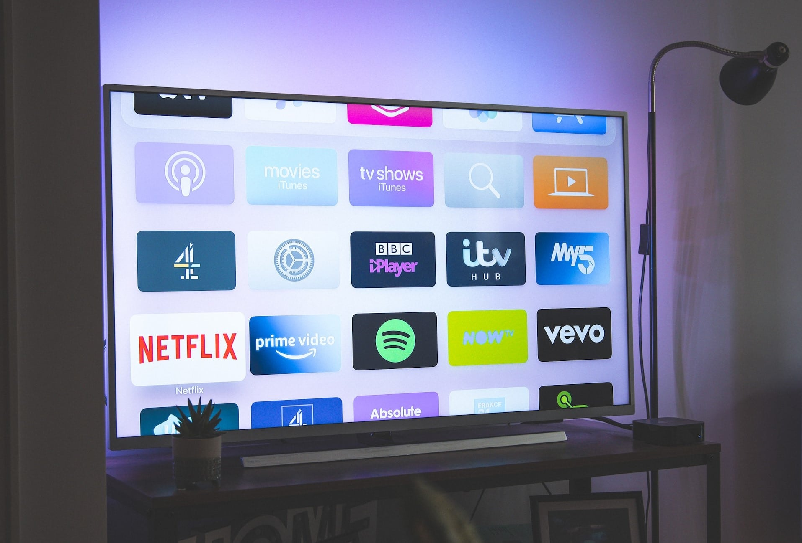

Следить за своими расходами порой не так-то просто. Слишком часто случается так, что в конце месяца деньги просто исчезают, и вы с трудом можете вспомнить, на что их потратили. Именно тогда на помощь приходит **книга по бюджету**, которая вносит порядок в финансовый хаос!

## Веские причины для бюджетной книги

### Документируйте расходы с помощью бюджетной книги

Скажите честно: как часто вы проверяете свои банковские выписки и подсчитываете, на что потратили деньги? Если счет не в минусе, то мы обычно избегаем этого, а возможно, и не хотим знать точно. Ведь если бы мы увидели, во сколько в конечном итоге обходятся походы по магазинам, прогулки с друзьями или курение, мы могли бы усомниться в своем образе жизни.

Помимо неизбежных постоянных расходов, более мелкие ловушки могут вылиться в значительные суммы. Принимать меры следует не позже, чем вы поймете, что после вычета всех расходов почти ничего не осталось. С помощью бюджетной книги вы сможете вести полный учет того, на что вы тратите деньги. Получите представление о текущих расходах, чтобы быть уверенным, что ваши деньги не исчезают бесследно.

### Выявление неоправданно высоких расходов

В конце месяца у вас остается меньше денег, чем вы предполагали? Это может быть связано с особенно высокими расходами в определенной области. Во многих семьях самые большие расходы можно разделить на жилье, страхование, передвижение и телекоммуникации. Если вы будете вести учет своих расходов, вы сможете быстро определить самые высокие расходы в вашей бюджетной книге и подумать, можно ли здесь сэкономить.

### Долгосрочное планирование благодаря бюджетной книге

Вас регулярно удивляют неожиданные списания со счета? Бюджетная книга позволяет точно прогнозировать доходы и расходы и планировать бюджет (например, на отпуск) в долгосрочной перспективе. Таким образом, вы всегда будете знать, сколько у вас осталось до конца месяца или года, и не будете рисковать, что деньги закончатся раньше.

## Что следует записать в бюджетной книге

Бюджетная книга обычно содержит все расходы, которые человек или семья несет в течение месяца или года. Они делятся на **постоянные** и **переменные** расходы.

- Постоянные расходы - это фиксированные платежи, которые вы должны совершать регулярно или которые автоматически списываются с вашего счета, например, арендная плата, страховка, электроэнергия, интернет и телефон, подписка и многие другие регулярные расходы.
- Переменные затраты, с другой стороны, не являются постоянными, а обычно производятся индивидуально и поэтому всегда меняются по величине. К ним относятся каждая покупка, каждый обед в ресторане и каждый билет. Эти затраты иногда выше, иногда ниже.

При желании вы можете добавить в бюджетную книгу свои ежемесячные **доходы**. Сюда входит ваша ежемесячная фиксированная зарплата и переменный доход от подработок, продаж, кредитных нот или подарков. Затем вы можете рассчитать финансовый **излишек**, который остается у вас после вычета всех расходов. Вы можете откладывать эти деньги или планировать долгосрочные инвестиции.

## Как создать бюджетную книгу

Итак, все говорит в пользу того, чтобы завести бюджетную книгу и следить за своими расходами. Как именно это будет выглядеть, зависит от вас: вы можете вести список расходов **вручную на бумаге** или записывать затраты, счета и квитанции в цифровом виде. **Цифровое решение** обычно рекомендуется из-за более простого анализа данных. Например, для ведения бюджетной книги можно использовать Excel или SeaTable.

### Пример: Бюджетная книга с SeaTable

Бескодовая база данных SeaTable предлагает вам отличную возможность создать свою бюджетную книгу - с интуитивно понятным пользовательским интерфейсом и множеством функций, выходящих за рамки классических **электронных таблиц**, таких как Excel. Вы не только можете легко получить доступ к своим данным в облаке с любого конечного устройства, но и использовать **статистику**, **формулы**, **группировки** и **фильтры** для анализа данных.

Вы можете легко заносить все свои расходы в цифровую бюджетную книгу. На примере семьи из четырех человек мы создали [бесплатный шаблон](), который содержит все важные пункты:

- Категория, частота и тип выпуска
- Сумма выдачи и загрузка счета-фактуры
- Дата, месяц и единица измерения стоимости выпуска

Покупки, аренда и коммунальные услуги, страхование автомобиля или репетиторство для сына - с помощью SeaTable вы сможете отслеживать все свои расходы. С помощью [колонок с одним выбором](https://seatable.io/ru/docs/auswahlspalten/anlegen-einer-einfachauswahl-spalte/) вы можете **классифицировать**, **фильтровать** и **группировать** свои расходы по отдельности. Чтобы навести хронологический порядок в вашей бюджетной книге, просто **отсортируйте** расходы по [дате](https://seatable.io/ru/docs/datum-dauer-und-personen/die-datum-spalte/). В двух дополнительных таблицах вы можете перечислить свои ежемесячные **доходы** и рассчитать профицит **бюджета**.

Если вы хотите использовать этот шаблон для своей бюджетной книги, [просто бесплатно зарегистрируйтесь]() в SeaTable. Затем вы сможете импортировать [шаблон]() в свое рабочее пространство и настроить его в соответствии со своими потребностями.

## 12 советов, которые помогут вам сэкономить деньги

Как только вы завели бюджетную книгу, необходимо проанализировать имеющиеся данные, сделать выводы и подумать о **возможной экономии**. Мы собрали 12 непревзойденных советов о том, как сократить расходы, чтобы у вас оставалось больше денег на самые приятные вещи в жизни.

### 1\. проверьте контракты и смените поставщика

Многие из самых дорогих вещей в нашей жизни списываются с нашего счета каждый месяц. Электричество, интернет, контракты на мобильную связь, страховка и многое другое. Вы должны тщательно проверять эти **постоянные расходы** хотя бы раз в год. Мы рекомендуем **сравнивать поставщиков** услуг через популярные онлайн-порталы, такие как Check24 или Verivox.

Проанализируйте свои текущие контракты, при необходимости поищите более дешевые альтернативы и расторгните **старые дорогостоящие контракты**. Многие провайдеры борются за новых клиентов, и часто для этого даже не нужно менять провайдера: выгодное предложение от конкурентов может убедить вашего нынешнего провайдера улучшить **условия**.

### 2\. отменить ненужные подписки

У вас есть подписка на потоковое вещание от Amazon Prime, Netflix и Sky? Но давайте будем честными - как часто вам удается посмотреть фильм или целый сериал в повседневной жизни? Проверьте, действительно ли вы пользуетесь определенными **потоковыми сервисами** или можете обойтись без них. То же самое относится и к музыкальным сервисам, таким как Spotify и Deezer, и даже к **газетам** и **журналам**, на которые вы подписаны. Даже если речь идет всего о нескольких евро в месяц, со временем сумма в вашем бюджете увеличится.

Лишние подписки на потоковое вещание могут стоить дорого.

### 3\. заниматься спортом бесплатно

Помимо абонементов на развлечения, **членство в тренажерных залах, спортивных клубах или танцевальных школах** - это тоже фиксированные ежемесячные расходы. Но вы знаете, как это бывает: записавшись в спортзал, вы быстро теряете мотивацию и посещаете его лишь от случая к случаю. Вы можете сэкономить на этих расходах, занимаясь дома с простыми приспособлениями, такими как гантели или эластичные ленты, или выполняя **упражнения с собственным весом**: Приседания, отжимания и приседания не стоят ни копейки. Вы также можете бесплатно перенести кардиотренировки на велотренажере или беговой дорожке из спортзала на свежий воздух.



### 4\. пригласить друзей домой

Игровые вечера, вечеринки или совместное приготовление чего-нибудь вкусненького: **Мероприятия дома** почти всегда обходятся дешевле, чем походы в гости. Вместе с друзьями вы можете легко сэкономить деньги, сократив количество посещений ресторанов, баров и клубов, а вместо этого [устраивая вечеринки]() дома, где каждый гость вносит несколько закусок или напитков. Дома вам будет даже веселее, вы сами сможете выбрать музыку и список гостей, и ваш бюджет скажет вам за это спасибо.

### 5\. сдавать в аренду неиспользуемые жилые или складские помещения

Ваши дети съехали, вы продали машину или почти не пользуетесь подвалом? Если у вас больше жилого или складского пространства, чем вам нужно, имеет смысл сдать его в аренду. Например, вы можете сдать свободную **комнату** путешественникам на краткосрочной основе через такие порталы, как AirBnB, или - если вам подходит совместная квартира - субарендаторам на постоянной основе.



То же самое касается и ненужного вам **гаража**, **автостоянки** или **подвального помещения**. [Сдача недвижимости в аренду]() может принести немалый доход в долгосрочной перспективе, что порадует ваш семейный бюджет.

### 6\. пользоваться общественным транспортом, совместным использованием автомобилей

Особенно в больших городах **владение автомобилем** для многих людей становится нецелесообразным. Купив машину, вы постоянно сталкиваетесь с расходами на топливо, обслуживание, страховку и парковку. Именно поэтому **схемы совместного использования автомобилей** становятся все более популярными. Если вы планируете путешествовать на большие расстояния, вы можете воспользоваться различными **онлайн-агентствами совместного использования автомобилей**, чтобы забрать пассажиров или заказать шофера.

Обойтись без собственного автомобиля и сдать парковочное место в аренду - так вы сэкономите расходы и одновременно получите доход.

Если ваш дом хорошо связан с **общественным транспортом**, вы сможете чаще пользоваться им или вовсе обойтись без машины. Поездки на автобусах и поездах не только сэкономят ваши деньги, но и позволят вам поддерживать физическую форму благодаря прогулкам между домом и остановками.

### 7\. покупать подержанные товары

Не обязательно покупать новые вещи для дома или гардероба. **Подержанные вещи** в хорошем или почти новом состоянии часто стоят в два раза дешевле, что значительно облегчает ваш бюджет. Пройдитесь по **магазинам подержанных** вещей, **блошиным рынкам** или **онлайн-площадкам** в вашем районе. Однако чтобы сэкономить таким образом, вам потребуется немного больше терпения, чем для похода по магазинам.

{{< warning headline="Внимание: ловушка стоимости!" text="Старые холодильники, стиральные машины и другие электроприборы часто можно купить очень дешево. Но при покупке этих приборов важно учитывать расходы за весь срок их службы. Прибор, который стоит на 200 евро дороже нового, но служит на десять лет дольше и потребляет на 20 процентов меньше электроэнергии, может сэкономить вам гораздо больше, чем 200 евро. Поэтому лучше выбирать высококачественные электроприборы. Светодиодные лампы также стоят дороже, но потребляют лишь десятую часть электроэнергии по сравнению с обычными лампочками." />}}

Также обратите внимание на **специальные предложения** от розничных продавцов. [Сравнение цен]() может оказаться нелишним, особенно если вы рассматриваете новую дорогостоящую покупку.

### 8\. избегайте импульсивных покупок

Прежде чем что-то купить, остановитесь и подумайте, действительно ли вам это нужно. Если речь идет о **небольших покупках в магазине**, положите вещь на место после того, как посмотрите на нее, и осмотритесь в магазине еще 5 минут. В большинстве **интернет-магазинов** вы можете сначала добавить желаемый предмет в корзину или записать его в список желаний. Если через некоторое время вы не забыли об этом предмете и по-прежнему хотите его приобрести, купите его.

Прежде чем совершать **крупные покупки**, потратьте несколько дней на то, чтобы рассчитать свой бюджет в бюджетной книге и сравнить цены. Это позволит убедиться, что вы действительно можете позволить себе расходы и не купитесь на мнимую выгодную сделку, не подумав.

### 9\. собственные бренды вместо дорогих фирменных продуктов

Большинство сетей супермаркетов выпускают продукты под **собственными торговыми марками**, которые значительно дешевле брендовых продуктов, рекламируемых дорого. Однако частные марки часто производятся на тех же заводах и из тех же ингредиентов, что и более дорогие брендовые продукты. Если вы все чаще выбираете частные марки, вы можете сэкономить до 30 процентов на покупках без ущерба для качества.

Готовые блюда для каждого обеденного перерыва могут быть дорогими. Здесь вы можете сэкономить не только на собственных брендах, но и на домашней еде.

### 10\. Приготовьте еду для обеденного перерыва

Если вы каждый обеденный перерыв покупаете дорогие готовые блюда в супермаркете, заказываете еду в офис или едите в кафе за углом, вы теряете от 5 до 10 евро за рабочий день. Это может быстро превратиться в 150 евро в месяц. Вместо этого готовьте большие порции еды заранее и разогревайте любимые блюда во время обеденного перерыва. Это позволит вам выделить больше средств на другие вещи в вашем домашнем бюджете.

[В этой статье вы узнаете, как приготовление еды может не только помочь вам прожить неделю более дешево, но и более полезно для здоровья.](https://seatable.io/ru/meal-prep-gesund-und-guenstig-essen-vorkochen/)

### 11\. избегать пищевых добавок

Хитрые фитнес-гуру и их компании с помощью заманчивого маркетинга убеждают нас в необходимости дополнить свой рацион специальными добавками, например, для наращивания мышц, ускорения метаболизма или укрепления иммунной системы. Миллиарды тратятся на протеиновые порошки и витаминные таблетки, большинство из которых совершенно излишни.

Вместо этого следите за сбалансированным питанием, занимайтесь спортом и ведите здоровый образ жизни, тогда вы сможете обойтись без предполагаемых чудодейственных средств, которые в итоге только пополнят ваш семейный бюджет.



### 12\. покончить с дорогостоящими пороками

Вредные привычки, такие как регулярное употребление **алкоголя, сигарет или кофе**, могут быстро обойтись вам более чем в 100 евро в месяц. Однако есть несколько методов, которые помогут вам [изменить]() свои [привычки]() в долгосрочной перспективе. С помощью силы воли и поддержки друзей и семьи вы сможете избавиться от дорогостоящих пороков, без которых вы сможете жить здоровее и сэкономить много денег в долгосрочной перспективе.

В то же время вы можете завести положительные привычки: Например, просто пить воду вместо дорогих **энергетических напитков** - полезно для здоровья. Ваш бюджет будет только радоваться, особенно если вы откажетесь от бутилированной воды и будете использовать **воду из-под крана**.

## Ваш идеальный бюджетный заказ с SeaTable

Как видите: Контроль за своими расходами и стоимостью жизни имеет только преимущества. С бюджетной книгой вы всегда контролируете ситуацию и точно знаете, куда ушли ваши деньги. SeaTable адаптируется к вашим потребностям. Если вы используете Excel для ведения бюджетной книги, вы можете просто импортировать свои таблицы в SeaTable. Вы можете [бесплатно зарегистрироваться]() и попробовать SeaTable!

Если вы хотите использовать наш шаблон, загляните в раздел " [Финансовые]() шаблоны". Существует множество других примеров того, как SeaTable может облегчить вашу повседневную жизнь.
