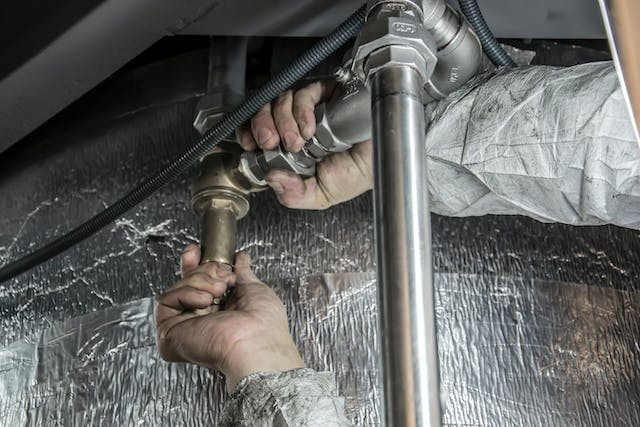

Die **Vermietung von Immobilien** ist sowohl privat als auch für Unternehmen und Kommunen ein lohnendes Geschäft. Wenn Sie Immobilien bewirtschaften, müssen Sie aber eine funktionierende **Hausverwaltung** gewährleisten – egal, ob Sie privat einzelne Wohnungen vermieten oder im großen Stil mit einer Firma.

Was es bei der Hausverwaltung zu beachten gibt und wie Sie Ihr Immobilienmanagement digital umsetzen können, erfahren Sie in diesem Artikel.

## Was ist eine Hausverwaltung?

Bei der Immobilienverwaltung geht es primär um das Verwalten einzelner Mieteinheiten. Eine Hausverwaltung ist in diesem Sinne eine Firma, die sich mit der **Verwaltung von vermieteten Wohnhäusern, Eigentumswohnungen und Gewerbeimmobilien** beschäftigt. Diese Immobilien müssen sich dabei _nicht_ in ihrem Besitz befinden.

Als Eigentümer müssen Sie sich um die Verwaltung und Vermietung Ihrer Immobilien kümmern.

Es gibt **externe Hausverwaltungen**, die Eigentümer von Mietobjekten bei der Verwaltung unterstützen oder dies gänzlich übernehmen. Das heißt, dass sie dafür sorgen, dass die Immobilien gut erhalten bleiben und die Bewirtschaftung der Objekte gewährleistet ist. Diesen administrativen Aufwand lassen sie sich von den Eigentümern vergüten.



Es gibt aber auch viele **private Eigentümer**, die selbst die administrativen Tätigkeiten der Hausverwaltung übernehmen – insbesondere, wenn es sich um wenige Mietparteien handelt. Damit sparen sie sich die Kosten für eine externe Verwaltung.

Unter einem **Hausverwalter** versteht man wiederum eine selbstständige Person, die eigene oder fremde Mietobjekte verwaltet.

## Wann Sie eine externe Hausverwaltung hinzuziehen sollten

Wenn Sie **mehrere Immobilien** besitzen und vermieten, ist es oftmals ratsam, eine professionelle Hausverwaltung zu engagieren. Diese kennt sich meist in der Immobilienwirtschaft aus und hat bereits vorgefertigte Prozesse für die effiziente Verwaltung Ihrer Mietobjekte. Vor allem, wenn Sie Ihre Immobilien als **Kapitalanlage** nutzen und hauptberuflich einem anderen Job nachgehen, fehlt oft die **Zeit**, sich um jede Immobilie und die Belange der Mieter selbst zu kümmern.

In diesem Fall sollten Sie überlegen, ob sich die **Kosten für eine externe Hausverwaltung** lohnen könnten: Je mehr Mietparteien Sie zu betreuen haben, desto eher lohnt sich dieses Vorhaben. Zwischen der Hausverwaltung und Ihnen als Eigentümer können Sie vertraglich ganz genau festhalten, welche Aufgaben Sie der Firma übertragen und wer etwa Zahlungserinnerungen, Instandhaltungsmaßnahmen oder die Kommunikation mit den Mietern koordiniert. Wenn Sie es sich zutrauen, können Sie die Hausverwaltung natürlich auch komplett selbst übernehmen.

> Je mehr Mietparteien Sie zu verwalten haben, desto eher lohnt sich eine externe Hausverwaltung, die Ihnen als Eigentümer viel Arbeit abnimmt. Trotz hoher Kosten sind Immobilien auf lange Sicht eine [gewinnbringende Kapitalanlage](https://www.immoanleger.de/10-gruende-immobilien-investieren/), weil sie im Wert steigen und bei Eigenbedarf selbst bezogen werden können.

## Hausverwaltung bei Eigentümergemeinschaften

Manchmal kommen Sie um eine professionelle Hausverwaltung nicht herum und haben keine Chance, alle Angelegenheiten bezüglich Ihrer Immobilien selbst zu verwalten. Denn oft erwerben Sie beim Kauf einer **Eigentumswohnung** auch Anteile am Gemeinschaftseigentum (wie etwa Grünanlagen, Treppenhaus und Dach), das der gesamten **Eigentümergemeinschaft** gehört und von einer Hausverwaltung bewirtschaftet werden muss.

Dann übernimmt die Hausverwaltung z. B. auch die Pflege der Grünanlagen.

Gesetzlich ist mit dem **Wohnungseigentumsgesetz** festgelegt, welche Tätigkeiten der Hausverwalter zu übernehmen hat. Hierbei sollten Sie im Auge behalten, ob die Hausverwaltung ihre Aufgaben ordnungsgemäß erledigt, um [unseriöse Unternehmen](https://www.hausverwaltung-ratgeber.de/woran-erkennt-man-einen-unserioesen-hausverwalter.html) zu erkennen.

## Welche Aufgaben bei der Immobilienverwaltung anfallen

Die Aufgaben der Hausverwaltung sind je nach Anzahl und Größe der Objekte vielfältig und nicht zu unterschätzen. Sie gehen weit über die Kontrolle der Mieteinnahmen hinaus und umfassen jegliche Tätigkeiten, die rund um die Immobilie anfallen. Dazu zählen etwa die Auswahl neuer Mieter, die Kommunikation mit Mietern und Dienstleistern bei Instandsetzungsterminen, aber auch die Betriebskostenabrechnungen und das Ablesen von Heizung, Wasser und Strom.

Die Aufgaben einer Hausverwaltung sind durch das Wohnungseigentumsgesetz geregelt und lassen sich in verschiedene **Themenblöcke** unterteilen. Daran wird deutlich, wie vielfältig die Immobilienverwaltung ist und dass es einige Kenntnisse abverlangt, die nicht jeder per se mitbringt.

**Betriebswirtschaftlich**

- Überprüfung der Mieteinnahmen
- Verwaltung der Gemeinschaftsgelder
- Kontrolle von Rechnungen
- Verwaltung des Mahnwesens
- Erstellen der Heiz- und Betriebskostenabrechnung

**Technisch**

- Verkehrssicherungspflicht (etwa Brandschutz)
- Instandsetzungsmaßnahmen
- Kontrolle der Verbrauchswerte (Wasser, Heizung, Strom)
- Modernisierungsmaßnahmen
- Einweisen und Überwachen von Dienstleistern

**Rechtlich**

- Verwaltung von Mietverträgen, Mieterhöhungen oder -minderungen
- Durchsetzung gesetzlicher Vorgaben
- Dokumentation von Wohnungsabnahmen

**Organisatorisch**

- Organisation der Eigentümerversammlung
- Kommunikation mit Mietern
- Auswählen neuer Mieter
- Beschwerdemanagement
- Kommunikation mit Behörden

Die Aufgaben der Hausverwaltung gehen weit über die Kontrolle der Mieteinnahmen hinaus.

Bei der Hausverwaltung fallen einige Aufgaben an, die insbesondere für berufstätige Eigentümer viel Arbeit bedeuten. Deshalb überlegen viele private Eigentümer, eine externe Immobilienverwaltung hinzuzuziehen, die sämtliche Aufgaben rund um die Mietobjekte übernimmt. Sie sollten persönlich abwägen, ob eine Auslagerung vonnöten ist, denn dadurch geben Sie einen großen Teil der **Kontrolle** über Ihre eigenen Immobilien ab.

## Immobilien managen: Software für die Hausverwaltung

Egal, ob Sie privat einzelne Wohnungen vermieten oder im großen Stil Immobilien verwalten: Eine Software-Lösung für die Verwaltung von Immobilien muss stets einen strukturierten **Überblick über alle Objekte, Mieter, Zahlungen, Dokumente und Aufgaben** gewähren. Hierfür eignen sich benutzerfreundliche No-Code-Datenbanken wie SeaTable sehr gut.

### Alles auf einen Blick

Je mehr Objekte Sie verwalten, desto schwieriger wird es, den Überblick über die Hausverwaltung zu behalten. Um alle wichtigen Informationen an einem zentralen Ort zu sammeln, ist eine **Datenbank** mit grafischer Benutzeroberfläche ideal. Bleiben Sie immer darüber im Bilde, wer gerade in welchem Objekt wohnt und was es bezüglich einzelner Immobilien zu tun gibt. Bündeln Sie Daten wie Adresse, Größe und Ausstattung Ihrer Mietobjekte und hinterlegen Sie Fotos und Grundrisse von Ihren Immobilien. Gerade für ein schnelles Portfolio haben Sie mit einer gut organisierten Tabelle Ihre Immobilien optimal im Blick.

So könnte eine Datenbank zur Hausverwaltung in SeaTable aussehen:

### Mieteinnahmen und Mieterinformationen dokumentieren

Um jederzeit nachvollziehen zu können, ob Ihre Mieter die Miete rechtzeitig überwiesen haben, sollten Sie diese Daten zentralisiert in Ihrer Software zur Immobilienverwaltung sammeln. Wenn Sie Ihre Mieteinnahmen monatlich auflisten, sehen Sie direkt, ob ein Mieter im Verzug ist. Speichern Sie vertrauliche Informationen über Ihre Mieter (z. B. Gehalt und Bonität) parallel dazu in einer übersichtlichen Tabelle.

### Instandhaltungsmaßnahmen und Reparaturen im Blick behalten

Als Vermieter müssen Sie sich um Reparaturen, Modernisierungsmaßnahmen und Instandhaltungsarbeiten kümmern. Um dabei den Überblick zu behalten, sollten Sie akute ebenso wie regelmäßige Maßnahmen immer genau dokumentieren. Erfassen Sie dazu Aufträge, Instandsetzungstermine und Rechnungen in einer Tabelle. Ihre Mieter sind auf eine Hausverwaltung angewiesen, die zuverlässig Dienstleister koordiniert, damit wichtige Dinge wie etwa ein kaputter Wasserhahn sofort repariert werden.

Wenn Sie mehrere Immobilien besitzen, kann die Koordination von Handwerkern und Instandsetzungen viel Zeit kosten.

## Fazit

Eine **Software für die Hausverwaltung** muss einiges leisten. Stellen Sie sich bei der Auswahl und beim Testen folgende Fragen: Können Sie mit der Software …

- alle Informationen zu Ihren Mietobjekten übersichtlich ordnen?
- Ihre monatlichen Mieteinnahmen dokumentieren?
- vertrauliche Informationen zu Ihren Mietern erfassen?
- Dienstleister koordinieren und Wartungsaufträge abwickeln?
- Aufgaben und Termine (z. B. Wohnungsbesichtigungen) organisieren?
- wichtige Dokumente wie Verträge und Betriebskostenabrechnungen speichern?

Mit der SeaTable [Vorlage für Ihre Immobilienverwaltung](https://seatable.io/vorlage/ufyf6scpsgucxv8y0g9asw/) können Sie all diese Belange rund um Ihre Immobilien problemlos managen. Speichern Sie Vertragsdokumente, Rechnungen, Übergabeprotokolle, Grundrisse und Fotos einfach in Ihrer SeaTable Datenbank.

In einer Datenbank können Sie Fotos und Highlights Ihrer Immobilien (z. B. voll ausgestattete Küche, Terrasse) erfassen.

[Registrieren Sie sich kostenlos](), um die Vorlage zu nutzen und Ihre Daten effizient zu organisieren. Legen Sie flexibel die Tabellenstruktur an, die Sie für die Hausverwaltung brauchen, um alle Daten im Blick zu behalten und Ihren Verwaltungsaufwand so gering wie möglich zu halten.
