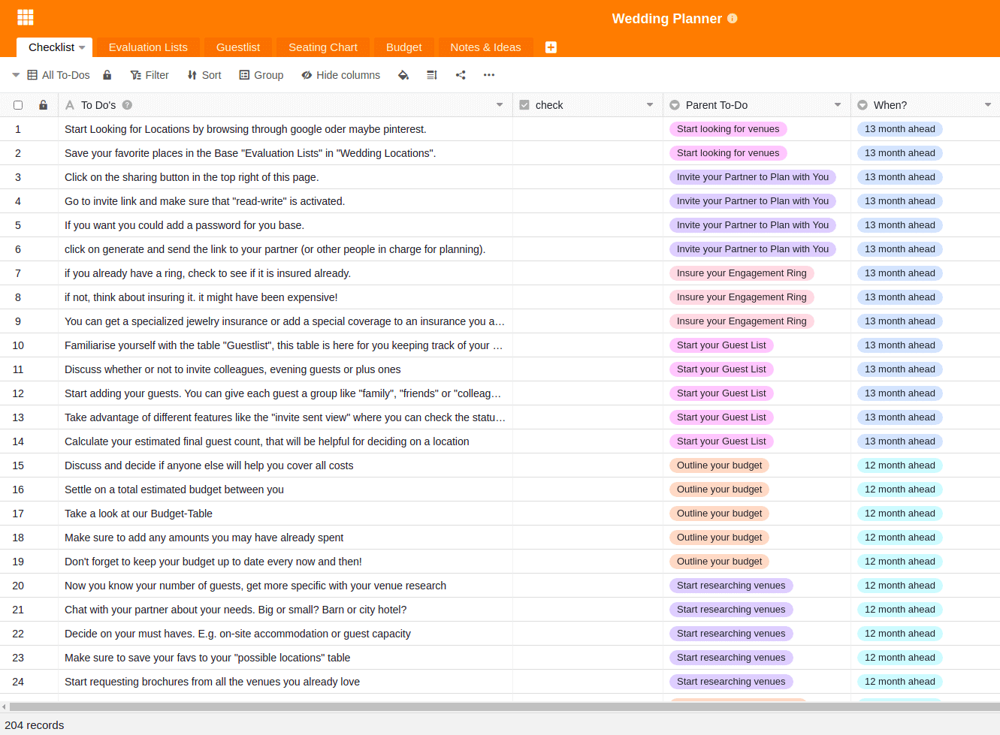

Einer der schönsten und wichtigsten Tage im Leben steht vor der Tür: die eigene Hochzeit. Hier soll auf keinen Fall etwas schief gehen, weshalb eine strukturierte Hochzeitsplanung von großer Bedeutung für die meisten Paare ist. Was muss man bereits 12 Monate vor der Hochzeit erledigen, was ist 5 Monate vor dem großen Tag alles zu tun? Hat man nicht die finanziellen Mittel, sich einen professionellen Hochzeitsplaner zu engagieren, oder hat man ganz einfach Spaß an der Planung der eigenen Hochzeit, so hilft SeaTable bei der Hochzeitsplanung nicht den Überblick zu verlieren.

## Checkliste Hochzeitsplanung mit über 200 To-dos

Normalerweise startet die Planung einer Hochzeit ungefähr 13 Monate vor dem großen Tag. Wenn man eine beliebte Hochzeitslocation haben möchte, teilweise sogar noch früher. Wichtig ist, dass man bei der schieren Menge an Aufgaben nicht den Überblick verliert. Deshalb steht in Zentrum unseres Templates [Wedding Planner]() die _Checkliste_ mit bereits über 200 vordefinierten Aufgaben. Zusätzlich wird in dieser Tabelle erfasst, wann das entsprechende To-do erledigt werden muss. Es gibt immer ein übergeordnetes To-do, welches mehrere einzelne Unterpunkte beinhaltet, um Sie durch den ganzen Prozess zu leiten. Die Spalte _Check_ ist eine [Checkbox-Spalte](https://seatable.io/docs/handbuch/datenmanagement/feld-typen/?lang=auto#checkbox), die dazu dient, erledigte To-dos abzuhaken.

Unsere Checkliste für die Hochzeitplanung enthält bereits über 200 ToDos, damit Sie nichts vergessen.

### Eigene To-dos erstellen

Um mit der Planung Ihrer eigenen Hochzeit zu beginnen, müssen Sie sich für einen [Free-Account von SeaTable registrieren](). Anschließend können Sie mithilfe unseres Templates _Wedding Planner_ mit der Planung Ihrer Hochzeit beginnen.

Zusätzliche oder weitere To-dos können Sie an beliebiger Stelle in das Template einfügen. Wenn Sie ein neues _Parent To-do_ vergeben, wird automatisch eine neue Gruppe von Aufgaben angelegt. Die Sortierung der Aufgabengruppen erfolgt automatisch anhand der Vorlaufzeit zu Ihrer Hochzeit. Sie möchten die Aufgaben mit einem konkreten Datum versehen? Fügen Sie einfach eine neue [Datumsspalte](https://seatable.io/docs/handbuch/datenmanagement/feld-typen/?lang=auto#datum) hinzu und versehen Sie jedes To-do mit einem Datum.

[Hier geht es direkt zum Template für Ihre Hochzeitsplanung]()

## SeaTable hilft Ihnen wichtige Entscheidungen zu treffen

Neben der Checkliste zur Hochzeitsplanung haben wir noch weitere Tabellenblätter für Sie eingerichtet. Die _Evaluation Lists_ hilft Ihnen dabei, wichtige Entscheidungen zu treffen. Bei der Hochzeitsplanung werden Sie auf viele Situationen und To-dos stoßen, die Sie zwingen, Entscheidungen zu treffen. Welchen Caterer möchten Sie? Möchten Sie nur einen Fotografen oder braucht es auch noch einen Videografen? Lieber eine Band oder doch lieber ein DJ? Wir wissen, dass man bei so viel Auswahl an Anbietern auf dem Markt schnell überfordert sein kann. Deshalb haben wir Ihnen verschiedene Ansichten erstellt, welche Ihnen helfen …

1. … mögliche Anbieter zu sammeln
2. … die Anbieter miteinander anhand der verschiedenen Kriterien zu vergleichen
3. … sich letztendlich für den besten Anbieter zu entscheiden
4. … die Buchungsbestätigung der auserwählten Anbieter zu dokumentieren

### Die Übersicht bei der Hochzeitsplanung behalten

Wir haben Ihnen gleich 5 verschiedene Ansichten vorbereitet, die bei 5 wichtigen Entscheidungen unterstützen:

1. Für die Location-Auswahl gibt es die Ansicht _Wedding Locations_
2. Für die Auswahl von Fotografen und Filmern gibt es die Ansicht _Photographer/ Videographer_
3. Für die Dekoration gibt es die Ansicht _Florist_
4. Für die Unterhaltung gibt es die Ansicht _Entertainment_
5. Für das Essen gibt es die Ansicht möglicher _Caterer_

### Bei der Hochzeitsplanung geht es um Entscheidungen

Sie treffen bei Ihrer Hochzeitsplanung auf weitere Entscheidungen, die wir nicht bedacht haben? Kein Problem. Um eine neue Ansicht als Entscheidungshilfe zu erstellen, folgen Sie einfach dieser Anleitung:

1. Klicken Sie in einer beliebigen Ansicht auf das + Icon, um eine neue Zeile hinzuzufügen
2. Tragen Sie vorne den Namen des Anbieters ein
3. Erstellen Sie unter Category eine neue Kategorie, indem Sie auf den kleinen Pfeil klicken und “Edit Single Select” wählen
4. Der Eintrag verschwindet sofort aus der neuen Ansicht, da diese eine Filterfunktion enthält
5. Erstellen Sie nun eine neue Ansicht
6. In dieser Ansicht erscheinen automatisch alle Einträge jeder einzelnen Ansicht
7. Filtern Sie nun nach “Category” + “is” + “Ihre neu erstellte Kategorie”
8. Jetzt können Sie Ihre Liste wie gewohnt fortsetzten

## Mehr als nur eine einfache Gästeliste

Die Gästeliste ist wohl eines der schönsten Dinge bei der Hochzeitsplanung. Endlich wird jeder erfahren, dass der große Tag bevorsteht! Wir haben Ihnen eine _Guestlist_ erarbeitet, welche Ihnen die Planung erleichtert. Zuerst können Sie hier den Namen des Gastes eintragen. Als Nächstes ordnen Sie ihm eine Kategorie zu, gehört er zur Familie, zum engeren Freundeskreis oder ist er ein Kollege? Diese Zuordnung hilft Ihnen bei der weiteren Hochzeitsplanung, nämlich dann, wenn es zum Sitzplan geht. Als Nächstes können Sie dem Gast noch eine Essens-Kategorie zuordnen, entweder Sie wissen es schon, oder Sie fragen es bei Ihrer Einladung mit ab und notieren es im Nachhinein. Alternativ könnte man mit SeaTable auch ein [Webformular](https://seatable.io/docs/handbuch/datenmanagement/webformulare/?lang=auto) erstellen, mit der jeder Gast seine Essenswünsche und weitere Informationen angeben kann. So können Sie genau die Informationen abfragen, die Sie im Vorfeld benötigen.

Die Adresse wird Ihnen später beim Verschicken der Einladungen helfen, genau wie die Checkbox, die Ihnen sagt, ob die Einladung schon verschickt wurde. In der Spalte “Special Diet” können Sie Allergien oder sonstige Besonderheiten festhalten und überblicken. Die Spalte “For When” hilft Ihnen, die Gäste für die einzelnen Feierlichkeiten einzuordnen. Kommen die Gäste nur zur Zeremonie oder auch zum Standesamt?

In den Notizen ist Platz für alles möglich, vielleicht gibt es persönliche Präferenzen, was den späteren Sitzplan angeht, die Sie hier notieren können.

### Von der Gästeliste zum Sitzplan

Damit neben der chaotischen Hochzeitsplanung kein zusätzliches Zettelchaos auf dem Esstisch entsteht, haben wir uns gedacht, die Sitzplanproblematik digital zu lösen. Durch die Verknüpfung der beiden Tabellen _Guestlist_ und _Seating Chart_ können Sie jedem Gast in der Tabelle _Guestlist_ einen von Ihnen zuvor festgelegten Tisch der Tabelle _Seating Chart_ zuweisen. Falls es für Sie übersichtlicher ist, können Sie auch andersherum in der Tabelle _Seating Chart_ die einzelnen Gäste Ihren Tischen zuweisen. Wenn Sie in der _Guestlist_ auf einen Tisch klicken, so sehen Sie direkt, wer bereits am Tisch sitzt.

Auch bei der Gästeliste gibt es wieder verschiedene Ansichten, um Ihnen noch mehr unter die Arme zu greifen. Wir haben eine Ansicht erstellt, die Ihnen zeigt, welche [Einladungen](https://www.pinterest.de/mhochzeitsdeko/einladungenskarten-hochzeit/) noch nicht verschickt wurden. Eine Ansicht zeigt Ihnen die verschiedenen Menüwünsche. Vielleicht wäre es für Sie auch eine Option, diese Ansicht direkt mit dem Caterer zu [teilen](https://seatable.io/docs/handbuch/zusammenarbeit/externe-links/?lang=auto), so kann dieser das Menü einfacher planen. Zu guter Letzt gibt es noch drei Einzelansichten für jede einzelne Feierlichkeit, denn wie wir wissen, kommt nicht jeder Gast zu jedem Teil der Feier. Mit einem Klick haben Sie also direkt eine Übersicht über die Personen, die jeweils anwesend sein werden.

## Das Budget im Blick behalten

Eine Hochzeit ist bekanntlich teuer. Neben vielen [Spartipps](https://www.weddingstyle.de/spartipps-hochzeit/) hilft ein am Anfang ausgeklügelter Budgetplan und das Tracken der Ausgaben, sodass finanziell nichts aus dem Ruder läuft. In unserer Base _Budget_ können Sie von vornherein alle Kostenpunkt, die Ihnen einfallen notieren, einer Kategorie zuordnen und ein maximales Budget für diesen Punkt festlegen. Mit dem tatsächlich gezahlten Betrag, den Sie dahinter eintragen und der Differenzspalte behalten Sie Ihre Budgetplanung im Blick. Durch das automatische Summieren sehen Sie am Ende Ihrer Budgettabelle Ihr gesamtes geplantes Budget, die tatsächlichen Ausgaben und die Differenz.

## Ideen und Inspiration zur Hochzeitsplanung festhalten

Während der Hochzeitsplanung recherchiert man viel. Gerade auf Pinterest verliert man sich oft, vergisst, was man ursprünglich gesucht hat und sammelt dabei unglaublich viele Inspirationen für alle möglichen Aspekte einer Hochzeit. Damit Sie nichts davon vergessen, haben wir noch eine letzte Base angelegt. Die Base _Notes and Ideas_ hält alles fest, was Ihnen bei Ihren unzähligen Recherchen in die Finger kommt. Interessante Blogartikel, schöne DIY’s, [Ideen für Ihr Gästeentertainment](http://the-little-wedding-corner.de/10-ideen-fuer-die-beschaeftigung-und-unterhaltung-eurer-gaeste-auf-der-hochzeit/) und vieles mehr. Sie können hier Bilder und Links einfügen und sogar Kategorien bilden. Wird die Liste zu lang und unübersichtlich, können unterschiedliche Ansichten helfen, nach Kategorien zu sortieren. Wenn Sie vielleicht schon [Pocket](https://getpocket.com/) zum Speichern solcher Inspirationen verwenden, könnten Sie überlegen, ob Sie mithilfe einer [Zapier Automation](https://zapier.com/apps/seatable/integrations/pocket) diese Notizen automatisch in Ihren Wedding Planner überführen lassen.

## Die perfekte Hochzeitsplanung mit SeaTable

Mit unserer über 200 Punkte umfassenden _Checkliste_ kann bei der Planung Ihrer Hochzeit nichts mehr schief gehen. SeaTable begleitet Sie über 13 Monate hin bis zu Ihrem perfekten Tag. Die _Evaluation Lists_ hilft Ihnen, Entscheidungen zu treffen, mit der _Guestlist_ gibt es kein Chaos beim _Sitzplan_ und jeder Gast erhält pünktlich seine Einladung und das passende Menü auf dem Essenstisch. Mit der _Budgetplanung_ überschattet kein finanzieller Engpass den schönsten Tag Ihres Lebens und letztlich vergessen Sie auch keine gute Idee dank Ihrer _Notes & Ideas_ Base.

Selbst wenn Ihre Hochzeit etwas spezieller ist oder Sie andere Anforderungen haben, SeaTable lässt sich ganz nach Ihren Wünschen anpassen. Fügen Sie Tabellen hinzu, erstellen Sie [unterschiedliche Ansichten](https://seatable.io/docs/handbuch/datenmanagement/ansichten/?lang=auto), [gruppieren und filtern](https://seatable.io/docs/handbuch/datenmanagement/gruppierung-sortierung-filter/?lang=auto) Sie Ihre Daten und Ansichten oder probieren Sie die für Sie passende [PlugIns](https://seatable.io/docs/handbuch/schnelleinstieg/erweiterungen/?lang=auto) aus. So wäre es z.B. vorstellbar eine Wunschliste in den Wedding Planner zu integrieren und die Gäste können per Webformular im Vorfeld eintragen, welches Geschenk Sie aussuchen werden. Mit SeaTable könnte das Webformular so gestaltet sein, dass die Gäste nur Geschenke sehen, die noch kein anderer Gast ausgesucht hat. Der Fantasie sind wirklich keine Grenzen gesetzt.

[Melden Sie sich jetzt an]() und starten Sie mit der Planung Ihrer Hochzeit. Das ganze SeaTable Team wünscht Ihnen viel Spaß und eine tolle Hochzeit!

### Deutsche Videoanleitungen auf YouTube

Wenn Sie gerade Ihre ersten Schritte mit SeaTable unternommen haben, kommt manchmal der Wunsch nach einer kompakten Einführung und Vorstellung aller Funktionen. Auf unserem YouTube-Kanal finden Sie eine ausführliche deutsche [SeaTable-Einführung](https://www.youtube.com/channel/UCnkzwl8TED0AWo9QCjZv1cA), mit der Sie noch mehr aus SeaTable herausholen können.
