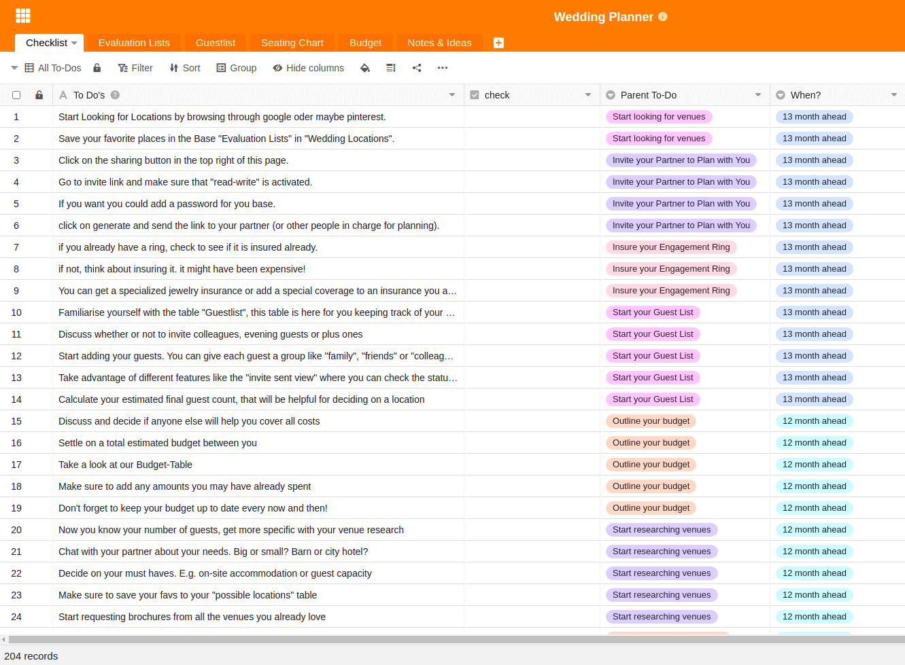
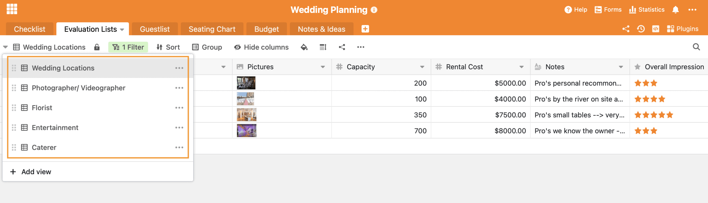
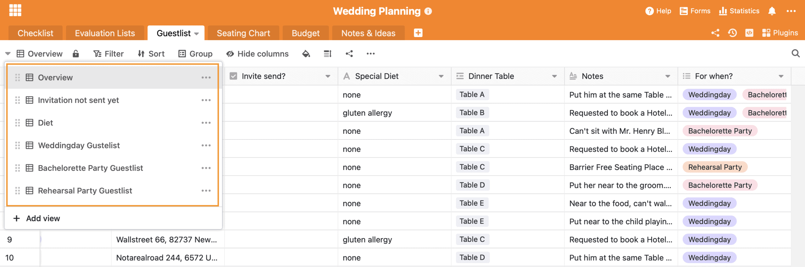

One of the most beautiful and important days in life is just around the corner: your own wedding. Nothing should go wrong here, which is why structured wedding planning is of great importance for most couples. What needs to be done 12 months before the wedding, what needs to be done 5 months before the big day? If you don't have the financial means to hire a professional wedding planner, or if you simply enjoy planning your own wedding, SeaTable helps you not to lose the overview when planning your wedding.

## Checklist wedding planning with over 200 to-dos

Usually the planning of a wedding starts about 13 months before the big day. If you want to have a popular wedding location, sometimes even earlier. It is important not to lose track of the sheer number of tasks. That's why at the centre of our Wedding [Planner](https://seatable.io/en/vorlage/eso9hktaqnms333jjy0z9q/) template is the _checklist_ with already over 200 predefined tasks. In addition, this table records when the corresponding to-do must be completed. There is always a superordinate to-do, which contains several individual sub-items to guide you through the whole process. The _Check_ column is a [checkbox column](https://seatable.io/en/docs/handbuch/datenmanagement/feld-typen/?lang=auto#checkbox) that is used to tick off completed to-dos.

Our wedding planning checklist already contains over 200 to-dos so that you don't forget anything.

### Create your own to-dos

To start planning your own wedding, you need to [register for a SeaTable Free Account](https://seatable.io/en/registrierung/?lang=auto). You can then start planning your wedding using our Wedding _Planner_ template.

You can insert additional or further to-dos at any point in the template. When you assign a new _Parent To-do_, a new group of tasks is automatically created. The sorting of the task groups is done automatically based on the lead time to your wedding. Want to give the tasks a specific date? Simply add a new [date column](https://seatable.io/en/docs/handbuch/datenmanagement/feld-typen/?lang=auto#datum) and assign a date to each to-do.

[Click here to go directly to the template for your wedding planning](https://seatable.io/en/vorlage/eso9hktaqnms333jjy0z9q/)

## SeaTable helps you make important decisions

In addition to the Wedding Planning Checklist, we have set up other spreadsheets for you. The _Evaluation Lists_ will help you make important decisions. When planning a wedding, you will come across many situations and to-dos that force you to make decisions. Which caterer do you want? Do you only want a photographer or do you also need a videographer? Do you prefer a band or a DJ? We know that with so much choice of providers on the market, it's easy to get overwhelmed. That's why we have created several views that will help you ...

1. ... to collect possible providers
2. ... compare the providers with each other based on the different criteria
3. ... to ultimately decide on the best provider
4. ... document the booking confirmation of the selected suppliers

### Keeping track of the wedding planning

We have prepared 5 different views to help you make 5 important decisions:

1. For the location selection there is the view _Wedding Locations_
2. For the selection of photographers and _videographers_there is the view \_Photographer/ Videographer_
3. For the decoration there is the view _Florist_
4. For entertainment there is the \_Entertainment_view
5. For the food there is the view of possible _caterers_

### Wedding planning is about decisions

You come across other decisions in your wedding planning that we have not considered? No problem. To create a new view to help you decide, simply follow these instructions:

1. Click on the + icon in any view to add a new row
2. Enter the name of the provider in the front
3. Create a new category under Category by clicking on the small arrow and selecting "Edit Single Select".
4. The entry immediately disappears from the new view, as this contains a filter function
5. Now create a new view
6. In this view, all entries of each individual view appear automatically
7. Now filter by "Category" + "is" + "Your newly created category".
8. Now you can continue your list as usual

## More than a simple guest list

The guest list is probably one of the best things about planning a wedding. Finally, everyone will know that the big day is coming! We have prepared a _guest list_ for you, which will make planning easier. First you can enter the name of the guest here. Next, assign a category to him, is he a member of the family, a close friend or a colleague? This assignment will help you in the further wedding planning, namely when it comes to the seating plan. Next, you can assign a food category to the guest, either you already know it or you ask for it with your invitation and note it down afterwards. Alternatively, you could use SeaTable to create a [web form](https://seatable.io/en/docs/handbuch/datenmanagement/webformulare/?lang=auto) with which each guest can enter their meal preferences and other information. This way you can ask for exactly the information you need in advance.

The address will help you later when sending the invitations, just like the checkbox that tells you if the invitation has already been sent. In the "Special Diet" column you can record and keep track of allergies or other special features. The "For When" column helps you categorize guests for each ceremony. Will the guests only come to the ceremony or also to the registry office?

There is room for everything possible in the notes, perhaps there are personal preferences regarding the later seating plan that you can note here.

### From the guest list to the seating plan

In order to avoid an additional chaos of notes on the dining table in addition to the chaotic wedding planning, we thought of solving the seating plan problem digitally. By linking the two tables _Guestlist_ and _Seating Chart_, you can assign each guest in the _Guestlist_ table to a table you have previously defined in the _Seating Chart_ table. If it is clearer for you, you can also assign the individual guests to their tables in the _Seating Chart_ table the other way round. If you click on a table in the _guest list_, you can see directly who is already sitting at the table.

Again, there are different views for the guest list to help you even more. We have created a view that shows you which [invitations](https://www.pinterest.de/mhochzeitsdeko/einladungenskarten-hochzeit/) have not yet been sent. A view shows you the different menu requests. Perhaps it would also be an option for you to [share](https://seatable.io/en/docs/handbuch/zusammenarbeit/externe-links/?lang=auto) this view directly with the caterer, so they can plan the menu more easily. Last but not least, there are three individual views for each celebration, because as we know, not every guest comes to every part of the celebration. So with one click you have a direct overview of the people who will be present in each case.

## Keeping an eye on the budget

A wedding is known to be expensive. In addition to many [savings tips](https://www.weddingstyle.de/spartipps-hochzeit/), a sophisticated budget plan and tracking of expenses helps at the beginning, so that nothing gets out of hand financially. In our Base _Budget_, you can note down all the cost items you can think of from the outset, assign them to a category and set a maximum budget for that item. With the actual amount paid entered behind it and the difference column, you can keep an eye on your budget planning. With automatic totaling, you'll see your total planned budget, actual expenses, and the difference at the end of your budget spreadsheet.

## Capture wedding planning ideas and inspiration

During wedding planning, you do a lot of research. Especially on Pinterest, you often get lost, forget what you were originally looking for and collect an incredible amount of inspiration for all possible aspects of a wedding. To make sure you don't forget any of it, we've created one last base. The _Notes and Ideas_ base holds everything that comes your way during your countless searches. Interesting blog articles, beautiful DIY's, [ideas for your guest entertainment and](http://the-little-wedding-corner.de/10-ideen-fuer-die-beschaeftigung-und-unterhaltung-eurer-gaeste-auf-der-hochzeit/) much more. You can add pictures and links here and even create categories. If the list gets too long and confusing, different views can help you sort by categories. If you perhaps already use [Pocket](https://getpocket.com/) to save such inspirations, you could consider using [Zapier Automation](https://zapier.com/apps/seatable/integrations/pocket) to automatically transfer these notes into your Wedding Planner.

## The perfect wedding planning with SeaTable

With our 200+ point _checklist_, nothing can go wrong when planning your wedding. SeaTable guides you over 13 months to your perfect day. The _evaluation lists_ help you to make decisions, with the _guest list_ there is no chaos in the _seating plan_ and every guest receives their invitation and the matching menu on the dinner table on time. With the _budget planning_, no financial bottleneck will overshadow the most beautiful day of your life and finally, you won't forget a good idea thanks to your _Notes & Ideas_ Base.

Even if your wedding is a bit more special or you have different requirements, SeaTable is fully customizable. Add tables, create [different views](https://seatable.io/en/docs/handbuch/datenmanagement/ansichten/?lang=auto), [group and filter](https://seatable.io/en/docs/handbuch/datenmanagement/gruppierung-sortierung-filter/?lang=auto) your data and views or try out the [plugins](https://seatable.io/en/docs/handbuch/schnelleinstieg/erweiterungen/?lang=auto) that suit you best. For example, it would be conceivable to integrate a wish list into the Wedding Planner and the guests can enter via web form in advance which gift they will choose. With SeaTable, the web form could be designed so that guests only see gifts that no other guest has chosen yet. There really are no limits to the imagination.

[Register now](https://seatable.io/en/registrierung/?lang=auto) and start planning your wedding. The whole SeaTable team wishes you lots of fun and a great wedding!

### German video instructions on YouTube

If you have just taken your first steps with SeaTable, sometimes the desire for a compact introduction and presentation of all functions comes up. On our YouTube channel you will find a detailed German [SeaTable introduction](https://www.youtube.com/channel/UCnkzwl8TED0AWo9QCjZv1cA) that will help you get even more out of SeaTable.
