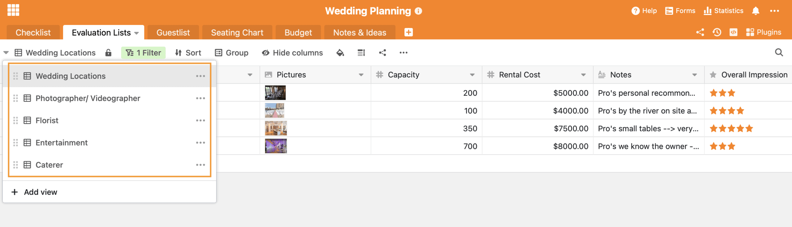

L'un des plus beaux et des plus importants jours de la vie est sur le point d'arriver : le mariage. Il ne faut surtout pas que quelque chose se passe mal, c'est pourquoi un planning de mariage structuré est d'une grande importance pour la plupart des couples. Que faut-il faire 12 mois avant le mariage, que faut-il faire 5 mois avant le grand jour ? Si l'on n'a pas les moyens financiers d'engager un organisateur de mariage professionnel ou si l'on prend tout simplement plaisir à organiser son propre mariage, SeaTable permet de ne pas perdre la vue d'ensemble lors de l'organisation du mariage.

## Check-list de planification de mariage avec plus de 200 choses à faire

En général, l'organisation d'un mariage commence environ 13 mois avant le grand jour. Parfois même plus tôt si l'on souhaite avoir un lieu de mariage populaire. Il est important de ne pas perdre la vue d'ensemble face à la quantité de tâches à accomplir. C'est pourquoi la _liste de contrôle_ avec plus de 200 tâches prédéfinies se trouve au centre de notre modèle [Wedding Planner](). De plus, ce tableau indique quand la tâche en question doit être effectuée. Il y a toujours une tâche principale qui contient plusieurs sous-rubriques individuelles pour vous guider tout au long du processus. La colonne _Check_ est une [colonne de cases à](https://seatable.io/fr/docs/handbuch/datenmanagement/feld-typen/?lang=auto#checkbox) cocher qui sert à cocher les choses à faire terminées.

Notre check-list pour l'organisation du mariage contient déjà plus de 200 ToDos, afin que vous n'oubliiez rien.

### Créer ses propres to-do

Pour commencer à planifier votre propre mariage, vous devez [vous inscrire](https://seatable.io/fr/enregistrement/?lang=auto) à un [compte gratuit de SeaTable](https://seatable.io/fr/enregistrement/?lang=auto). Vous pourrez ensuite commencer à planifier votre mariage à l'aide de notre modèle _Wedding Planner_.

Vous pouvez insérer des tâches à faire supplémentaires ou additionnelles à n'importe quel endroit du modèle. Lorsque vous attribuez un nouveau _Parent To-do_, un nouveau groupe de tâches est automatiquement créé. Le tri des groupes de tâches se fait automatiquement en fonction du délai de préparation de votre mariage. Vous souhaitez attribuer une date concrète aux tâches ? Il vous suffit d'ajouter une nouvelle [colonne de date](https://seatable.io/fr/docs/handbuch/datenmanagement/feld-typen/?lang=auto#datum) et d'attribuer une date à chaque to-do.

[Cliquez ici pour accéder directement au modèle de planification de votre mariage.]()

## SeaTable vous aide à prendre des décisions importantes

En plus de la liste de contrôle pour l'organisation du mariage, nous avons mis en place d'autres feuilles de calcul pour vous. Les _listes d'évaluation_ vous aident à prendre des décisions importantes. Lors de l'organisation de votre mariage, vous rencontrerez de nombreuses situations et choses à faire qui vous obligeront à prendre des décisions. Quel traiteur souhaitez-vous ? Voulez-vous seulement un photographe ou faut-il aussi un vidéaste ? Préférez-vous un groupe de musique ou un DJ ? Nous savons qu'avec autant de choix de prestataires sur le marché, on peut vite être dépassé. C'est pourquoi nous avons créé différentes vues qui vous aideront ...

1. ... rassembler les fournisseurs potentiels
2. ... de comparer les fournisseurs entre eux sur la base de différents critères
3. ... de choisir finalement le meilleur fournisseur
4. ... de documenter la confirmation de réservation des prestataires sélectionnés

### Garder une vue d'ensemble de l'organisation du mariage

Nous vous avons préparé tout de suite 5 vues différentes qui vous aideront à prendre 5 décisions importantes :

1. Pour le choix du lieu, il y a la vue _Wedding Locations_
2. Pour la sélection des photographes et des vidéastes, il existe la vue _Photographer/ Videographer_
3. Pour la décoration, il y a la vue _Fleuriste_
4. Pour le divertissement, il y a la vue _Entertainment_
5. Pour la nourriture, il y a l'avis de \_traiteurs_possibles

### L'organisation d'un mariage est une question de choix

Lors de l'organisation de votre mariage, vous rencontrez d'autres décisions auxquelles nous n'avons pas pensé ? Pas de problème ! Pour créer une nouvelle vue comme aide à la décision, il suffit de suivre ces instructions :

1. Cliquez sur l'icône + dans n'importe quelle vue pour ajouter une nouvelle ligne.
2. Inscrivez devant le nom du fournisseur
3. Créez une nouvelle catégorie sous Category en cliquant sur la petite flèche et en sélectionnant "Edit Single Select".
4. L'entrée disparaît immédiatement de la nouvelle vue, car celle-ci contient une fonction de filtrage.
5. Créez maintenant une nouvelle vue
6. Dans cette vue, toutes les entrées de chaque vue apparaissent automatiquement
7. Filtrez maintenant sur "Category" + "is" + "votre nouvelle catégorie créée".
8. Vous pouvez maintenant continuer votre liste comme d'habitude.

## Plus qu'une simple liste d'invités

La liste des invités est sans doute l'une des choses les plus agréables lors de l'organisation d'un mariage. Tout le monde va enfin savoir que le grand jour approche ! Nous avons élaboré une _guestlist_ qui vous facilitera la planification. Tout d'abord, vous pouvez y inscrire le nom de l'invité. Ensuite, vous lui attribuez une catégorie : fait-il partie de la famille, du cercle d'amis proches ou est-il un collègue ? Cette attribution vous aidera à planifier la suite du mariage, c'est-à-dire lorsqu'il s'agira d'établir le plan de table. Ensuite, vous pouvez encore attribuer une catégorie de repas à l'invité, soit vous le savez déjà, soit vous le demandez lors de l'invitation et le notez après coup. Vous pouvez également utiliser SeaTable pour créer un [formulaire web](https://seatable.io/fr/docs/handbuch/datenmanagement/webformulare/?lang=auto) permettant à chaque invité d'indiquer ses préférences alimentaires et d'autres informations. Vous pouvez ainsi demander exactement les informations dont vous avez besoin à l'avance.

L'adresse vous sera utile plus tard pour l'envoi des invitations, tout comme la case à cocher qui vous indique si l'invitation a déjà été envoyée. La colonne "Special Diet" vous permet de noter et d'avoir un aperçu des allergies ou autres particularités. La colonne "For When" vous aide à classer les invités pour les différentes cérémonies. Les invités viennent-ils uniquement pour la cérémonie ou également pour la mairie ?

Dans les notes, il y a de la place pour tout ce qui est possible, il y a peut-être des préférences personnelles en ce qui concerne le plan de table ultérieur que vous pouvez noter ici.

### De la liste des invités au plan de table

Pour éviter qu'en plus de l'organisation chaotique du mariage, il n'y ait un chaos supplémentaire de papiers sur la table de la salle à manger, nous avons pensé à résoudre numériquement le problème du plan de table. En reliant les deux tableaux _Guestlist_ et _Seating Chart_, vous pouvez attribuer à chaque invité du tableau _Guestlist_ une table du _tableau Seating Chart_ que vous avez définie au préalable. Si cela vous semble plus clair, vous pouvez également attribuer les différents invités à vos tables dans le _tableau Seating Chart_. Si vous cliquez sur une table dans la _Guestlist_, vous voyez directement qui est déjà assis à cette table.

Pour la liste des invités aussi, il y a à nouveau différentes vues pour vous aider encore plus. Nous avons créé une vue qui vous montre quelles [invitations](https://www.pinterest.de/mhochzeitsdeko/einladungenskarten-hochzeit/) n'ont pas encore été envoyées. Une vue vous montre les différents menus souhaités. Peut-être pourriez-vous [partager](https://seatable.io/fr/docs/handbuch/zusammenarbeit/externe-links/?lang=auto) cette vue directement avec le traiteur, afin qu'il puisse planifier le menu plus facilement. Enfin, il y a encore trois vues individuelles pour chaque fête, car comme nous le savons, tous les invités ne viennent pas à chaque partie de la fête. En un clic, vous avez donc directement une vue d'ensemble des personnes qui seront présentes à chaque fois.

## Garder un œil sur le budget

Un mariage coûte cher, c'est bien connu. Outre de nombreuses [astuces pour économiser](https://www.weddingstyle.de/spartipps-hochzeit/), un plan budgétaire élaboré au départ et le suivi des dépenses permettent de ne pas perdre le contrôle financier. Dans notre Base _Budget_, vous pouvez noter dès le départ tous les postes de dépenses qui vous viennent à l'esprit, les classer dans une catégorie et définir un budget maximal pour ce point. Avec le montant effectivement payé que vous inscrivez derrière et la colonne de différence, vous gardez un œil sur votre planification budgétaire. Grâce à la totalisation automatique, vous voyez à la fin de votre tableau budgétaire votre budget total prévu, les dépenses réelles et la différence.

## Consigner les idées et l'inspiration pour la planification du mariage

Pendant l'organisation d'un mariage, on fait beaucoup de recherches. Sur Pinterest en particulier, on se perd souvent, on oublie ce que l'on cherchait au départ et on accumule une quantité incroyable d'inspiration pour tous les aspects possibles d'un mariage. Pour ne rien oublier, nous avons créé une dernière base. La base _Notes and Ideas_ retient tout ce qui vous tombe sous la main au cours de vos innombrables recherches. Des articles de blog intéressants, de beaux DIY, [des idées pour le divertissement de vos invités](http://the-little-wedding-corner.de/10-ideen-fuer-die-beschaeftigung-und-unterhaltung-eurer-gaeste-auf-der-hochzeit/) et bien plus encore. Vous pouvez y insérer des images et des liens et même créer des catégories. Si la liste devient trop longue et difficile à gérer, différentes vues peuvent vous aider à trier par catégorie. Si vous utilisez déjà [Pocket](https://getpocket.com/) pour enregistrer ces inspirations, vous pouvez envisager d'utiliser une [automatisation Zapier](https://zapier.com/apps/seatable/integrations/pocket) pour transférer automatiquement ces notes dans votre Wedding Planner.

## L'organisation parfaite d'un mariage avec SeaTable

Grâce à notre _liste de contrôle_ de plus de 200 points, l'organisation de votre mariage ne peut plus se dérouler de manière incorrecte. SeaTable vous accompagne pendant 13 mois jusqu'au jour parfait. L'_Evaluation Lists_ vous aide à prendre des décisions, la _Guest List_ évite le chaos dans le _plan de table_ et chaque invité reçoit à temps son invitation et le menu approprié sur la table du dîner. Grâce à la _planification du budget_, aucune contrainte financière ne viendra assombrir le plus beau jour de votre vie et, finalement, vous n'oublierez aucune bonne idée grâce à votre base _Notes & Ideas_.

Même si votre mariage est plus spécifique ou si vous avez d'autres exigences, SeaTable peut être personnalisé selon vos besoins. Ajoutez des tableaux, créez [différentes vues](https://seatable.io/fr/docs/handbuch/datenmanagement/ansichten/?lang=auto), [regroupez et filtrez](https://seatable.io/fr/docs/handbuch/datenmanagement/gruppierung-sortierung-filter/?lang=auto) vos données et vos vues ou essayez les [plug-ins](https://seatable.io/fr/docs/handbuch/schnelleinstieg/erweiterungen/?lang=auto) qui vous conviennent. Il serait par exemple envisageable d'intégrer une liste de souhaits dans le Wedding Planner et de permettre aux invités d'inscrire à l'avance, via un formulaire web, le cadeau qu'ils choisiront. Avec SeaTable, le formulaire web pourrait être conçu de manière à ce que les invités ne voient que les cadeaux qu'aucun autre invité n'a encore choisis. Il n'y a vraiment aucune limite à l'imagination.

Inscrivez-vous[dès maintenant](https://seatable.io/fr/enregistrement/?lang=auto) et commencez à planifier votre mariage. Toute l'équipe de SeaTable vous souhaite un bon mariage !

### Instructions vidéo en allemand sur YouTube

Si vous venez de faire vos premiers pas avec SeaTable, vous avez parfois besoin d'une introduction concise et d'une présentation de toutes les fonctions. Vous trouverez sur notre chaîne YouTube une [présentation](https://www.youtube.com/channel/UCnkzwl8TED0AWo9QCjZv1cA) détaillée de [SeaTable](https://www.youtube.com/channel/UCnkzwl8TED0AWo9QCjZv1cA) en français qui vous permettra de tirer encore plus de profit de SeaTable.
