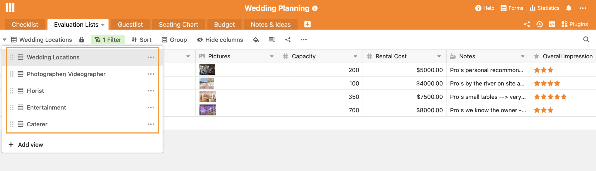

Um dos dias mais bonitos e importantes da vida está mesmo ao virar da esquina: o seu próprio casamento. Nada deve correr mal aqui, e é por isso que o planeamento estruturado do casamento é de grande importância para a maioria dos casais. O que precisa de ser feito 12 meses antes do casamento, o que precisa de ser feito 5 meses antes do grande dia? Se não tiver meios financeiros para contratar um organizador de casamentos profissional, ou se simplesmente gostar de planear o seu próprio casamento, a SeaTable ajuda-o a não perder a visão geral ao planear o seu casamento.

## Lista de controlo de planeamento do casamento com mais de 200 doses

Normalmente, o planeamento de um casamento começa cerca de 13 meses antes do grande dia. Se quiser ter um local de casamento popular, por vezes até mais cedo. É importante não perder de vista o grande número de tarefas. É por isso que no centro do nosso modelo de Wedding [Planner]() está a _lista de verificação_ com mais de 200 tarefas pré-definidas. Além disso, esta tabela regista quando a tarefa correspondente deve ser completada. Há sempre uma tarefa superordenada, que contém vários subitens individuais para o guiar ao longo de todo o processo. A coluna de _verificação_ é uma [coluna de caixa de verificação](#checkbox) que é utilizada para marcar as doses completadas.

A nossa lista de controlo de planeamento de casamento já contém mais de 200 doses para que não se esqueça de nada.

### Crie as suas próprias doses

Para começar a planear o seu próprio casamento, precisa de [se registar para uma conta SeaTable Free](). Pode então começar a planear o seu casamento usando o nosso modelo de Wedding _Planner_.

Pode inserir doses adicionais ou posteriores em qualquer ponto do modelo. Quando se atribui um novo _Parent To-do_, é automaticamente criado um novo grupo de tarefas. A ordenação dos grupos de tarefas é feita automaticamente com base no tempo de espera para o seu casamento. Deseja acrescentar uma data específica às tarefas? Basta adicionar uma nova [coluna de datas](#datum) e atribuir uma data a cada um dos afazeres.

[Clique aqui para ir directamente para o modelo para o seu planeamento de casamento]()

## SeaTable ajuda-o a tomar decisões importantes

Para além da Lista de Controlo de Planeamento de Casamentos, preparámos outras folhas de cálculo para si. As _Listas de Avaliação_ ajudá-lo-ão a tomar decisões importantes. Ao planear um casamento, deparar-se-á com muitas situações e com doses que o obrigam a tomar decisões. Qual o fornecedor que deseja? Quer apenas um fotógrafo ou também precisa de um videógrafo? Prefere uma banda ou um DJ? Sabemos que com tanta escolha de fornecedores no mercado, é fácil ficar sobrecarregado. É por isso que criámos vários pontos de vista que o ajudarão ...

1. ... para recolher possíveis fornecedores
2. ... comparar os fornecedores uns com os outros com base nos diferentes critérios
3. ... para decidir em última análise sobre o melhor fornecedor
4. ... documentar a confirmação da reserva dos fornecedores seleccionados

### Acompanhar o planeamento do casamento

Preparámos 5 pontos de vista diferentes para o ajudar a tomar 5 decisões importantes:

1. Para a selecção do local, existe a vista _Locais de Casamento_
2. Para a selecção de fotógrafos e _videógrafos_ existe a vista _Fotógrafo/ Videógrafo_
3. Para a decoração existe a vista _Florista_
4. Para entretenimento há a vista de _Entretenimento_
5. Para os alimentos há a vista de possíveis _fornecedores de refeições_

### O planeamento do casamento é uma questão de decisões

Depara-se com outras decisões no seu planeamento de casamento que nós não consideramos? Não há problema. Para criar uma nova visão que o ajude a decidir, basta seguir estas instruções:

1. Clique no ícone + em qualquer vista para adicionar uma nova linha
2. Introduzir o nome do fornecedor na frente
3. Crie uma nova categoria em Categoria, clicando na pequena seta e seleccionando "Editar seleção única".
4. A entrada desaparece imediatamente da nova visão, pois esta contém uma função de filtragem
5. Agora crie uma nova visão
6. Nesta vista, todas as entradas de cada vista individual aparecem automaticamente
7. Agora, filtre por "Categoria" + "é" + "A sua categoria recentemente criada".
8. Agora pode continuar a sua lista como de costume

## Mais do que uma simples lista de convidados

A lista de convidados é provavelmente uma das melhores coisas sobre o planeamento de um casamento. Finalmente, todos saberão que o grande dia está a chegar! Preparámos uma _lista de convidados_ para si, o que facilitará o planeamento. Primeiro pode introduzir aqui o nome do hóspede. A seguir, atribuir-lhe uma categoria, pertence à família, ao círculo de amigos ou é um colega? Esta tarefa irá ajudá-lo no planeamento do casamento, nomeadamente no que diz respeito ao plano dos assentos. A seguir, pode atribuir uma categoria alimentar ao convidado, ou já a conhece ou pedi-la com o seu convite e anotá-la depois. Em alternativa, poderia usar o SeaTable para criar um [formulário web]() com o qual cada convidado pode introduzir as suas preferências de refeição e outras informações. Desta forma, pode pedir com antecedência exactamente a informação de que necessita.

O endereço ajudá-lo-á mais tarde a enviar os convites, tal como a caixa de verificação que indica se o convite já foi enviado. Na coluna "Dieta especial" pode registar e manter o registo de alergias ou outros requisitos especiais. A coluna "Para quando" ajuda-o a classificar os convidados para as cerimónias individuais. Os convidados vêm apenas para a cerimónia ou também para o registo civil?

Há espaço para tudo o que é possível nas notas, talvez haja preferências pessoais em relação ao plano de assento posterior que pode anotar aqui.

### Desde a lista de convidados até ao plano de lugares

A fim de evitar um caos adicional de notas na mesa de jantar, para além do caótico planeamento do casamento, pensámos em resolver digitalmente o problema dos lugares sentados. Ligando as duas tabelas _Guestlist_ e _Seating Chart_, pode atribuir cada convidado da tabela _Guestlist_ a uma tabela que tenha previamente definido na tabela _Seating Chart_. Se for mais claro para si, pode também atribuir os convidados individuais às suas mesas na tabela _de Lugares_ ao contrário. Se clicar numa mesa da _lista de convidados_, poderá ver directamente quem já está sentado à mesa.

Mais uma vez, existem diferentes pontos de vista para a lista de convidados para o ajudar ainda mais. Criámos uma visão que mostra quais os [convites](https://www.pinterest.de/mhochzeitsdeko/einladungenskarten-hochzeit/) que ainda não foram enviados. Uma vista mostra-lhe os diferentes pedidos do menu. Talvez fosse também uma opção para si [partilhar]() esta visão directamente com o fornecedor, para que este possa planear o menu mais facilmente. Por último, mas não menos importante, existem três pontos de vista individuais para cada celebração, porque, como sabemos, nem todos os convidados vêm a cada parte da celebração. Assim, com um clique tem uma visão directa das pessoas que estarão presentes em cada caso.

## Manter um olho no orçamento

Um casamento é notoriamente caro. Para além de muitas [dicas sobre como poupar dinheiro](https://www.weddingstyle.de/spartipps-hochzeit/), ajuda a ter um plano orçamental elaborado no início e a acompanhar as suas despesas para que nada fique fora de controlo financeiramente. No nosso _Orçamento_ Base, pode anotar todos os itens de custos em que se pode pensar desde o início, atribuí-los a uma categoria e estabelecer um orçamento máximo para este item. Com o montante efectivamente pago, que entra atrás dele, e a coluna da diferença, pode ficar de olho no seu planeamento orçamental. Resumindo automaticamente, pode ver o seu orçamento total planeado, as despesas reais e a diferença no final da sua tabela orçamental.

## Capturar ideias e inspiração para o planeamento do casamento

Durante o planeamento do casamento, faz-se uma grande quantidade de pesquisas. Especialmente no Pinterest, perde-se frequentemente, esquece-se do que se procurava originalmente e recolhe-se uma quantidade incrível de inspiração para todos os aspectos possíveis de um casamento. Para garantir que não se esqueça de nada, criámos uma última base. A base de _Notas e Ideias_ contém tudo o que vem no seu caminho durante as suas incontáveis buscas. Artigos interessantes no blogue, belas bricolage, [ideias para o entretenimento dos seus convidados e](http://the-little-wedding-corner.de/10-ideen-fuer-die-beschaeftigung-und-unterhaltung-eurer-gaeste-auf-der-hochzeit/) muito mais. Pode adicionar imagens e links aqui e até criar categorias. Se a lista se tornar demasiado longa e confusa, diferentes pontos de vista podem ajudá-lo a classificar por categorias. Se talvez já utilize o [Pocket](https://getpocket.com/) para guardar tais inspirações, poderia considerar a utilização do [Zapier Automation](https://zapier.com/apps/seatable/integrations/pocket) para transferir automaticamente estas notas para o seu Wedding Planner.

## O planeamento perfeito do casamento com SeaTable

Com a nossa _lista de verificação de_ mais de 200 pontos, nada pode correr mal ao planear o seu casamento. SeaTable guia-o durante 13 meses para o seu dia perfeito. As _listas de avaliação_ ajudam-no a tomar decisões, com a _lista de convidados_ não há caos no _plano dos lugares_ e cada convidado recebe o seu convite e o menu correspondente na mesa de jantar a tempo. Com o _planeamento orçamental_, nenhum estrangulamento financeiro irá ensombrar o dia mais bonito da sua vida e, finalmente, não irá esquecer uma boa ideia graças à sua Base de _Notas & Ideias_.

Mesmo que o seu casamento seja um pouco mais específico ou que tenha outros requisitos, o SeaTable pode ser personalizado ao seu gosto. Adicione tabelas, crie [diferentes vistas](), [agrupe e filtre]() os seus dados e vistas ou experimente os [plug-ins]() que mais lhe convêm. Por exemplo, seria concebível integrar uma lista de desejos no Planeador de Casamentos e os convidados podem entrar no presente que escolherão antecipadamente através de um formulário web. Com SeaTable, o formulário da web poderia ser concebido de tal forma que os convidados só vissem presentes que nenhum outro convidado tivesse ainda escolhido. Não há realmente limites para a imaginação.

[Registe-se agora]() e comece a planear o seu casamento. Toda a equipa SeaTable deseja-lhe muita diversão e um grande casamento!

### Instruções em vídeo em alemão no YouTube

Se acabou de dar os seus primeiros passos com SeaTable, por vezes surge o desejo de uma introdução e apresentação compacta de todas as funções. No nosso canal YouTube encontrará uma [introdução](https://www.youtube.com/channel/UCnkzwl8TED0AWo9QCjZv1cA) detalhada [da SeaTable](https://www.youtube.com/channel/UCnkzwl8TED0AWo9QCjZv1cA) alemã que o ajudará a tirar ainda mais partido da SeaTable.
