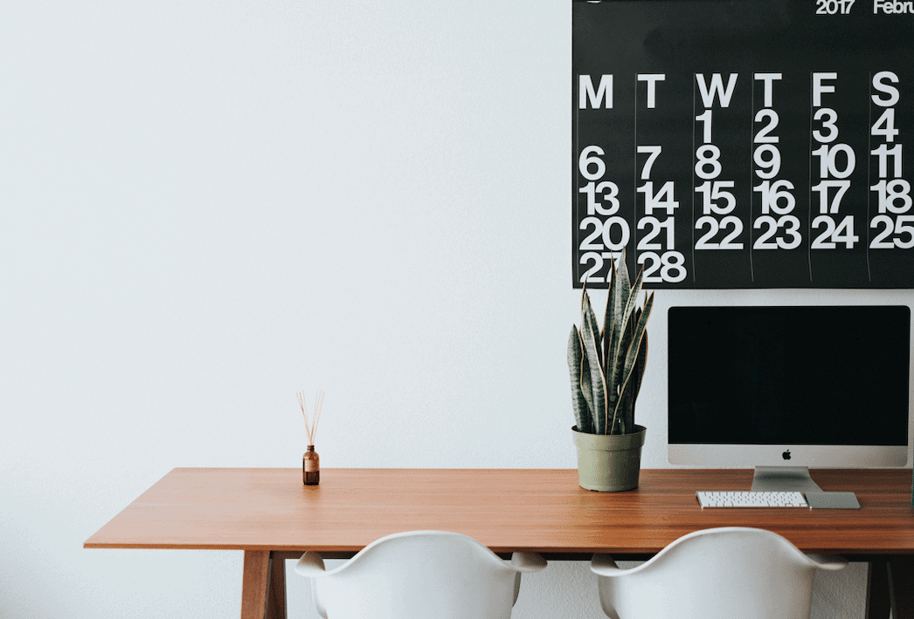

The corona crisis is currently forcing millions of people to work from home. Some find it easy to adjust to the new situation, but many also struggle with it. Do you also not really know how to start in the morning? Do you keep forgetting your lunch break and instead eat your quickly made sandwiches in front of your PC? We will give you valuable tips and show you advantages that will definitely make the situation easier for you.

Are you a team leader and wondering how best to organise your weekly meetings from your home office? Take a look [here,](https://seatable.io/en/team-meetings-remote-organisieren/) we have developed the right template for you!

## 1\. a routine in the morning

To avoid decision fatigue in the morning, establish a fixed morning routine. Always get up at the same time and start your day with things that are good for you. Go for a bike ride or jog, listen to an audio book or read something. Every person is different, find your way! For many, it also helps you to get ready in the morning as usual, as if you were actually going to the office. After all, sweatpants and pyjamas should not be associated with work in the future.

## 2\. create a space to work

Creating a workspace is very important for working from home. If you don't have a study, use [room dividers](https://diy-family.com/diy-raumteiler-6-praktische-ideen/). This can be bookshelves, plants, curtains or just a different wall colour. Visual separation is important, it makes it easier to get into work mode and to switch off after work.

## 3\. fresh air and exercise

Fresh air and exercise are not only good right after getting up, small breaks in between are also good for concentration. Do you have a long call? Why not try walking around your flat or even around the block during your call? The longer coffee break with your colleagues is no longer necessary in the home office, so now you have 5 minutes to get some fresh air instead.

## 4\. even in the home office - take your lunch break!

You hear yourself saying that you don't have time for a break? Then you should take one! If you take regular breaks, you will work more concentrated and productive. The advantage of a home office is that you can schedule your breaks as you like. Instead of a long lunch break, experts recommend several small, intensive breaks. The increased time spent in front of the screen puts more strain on our eyes than usual, and the lack of commuting means we don't get enough exercise. Stand at the open window for a short while and breathe deeply in and out several times. Close your eyes for 2 minutes in between, preferably with a timer set.

## 5\. agreeing rules with flatmates

To avoid unpleasant situations during video calls, it is recommended to arrange rules with members of the household. Important example: closing the door means "do not disturb".

## 6\. clarify questions by telephone

You don't need an email or messenger message for every little question. Just give your colleagues a quick call. Questions are clarified more quickly and you also have at least a little social contact.

### Look at it positively - home office offers you some advantages

Even if it is difficult at first, working from home does offer some advantages. You save yourself the commute to work and thus also annoying traffic jams or bus and train delays. At the end of the day, you have a little more free time. You also save the money for the car or bus journey. The noise level is usually not as high at home either. Especially if you actually work in an open-plan office. In addition, if you don't have strictly prescribed deadlines, you can work according to your own biorhythm. You are already fit at 5 o'clock in the morning and could start your working day? No problem in the home office.
