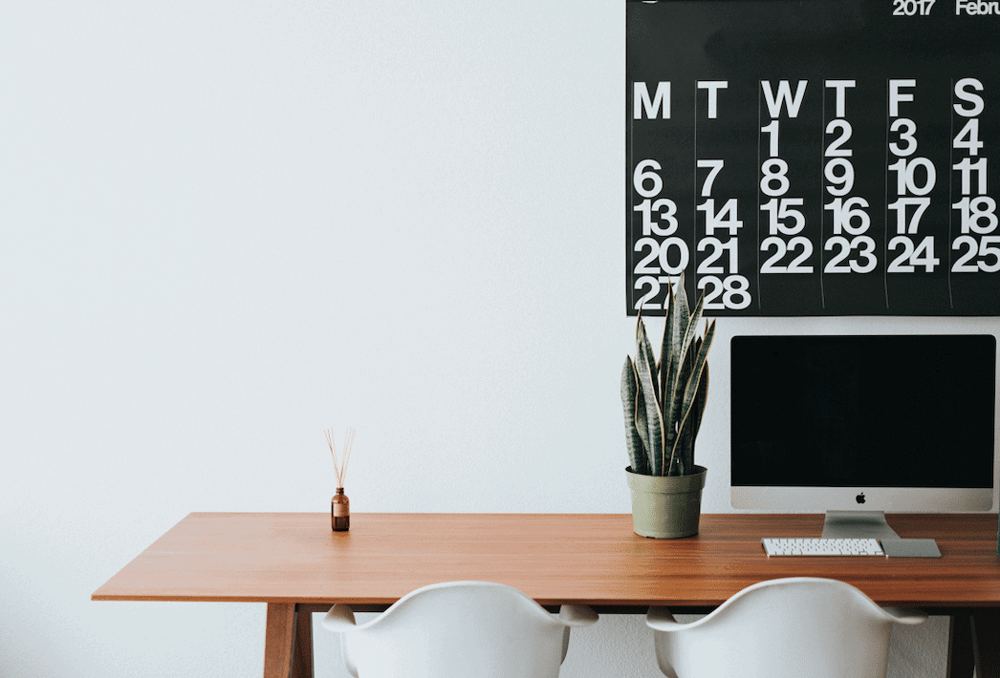

Vous êtes chef d'équipe et vous vous demandez comment organiser au mieux vos réunions hebdomadaires depuis votre bureau à domicile ? Jetez donc un coup d'œil [ici](), nous avons développé le modèle qui vous convient !

## 1\. une routine le matin

Pour éviter d'être fatigué de prendre des décisions le matin, établissez une routine matinale fixe. Levez-vous toujours à la même heure et commencez votre journée par des choses qui vous font du bien. Faites du vélo ou du jogging, écoutez un livre audio ou lisez quelque chose. Chaque personne est différente, trouvez votre chemin ! Pour beaucoup, il est également utile de se préparer le matin comme d'habitude, comme si vous alliez réellement au bureau. Le jogging et le pyjama ne doivent pas être associés au travail à l'avenir.

## 2\. créer un espace de travail

Pour travailler à la maison, il est très important de créer un espace de travail. Si tu ne disposes pas d'un bureau, utilise [des séparateurs d'espace](https://diy-family.com/diy-raumteiler-6-praktische-ideen/). Il peut s'agir de bibliothèques, de plantes, de rideaux ou simplement d'une autre couleur de mur. La séparation visuelle est importante, car elle te permet de te mettre plus facilement en mode travail et de te déconnecter plus facilement après le travail.

## 3\. l'air frais et l'exercice

Il n'y a pas qu'au lever que l'air frais et le mouvement font du bien, de petites pauses pour bouger entre-temps sont également bénéfiques pour la concentration. Vous avez un long appel ? Essayez donc de faire le tour de l'appartement et même du pâté de maisons pendant ce temps. La longue pause café avec les collègues n'a plus lieu d'être dans un bureau à domicile, vous avez donc maintenant 5 minutes pour prendre l'air.

## 4\. même dans un bureau à domicile, il faut respecter la pause de midi !

Vous vous entendez dire que vous n'avez pas le temps de faire une pause ? C'est justement dans ce cas que vous devriez en faire une ! Faire des pauses régulières permet de travailler de manière plus concentrée et plus productive. L'avantage du télétravail est que vous pouvez organiser vos pauses comme vous le souhaitez. Au lieu d'une longue pause déjeuner, les experts recommandent en effet plusieurs petites pauses intensives. En passant plus de temps devant l'écran, nos yeux sont plus sollicités que d'habitude et l'absence de trajets nous prive d'exercice. Mettez-vous brièvement près de la fenêtre ouverte et inspirez et expirez profondément à plusieurs reprises. Fermez les yeux pendant 2 minutes de temps en temps, de préférence avec une minuterie réglée.

## 5\. convenir de règles avec les colocataires

Pour éviter les situations désagréables pendant les appels vidéo, il est recommandé de fixer des règles avec les membres du ménage. Exemple important : fermer la porte signifie "ne pas déranger".

## 6\. répondre aux questions par téléphone

Il n'est pas nécessaire d'envoyer un mail ou un message Messenger pour chaque petite question. Il suffit d'appeler rapidement les collègues. Les questions sont résolues plus rapidement et cela permet en outre d'avoir au moins des petits contacts sociaux.

### Voyez le bon côté des choses - le télétravail vous offre quelques avantages

Même si cela peut paraître difficile au début, le travail à domicile présente certains avantages. Vous vous épargnez le trajet pour aller au travail et donc les embouteillages ennuyeux ou les retards de bus ou de train. À la fin de la journée, il vous reste un peu plus de temps libre. De plus, vous économisez l'argent des trajets en voiture ou en bus. De même, le niveau de bruit est généralement moins élevé à la maison. Surtout si vous travaillez en fait dans un bureau en open space. De plus, si vous n'avez pas de rendez-vous strictement imposés, vous pouvez travailler selon votre propre biorythme. Vous êtes déjà en forme à 5 heures du matin et vous pourriez commencer votre journée de travail ? Pas de problème dans un bureau à domicile.
