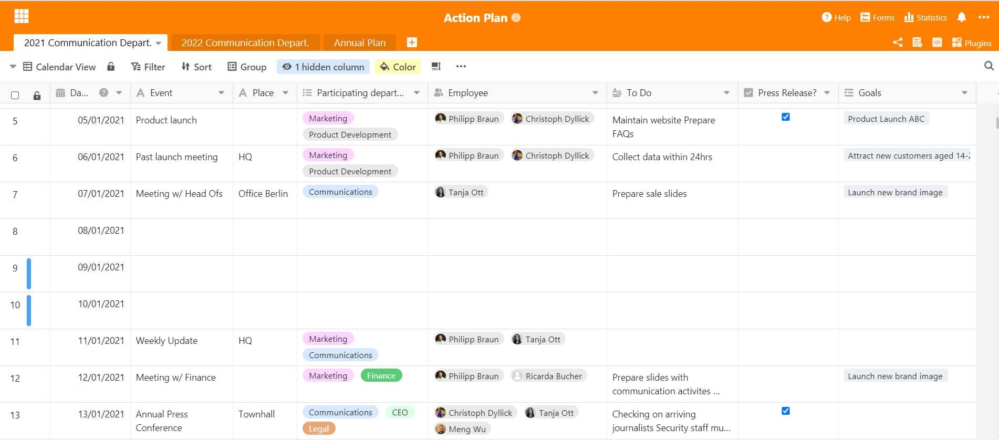

Para que las empresas crezcan y se desarrollen, se fijan constantemente nuevos objetivos y trabajan para alcanzarlos con todos sus recursos. El plan de acción es un método de probada eficacia para alcanzar estos objetivos, por ejemplo en la [gestión de proyectos](), las finanzas y el control y el [marketing]().

## ¿Qué es un plan de acción?

Un plan de acción es una herramienta muy poderosa para alcanzar objetivos en las organizaciones. La visión de conjunto del plan sirve para estructurar las actividades y registrar cuándo se van a llevar a cabo, por quién, en qué condiciones y dónde exactamente. Así, puede entenderse como una especie de [lista de tareas](https://seatable.io/es/to-do-liste-online/) y herramienta de comunicación para toda la empresa. De este modo, se pueden definir diferentes medidas para distintos objetivos, que los empleados de la empresa pueden utilizar como guía y con las que pueden trabajar concretamente. De este modo, los objetivos no se quedan en meras visiones, sino que, con los esfuerzos adecuados y un plan de acción eficaz, se convierten en realidad en poco tiempo.

### ¿Y por qué es importante un plan de acción para las empresas?

El plan ayuda a poner en práctica la estrategia de la empresa a muchos niveles y sirve de orientación para todos. Al fin y al cabo, ¿cómo se supone que los empleados van a saber lo que hay que hacer exactamente? Sin un plan, los objetivos que se persiguen sólo pueden alcanzarse con gran dificultad, por lo que un plan de actividades recogido es muy importante. No siempre tiene que tratarse de toda la empresa o del plan anual. Los planes de acción también pueden utilizarse a nivel de departamento, por ejemplo para aumentar la satisfacción de los empleados o para avanzar en la gestión del cambio. A grandes rasgos, los planes de acción ofrecen estos beneficios clave:

### Estructura clara

Un plan de acción ayuda a los empleados y a la empresa a hacer un seguimiento estructurado de todas las medidas y plazos.

### Procesos y flujos de trabajo eficientes

Siempre ayuda cortar el elefante en rodajas pequeñas. Un plan de acción claro hace que los procesos y los flujos de trabajo sean más eficaces.

Cada tarea y cada medida necesitan una responsabilidad clara. El plan de acción ayuda a definir esta responsabilidad de empleado a tarea y a hacerla transparente para todos.

## El plan de acción como herramienta versátil

Un plan de acción puede aplicarse en toda la empresa cuando se formulan objetivos corporativos a gran escala. Pero también puede utilizarse de diversas maneras en la [gestión de proyectos](https://seatable.io/es/projektmanagement/), y en los más diversos contextos. El plan de acción es útil siempre que haya proyectos que gestionar: por ejemplo, a corto plazo, cuando hay que desarrollar medidas para objetivos concretos en un taller, por ejemplo para la próxima campaña publicitaria de un producto. O también a largo plazo, si se quiere seguir una estrategia definida, como en el [marketing](https://seatable.io/es/marketing/) o en el departamento de comunicación, cuando se trata de la comunicación estratégica externa.

Las empresas deben planificar muy bien su aspecto exterior, y preferiblemente con mucha antelación. Debe quedar claro: ¿Cuándo se celebran eventos especiales que debemos comunicar? ¿Cuándo son las fechas importantes y quiénes participan? Esto suele ocurrir en el departamento de marketing o comunicación, donde se planifican y aplican las medidas de comunicación externa y marketing. No se puede subestimar la importancia de un [plan de acción para la empresa](https://www.fuer-gruender.de/wissen/unternehmen-gruenden/aussenauftritt/externe-kommunikation/) y la estrategia de relaciones públicas.

La planificación anual de las actividades en las empresas debe hacerse con tiempo suficiente para todo el año. El uso de un plan de acción para la planificación anual puede ser muy útil en este caso: no sólo se pueden formular y establecer los objetivos anuales, sino que también se pueden recoger ya las ideas para ponerlos en práctica.

### Aplicación en la comunicación externa

En el departamento de comunicación de la empresa, las actividades de comunicación deben planificarse a menudo con un año de antelación. Para desarrollar una buena estrategia de comunicación, el personal de comunicación necesita un plan detallado de todas las fechas importantes del año, que suelen registrarse en tablas. Se puede planificar una actividad de comunicación para cada fecha:

- Comunicados de prensa
- Anuncios
- Publicaciones en las redes sociales
- Reuniones con periodistas
- Revista de la empresa
- Campañas publicitarias

Además, el departamento de comunicación es en la mayoría de los casos también la oficina de prensa y la persona de contacto para el público en todos los asuntos relacionados con la empresa. Por lo tanto, los empleados del sector de la comunicación deben saber siempre cuándo se celebran las citas públicas.

Un plan de acción puede ser un muy buen remedio para esto. Todos estos datos se anotan allí para poder derivar de ellos las medidas adecuadas y aclarar qué forma de actuación se adoptará ante un suceso. Para que el año sea más claro, es útil trazar un mapa de todos los días del calendario, porque te darás cuenta: Casi todos los días de la semana hay algo que puede ser importante para su estrategia de comunicación.

## La planificación de acciones es más fácil con SeaTable

Con nuestra [plantilla SeaTable para un plan de actividades](), siempre tendrá a la vista cada cita y cada actividad. Diseñe el plan según sus deseos y planes de actividad. Puede vincular sus medidas con sus objetivos (anuales) en el mismo documento en un abrir y cerrar de ojos, para tener toda la información en un solo lugar.

Nuestra plantilla consiste esencialmente en un calendario de 365 días con fines de semana y días festivos marcados, en el que puede introducir fácilmente todo lo relacionado con su planificación. Esto tiene la ventaja de que puedes ver los días de la semana y los meses en una vista holística. Esto permite tener una mejor visión de conjunto de cuándo y con qué periodicidad debe tener lugar una determinada cita o actividad y facilita la planificación anual. Para una planificación detallada del proyecto, se integran en las columnas la hora, el lugar, los responsables y los departamentos, así como las tareas importantes. De este modo, se puede planificar con gran precisión el curso de las medidas individuales y las fechas importantes están siempre al alcance de unos pocos clics. Ya lo verás: Con SeaTable, la planificación de todo el año está perfectamente estructurada y organizada.

La visión de conjunto en el plan de acción

Aquí no sólo tiene cabida su agenda, sino también sus proyectos y objetivos previstos al mismo tiempo. Puede crearlas en otra hoja de cálculo y documentar continuamente los progresos. Lo práctico: a través de la columna de personal, puedes entregar las tareas y proyectos directamente a los responsables para evitar el caos. De este modo, te aseguras de que todo se haga a tiempo y de que todos los empleados sepan cuáles son sus tareas. De este modo, se garantiza un flujo de trabajo ideal en el que no se pierde nada.

Visualice y avance los objetivos en su plan de acción

Con la flexibilidad de SeaTable y las numerosas opciones de diseño, crear un plan de acción es un juego de niños. Los objetivos pueden estar vinculados entre sí, al igual que los plazos o las medidas que se repiten anualmente. Utilízalo para visionar tu estrategia y aplicar tus planes de forma directa y eficaz.

Comience directamente y [descargue nuestra plantilla]() para un plan de acción en su nube hoy mismo. Benefíciese de las versátiles funciones de SeaTable. No volverá a perder de vista sus objetivos y medidas.
