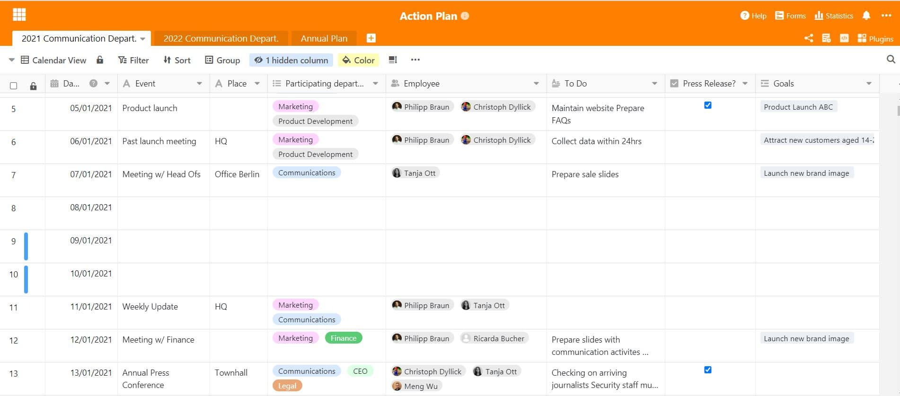

Para que as empresas cresçam e se desenvolvam, estabelecem constantemente novos objectivos e trabalham para eles com todos os seus recursos. O plano de acção é um método comprovado para alcançar estes objectivos - por exemplo na [gestão de projectos](), finanças & controlo e [marketing]().

## O que é um plano de acção?

Um plano de acção é um instrumento muito poderoso para atingir objectivos dentro das organizações. A visão geral no plano serve para estruturar as actividades e registos quando estas devem ter lugar, por quem, em que condições e onde exactamente. Pode assim ser entendida como uma espécie de [lista de afazeres](https://seatable.io/pt/to-do-liste-online/) e instrumento de comunicação para toda a empresa. Desta forma, podem ser definidas diferentes medidas para diferentes objectivos, que os empregados da empresa podem utilizar como guia e com as quais podem trabalhar de forma concreta. Desta forma, os objectivos não permanecem apenas visões, mas com os esforços certos e um plano de acção eficiente, tornam-se realidade num instante.

### E porque é que um plano de acção é importante para as empresas?

O plano ajuda a implementar a estratégia empresarial a muitos níveis e fornece orientação para todos. Afinal de contas, como é que os empregados devem saber exactamente o que precisa de ser feito? Sem um plano, os objectivos perseguidos só podem ser alcançados com grande dificuldade, razão pela qual um plano de actividades recolhido é muito importante. Não tem de ser sempre sobre toda a empresa ou sobre o plano anual. Os planos de acção também podem ser utilizados a nível departamental, por exemplo, para aumentar a satisfação dos empregados ou para o progresso na gestão da mudança. No quadro geral, os planos de acção oferecem estes benefícios-chave:

### Estrutura clara

Um plano de acção ajuda os empregados e a empresa a manter um registo estruturado de todas as medidas e prazos.

### Processos e fluxos de trabalho eficientes

Ajuda sempre a cortar o elefante em pequenas fatias. Um plano de acção claro torna os processos e os fluxos de trabalho mais eficientes.

Cada tarefa e cada medida precisa de uma responsabilidade clara. O plano de acção ajuda a definir esta responsabilidade de empregado para tarefa e a torná-la transparente para todos.

## Plano de acção como uma ferramenta versátil

Um plano de acção pode ser aplicado em toda a empresa ao formular objectivos empresariais em grande escala. Mas também pode ser utilizado de várias maneiras na [gestão de projectos](https://seatable.io/pt/projektmanagement/), e nos mais diversos contextos. O plano de acção é útil onde quer que haja projectos a gerir: por exemplo, a curto prazo, quando as medidas para objectivos específicos devem ser desenvolvidas num workshop, por exemplo, para a próxima campanha publicitária de um produto. Ou também a longo prazo, se se pretende prosseguir uma estratégia definida, como no [marketing](https://seatable.io/pt/marketing/) ou no departamento de comunicação, quando se trata de comunicação estratégica externa.

As empresas precisam de planear a sua aparência externa muito bem, e de preferência com bastante antecedência. Deve ser claro: Quando se realizam os eventos especiais que precisamos de comunicar? Quando são datas importantes e quem está envolvido? Isto acontece normalmente no departamento de marketing ou comunicação, onde as medidas de comunicação e marketing externo são planeadas e implementadas. A importância de um [plano de acção para a empresa](https://www.fuer-gruender.de/wissen/unternehmen-gruenden/aussenauftritt/externe-kommunikation/) e a estratégia de relações públicas não pode ser subestimada.

O planeamento anual das actividades nas empresas deve ser feito em tempo útil durante todo o ano. A utilização de um plano de acção para o planeamento anual pode ser muito útil aqui - não só os objectivos anuais podem ser formulados e definidos, como também as ideias para a sua implementação podem já ser recolhidas.

### Aplicação em comunicação externa

No departamento de comunicação empresarial, as actividades de comunicação precisam muitas vezes de ser planeadas com um ano de antecedência. Para desenvolver uma boa estratégia de comunicação, o pessoal de comunicação precisa de um plano detalhado de todas as datas importantes do ano, que são geralmente registadas em tabelas. Uma actividade de comunicação pode ser planeada para cada data:

- Comunicados de imprensa
- Advertorias
- Postos de comunicação social
- Reunir eventos com jornalistas
- Revista da empresa
- Campanhas publicitárias

Além disso, o departamento de comunicação é também, na maioria dos casos, o gabinete de imprensa e a pessoa de contacto para o público sobre todas as questões relacionadas com a empresa. Os funcionários nas comunicações devem, portanto, saber sempre quando se realizam as nomeações públicas.

Um plano de acção pode ser um remédio muito bom para isto. Todas estas datas são aí anotadas para que delas se possam derivar medidas apropriadas e se possa esclarecer de que forma as medidas reagirão a um evento. Para a clareza do ano, é útil mapear todos os dias do calendário, porque notará: Em quase todos os dias da semana há algo que pode ser importante para a sua estratégia de comunicação.

## Planeamento de acções facilitado com SeaTable

Com o nosso [modelo SeaTable para um plano de actividades](), tem sempre em vista todos os compromissos e todas as actividades. Desenhe o plano de acordo com os seus desejos e planos de actividade. Pode ligar as suas medidas aos seus objectivos (anuais) no mesmo documento num instante - para que tenha toda a informação num só lugar.

O nosso modelo consiste essencialmente num calendário de 365 dias com fins de semana e feriados marcados, no qual pode facilmente introduzir tudo relacionado com o seu planeamento. Isto tem a vantagem de poder olhar para os dias da semana e meses numa visão holística. Isto dá uma melhor visão geral de quando e a que intervalos uma determinada nomeação ou actividade deve ter lugar e facilita o planeamento anual. Para o planeamento detalhado do projecto, tempo, local, pessoas responsáveis e departamentos, bem como importantes afazeres, estão integrados nas colunas. Desta forma, o curso das medidas individuais pode ser planeado com muita precisão e datas importantes estão sempre ao alcance de apenas alguns cliques. Verá: Com SeaTable, o planeamento para todo o ano é perfeitamente estruturado e organizado.

A visão geral no plano de acção

Não só a sua agenda encontra aqui espaço, mas também os seus projectos e objectivos planeados, ao mesmo tempo. Pode criá-los noutra folha de cálculo e documentar continuamente o progresso. O prático: A coluna de pessoal permite entregar tarefas e projectos directamente aos responsáveis, a fim de evitar o caos. Desta forma, assegura-se que tudo é feito a tempo e que todos os empregados sabem quais são as suas tarefas. Desta forma, assegura-se um fluxo de trabalho ideal onde nada se perde.

Visualize e avance objectivos no seu plano de acção

Com a flexibilidade do SeaTable e as muitas opções de design, criar um plano de acção é uma brincadeira de criança. Os objectivos podem ser associados de forma transversal, tal como os prazos ou medidas anuais recorrentes. Utilize-o para visualizar a sua estratégia e implementar os seus planos de forma directa e eficaz.

Comece directamente e [descarregue]() hoje o [nosso modelo]() para um plano de acção na sua nuvem! Beneficiar das funções versáteis do SeaTable. Nunca mais perderá de vista os seus objectivos e medidas!
