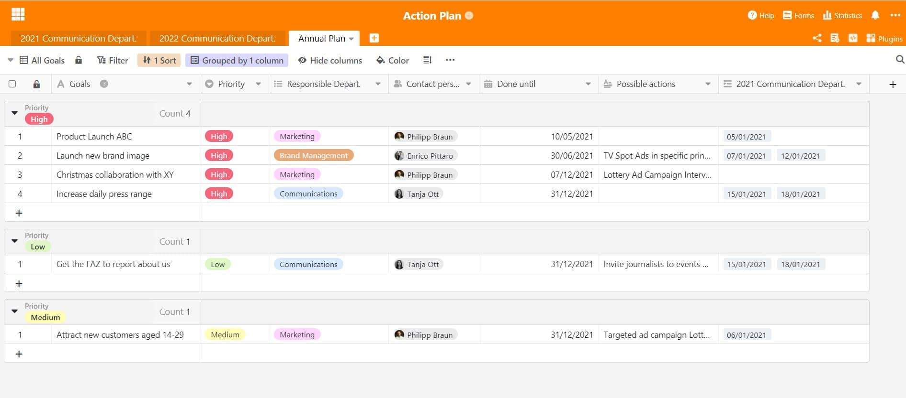

Для того чтобы компании росли и развивались, они постоянно ставят перед собой новые цели и работают над их достижением всеми своими силами. План действий является проверенным методом достижения этих целей – например, в [управлении проектами](), финансах и контроллинге и [маркетинге]().

## Что такое план действий?

План действий — это очень мощный инструмент для достижения целей в компаниях. Обзор в плане служит для структурирования действий и записи того, когда они должны происходить, кем, при каких условиях и где именно. Таким образом, его можно рассматривать как своего рода [список дел]() и инструмент коммуникации для всей компании. Таким образом, для разных целей можно определить различные меры, которые сотрудники компании могут использовать в качестве ориентира и с которыми они могут конкретно работать. Таким образом, цели не остаются просто видениями, а при правильных усилиях и эффективном плане действий в кратчайшие сроки становятся реальностью.

### Почему план действий важен для компаний?

План помогает **реализовать корпоративную стратегию** на многих уровнях и обеспечивает **ориентацию** для каждого. В конце концов, как еще сотрудники могут узнать, что именно нужно сделать? Без плана преследуемые цели могут быть достигнуты лишь с большим трудом, поэтому совместное планирование всех мероприятий очень важно. Это не всегда должно касаться всей компании или годового плана. Планы действий также можно использовать в масштабах отдела, например, для повышения удовлетворенности сотрудников или для достижения прогресса в [управлении изменениями]().

В целом планы действий предлагают следующие ключевые **преимущества**:

- **Четкая структура**: план действий помогает сотрудникам и компании структурированно отслеживать все мероприятия и сроки их выполнения.
- **Эффективные процессы и рабочие потоки**: всегда помогает разделить масштабные задачи на небольшие части. Четкий план действий делает процессы и рабочие потоки более эффективными.
- **Четкие зоны ответственности**: каждая задача и каждая мера требует четкой ответственности. План действий помогает определить эту ответственность от сотрудника к задаче и сделать ее прозрачной для всех.

## План действий как универсальный инструмент

План действий может применяться в масштабах всей компании при формулировании корпоративных целей в большом масштабе. Но его также можно использовать различными способами в [управлении проектами](), причем в самых разных контекстах. План действий полезен везде, где есть проекты, которыми нужно управлять: например, в краткосрочной перспективе, когда на семинаре должны быть разработаны меры для достижения конкретных целей, например, для следующей рекламной кампании продукта. Или также в долгосрочной перспективе, если необходимо придерживаться определенной стратегии, как, например, в [маркетинге]() или в отделе коммуникаций, когда речь идет о стратегической внешней коммуникации.

Компании должны очень хорошо планировать свой внешний облик, и желательно заблаговременно. Это должно быть ясно: Когда происходят особые [мероприятия](), о которых нам нужно сообщить? Когда наступают важные даты и кто в них участвует? Обычно это происходит в отделе маркетинга или коммуникаций, где планируются и реализуются внешние коммуникационные и маркетинговые мероприятия. Нельзя недооценивать важность [плана действий для компании](https://www.fuer-gruender.de/wissen/unternehmen-gruenden/aussenauftritt/externe-kommunikation/) и PR-стратегии.

Годовое планирование деятельности в компаниях должно осуществляться заблаговременно на весь год. Использование плана действий для годового планирования может быть здесь очень полезным – можно не только сформулировать и установить годовые цели, но и уже собрать идеи для их реализации.

### Применение во внешней коммуникации

В отделе корпоративных коммуникаций коммуникационные мероприятия часто приходится планировать на год вперед. Для разработки хорошей стратегии коммуникации сотрудникам отдела коммуникации необходим подробный план всех важных дат в году, которые обычно записываются в таблицы. Для каждой даты можно запланировать коммуникационное мероприятие:

- Пресс-релизы
- Рекламные статьи (адверториалы)
- [Посты в социальных сетях]()
- Get-together-мероприятия с журналистами
- Журнал компании
- Рекламные кампании

Кроме того, отдел коммуникаций в большинстве случаев является также пресс-службой и контактным лицом для общественности по всем вопросам, связанным с деятельностью компании. Поэтому сотрудники отдела коммуникаций должны всегда знать, когда проходят публичные мероприятия.

План действий может стать очень хорошим средством для решения этой проблемы. Все эти даты отмечаются там, чтобы на их основе можно было принять соответствующие меры и уточнить, в какой форме будет дан ответ на то или иное событие. Для наглядности в течение года полезно отобразить все календарные дни, потому что вы заметите: почти в каждый будний день есть что-то, что может быть важно для вашей коммуникационной стратегии.

## Планирование мероприятий совсем просто с SeaTable

С нашим [шаблоном SeaTable для плана мероприятий]() вы всегда будете иметь на виду каждую встречу и каждое мероприятие. Разработайте план в соответствии с вашими пожеланиями и планами деятельности. При этом вы можете связать ваши мероприятия с вашими (годовыми) целями в одном документе в кратчайшие сроки — так у вас будет вся информация в одном месте.

Наш шаблон, по сути, представляет собой **календарь на 365 дней с отмеченными выходными и праздниками**, в который вы можете легко внести все, что связано с вашим планированием. Преимущество этого способа заключается в том, что вы можете рассматривать дни недели и месяцы в целостном виде. Это позволяет лучше понять, когда и через какие промежутки времени должна проводиться та или иная встреча или мероприятие, и облегчает планирование на год. Для детального планирования проекта интегрированы столбцы **мероприятие, место, ответственные отделы и сотрудники, а также важные задачи и цели**. Таким образом, можно очень точно спланировать ход отдельных мероприятий и всегда иметь под рукой важные даты, сделав всего несколько щелчков мышью. Вы увидите: с SeaTable планирование на весь год идеально структурировано и организовано.



Здесь найдется место не только вашему расписанию, но и запланированным проектам и целям. Вы можете создать их в другой электронной таблице и постоянно документировать прогресс. Практичная деталь: колонка сотрудников позволяет передавать задачи и проекты непосредственно ответственным лицам, чтобы избежать хаоса. Таким образом, вы обеспечите, чтобы все было сделано вовремя и все сотрудники знали свои задачи. Так вы обеспечите идеальный рабочий процесс, в котором ничего не потеряется.

Благодаря гибкости SeaTable и множеству вариантов дизайна создание плана действий — это детская забава. Цели могут быть связаны между собой, как и ежегодно повторяющиеся сроки или мероприятия. Придайте таким образом видение своей стратегии и реализуйте свои планы непосредственно и эффективно.

Начните прямо сейчас и [загрузите наш шаблон]() плана действий в свое облако уже сегодня! Воспользуйтесь универсальными функциями SeaTable. Вы больше никогда не потеряете из виду свои цели и мероприятия!
