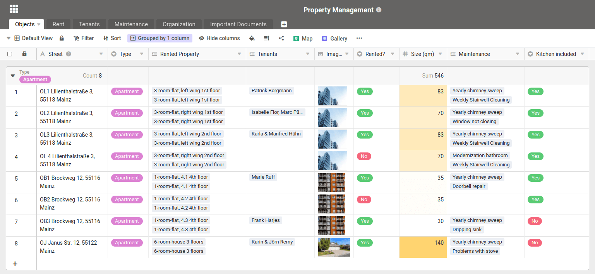

We take care of your organization - regardless of whether you want to manage your properties clearly, are looking for an apartment or are already planning your next move.

SeaTable is as flexible as a Swiss army knife and can help you with a wide range of challenges. In the following article, we present four new templates from the real estate sector. Two are aimed at companies or private individuals who rent out or manage properties; the other two are aimed at tenants and people looking for accommodation:

- SeaTable is the flexible software for any real estate management
- Plan and coordinate the activities of your janitors
- Structure your next flat search
- Plan your next move and stay on top of things

You will find these four templates in [the Real estate templates section](). We have created this section to help you with your daily challenges. You will see: The templates will help you to map all your processes and tasks quickly and easily.

Copy the templates, adapt them to your needs or use the table structures and contents as inspiration when building and developing your own applications.

## Manage all your properties clearly in one software

Property management with SeaTable

Even today, properties and all associated information such as tenants, repair orders, invoices, incoming payments, etc. are often still managed using Excel spreadsheets. Save yourself this tedious task and get started with SeaTable today.

In our [template for managing your properties](), you can record all information centrally in a database. Record data, photos and floor plans of your properties, remind defaulting tenants by e-mail if no money has been received, and document all maintenance work and repairs in a clear table.

## Keep your properties in order and coordinate janitor services

Coordinate caretaker services with SeaTable

Something breaks in every building. You can't change that. What you can change, however, is that you can handle the repair process efficiently - with our [template for janitorial services]().

With SeaTable, you can let residents submit repair orders conveniently via a [web form](). You are automatically informed by email about new reported damage and problems and can assign the repair to the right janitor, tradesman or employee. They receive all the necessary information and can document the repair directly on site in their SeaTable app. Working hours and required consumables can be easily documented.

If you want, you can even email the person who reported the repair need to inform them that the repair has been completed. You retain full control over all activities from start to finish and can adapt the template to your needs and properties as you wish.

## Leave nothing to chance in your next flat search

Flat hunting with SeaTable - Leave nothing to chance.

The search for a new apartment is notoriously difficult, especially in metropolitan areas. The apartments on offer often do not match individual requirements in terms of rent, location, rooms and furnishings. After the fifth viewing at the latest, you also start to lose track of the properties. Therefore, make a note of all the pros and cons of the apartments you view in one place, compare certain criteria such as the [price-performance ratio](https://de.wikipedia.org/wiki/Preis-Leistungs-Verhältnis) and you will find that the decision is easier in the end.

With our [apartment search template](), you can record all information, data and documents about the apartments in a simple and structured way. Save photos, floor plans, living space, rental price and everything else you noticed during the property viewing in a clear table. Assign a rating and make the right decision easier, safer and faster.

## Start planning your next move

Your next move planning will be a breeze with SeaTable.

We've all moved house in our lives and know how nerve-wracking a move can be. After the third packed box at the latest, you lose track of what is packed where and get bogged down in confusing to-do lists.

You can significantly reduce your stress level with our [template for your next move](). The template helps you to record exactly what you have packed where and how it gets from your old home to your new one.

Our relocation template also provides a to-do list for other tasks that need to be completed by a certain date. So don't forget to set up the redirection request for the post office or cancel contracts relating to the old property in good time. Try it out! The next move is sure to come.

Want to see even more ways you can use SeaTable? Discover [all our templates]() and work even more efficiently with your data.
