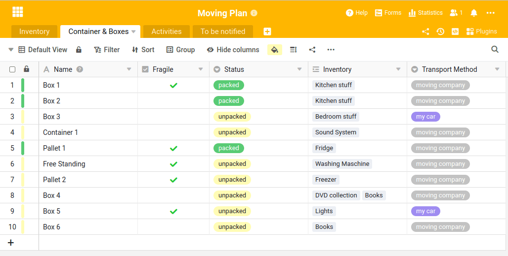

Nós tratamos da sua organização - independentemente de querer gerir claramente os seus imóveis, de estar à procura de um apartamento ou de já estar a planear a sua próxima mudança.

O SeaTable é tão flexível como um canivete suíço e pode ajudá-lo numa vasta gama de desafios. No artigo seguinte, apresentamos quatro novos modelos do sector imobiliário. Dois destinam-se a empresas ou particulares que arrendam ou gerem propriedades; os outros dois destinam-se a inquilinos e pessoas à procura de alojamento:

- O SeaTable é o software flexível para qualquer gestão imobiliária
- Planear e coordenar as actividades das pessoas que cuidam de si
- Estruture a sua próxima pesquisa plana
- Planeie o seu próximo passo e mantenha-se no topo das coisas

Encontrará estes quatro modelos na [secção de modelos para o sector imobiliário](). Criámos esta secção para o ajudar nos seus desafios diários. Verá: Os modelos ajudá-lo-ão a mapear todos os seus processos e tarefas de forma rápida e fácil.

Copie os modelos, personalize-os de acordo com as suas necessidades ou utilize as estruturas e conteúdos dos quadros como inspiração para criar e desenvolver as suas próprias aplicações.

## Administre todas as suas propriedades claramente num único software

Gestão de propriedades com SeaTable

Ainda hoje, as propriedades e todas as informações associadas, tais como inquilinos, ordens de reparação, facturas, pagamentos recebidos, etc., são muitas vezes geridas através de folhas de cálculo Excel. Poupe-se a este esforço tedioso e comece a utilizar o SeaTable hoje mesmo.

No nosso [modelo para gerir as suas propriedades](), pode registar todas as informações de forma centralizada numa base de dados. Registe dados, fotografias e plantas das suas propriedades, lembre os inquilinos em falta por correio eletrónico se o dinheiro não tiver sido recebido e documente todos os trabalhos de manutenção e reparações numa tabela claramente organizada.

## Manter as suas propriedades em ordem e coordenar os serviços de manutenção

Coordenar os serviços de manutenção com SeaTable

Algo se parte em todos os edifícios. Isso não pode ser alterado. O que pode mudar, no entanto, é o facto de poder tratar do processo de reparação de forma eficiente - com o nosso [modelo para serviços de limpeza]().

Com o SeaTable, pode permitir que os residentes apresentem pedidos de reparação de forma cómoda através de um [formulário Web](). É automaticamente informado por correio eletrónico sobre os novos danos e problemas comunicados e pode atribuir a reparação ao zelador, comerciante ou empregado certo. Estes recebem todas as informações necessárias e podem documentar a reparação diretamente no local, na sua aplicação SeaTable. As horas de trabalho e os consumíveis necessários podem ser facilmente documentados.

Se quiser, pode até enviar um e-mail à pessoa que comunicou a necessidade de reparação para a informar de que a reparação foi concluída. Mantém o controlo total sobre todas as actividades do início ao fim e pode personalizar o modelo de acordo com as suas necessidades e propriedade.

## Não deixe nada ao acaso na sua próxima pesquisa de apartamento

Caça plana com SeaTable - Não deixar nada ao acaso.

A procura de um novo apartamento é notoriamente difícil, sobretudo nas zonas urbanas. Muitas vezes, os apartamentos propostos não correspondem às necessidades individuais em termos de renda, localização, divisões e mobiliário. Depois da quinta visita, o mais tardar, começa-se a perder a noção dos imóveis. Por isso, tome nota de todos os prós e contras dos apartamentos que vê num só lugar, compare certos critérios como a [relação preço/desempenho](https://de.wikipedia.org/wiki/Preis-Leistungs-Verhältnis) e verá que, no final, a decisão será mais fácil para si.

Com o nosso [modelo de pesquisa de apartamento](), pode registar todas as informações, dados e documentos sobre os apartamentos de uma forma simples e estruturada. Guarde fotografias, plantas, área de habitação, preço de aluguer e tudo o mais que observou durante a visita ao imóvel numa tabela claramente organizada. Atribua uma classificação e tome a decisão correcta de forma mais fácil, segura e rápida.

## Comece a planear o seu próximo passo

Planear a sua próxima jogada é uma brincadeira de crianças com o SeaTable.

Todos nós já mudámos de casa na vida e sabemos como uma mudança pode ser enervante. Depois da terceira caixa embalada, o mais tardar, perdemos a noção do que está embalado e onde e ficamos atolados em listas de tarefas confusas.

Pode reduzir significativamente os seus níveis de stress com o nosso [modelo para a sua próxima mudança](). O modelo ajuda-o a registar exatamente o que empacotou, onde e como vai da sua casa antiga para a nova.

O nosso modelo de mudança também inclui uma lista de afazeres para outras tarefas que têm de ser concluídas até uma determinada data. Por isso, não se esqueça de preparar o pedido de reencaminhamento para os correios ou de cancelar atempadamente os contratos relativos à antiga propriedade. Experimente! O próximo passo é certo.

Gostaria de ver ainda mais formas de utilizar o SeaTable? Descubra [todos os nossos modelos]() e trabalhe de forma ainda mais eficiente com os seus dados.
