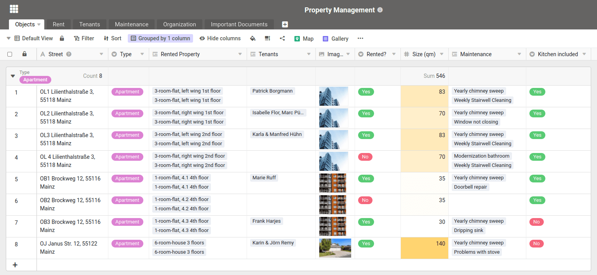
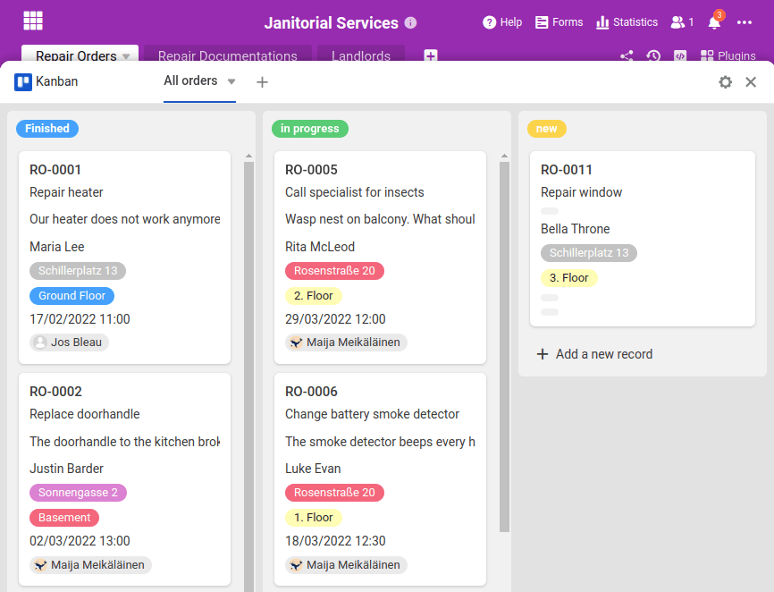
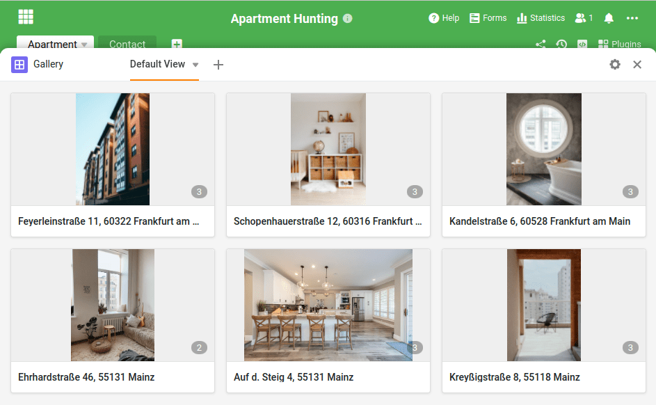
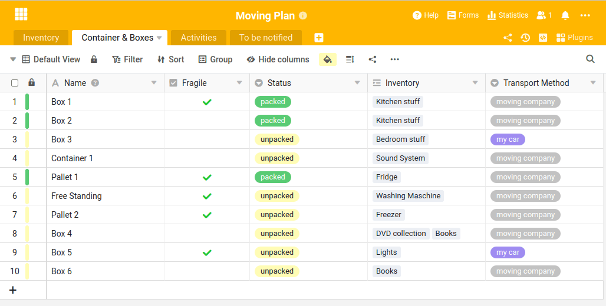

Мы позаботимся о Вашей организации - независимо от того, хотите ли Вы четко управлять своей недвижимостью, ищете квартиру или уже планируете свой следующий переезд.

SeaTable гибок, как швейцарский армейский нож, и может помочь вам в решении самых разных задач. В следующей статье мы представляем четыре новых шаблона из сферы недвижимости. Два из них предназначены для компаний или частных лиц, сдающих в аренду или управляющих недвижимостью, а два других - для арендаторов и людей, ищущих жилье:

- SeaTable - гибкое программное обеспечение для управлениялюбой недвижимостью
- Планировать и координировать деятельность ваших воспитателей
- Структурируйте свой следующий поиск квартиры
- Планируйте свои дальнейшие действия и будьте в курсе событий

Эти четыре шаблона вы найдете в [разделе Шаблоны для работы с недвижимостью](). Мы создали этот раздел, чтобы помочь вам в решении повседневных задач. Вы увидите: Шаблоны помогут вам быстро и легко составить карту всех ваших процессов и задач.

Копируйте шаблоны, адаптируйте их под свои нужды или используйте структуры и содержание таблиц в качестве вдохновения при создании и разработке собственных приложений.

## Четкое управление всей вашей недвижимостью в одном программном обеспечении

Управление недвижимостью с помощью SeaTable

Даже сегодня управление недвижимостью и всей сопутствующей информацией, такой как арендаторы, заявки на ремонт, счета, входящие платежи и т.д., часто осуществляется с помощью электронных таблиц Excel. Избавьте себя от этой утомительной работы и начните работать с SeaTable уже сегодня.

В нашем [шаблоне для управления недвижимостью]() вы можете централизованно заносить всю информацию в базу данных. Записывайте данные, фотографии и поэтажные планы объектов недвижимости, напоминайте неплательщикам по электронной почте о неполученных деньгах и документируйте все работы по обслуживанию и ремонту в виде четко организованной таблицы.

## Поддерживать порядок на объектах недвижимости и координировать услуги сторожей

Координировать услуги сторожа с SeaTable

В каждом здании что-то ломается. Вы не можете этого изменить. Но что вы можете изменить, так это то, что вы сможете эффективно справиться с процессом ремонта - с помощью нашего [шаблона для уборщиц]().

SeaTable позволяет жильцам удобно подавать заявки на ремонт через [веб-форму](). Вы автоматически получаете по электронной почте информацию о новых сообщениях о повреждениях и проблемах и можете поручить ремонт нужному смотрителю, мастеру или сотруднику. Они получают всю необходимую информацию и могут документировать ремонт прямо на месте в своем приложении SeaTable. Трудозатраты и необходимые расходные материалы могут быть легко задокументированы.

При желании можно даже отправить электронное письмо лицу, сообщившему о необходимости ремонта, чтобы проинформировать его о том, что ремонт завершен. Вы сохраняете полный контроль над всеми действиями от начала до конца и можете настроить шаблон в соответствии со своими потребностями и особенностями объекта.

## Не оставляйте ничего на волю случая при следующем поиске квартиры

Плоская охота с SeaTable - не оставляйте ничего на волю случая.

Поиск новой квартиры, особенно в городах, как известно, дело непростое. Предлагаемые квартиры часто не соответствуют индивидуальным требованиям по арендной плате, расположению, комнатам и обстановке. Не позднее чем после пятого просмотра вы начинаете теряться в выборе недвижимости. Поэтому запишите в одном месте все плюсы и минусы просмотренных квартир, сравните некоторые критерии, например [соотношение цены и качества](https://de.wikipedia.org/wiki/Preis-Leistungs-Verhältnis), и вы поймете, что в конечном итоге вам будет легче принять решение.

С помощью нашего [шаблона для поиска квартиры]() вы можете записать всю информацию, данные и документы о квартирах в простой и структурированной форме. Сохраните фотографии, поэтажные планы, жилую площадь, стоимость аренды и все остальное, что вы заметили во время просмотра недвижимости, в четко организованной таблице. Присвойте оценку и примите правильное решение проще, надежнее и быстрее.

## Начните планировать свои дальнейшие действия

С помощью SeaTable планировать дальнейшие действия - проще простого.

Все мы в своей жизни переезжали и знаем, насколько нервным может быть переезд. Не позднее чем после третьей упакованной коробки вы теряете представление о том, что куда упаковано, и увязаете в путаных списках дел.

Вы можете значительно снизить уровень стресса, используя наш [шаблон для следующего пере]() езда. Шаблон поможет вам точно записать, что и куда вы упаковали и как это попадет из вашего старого дома в новый.

Наш шаблон переезда также содержит список дел, которые необходимо выполнить к определенной дате. Так что не забудьте своевременно оформить запрос на пересылку почты или расторгнуть договоры, связанные с прежней недвижимостью. Попробуйте! Следующий ход обязательно будет.

Вы хотите увидеть еще больше возможностей использования SeaTable? Откройте для себя [все наши шаблоны]() и работайте с данными еще эффективнее.
