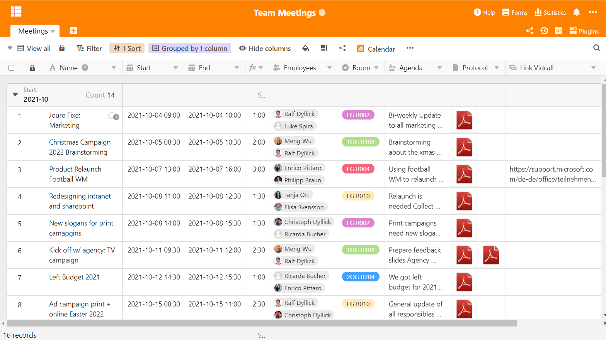
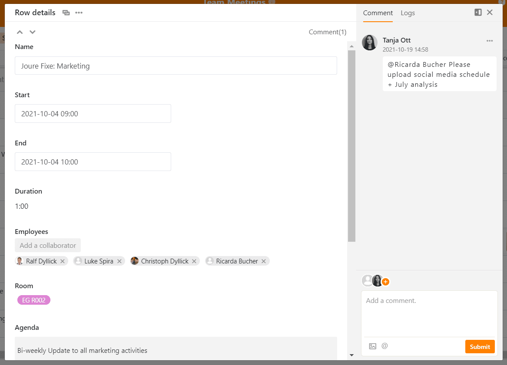
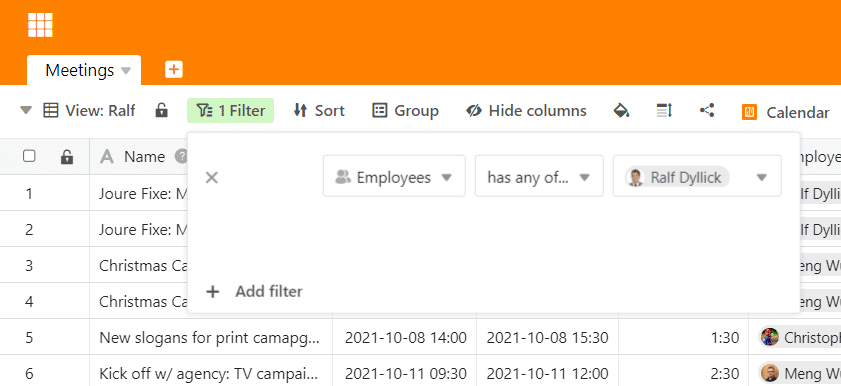
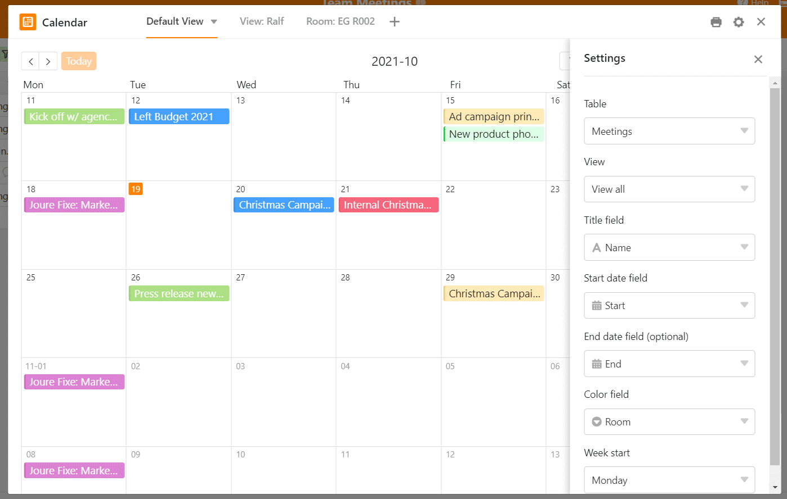

Las reuniones de equipo son una parte esencial de la vida laboral diaria. Hay que coordinar proyectos, aprobar textos y tomar decisiones. Sin una comunicación regular, nada avanza. Por eso las reuniones figuran a menudo en las agendas de los empleados: Pasan [más de 15 horas al mes](https://news.it-matchmaker.com/meetings-zeitverschwendung-statt-erfolgsfaktor/) en reuniones de todo tipo, pero a menudo éstas no son muy productivas en términos de resultados. La falta de eficacia y, por tanto, la pérdida de un valioso tiempo de trabajo puede ser un gran problema para las culturas de reuniones.

Descubra en este artículo cómo puede organizar reuniones de equipo eficaces y contrarrestar el desaprovechamiento de capacidades.

## Reuniones de equipo: devoradores de tiempo necesarios

Las reuniones son importantes para garantizar una comunicación equilibrada y un flujo constante del proyecto que conduzca a resultados satisfactorios. Por tanto, la coordinación periódica dentro del equipo es esencial para que los flujos de trabajo y la colaboración sean fluidos. Pero, ¿por qué las reuniones suelen ser tan improductivas?

Hay varias razones por las que las reuniones de equipo son ineficaces, aparte de las conversaciones triviales y las charlas de café. Estas son las 6 principales de nuestra lista:

1. Nadie sabe de qué se trata.
2. Nadie estaba preparado.
3. Algunos participantes han olvidado la reunión o llegan tarde.
4. Se debaten temas que no tienen cabida en la reunión.
5. Hay una persona que habla demasiado y da monólogos.
6. En la reunión no se fijan [tareas pendientes]() ni se toman decisiones.

Es probable que usted mismo haya experimentado ya alguno de los puntos aquí mencionados. Los puntos 4 a 6 son cosas que puedes regular **con moderación**. Para ello, una persona debe tomar la iniciativa e intervenir en cuanto la conversación deje de centrarse en lo esencial.

Sin embargo, los puntos 1 a 3 son de carácter organizativo, por lo que puedes prevenirlos perfectamente con antelación. Para que todo el mundo tenga claro de qué se va a hablar en una reunión, debes haber definido ya los **objetivos** y el **orden del día** de la reunión de equipo cuando les invites a la reunión.

Sólo con un orden del día pueden los participantes **prepararse** eficazmente para la reunión de equipo o quizá darse cuenta desde el principio de que no tienen nada que aportar al tema que se está tratando. Así se evita perder el tiempo por todos lados. Los objetivos y el orden del día también ayudan a evitar desviarse demasiado del tema y perder el infame **hilo rojo**.

## Planificar y gestionar las reuniones del equipo con SeaTable

Con SeaTable tiene la posibilidad de evitar este problema: Nuestro software es tan flexible que puede utilizarlo para planificar, realizar y documentar reuniones de forma estructurada. Todas las citas, los temas y los participantes pueden consultarse de forma transparente y estructurada en un solo lugar. Esto hace que sus reuniones sean eficaces y fructíferas.

Nuestra solución informática comienza con la agenda y permite una gestión completa y estructurada de las citas y los datos. También se utiliza para la documentación y el seguimiento de las reuniones. A continuación le explicamos exactamente cómo utilizar nuestra plantilla personalizada y qué funciones le esperan.

[Haga clic aquí para ir directamente a la plantilla de las reuniones de equipo]()

En las reuniones, es importante planificar con suficiente antelación el contenido que se va a tratar. Sin preparar el contenido, la reunión es azarosa, caótica y también inútil, porque el objetivo de las reuniones no es sólo llegar a un acuerdo mutuo, sino también avanzar en los proyectos. Deben tomarse decisiones que logren resultados. Si esto no ocurre, la reunión ha fracasado por completo en su propósito.

Con SeaTable dispondrá de un lugar central en el que podrá completar todos los pasos de la planificación. Aquí se pone fecha a las reuniones del equipo, se invita a los participantes a las mismas y se crea un orden del día y tableros de temas por adelantado. Después, el acta de la reunión y otros documentos importantes se almacenan directamente en la mesa para que los compañeros que no puedan asistir puedan conocer los resultados de la reunión. El almacenamiento de las actas también sirve para documentar los pasos del trabajo, las ideas y los acuerdos, de modo que no se pierde nada y se tiene todo en blanco y negro.

Pero ahora desde el principio: Empezamos en la tabla resumen de la plantilla, donde se enumeran las reuniones. Algunos datos importantes ya están introducidos aquí. Introduzca el nombre de la reunión en la primera columna para que todos sepan exactamente de qué se trata. Si es especialmente preciso aquí, muchas preguntas se aclararán de antemano.

## 1\. trabajar en colaboración sobre los temas

Hemos diseñado nuestra plantilla para que sea sencilla y directa. En una tabla encontrará todos los parámetros importantes para planificar y celebrar reuniones. En el primer paso, defina un título conciso y significativo para la reunión, como "Lluvia de ideas para la campaña de Navidad de 2022". De este modo, todos los participantes invitados ya saben de qué va la reunión.

En el siguiente paso, puede utilizar la columna de fecha para determinar qué día y a qué hora debe comenzar la reunión y cuándo debe terminar. La siguiente columna de fórmulas calcula automáticamente la duración de la reunión para que todos sepan de un vistazo cuánto tiempo tienen para planificar. En la columna "Empleados", especifique todos los empleados que deben participar en la reunión. Todos los empleados recibirán entonces una notificación automática, que explicamos con más detalle a continuación.

El siguiente paso es determinar la sala en la que tendrá lugar la reunión. Las salas están claramente separadas por colores para que sea fácil ver dónde se reúnen. La siguiente columna muestra una parte especialmente importante de la preparación y el seguimiento: El orden del día. Dado que SeaTable es también una base de datos, todos los temas, archivos y actas pueden almacenarse directamente en el lugar y editarse de forma sincronizada. Todos los usuarios autorizados pueden trabajar en Base con otros usuarios al mismo tiempo y, por ejemplo, introducir temas importantes.

En la columna de la agenda, todos los usuarios pueden introducir sus temas por adelantado y así nombrar los puntos importantes que se van a tratar en la reunión. Al mismo tiempo, la agenda también funciona como una ayuda para el protocolo o incluso como un protocolo en su totalidad: Porque todos los cambios en ella se muestran inmediatamente a los demás participantes en sus ordenadores portátiles cuando han abierto Base. Trabajar en colaboración sin provocar un lío de versiones de archivos es un enorme alivio en el trabajo diario y simplifica la complejidad, especialmente en los procesos de coordinación.

El orden del día también ayuda a preparar la reunión como corresponde. Un vistazo rápido es suficiente para informarse sobre los temas y quizás buscar información o archivos que se necesitarán más adelante. También ayuda al seguimiento y a la creación de actas que se pueden cargar posteriormente en la columna de archivos. Esto es útil para todos aquellos que no pudieron asistir a la reunión o que quieren volver a leer algo.

### La función de chat facilita la comunicación

La [función de chat]() en cada fila, es decir, en cada reunión individual del equipo, permite una comunicación sencilla y ágil que hace superfluos los correos electrónicos. Cuando se abre una línea (haciendo clic en las pequeñas flechas azules a la izquierda de la línea), se abre una vista general de la reunión. A la derecha está el chat, en el que puede añadir fácilmente a los miembros del personal y escribir mensajes importantes, como que el miembro del personal Müller debería subir la presentación provisional con la revisión anual.

El miembro del personal etiquetado recibe una notificación automática por correo electrónico sobre el mensaje de chat y entonces puede simplemente responder a él en el propio chat. De este modo, se pueden aclarar las preguntas con antelación, recoger materiales o intercambiar otra información importante. Todo se recoge de forma transparente y comprensible para que todo el mundo esté de acuerdo y las responsabilidades estén claramente delimitadas.

Con SeaTable, puedes organizar todas las reuniones de tu equipo en una ubicación central.

## 2\. vista de la reunión personal para el personal

La creación de diferentes vistas es una de las ventajas prácticas de SeaTable sobre otras hojas de cálculo.

Cree tantas vistas como quiera y diséñelas exactamente como necesite los datos en ese momento. Los ajustes de la vista original no cambian. Un conjunto de datos, pero cientos de opciones de visualización: Eso es posible con SeaTable.

En nuestro ejemplo, hemos creado una vista separada para cada empleado y hemos definido con la regla de filtro que sólo se muestren aquellas citas en las que, por ejemplo, también aparezca el Sr. Müller. Así sabe qué reuniones se avecinan y cómo tiene que prepararlas. Él mismo puede diseñar, filtrar, agrupar y ordenar la vista de la forma que más le convenga.

Las vistas siguen siendo importantes para el complemento del calendario y se necesitan inmediatamente. Si crea una vista para cada habitación, por ejemplo

## 3\. todas las reuniones del equipo de un vistazo: Con el plugin de calendario

SeaTable también está equipado con un complemento de calendario. Aquí se pueden integrar citas de cualquier tipo para mantener una buena visión de conjunto. Para la vista general de la reunión, sólo tiene que seleccionar esta vista en el plugin de calendario y configurar todos los parámetros para que se adapten a sus necesidades.

Por ello, hemos clasificado las salas en columnas de selección única, ya que aquí podemos establecer diferentes colores por sala. En el complemento de calendario, esto tiene la ventaja de que las diferentes reuniones de equipo pueden mostrarse exactamente en el mismo color que el esquema de colores de la sala. Por ejemplo, si desea crear otra reunión a la misma hora el 20.10., verá directamente que no puede tener lugar en la sala de reuniones azul.

Las vistas creadas se utilizan ahora en el complemento. Para ello, basta con seleccionar la vista del miembro del personal o de la sala que se va a mostrar en el calendario. De este modo, cada miembro del personal tiene también su propia vista de calendario en la que se introducen todas sus reuniones. Lo mismo ocurre con la vista de la sala: con un filtro, la vista de la sala EG R002 sólo muestra las reuniones que tienen lugar en esta sala. Para encontrar una sala libre cuando se planifica una reunión, se puede crear una cita y reservarla directamente a través de la vista.

Esto significa que ya no hay citas duplicadas y que todo el mundo tiene un punto de contacto visual para las citas.

## 4\. notificaciones automáticas directamente en la bandeja de entrada

Como se ha mencionado anteriormente, las reglas de notificación de SeaTable son una solución ideal para simplificar la comunicación y reducir el número de correos electrónicos enviados. Así se ahorra tiempo y se protege la bandeja de entrada del correo electrónico, que ya está bien llena. Hemos creado dos reglas de notificación: La primera informa a todos los miembros invitados de que han sido añadidos a una reunión de equipo. Con un solo clic, pueden ir directamente a la Base e informarse sobre la reunión.

La segunda regla es una notificación de recordatorio fijada con una fecha límite. Un día antes del inicio de la reunión de equipo (seleccionable con la columna "Inicio"), se envía una notificación a todos los miembros invitados para que no olviden la reunión. Se envía una sola notificación, pero también puedes establecer notificaciones cada hora, por ejemplo. Esto recuerda a todos la próxima reunión y les permite preparar todos los temas con tiempo.

## Gestione todas las reuniones de equipo en un solo lugar con SeaTable

Como puedes ver: Con SeaTable, organizar y llevar a cabo reuniones no es un truco de magia. La preparación óptima se consigue mediante las reglas de notificación, las vistas personalizadas, la función de chat y la agenda, mientras que la agenda invita al trabajo colaborativo durante la ejecución. Para el seguimiento, todos los detalles importantes se enumeran y se guardan en Base, de modo que todo puede ser rastreado y leído en cualquier momento. Nunca más te perderás una reunión.

[Pruebe nuestra plantilla]() hoy mismo y [regístrese]() de forma totalmente gratuita.
