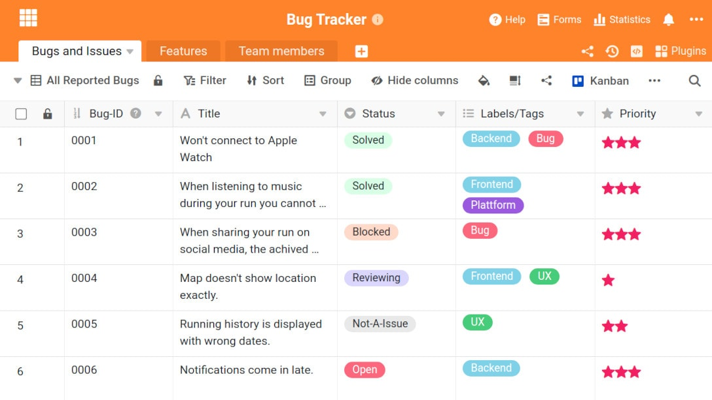

In software development, monitoring and managing bugs and issues can quickly become confusing. Appropriate tools, so-called bug and **issue trackers**, help you to fix bugs quickly and efficiently. Read in this article which programmes can support you in bug management and what the differences are.

## What is the difference between a bug and an issue?

The two terms bug and issue are often used synonymously. At SeaTable we distinguish between the two. We consider a bug to be an error in a programme that has been reported by an employee. Within the development of a software, bugs should be found, prioritised and fixed. A bug tracker is therefore an internal tool that supports software development.

An issue is an error reported by customers. It can be an error in a software programme. But it can also be a missing email or an incorrect debit. The issue tracker brings customers and the internal support team together. The focus is on customer satisfaction.

Both bug and issue trackers manage and monitor errors. With their help, the process is clearly documented. Several people can collaborate on individual projects across departments and locations very easily.

## What are the advantages of bug and issue tracker software?

Why should you think about introducing bug or issue tracker software?

Essentially, there are the following five reasons for this:

1. **Easy collaboration for distributed teams**: In bug and issue tracking, employees from different departments come together - e.g. customer service, the development team and project managers. In a bug or issue tracker, everyone involved has access to the areas they need. Tasks can also be delegated and assigned to those responsible. Dynamic communication between departments becomes possible.
2. **Keeping an overview**: The bug or issue tracker programme enables monitoring of all actions related to an issue. If customer service needs information about an issue, they can view it. A project manager from software development can check which bugs are doing extra rounds and where processes can be improved.
3. **Centralised troubleshooting**: If all bugs and/or issues are stored in a database, this makes troubleshooting easier. You can fix problems faster.
4. **Comprehensive error history**: The error history in the bug or issue tracker software can be used to identify correlations and improve processes. Analyses can be carried out on the basis of the data and new errors can be solved more quickly.
5. **Automatic notification and reminder**: Existing automatisms in the bug and issue tracker programmes make it easier to manage and fix bugs. Employees are automatically informed about new tasks, for example. Software developers can set up email notifications to meet deadlines.

Now let's move on to the bug and issue tracker solutions.

## What bug and issue tracker solutions are available?

In the following, you will get to know five bug and issue tracker programmes in comparison. Let's start with an open source software.

### WebIssues - the issue tracker freeware

With [WebIssues](https://webissues.mimec.org/) it is possible to document, track and share errors. You have the possibility to set different attributes, leave comments and save data attachments.

**Advantages**  
A version translated into German by the community is available under Crowdin. You can also test the issue tracker on a demo server before installing it.

**Disadvantages**  
There is no support to help you with problems or adjustments.

### Bird Eats Bug - Bug- and Issuetracker in German

A bug and issue tracker in German is the programme Bird Eats Bug. The software-as-a-service start-up was founded in Berlin in 2020 and aims to improve the reporting of technical errors. Both a free, limited version and a business version for $8 per user per month are available.

**Advantages**  
[Bird Eats](https://birdeatsbug.com/) Bug produces detailed, sharable bug reports in a short time. No programming skills are needed to document the bugs. Your data is also stored on servers in the EU.

**Disadvantages**  
You can only use the bug and issue tracker as a SaaS solution and not hosted independently.

### Jira - the complex bug and issue tracker programme

[Jira](https://www.atlassian.com/de/software/jira) is a [project management tool](https://seatable.io/en/projekt-management-tool/) that is also suitable for bug and issue tracking. Bugs are arranged in lists and visible on a Kanban board for each project. You can get the solution for free as a limited version, for $7.50 in the standard version and for $14.50 per user per month in the premium version.

Issuetracker © tippapatt / adobe stock

**Advantages**  
Jira originates from software development. Developers in particular will find everything they need for reporting bugs and issues.

**Disadvantages**  
In Jira, a distinction is made between the backlog and sprints in accordance with the Scrum method. Only tasks that belong to the sprint, i.e. are currently being processed, appear on the board. This must be taken into account when processing errors. Furthermore, the [large range of functions in Jira](https://seatable.io/en/jira-alternativen/) can be [a disadvantage](https://seatable.io/en/jira-alternativen/) if you do not need all the functions and the programme becomes too confusing.

### Enablon - a solution from incident management

[Enablon](https://www.capterra.com.de/software/152820/safety-incident-management-software) does not only function as a bug and issue tracker. The programme was developed as a complete incident management lifecycle software. Workplace incidents or complaints can also be documented and processed alongside software bugs. Prices for the software are available on request.

**Advantages**  
One advantage of Enablon is that employees can report problems in the mobile app even when they are offline. In addition, correlations between incidents are recognised via artificial intelligence.

**Disadvantages**  
A disadvantage mentioned by users is that reports in the software are not easy to create and understand.

### SeaTable - the intelligent list solution

Like Bird Eats Bug,[SeaTable](https://seatable.io/en/) is a company from Germany. In addition to bug and issue tracking, SeaTable also offers practical support for other business areas. For example, [project management](https://seatable.io/en/projektmanagement-methoden-im-ueberblick/) can also be mapped with SeaTable. Choose between a free version, the Plus version for €7 or the Enterprise version for €14 per user per month.

**Advantages**  
SeaTable is available as a flexible, simple low-code SaaS in the cloud, on a dedicated server, or as a self-hosted on-premises solution. A simple but efficient design facilitates defect capture and management. In addition, you can flexibly adapt the table to your needs: A new column, e.g. for users where the bug occurs, is added in no time - as is the web form for reporting issues. Automations and notifications make it very easy to create processes for bug tracking. The setup is ready in a few minutes: Load template, publish web form and off you go. With built-in reporting through individual dashboards, you can keep an eye on everything afterwards.

**Disadvantages**  
Bugs and issues are reported via a web form, there is no app for mobile devices.

## How bug and issue tracking works with SeaTable

Let's take a look at how capturing and managing errors works with SeaTable.

In SeaTable, there is a [template for bug tracking that](https://seatable.io/en/vorlage/hlbtvqrtscqmhx3adh5asg/) can be used by any user free of charge. Staff members enter the bugs here via a [web form](https://seatable.io/en/docs/handbuch/seatable-nutzen/webformulare/). The bugs then appear automatically in a so-called [base](https://seatable.io/en/docs/handbuch/seatable-nutzen/bases/), where they can be processed by the responsible staff members.

Issuetracker © SeaTable

In the first table you can adjust the priority and status of the error. An assignment to a specific feature and a staff member for further processing is also possible. You can filter the view according to the following criteria and thus quickly find the relevant information:

- Priority
- Open bugs
- Active bugs
- Blocked bugs
- Bugs according to responsible employee

Now you can click on the second tab in the menu bar to get to the second table. This is used to assign bugs to one or more higher-level functions. It also contains statistics functions that show you which functions are particularly buggy. Have it displayed:

- Number of bugs per employee
- Average processing time
- Proportion of solved to open bugs
- Bugs per milestone or theme

In the third table of the bug and issue tracker template, you keep an eye on your team. Here, everything revolves around information such as the email address, the team membership of the employees or how many and which bugs they are working on.

Finally, you will find the notifications under the three points at the top right in SeaTable. Here you have the option of setting automatic notifications.

## Conclusion

Bug and issue tracker software helps companies monitor, manage and resolve issues in different departments.

Issuetracker © monticellllo / adobe stock

Try our [free template for bug tracking](https://seatable.io/en/vorlage/hlbtvqrtscqmhx3adh5asg/) and benefit from the intelligent list solution in other areas as well.

Image source Cover image: © REDPIXEL/Adobe Stock
