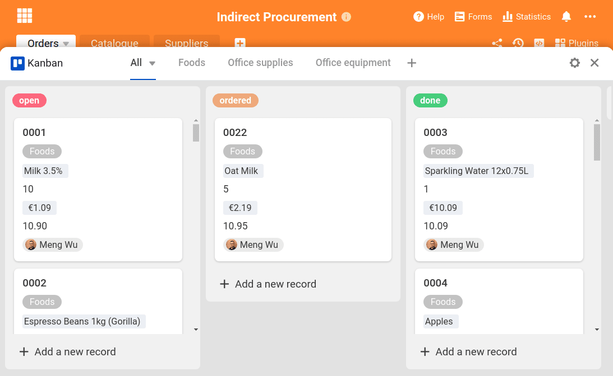

In jedem Unternehmen ist er in irgendeiner Art und Weise vorhanden: indirekter Einkauf. Er umfasst die Beschaffung, Bestellung und das komplette Management aller Güter und Waren, die nicht weiterverkauft werden, sondern im Unternehmen verbleiben und für die internen Abläufe der Büroorganisation benötigt werden. Typische Beispiele für indirektes Material sind:

- Arbeitsmittel wie Kugelschreiber, Bleistifte, Notizbücher
- Büroequipment, z. B. Druckerpapier oder Druckerpatronen
- sämtliche Lebensmittel für die Büroküche
- Büroausstattung wie Stühle oder Schränke
- IT-Geräte wie Notebooks oder Computer

Untersuchungen zeigen, dass der indirekte Einkauf zwischen [15 und 30 % der internen Ausgaben](https://www.wlw.de/de/inside-business/praxiswissen/einkaeufer-ratgeber/indirect-procurement-verdient-viel-mehr-aufmerksamkeit) verursachen kann.

Gleichzeitig wird dem indirekten Einkauf üblicherweise viel weniger Aufmerksamkeit geschenkt, im Gegensatz zum direkten Einkauf, bei dem viel Aufwand zur Optimierung und Kostenersparnis getrieben wird.

Die Herausforderung in jedem Unternehmen ist es, dass indirekte Material effizient und kostengünstig zu beschaffen. Zum einen müssen Verbrauchsgegenstände wie Stifte, Kaffeebohnen und Druckerpapier rechtzeitig nachbestellt werden, bevor sie verbraucht sind. Das sind Arbeitsmittel, die dem täglichen Bedarf unterliegen und daher immer einen Vorrat benötigen. Zum anderen müssen manche Posten separat und auf Anfrage bestellt werden, wie zum Beispiel Computer, Noise Cancelling Earphones oder EDV Kabel. Die Lösung für einen reibungslosen Prozess: Eine zentrale Büroorganisation aller interner Warenbestellungen über SeaTable!

Mit SeaTable haben Sie alle wichtigen Informationen, Produkte und Bestellungen an einem Ort. Hier erstellen Sie einen eigenen Produktkatalog für Ihren internen Einkauf, nehmen Bestellungen via Webformular auf und führen Bestellungen mit einem Klick aus. Sie müssen dabei nicht bei null anfangen, sondern können direkt mit unserem [Template]() aus dem Bereich Operations starten.

## Indirekter Einkauf: Behalten Sie die Übersicht

Unser Template besteht aus drei Tabellen, die alle miteinander zusammenhängen und sich gegenseitig Informationen zuspielen. Die erste Tabelle ist die Grundlage für das Webformular, das Ihre Mitarbeiter für alle Bestellungen nutzen können. Die zweite Tabelle besteht aus einem ausführlichen Produktkatalog, der alle Waren beinhaltet, die im Unternehmen für interne Zwecke benötigt werden – von Bleistiften bis hin zur Computermaus. Die dritte Tabelle beinhaltet alle Lieferanten der Güter mit den wichtigen Kontaktdaten. **Mit diesen drei Stellschrauben** wird Ihre Büroorganisation sehr bald ein Leichtes werden.

Dass alle Tabellen miteinander verbunden sind, ist mit den verknüpften Spalten möglich. Dieses praktische Feature vereinfacht die Datenorganisation innerhalb einer Base: Daten, die in jeder Tabelle benötigt werden, wie etwa der Preis eines Produkts, können in einer Tabelle angelegt und in allen anderen Tabellen ausgespielt werden. Ändert sich der Preis in der Ursprungstabelle, so ändert er sich durch die Verknüpfung auch in allen anderen Tabellen. So müssen Informationen nicht mehrfach eingetragen werden, sondern regulieren sich selbst!

In dieser Tabelle kommen damit viele Informationen zusammen: Die Spalten “Product”, “€” für den Preis, “Email” und “Art.No.” für die Artikelnummer ziehen ihre Daten alle aus den restlichen zwei Tabellen, die dort im Original stehen. So kann ein Dateneintrag an mehreren Stellen sinnvoll und gleichwertig verwendet werden.

## Waren bestellen mit dem integrierten Webformular

Die Tabelle bietet mit ihren Spalten gleichzeitig die Basis für das integrierte [Webformular]() für Ihre Büroorganisation. Für eine Bestellung von internem Material wählen die Mitarbeiter ein Produkt aus der Liste aus – das ist die verknüpfte Spalte “Products” aus dem Produktkatalog (Tabelle 2). Danach geben sie nur noch die Menge an und in welcher Abteilung sie tätig sind, damit die Bestellungen übersichtlich bleiben.

Jedes abgeschickte Formular landet umgehend in der Base und wird als neue Zeile angelegt. Die Mitarbeiter müssen relativ wenige Angaben machen, obwohl in der Tabelle selbst sehr viele Informationen hinterlegt sind. Hier kommen die verknüpften Spalten ins Spiel.

> **Für Profis:** Durch die verknüpften Spalten können auch die verknüpften Formelspalten erstellt werden, die zum Beispiel die Werte einer bestimmten Zeile wiedergeben, zusammenrechnen oder den Maximalwert ausgeben. Mit einer neuen Eintragung in der Bestellliste und der Auswahl eines Produkts werden automatisch auch Eigenschaften dieses Produkts, wie zum Beispiel die Kategorie, die Artikelnummer und der Preis des Produkts.

Hier muss also kein manuelles Zuordnen der Informationen erfolgen; sie werden einfach aus den anderen Tabellen entnommen und hier wiedergegeben. Aus der Tabelle “Suppliers” wird die Email-Adresse der entsprechenden Lieferanten der Waren herausgezogen. Diese wird für den Bestellprozess später noch gebraucht. Kein lästiges Übertragen von Daten mehr – SeaTable regelt dies alles bereits automatisch für Sie und erleichtert Ihnen die Büroorganisation enorm.

## Automatische Regeln: Vereinfachen, automatisieren, benachrichtigen

Damit Ihre Büroorganisation noch besser und intelligenter wird, haben wir mit unseren Automatisierungsregeln und Benachrichtigungsregeln gearbeitet. Diese Regeln automatisieren Prozesse zu bestimmten Bedingungen und benachrichtigen Mitglieder in Ihrem Team bei entsprechenden Ereignissen, die Sie in den Regeln selbst festlegen.

Mit einer ersten Regel haben wir festgelegt, dass bei jeder neu angelegten Zeile in Tabelle 1 (“Orders”) automatisch bei der Spalte “Status” die Option “open”, also offen, festgelegt wird. Das heißt, dass jede Bestellung direkt als offen markiert wird und so alle Bearbeiter wissen, dass diese noch nicht erledigt ist.

Die anderen Automatisierungsregeln weisen in unserer Vorlage jede Bestellung automatisch dem richtigen Bearbeiter zu. Das funktioniert folgendermaßen:

1. Als Bedingung muss ausgewählt werden, dass bei jeder neu hinzugefügten Zeile bei folgender Bedingung eine Aktion geschieht. Das ist dann der Trigger, der die Aktion auslöst.
2. In unserem Beispiel hier rechts wird die Aktion ausgelöst, wenn die Kategorie “Foods” ist.
3. Die darauf folgende Aktion ist, dass dann in der Spalte “Bearbeiter” ein bestimmter Mitarbeiter eingetragen wird.

Sobald eine Bestellung eingeht, in der zum Beispiel Äpfel bestellt werden, erkennt SeaTable durch die verknüpften Spalten, dass die zugehörige Kategorie “Foods” ist und trägt mit der Automatisierungsregel dann automatisch den richtigen Bearbeiter ein. Das ist besonders für die nächste Regel wichtig: Die Benachrichtigungsregel.

Diese Regel benachrichtigt alle Beteiligten darin automatisch per Mail, falls es Neuerungen gibt. Durch die Spezifikation der Automatisierungsregel (wir haben für jede Kategorie eine Regel erstellt) erhalten dann auch nur die Bearbeiter eine Benachrichtigung, wenn genau ihre Kategorie bei der Bestellung beansprucht wird. So werden die anderen Kollegen nicht mit nervigen Emails belästigt, die gar nicht ihren internen Einkauf betreffen.

## Indirekter Einkauf: Mit einem Klick Bestellungen weiterleiten

Mit SeaTable haben Sie auch die Möglichkeit, mit nur einem Klick automatisierte Emails zu verschicken. Das ist nicht nur im internen Einkauf sehr hilfreich. Dafür müssen Sie zuerst Ihr Email-Konto in Ihre Base einbauen. Das geht über die drei Punkte oben rechts -> Einstellungen -> Drittanbieter. Hier können Sie Ihr Email-Konto gemäß den Angaben Ihres Email-Anbieters hinzufügen. Ist dieser Schritt geschafft, so können Sie mit der Schaltflächen-Spalte eine Schaltfläche zum Versenden von Emails erstellen.

Das geht folgendermaßen:

1. Spalte erstellen und Aktion “Email versenden” auswählen
2. Eingebundenes Email-Konto wählen, von dem die Mail verschickt werden soll
3. Betreff, Email Text und Empfänger wählen

> **Für Profis:** Sie können dabei mit Nasenklammern direkt Spalteninhalte wiedergeben, was besonders bei der Email-Adresse sehr wichtig ist. Mit {Email} beziehen wir uns in unserer Vorlage auf die zuvor eingefügte Email-Adresse der Lieferanten, die aus Tabelle 3 gezogen wird. Die Inhalte aus Spalten können Sie auch im Betreff und dem Text der Email benutzen, wie etwa den Produktnamen und die Menge der bestellten Güter (also etwa: “Wir möchten das Produkt {Product} mit der Menge {Amount} bestellen”). Auf diese Weise vereinfachen Sie Ihre Büroorganisation ungemein, da Sie keine manuellen Emails mehr schreiben müssen, in der alle Bestellungen mühsam übertragen werden müssen.

## Individuelle Ansichten und Kanban sorgen für mehr Überblick

SeaTable wäre keine optimale Lösung für die Büroorganisation, wenn es nicht auch für die Aufgabenverwaltung eine übersichtliche und praktische Funktion parat hätte. Zum einen erstellen wir verschiedene [Ansichten]() für jeden Bearbeiter, damit nur die für ihn jeweiligen Bestellungen sichtbar sind. Denn ein Bearbeiter für Büroequipment muss die Bestellungen für Lebensmittel nicht sehen. Das geht über einen Klick auf den kleinen Pfeil links oben, in unserem Beispiel mit “View all” betitelt.

Mit einem Filter werden die entsprechenden Personen, für die die Ansicht gedacht ist, eingestellt. Somit werden nur noch die Bestellungen angezeigt, die auch einem selbst zugehörig sind – das hilft, den Überblick zu wahren und seine eigenen Aufgabenbereiche im Blick zu behalten. Die Ansichten sind allerdings auch die Grundlage für das Kanban-Plugin.

Mit dem Kanban-Plugin vereinfachen Sie Ihre Aufgabenverwaltung und bleiben immer im Flow. Das Plugin basiert auf den Spalten in der Tabelle und gibt diese in gewohnter Kanban-Optik wieder. Um jedem Bearbeiter auch hier seinen eigenen Arbeitsbereich zu geben, haben wir für jeden Mitarbeiter ein eigenes Kanban-Board erstellt. Hierfür wird die jeweilige Ansicht aus der Tabelle “Orders” ausgewählt.

Individualisieren Sie sich Ihr Board genau so, wie Sie es benötigen. Durch das Aktivieren von Spalten wird in den Bestellungen der jeweilige Wert angezeigt, der für die Bestellung gilt. Per Drag-and-Drop können Sie die Angaben in den Kanban-Karten nach Ihrer Wunsch-Reihenfolge ändern.

## Verknüpften Spalten: Synergien nutzen

Wir haben oben bereits erklärt, wie wertvoll die verknüpften Spalten in SeaTable zur Datenorganisation sind. In unserem Non-Resale Management ist es besonders praktisch, da Produktdaten und Herstellerdaten direkt in das Webformular für die Bestellungen integriert werden können, ohne diese Daten nochmals extra hinterlegen zu müssen. **Es gibt eine zentrale Datenquelle** – diese kann endlos oft durch die verknüpften Spalten und die “Formel für Verknüpfungen”-Spalte in anderen Tabellen ausgeschöpft werden. Der Vorteil daran ist, dass Änderungen im Ursprung auch automatisch auf alle verknüpften Werte übertragen werden.

In der zweiten Tabelle findet sich der komplette Produktkatalog der Büroorganisation. Nur Produkte, die hier hinterlegt sind, können von der Belegschaft auch bestellt werden. Daher ist es wichtig, dass auch alle Produkte in der Liste sind – sobald neue Produkte hinzukommen, werden diese hier mit eingepflegt und sind danach sofort für eine Bestellung verfügbar.

Auch in dieser Tabelle werden Informationen aus anderen genutzt. Die Bestellnummern etwa stammen aus der Tabelle “Orders” und die Lieferanten und deren Email-Adresse stammen aus der dritten Tabelle “Suppliers”. Auch hier werden wieder die verknüpften Spalten genutzt, um den Organisationsaufwand zu gering wie möglich zu halten. Die Spalte “€” in dieser Tabelle gibt die Produktpreise laut Liste wieder und ist dabei maßgeblich für die Berechnung der Preise der Bestellungen.

## Indirekter Einkauf: mit SeaTable effizient und kostensparend managen

Die Büroorganisation und gerade die Bestellung von internen Waren kann schnell zur Nebensächlichkeit werden, dabei ist sie wichtig und hält den Betrieb aufrecht. Die Vorlage in diesem gezeigten Blogbeitrag finden Sie direkt in SeaTable. Wählen Sie beim anlegen einer neuen Base einfach die Option: _Mit Vorlage starten_ und Sie finden diese Vorlage im Bereich **Operations**.

Mit SeaTable haben Sie ein starkes Tool an Ihrer Seite, das Sie in diesem und vielen anderen Prozessen exzellent unterstützen kann. Sie können Beispielsweise Ihr [CRM-Angebotsmanagement](?lang=auto) damit organisieren oder [interne Workshops damit planen]().

Probieren Sie unser Template aus und [registrieren Sie sich]()! SeaTable ist in der Basis-Version kostenlos.
