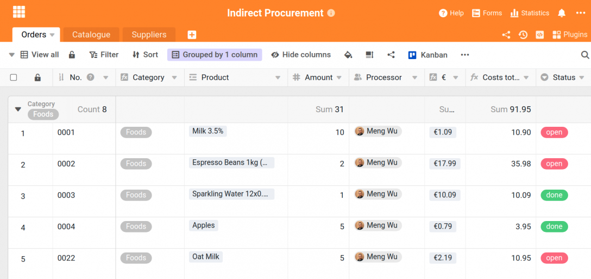
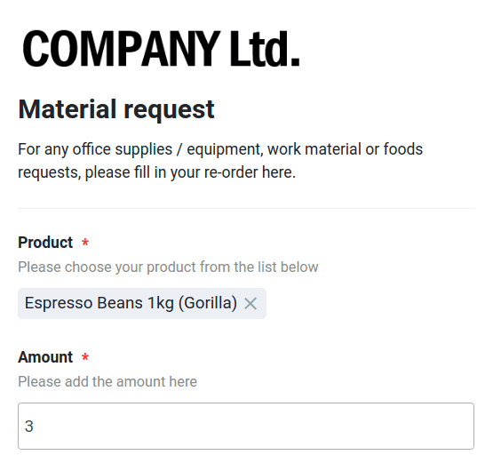
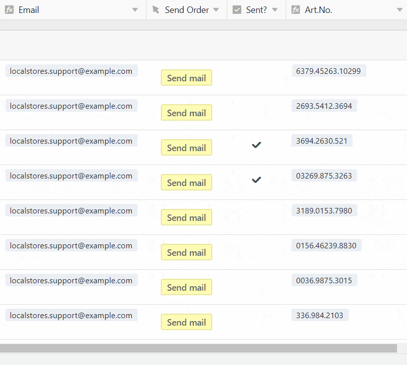
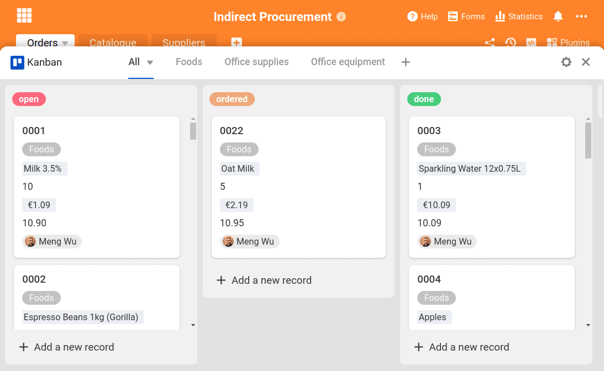
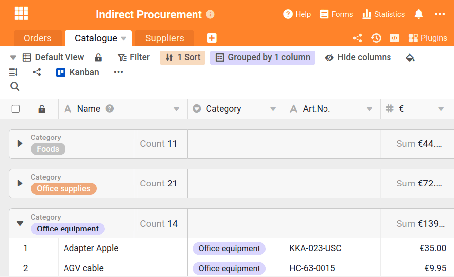

Il est présent dans chaque entreprise d'une manière ou d'une autre : les achats indirects. Il comprend l'approvisionnement, la commande et la gestion complète de tous les biens et marchandises qui ne sont pas revendus, mais qui restent dans l'entreprise et sont nécessaires pour les processus internes de l'organisation de bureau. Voici des exemples typiques d'achats indirects :

- Outils de travail tels que stylos, crayons, carnets de notes
- Matériel de bureau, par exemple papier ou cartouches d'imprimante
- tous les aliments pour la cuisine du bureau
- Équipement de bureau comme les chaises ou les armoires
- les équipements informatiques tels que les ordinateurs portables ou les ordinateurs

Des études montrent que les achats indirects peuvent représenter [entre 15 et 30 % des dépenses internes](https://www.wlw.de/de/inside-business/praxiswissen/einkaeufer-ratgeber/indirect-procurement-verdient-viel-mehr-aufmerksamkeit).

Parallèlement, on accorde habituellement beaucoup moins d'attention aux achats indirects, contrairement aux achats directs, pour lesquels de nombreux efforts sont consentis en vue d'optimiser et de réduire les coûts.

Le défi de toute entreprise est de se procurer le matériel indirect de manière efficace et économique. D'une part, les consommables tels que les stylos, les grains de café et le papier d'imprimante doivent être commandés à temps, avant d'être épuisés. Ce sont des outils de travail soumis aux besoins quotidiens et qui nécessitent donc toujours un stock. D'autre part, certains postes doivent être commandés séparément et sur demande, comme par exemple les ordinateurs, les écouteurs antibruit ou les câbles informatiques. La solution pour un processus sans faille : une organisation bureautique centralisée de toutes les commandes internes de marchandises via SeaTable !

Avec SeaTable, vous avez toutes les informations importantes, les produits et les commandes au même endroit. Vous y créez votre propre catalogue de produits pour vos achats internes, prenez des commandes via le formulaire web et effectuez les commandes en un seul clic. Vous n'avez pas besoin de partir de zéro, vous pouvez commencer directement avec notre [modèle de]() la section Opérations.

## Achats indirects : gardez une vue d'ensemble

Notre modèle se compose de trois tableaux qui sont tous liés entre eux et se transmettent mutuellement des informations. Le premier tableau est la base du formulaire web que vos collaborateurs peuvent utiliser pour toutes leurs commandes. Le deuxième tableau est un catalogue de produits détaillé qui contient toutes les marchandises nécessaires à l'entreprise à des fins internes, des crayons à la souris d'ordinateur. Le troisième tableau contient tous les fournisseurs des biens avec les coordonnées importantes. **Avec ces trois leviers**, l'organisation de votre bureau deviendra très vite un jeu d'enfant.

Le fait que tous les tableaux soient reliés entre eux est possible grâce aux colonnes liées. Cette fonction pratique simplifie l'organisation des données au sein d'une base : Les données qui sont nécessaires dans chaque table, comme le prix d'un produit, peuvent être créées dans une table et diffusées dans toutes les autres tables. Si le prix change dans la table d'origine, il change également dans toutes les autres tables grâce à la liaison. Ainsi, les informations ne doivent pas être saisies plusieurs fois, mais se règlent d'elles-mêmes !

De nombreuses informations sont ainsi rassemblées dans ce tableau : Les colonnes "Product", "€" pour le prix, "Email" et "Art.No." pour le numéro d'article tirent toutes leurs données des deux autres tableaux qui s'y trouvent en original. Ainsi, une entrée de données peut être utilisée de manière judicieuse et équivalente à plusieurs endroits.

## Commander des marchandises avec le formulaire web intégré

Avec ses colonnes, le tableau offre en même temps la base du [formulaire web](https://seatable.io/fr/docs/handbuch/seatable-nutzen/webformulare/) intégré pour l'organisation de votre bureau. Pour une commande de matériel interne, les collaborateurs choisissent un produit dans la liste - c'est la colonne liée "Products" du catalogue de produits (tableau 2). Ensuite, ils n'ont plus qu'à indiquer la quantité et le service dans lequel ils travaillent pour que les commandes restent claires.

Chaque formulaire envoyé atterrit immédiatement dans la base et est créé sous forme de nouvelle ligne. Les collaborateurs doivent fournir relativement peu d'informations, bien que la table elle-même contienne beaucoup d'informations. C'est là qu'interviennent les colonnes liées.

> **Pour les professionnels :** grâce aux colonnes liées, il est également possible de créer les colonnes de formules liées qui, par exemple, reproduisent les valeurs d'une ligne donnée, les additionnent ou éditent la valeur maximale. Avec une nouvelle entrée dans la liste de commande et la sélection d'un produit, les propriétés de ce produit, comme par exemple la catégorie, le numéro d'article et le prix du produit, sont également automatiquement affichées.

Ici, il n'est donc pas nécessaire d'attribuer manuellement les informations ; elles sont simplement extraites des autres tableaux et reproduites ici. L'adresse e-mail des fournisseurs des marchandises est extraite du tableau "Fournisseurs". Celle-ci sera utilisée plus tard pour le processus de commande. Plus besoin de transférer les données - SeaTable s'en charge automatiquement pour vous, ce qui facilite grandement l'organisation de votre bureau.

## Les règles automatiques : Simplifier, automatiser, notifier

Pour que votre organisation de bureau soit encore meilleure et plus intelligente, nous avons travaillé avec nos règles d'automatisation et nos règles de notification. Ces règles automatisent les processus à certaines conditions et informent les membres de votre équipe en cas d'événements correspondants, que vous définissez vous-même dans les règles.

Avec une première règle, nous avons défini que pour chaque nouvelle ligne créée dans le tableau 1 ("Orders"), l'option "open", c'est-à-dire ouverte, est automatiquement définie pour la colonne "Status". Cela signifie que chaque commande est directement marquée comme ouverte et que tous les collaborateurs savent ainsi qu'elle n'est pas encore réglée.

Dans notre modèle, les autres règles d'automatisation attribuent automatiquement chaque commande au bon responsable. Cela fonctionne de la manière suivante :

1. Comme condition, il faut choisir que pour chaque nouvelle ligne ajoutée, une action se produise dans la condition suivante. C'est alors le déclencheur qui déclenche l'action.
2. Dans notre exemple ici à droite, l'action est déclenchée lorsque la catégorie est "Foods".
3. L'action qui s'ensuit est qu'un collaborateur donné est alors saisi dans la colonne "Collaborateur".

Dès qu'une commande est reçue, dans laquelle des pommes sont par exemple commandées, SeaTable reconnaît, grâce aux colonnes liées, que la catégorie associée est "Foods" et inscrit alors automatiquement le bon agent avec la règle d'automatisation. Cela est particulièrement important pour la règle suivante : la règle de notification.

Cette règle informe automatiquement par e-mail tous les participants en cas de nouveautés. Grâce à la spécification de la règle d'automatisation (nous avons créé une règle pour chaque catégorie), seuls les collaborateurs reçoivent une notification lorsque leur catégorie est sollicitée dans la commande. Ainsi, les autres collègues ne sont pas importunés par des e-mails agaçants qui ne concernent pas leurs achats internes.

## Achats indirects : transmettre les commandes en un clic

Avec SeaTable, vous avez également la possibilité d'envoyer des e-mails automatisés en un seul clic. C'est très utile, et pas seulement pour les achats internes. Pour cela, vous devez d'abord intégrer votre compte e-mail dans votre base. Cela se fait via les trois points en haut à droite -> Paramètres -> Fournisseurs tiers. Ici, vous pouvez ajouter votre compte e-mail selon les indications de votre fournisseur de messagerie. Une fois cette étape franchie, vous pouvez créer un bouton d'envoi d'e-mails avec la colonne des boutons.

Voici comment procéder :

1. Créer une colonne et sélectionner l'action "Envoyer un e-mail".
2. Choisir le compte de messagerie intégré à partir duquel l'e-mail doit être envoyé
3. Choisir l'objet, le texte de l'e-mail et le destinataire

> **Für Profis:** Sie können dabei mit Nasenklammern direkt Spalteninhalte wiedergeben, was besonders bei der Email-Adresse sehr wichtig ist. Mit {Email} beziehen wir uns in unserer Vorlage auf die zuvor eingefügte Email-Adresse der Lieferanten, die aus Tabelle 3 gezogen wird. Die Inhalte aus Spalten können Sie auch im Betreff und dem Text der Email benutzen, wie etwa den Produktnamen und die Menge der bestellten Güter (also etwa: “Wir möchten das Produkt {Product} mit der Menge {Amount} bestellen”). Auf diese Weise vereinfachen Sie Ihre Büroorganisation ungemein, da Sie keine manuellen Emails mehr schreiben müssen, in der alle Bestellungen mühsam übertragen werden müssen.

## Les vues individuelles et le Kanban donnent une meilleure vue d'ensemble

SeaTable ne serait pas une solution optimale pour l'organisation du bureau si elle n'offrait pas une fonction claire et pratique pour la gestion des tâches. D'une part, nous créons des [vues](https://seatable.io/fr/docs/handbuch/seatable-nutzen/ansichten/) différentes pour chaque agent afin que seules les commandes qui le concernent soient visibles. En effet, un employé chargé de l'équipement de bureau ne doit pas voir les commandes de produits alimentaires. Pour cela, il suffit de cliquer sur la petite flèche en haut à gauche, intitulée dans notre exemple "View all".

Un filtre permet de définir les personnes auxquelles l'affichage est destiné. Ainsi, seules les commandes dont on fait partie sont affichées - ce qui aide à garder une vue d'ensemble et à garder un œil sur ses propres domaines d'activité. Les vues sont toutefois aussi la base du plugin Kanban.

Avec le plug-in Kanban, vous simplifiez la gestion de vos tâches et restez toujours dans le flux. Le plugin se base sur les colonnes du tableau et les reproduit dans l'optique Kanban habituelle. Afin de donner ici aussi à chaque collaborateur son propre espace de travail, nous avons créé un tableau Kanban pour chacun d'entre eux. Pour cela, il suffit de sélectionner la vue correspondante dans le tableau "Orders".

Personnalisez votre planche exactement comme vous le souhaitez. En activant les colonnes, la valeur respective qui s'applique à la commande s'affiche dans les commandes. Par glisser-déposer, vous pouvez modifier les indications dans les cartes Kanban selon l'ordre que vous souhaitez.

## colonnes liées : Utiliser les synergies

Nous avons déjà expliqué plus haut à quel point les colonnes liées de SeaTable sont précieuses pour l'organisation des données. Dans notre gestion hors-vente, c'est particulièrement pratique, car les données sur les produits et les fabricants peuvent être intégrées directement dans le formulaire web pour les commandes, sans avoir à enregistrer ces données à nouveau. **Il existe une source de données centrale** - celle-ci peut être exploitée à l'infini grâce aux colonnes liées et à la colonne "Formule pour les liens" dans d'autres tableaux. L'avantage est que les modifications apportées à la source sont automatiquement répercutées sur toutes les valeurs liées.

Le deuxième tableau contient le catalogue complet des produits de l'organisation de bureau. Seuls les produits qui y sont enregistrés peuvent être commandés par le personnel. Il est donc important que tous les produits figurent dans la liste - dès que de nouveaux produits sont ajoutés, ils sont intégrés ici et sont ensuite immédiatement disponibles pour une commande.

Ce tableau utilise également des informations provenant d'autres tableaux. Les numéros de commande, par exemple, proviennent du tableau "Orders" et les fournisseurs et leur adresse e-mail sont issus du troisième tableau "Suppliers". Ici aussi, les colonnes liées sont utilisées afin de réduire au maximum le travail d'organisation. La colonne "€" de ce tableau indique les prix des produits selon la liste et est déterminante pour le calcul des prix des commandes.

## Achats indirects : gérer efficacement et à moindre coût avec SeaTable

L'organisation du bureau, et notamment la commande de marchandises internes, peut rapidement devenir secondaire, alors qu'elle est importante et permet de maintenir l'activité. Le modèle de cet article de blog se trouve directement dans SeaTable. Lors de la création d'une nouvelle base, il suffit de sélectionner l'option : _Démarrer avec un modèle_ et vous trouverez ce modèle dans la section **Opérations**.

Avec SeaTable, vous disposez d'un outil puissant qui peut vous aider dans ce processus et dans bien d'autres. Vous pouvez par exemple l'utiliser pour organiser votre [gestion des offres CRM](https://seatable.io/fr/crm-angebotsmanagement/?lang=auto), pour [mettre en place une gestion numérique des produits](https://seatable.io/fr/digitales-produktmanagement/?lang=auto) ou pour [planifier des ateliers internes](https://seatable.io/fr/mit-internen-workshops-den-unternehmenswert-steigern/?lang=auto).

Essayez notre modèle et [inscrivez-vous](https://seatable.io/fr/enregistrement/)! SeaTable est gratuit dans sa version de base.
