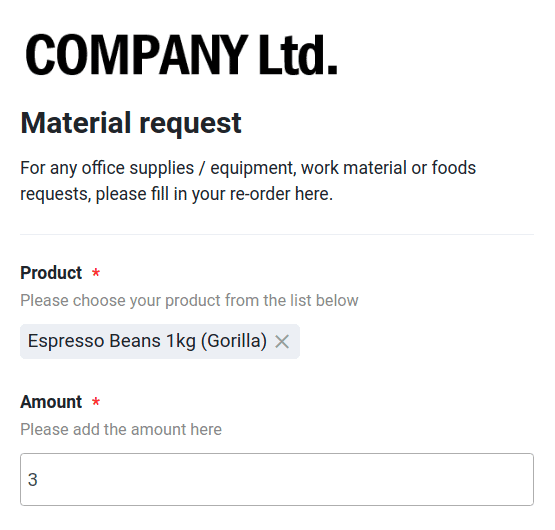
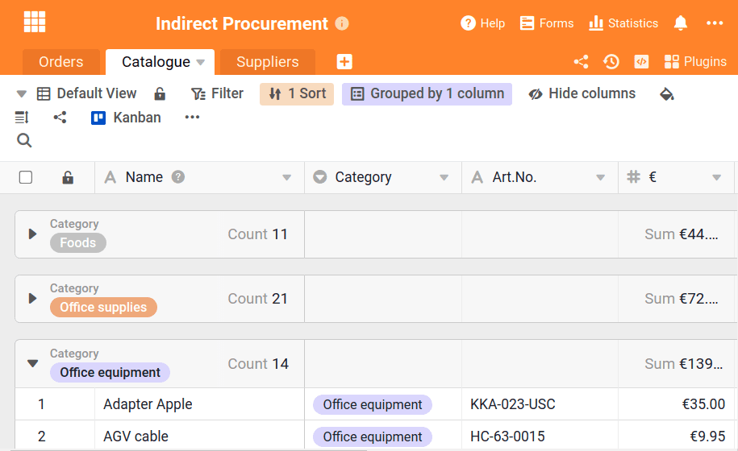

В той или иной мере она присутствует в каждой компании: косвенные закупки. Она включает в себя закупку, заказ и полное управление всеми товарами и товарами, которые не перепродаются, а остаются в компании и необходимы для внутренних процессов офисной организации. Типичными примерами косвенных материалов являются:

- Рабочие инструменты, такие как ручки, карандаши, блокноты
- Офисное оборудование, например, бумага для принтера или картриджи для принтера
- Все продукты для офисной кухни
- Офисное оборудование, например, стулья или шкафы
- ИТ-оборудование, например, ноутбуки или компьютеры

Исследования показывают, что на косвенные закупки может приходиться от [15 до 30% внутренних расходов](https://www.wlw.de/de/inside-business/praxiswissen/einkaeufer-ratgeber/indirect-procurement-verdient-viel-mehr-aufmerksamkeit).

В то же время косвенным закупкам обычно уделяется гораздо меньше внимания, в отличие от прямых закупок, где много усилий направлено на оптимизацию и снижение затрат.

Задача любого предприятия - эффективно и экономически выгодно закупать непрямые материалы. С одной стороны, расходные материалы, такие как ручки, кофейные зерна и бумага для принтера, необходимо своевременно заказывать, пока они не израсходованы. Это рабочие материалы, которые ежедневно пользуются спросом и поэтому всегда нуждаются в поставках. С другой стороны, некоторые товары приходится заказывать отдельно и по требованию, например, компьютеры, наушники с шумоподавлением или IT-кабели. Решение для бесперебойного процесса: организация всех внутренних заказов товаров в центральном офисе с помощью SeaTable!

С помощью SeaTable вся важная информация, продукты и заказы находятся в одном месте. Здесь вы можете создать собственный каталог продукции для внутренних закупок, размещать заказы через веб-форму и выполнять заказы одним щелчком мыши. Вам не нужно начинать с нуля, а можно начать прямо с нашего [шаблона]() из области операций.

## Косвенные закупки: ведите обзор

Наш шаблон состоит из трех таблиц, которые взаимосвязаны и передают информацию друг другу. Первая таблица является основой для веб-формы, которую ваши сотрудники могут использовать для всех заказов. Вторая таблица состоит из подробного каталога продукции, содержащего все товары, необходимые в компании для внутренних целей - от карандашей до компьютерных мышей. В третьей таблице указаны все поставщики товаров с важной контактной информацией. **С этими тремя винтами** организация вашего офиса очень скоро превратится в легкое дело.

То, что все таблицы связаны друг с другом, возможно благодаря связанным столбцам. Эта практичная функция упрощает организацию данных в базе: Данные, которые необходимы в каждой таблице, например, цена продукта, могут быть созданы в одной таблице и воспроизведены во всех остальных таблицах. Если цена изменяется в исходной таблице, она также изменяется во всех других таблицах по ссылке. Таким образом, информация не вводится несколько раз, а регулируется сама собой!

В этой таблице собрано большое количество информации: Колонки "Product", "€" для цены, "Email" и "Art.No." для номера товара черпают свои данные из двух остальных таблиц, которые есть в оригинале. Таким образом, ввод данных можно разумно и одинаково использовать в нескольких местах.

## Заказ товаров с помощью встроенной веб-формы

Благодаря своим колонкам таблица также является основой для интегрированной [веб-формы]() организации офиса. Для заказа внутренних материалов сотрудники выбирают продукт из списка - это связанный столбец "Продукты" из каталога продуктов (табл. 2). После этого они вводят только количество и то, в каком отделе они работают, чтобы заказ оставался понятным.

Каждая отправленная форма немедленно попадает в Base и создается как новая строка. Сотрудникам приходится вводить относительно мало информации, хотя много информации хранится в самой таблице. Именно здесь в игру вступают связанные колонки.

> **Для профессионалов:** Связанные столбцы можно также использовать для создания связанных столбцов формул, которые, например, отражают значения определенной строки, суммируют их или выводят максимальное значение. При новой записи в списке заказов и выборе товара также автоматически отображаются свойства этого товара, такие как категория, номер позиции и цена товара.

Здесь нет необходимости в ручном присвоении информации, она просто берется из других таблиц и воспроизводится здесь. Адрес электронной почты соответствующего поставщика товара берется из таблицы "Поставщики". В дальнейшем он понадобится для оформления заказа. Больше никакой утомительной передачи данных - SeaTable уже позаботился обо всем этом автоматически и значительно упростил организацию вашего офиса.

## Автоматические правила: Упрощение, автоматизация, уведомление

Чтобы сделать организацию вашего офиса еще лучше и умнее, мы разработали правила автоматизации и правила уведомлений. Эти правила автоматизируют процессы при определенных условиях и уведомляют членов вашей команды при наступлении соответствующих событий, которые вы определяете в самих правилах.

С помощью первого правила мы определили, что для каждой вновь созданной строки таблицы 1 ("Заказы") в столбце "Статус" автоматически устанавливается опция "открыт". Это означает, что каждый заказ непосредственно помечается как открытый и, таким образом, все процессоры знают, что он еще не завершен.

Другие правила автоматизации автоматически назначают каждый заказ правильному агенту в нашем шаблоне. Это работает следующим образом:

1. В качестве условия должно быть выбрано, чтобы действие происходило для каждой вновь добавленной строки со следующим условием. Это и есть триггер, который запускает действие.
2. В нашем примере, приведенном справа, действие срабатывает при выборе категории "Продукты питания".
3. Последующее действие заключается в том, что в графу "Агент" вводится конкретный сотрудник.

Как только поступает заказ, в котором, например, заказаны яблоки, SeaTable распознает по связанным столбцам, что соответствующая категория - "Продукты питания", и затем автоматически вводит нужный процессор с помощью правила автоматизации. Это особенно важно для следующего правила - правила уведомления.

Это правило автоматически уведомляет всех участников по электронной почте о любых изменениях. Из-за спецификации правила автоматизации (мы создали правило для каждой категории), только агенты получают уведомление, когда именно их категория заявлена в заказе. Таким образом, другие коллеги не будут беспокоиться о надоедливых письмах, которые не касаются их внутренних закупок.

## Косвенные закупки: пересылка заказов одним щелчком мыши

С помощью SeaTable у вас также есть возможность отправлять автоматические электронные письма одним щелчком мыши. Это очень полезно не только для внутренних закупок. Для этого сначала нужно добавить учетную запись электронной почты в базу. Это можно сделать с помощью трех точек в правом верхнем углу -> Настройки -> Сторонние провайдеры. Здесь вы можете добавить свою учетную запись электронной почты в соответствии со спецификациями вашего поставщика услуг электронной почты. После выполнения этого шага вы можете использовать колонку "Кнопка" для создания кнопки для отправки электронной почты.

Вот как это работает:

1. Создайте столбец и выберите действие "Отправить письмо
2. Выберите интегрированную учетную запись электронной почты, с которой будет отправлено письмо.
3. Выберите тему, текст письма и получателя

**Для профессионалов:** Вы можете использовать носовые скобки для прямого воспроизведения содержимого столбцов, что особенно важно для адреса электронной почты. В нашем шаблоне {Email} ссылается на ранее вставленный адрес электронной почты поставщика, который взят из таблицы 3. Вы также можете использовать содержимое столбцов в теме и тексте письма, например название товара и количество заказываемого товара (например: "Мы хотели бы заказать товар {Продукт} в количестве {Сумма}"). Таким образом, вы значительно упрощаете организацию работы своего офиса, поскольку вам больше не нужно вручную писать электронные письма, в которых все заказы должны быть трудоемко переданы.

## Индивидуальные представления и Kanban обеспечивают лучший обзор

SeaTable не был бы оптимальным решением для организации работы офиса, если бы в нем не было также четкой и практичной функции управления задачами. С одной стороны, мы создаем различные [представления]() для каждого агента, чтобы были видны только те заказы, которые для него актуальны. Например, агенту по оргтехнике не нужно видеть заказы на продукты питания. Это можно сделать, нажав на маленькую стрелочку в левом верхнем углу, в нашем примере под названием "Просмотреть все".

С помощью фильтра устанавливаются соответствующие лица, для которых предназначено представление. Таким образом, отображаются только те заказы, которые также принадлежат самому себе - это помогает поддерживать обзор и держать в поле зрения собственные зоны ответственности. Однако представления также являются основой для плагина Kanban.

Плагин Kanban позволяет упростить управление задачами и всегда оставаться в потоке. Плагин опирается на столбцы таблицы и отображает их в привычном для Канбан виде. Для того чтобы предоставить каждому сотруднику свое рабочее пространство, мы создали для него отдельную доску Канбан. Для этого из таблицы "Заказы" выбирается соответствующее представление.

Придайте вашей доске индивидуальность, соответствующую вашим потребностям. При активации столбцов в заказах отображается соответствующее значение, которое применяется к заказу. Используя функцию drag-and-drop, вы можете изменять информацию в карточках канбан в соответствии с желаемым порядком.

## Связанные колонки: Используйте синергию

Выше мы уже объясняли, насколько ценными для организации данных являются связанные колонки в SeaTable. В нашем управлении неторговыми операциями это особенно удобно, поскольку данные о продукции и производителе могут быть интегрированы непосредственно в веб-форму для заказов без необходимости повторного ввода этих данных. Имеется **центральный источник данных** - его можно бесконечно исчерпывать с помощью связанных столбцов и столбца "формула для ссылок" в других таблицах. Преимуществом этого является то, что изменения в источнике также автоматически переносятся на все связанные значения.

Вторая таблица содержит полный каталог продукции офисной организации. Персонал может заказать только те продукты, которые хранятся здесь. Поэтому важно, чтобы все продукты были в списке - как только добавляются новые продукты, они вносятся сюда и сразу же становятся доступными для заказа.

В этой таблице также используется информация из других таблиц. Например, номера заказов поступают из таблицы "Заказы", а поставщики и их электронные адреса - из третьей таблицы "Поставщики". Опять же, связанные столбцы используются для того, чтобы максимально снизить организационные усилия. Столбец "€" в этой таблице показывает цены на продукцию в соответствии с перечнем и является определяющим для расчета цен заказов.

## Косвенные закупки: эффективное и экономичное управление с помощью SeaTable

Организация работы офиса, и особенно заказ внутренних товаров, может быстро превратиться в мелочь, однако это очень важно и позволяет бизнесу работать. Шаблон, показанный в этом сообщении блога, можно найти непосредственно в SeaTable. При создании новой базы просто выберите опцию: _Начать с шаблона_, и вы найдете этот шаблон в области **операций**.

С помощью SeaTable вы получаете в свое распоряжение мощный инструмент, который может оказать вам отличную поддержку в этом и многих других процессах. Например, вы можете использовать его для организации [управления предложениями в CRM](), [построения управления продуктами в цифровом формате]() или [планирования внутренних семинаров]().

Попробуйте наш шаблон и [зарегистрируйтесь]()! SeaTable бесплатна в базовой версии.
