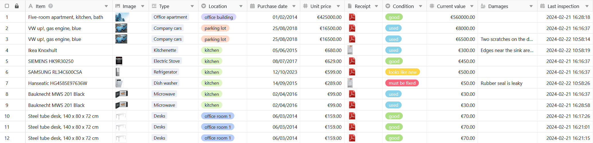
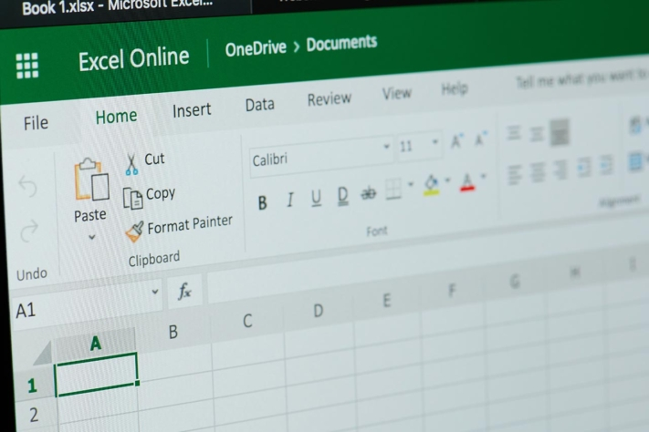
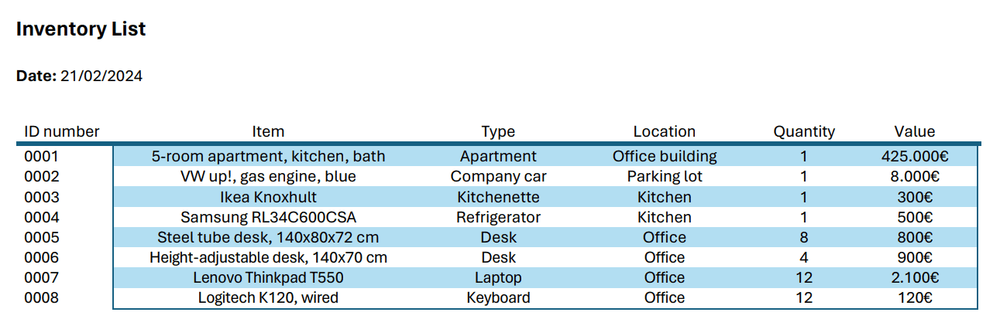
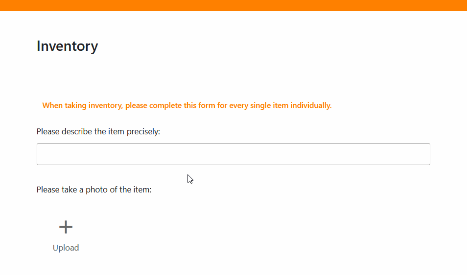

Importieren Sie eine Inventarliste in Excel oder bauen Ihre eigene Vorlage in Word auf. Finden Sie heraus, welche Vorteile eine kostenlose Datenbank wie SeaTable gegenüber Excel und Word bietet.

## Was ist eine Inventarliste?

Mit einer Inventarliste können Sie den Bestand in Ihrem Unternehmen erfassen. Das kann eine schlichte Bestandsliste auf Papier, eine komplexe Tabelle in einem Programm wie Excel oder eine digitale Inventurliste in SeaTable sein.

## Wer muss eine Inventarliste führen?

Jeder Kaufmann und jedes Unternehmen, das zur doppelten Buchführung verpflichtet ist, muss eine Inventur durchführen. Diese muss sowohl zur Geschäftseröffnung als auch nach jedem Geschäftsjahr erfolgen. Dabei nehmen Sie den Bestand auf und erstellen ein Inventar.

Nutzen Sie eine digitale Inventarliste, um Ihren Bestand zu erfassen. Bildrechte: tradol / Adobe Stock

## Was ist der Unterschied zwischen Inventur und Inventar?

Unter einem **Inventar** versteht man den kompletten Bestand eines Unternehmens; das heißt: alle Vermögensgegenstände, die Ihr Unternehmen besitzt. Die **Inventur** ist die Bestandsaufnahme, also der Prozess, bei dem Sie Ihre Vermögensgegenstände erfassen.

## Was zählt zum Inventar eines Unternehmens?

Zum Inventar und damit in Ihre Inventarliste gehören das Vermögen (Anlage- und Umlaufvermögen) und die Schulden Ihres Unternehmens. Am besten listen Sie dabei sowohl **immaterielle als auch materielle Vermögensgegenstände** auf. In einer weiteren Bestandsliste folgen die Schulden.

- Zum **Anlagevermögen gehören die Vermögensgegenstände**, die dauerhaft dem Geschäftsbetrieb Ihres Unternehmens dienen. Das können Immobilien, Maschinen, technische Anlagen, Fahrzeuge, Büromöbel, Finanzanlagen oder immaterielle Rechte und Werte wie etwa Patente sein.
- Das **Umlaufvermögen stellen alle Vermögensgegenstände dar**, die sich nur kurzfristig zur Veräußerung, zum Verbrauch, zur Weiterverarbeitung oder zur Rückzahlung im Unternehmen befinden. Diese sind meist die Grundlage (z. B. vorrätige Rohstoffe und Energieträger) oder das Ergebnis (z. B. fertige Erzeugnisse, Bankguthaben, Forderungen) des Produktionsprozesses.



## Arten der Inventur

Zunächst unterscheidet sich die Inventur danach, ob Sie materielle oder immaterielle Vermögensgegenstände erfassen. Bei physischen Beständen müssen Sie einmal im Jahr eine **körperliche Inventur** durchführen, bei der Sie beispielsweise alle Waren in Ihrem Lager zählen, messen oder wiegen. Dahingegen erfassen Sie bei der **Buchinventur** die immateriellen Vermögensgegenstände, die sich anhand von buchhalterischen Belegen wie etwa Kontoauszügen und Rechnungen nachvollziehen lassen.

Zudem macht es einen Unterschied, **wann** Sie Ihr Inventar erstellen:

- Am geläufigsten ist die sogenannte **Stichtagsinventur**. Wie der Name schon sagt, nehmen Sie die Bestände hier zu einem bestimmten Stichtag, meist am Ende eines Geschäftsjahres, auf. Dies ist zwar die genauste Methode, hat allerdings den Nachteil, dass der gesamte Aufwand für die körperliche Inventur in der Zeit zwischen Weihnachten und Neujahr anfällt, in der viele Mitarbeiter in Urlaub und nicht vor Ort sind.
- Daher gibt es auch die **verlegte Inventur**. Bei dieser Form der Inventur können Sie die Bestandsaufnahme flexibel an einem von Ihnen gewählten Tag durchführen, der maximal drei Monate vor oder zwei Monate nach dem Bilanzstichtag liegt. Da Sie die Bestände dann anhand der Zu- und Abgänge in Ihrer Inventarliste fortschreiben oder zurückrechnen müssen, ist die verlegte Inventur jedoch ungenauer als die Stichtagsinventur.
- Im Gegensatz dazu ist die **permanente Inventur** ein laufender Prozess mit dem Vorteil, dass sich der Aufwand gleichmäßig über das ganze Jahr verteilt und zum Bilanzstichtag eine Buchinventur ausreicht. Dennoch ist einmal im Jahr eine körperliche Inventur aller Vermögensgegenstände notwendig, um die tatsächlichen Bestände mit den Buchbeständen abzugleichen. Anschließend müssen Sie alle Zu- und Abgänge präzise in Ihrer Inventarliste dokumentieren, um die Bestände buchhalterisch fortzuschreiben.

Ihre Inventarliste sollten Sie regelmäßig mit dem tatsächlichen Bestand abgleichen. Bildrechte: zephyr_p / Adobe Stock

## Warum ist es wichtig, eine Inventarliste zu erstellen?

Eine Bestandsliste zu erstellen lohnt sich nicht nur für die Bilanz. Schließlich wollen Sie immer den Überblick behalten, welche [Vermögensgegenstände](https://de.wikipedia.org/wiki/Verm%C3%B6gensgegenstand) Ihre Firma gerade besitzt. Eine Inventarliste hilft Ihnen dabei, stets das **aktuell vorhandene, gewünschte oder benötigte Inventar auf dem Schirm zu haben**. Indem Sie Ihre Vermögensgegenstände auflisten, können Sie diese über einen längeren Zeitraum vergleichen – vorausgesetzt, Sie verwenden immer die gleiche Vorlage für Ihre Inventarliste.

## Welche Informationen gehören in die Inventarliste?

In Ihre Inventarliste sollten Sie folgende Punkte aufnehmen:

- die **Vermögensgegenstände**
- die **Art** oder **Kategorie**
- die **gezählte Menge**
- den **Zustand**
- den **aktuellen Wert**
- den **Lagerort**
- den **Zeitpunkt der Erfassung**

Zudem sollte jeder Gegenstand eine **eindeutige Nummer** erhalten, sobald Sie ihn in Ihrer Inventarliste erfassen. Falls noch vorhanden, können Sie auch den **Kassenzettel** oder die **Rechnung** beifügen sowie das **Kaufdatum** und den damaligen **Stückpreis** angeben. Optional können Sie zusätzlich Angaben wie die **Seriennummer** der Objekte, die **Laufzeit und das Enddatum der Garantie** sowie das **Datum der nächsten Inventur** hinterlegen.

Ein Beispiel für eine Inventarliste ist eine Tabelle mit diesen Spalten (klicken Sie zum Vergrößern auf das Bild):

So könnte Ihre Inventarliste aussehen.

Kommen wir jetzt zum praktischen Teil – wie genau können Sie ein Inventar erstellen?

## Inventar erstellen – was kann Excel?

Ein Programm, das viele Unternehmen bereits verwenden, ist Excel. Hier können Sie eine **Inventarliste für Ihre Inventur anlegen** und diese in den folgenden Jahren immer wieder verwenden.

Liegt Ihnen bereits eine Inventurliste als Excel-Vorlage vor, können Sie diese mit wenigen Klicks immer wieder verwenden. Duplizieren Sie dazu die bestehende Datei, bevor Sie sie in Excel öffnen.

Excel-Tabellen sind für Inventarlisten beliebt. Bildrechte: PixieMe / Adobe Stock

Wenn Ihnen noch keine Excel Inventarliste vorliegt, erstellen Sie kurzerhand eine eigene: Öffnen Sie ein neues, leeres Excel-Dokument. Überlegen Sie, **welche Spaltentitel Sie für Ihre Inventurliste benötigen** (zum Beispiel Identifikationsnummer, Bezeichnung, Standort, Menge und Wert), und tippen Sie diese ein.

Anschließend **formatieren Sie die Zellen gemäß den benötigten Datentypen**. Möchten Sie in einer Spalte zum Beispiel Zahlen mit zwei Stellen nach dem Komma anzeigen? Wie sollen Geldbeträge oder Währungen dargestellt werden? Gibt es negative Werte?

Stehen Ihre Formatierungen, geht es an die **Verknüpfung der Excel-Spalten mit Formeln**. Tippen Sie beispielsweise neben der Inventarliste in eine Zelle die Überschrift „Summe“ ein. Dann können Sie mit der _\=SUMME()_\-Formel alle Werte am Ende der Tabelle zusammenzählen.

Wenn Sie mit der Struktur Ihrer Inventurliste zufrieden sind, erstellen Sie Ihre Vorlage wie folgt:

1. Klicken Sie auf **Datei** > **Speichern unter**.
2. Wählen Sie einen **Speicherort**, zum Beispiel Dieser PC.
3. Geben Sie den gewünschten **Dateinamen** ein.
4. Im Feld darunter wählen Sie den **Dateityp** aus, zum Beispiel eine Excel-Arbeitsmappe mit oder ohne Makros.
5. Klicken Sie auf **Speichern**.

### Vorteile und Nachteile von Excel

Der Vorteil, wenn Sie in Excel das Inventar erstellen, ist, dass viele Mitarbeiter mit dem Programm bereits umgehen können. Steht die Inventarliste einmal, kann die Inventur beginnen. Spätere Änderungen oder Ergänzungen können jedoch mühsam sein.

Ein Nachteil von Excel ist, **dass erfasste Daten nicht in Echtzeit von anderen Mitarbeitern oder Vorgesetzten abgerufen** werden können. Jeder arbeitet an eigenen Tabellen oder greift über gemeinsame Ablagen auf die Dokumente zu. Dabei kann es **schnell zu Konflikten bei den Dateiversionen** kommen. Excel-Tabellen können außerdem schnell **unübersichtlich und komplex** werden, während viele Nutzer nur die Grundfunktionen der Software kennen.

## Wie Sie eine Inventarliste erstellen in Word

Word, das Textverarbeitungsprogramm von Microsoft, hat vermutlich fast jeder schon mal benutzt. Wenn Sie es für Ihre Inventarliste nur eine simple Tabelle benötigen, die Sie vielleicht sogar **ausdrucken und bei der Inventur vor Ort handschriftlich ausfüllen** möchten, eignet sich Word hervorragend.

Öffnen Sie dazu ein Leeres Dokument, klicken Sie auf Einfügen und anschließend auf Tabelle. Nun haben Sie mehrere Möglichkeiten: Beispielsweise können Sie eine (unformatierte) Tabelle mit beliebig vielen Zeilen und Spalten erstellen, auf eine formatierte Vorlage für die Inventurliste zurückgreifen oder eine Excel-Vorlage in Ihr Dokument einbinden, welche die oben erwähnten Funktionen bietet.

Egal, welche Option Sie wählen – auch in Word entscheiden Sie, welche Spaltentitel Sie für Ihre Inventurliste benötigen (zum Beispiel Identifikationsnummer, Gegenstand, Art, Standort, Menge und Wert). Anschließend tippen Sie Ihre Vermögensgegenstände händisch ein. Dies könnte so aussehen (klicken Sie zum Vergrößern auf das Bild):

Beispiel einer Inventarliste in Word

### Vorteile und Nachteile von Word

Der größte Vorteil von Word ist, dass sich Tabellen **schnell** und **intuitiv** erstellen lassen, wodurch auch weniger IT-affine Mitarbeiter damit klarkommen. Zur Veranschaulichung der Gegenstände können Sie sogar **Bilder** in einzelne Zellen Ihrer Inventarliste einfügen.

Im Vergleich zu Excel eignen sich Tabellen in Word allerdings nicht für weitere **Berechnungen und Auswertungen**, sondern nur für **reine Texterfassung**, bei der keine anderen Datentypen und Formeln für die Tabellenkalkulation vorgesehen sind. Für kleine Unternehmen mit wenig Inventar, die nur einfache Listen für ihre Inventur brauchen, mag dies ausreichen.

Für größere Unternehmen mit vielen Gegenständen und komplexeren Anwendungsfällen ist dringend davon abzuraten, Inventarlisten in Word zu führen (außer Sie wollen Ihre Buchhaltung in den Wahnsinn treiben). Hier kommen **Datenbanken wie SeaTable** ins Spiel, mit denen sich auch **große Datenmengen kinderleicht überblicken und auswerten** lassen.

## Eine Inventarliste erstellen mit SeaTable

Die No-Code-Datenbank-Software **SeaTable** hält bereits eine [Inventarliste Vorlage]() für Sie bereit. Um diese **kostenlos zu nutzen**, [registrieren]() Sie sich einfach mit Ihrer E-Mail-Adresse und legen einen Account an. Sind Sie eingeloggt, fahren Sie wie folgt fort:

1. Fügen Sie die Vorlage als **neue Base** auf Ihrer Startseite hinzu. Wie das geht, erfahren Sie [in dieser Anleitung](https://seatable.io/docs/arbeiten-mit-bases/anlegen-einer-base-mithilfe-einer-vorlage/).
2. Klicken Sie die Base an, um sie zu **öffnen**.
3. Lesen Sie die [Base-Beschreibung](https://seatable.io/docs/arbeiten-mit-bases/wie-man-einer-base-eine-beschreibung-hinzufuegt/) und verschaffen Sie sich einen Überblick.
4. [Löschen Sie die Beispieldaten](https://seatable.io/docs/arbeiten-mit-zeilen/das-loeschen-von-zeilen/) und füllen Sie die Tabellen mit Ihrem eigenen Inventar.

Möchten Sie Ihre eigenes Inventar erstellen, können Sie **beliebig viele Spalten in den Tabellen hinzufügen oder löschen** oder [mit einer komplett neuen Base starten](https://seatable.io/docs/arbeiten-mit-bases/eine-neue-base-erstellen/). Anschließend können Sie Ihre Inventarliste mit all Ihren Teammitgliedern [teilen](https://seatable.io/docs/freigaben/base-und-ansichtsfreigaben-im-ueberblick/). Fertig. Ihrer Inventur steht nichts mehr im Weg.

## Was sind die Vorteile von SeaTable?

Webbasierte Programme wie SeaTable ermöglichen das **kollaborative Erstellen und Verwalten von Inventarlisten** mit mehreren Personen. Der Vorteil gegenüber Excel ist, dass alle Beteiligten gleichzeitig Einblick in die Daten haben und **alle Änderungen in Echtzeit synchronisiert** werden.

So können Sie zum Beispiel vermeiden, dass eine **veraltete Inventurliste** genutzt und von verschiedenen Mitarbeitern parallel geführt wird. Benötigt beispielsweise die Buchhaltung Informationen aus der Inventarliste, kann sie diese in SeaTable direkt auf dem neuesten Stand abrufen und muss nicht warten, bis verschiedene Mitarbeiter ihre Versionen zusammengeführt haben.

Ferner können Sie aus Tabellen in SeaTable auch [Webformulare](https://seatable.io/docs/webformulare/webformulare/) für die Inventur erstellen. Dort können Sie Ihre Mitarbeiter durch den Inventurprozess begleiten und ihnen genauere Anweisungen geben, was sie erfassen sollen und worauf sie dabei achten müssen.

Die **Visualisierung** und **Auswertung** der Daten ist in SeaTable noch flexibler und einfacher als in Excel. Sie können [Statistiken](https://seatable.io/docs/plugins/anleitung-zum-statistik-plugin/) erstellen, [Plugins](https://seatable.io/docs/plugins/alle-plugins-in-der-uebersicht/) zur Darstellung verwenden oder mithilfe von Ansichten die Daten filtern, sortieren und gruppieren.

Nicht zuletzt können Sie **Bilder** und **Dateien** wie PDF-Dokumente in SeaTable speichern. Kaufbelege, Rechnungen oder Fotos vom aktuellen Zustand während der Inventur können Sie so mit in Ihre Bestandsliste aufnehmen.

## Fazit

Die meisten Unternehmen müssen eine Inventarliste führen. Dabei standardisiert und vereinfacht eine Inventurliste den Prozess, sei es in Excel, Word oder einer Datenbank wie SeaTable. Wie Sie eine digitale Bestandsliste anlegen, ist von Programm zu Programm unterschiedlich, folgt jedoch ähnlichen Schritten.

Überlegen Sie, **welche Informationen** Sie über Ihr Inventar benötigen, **wer** an der Inventur beteiligt ist und **wie viele Beteiligte** Zugriff auf die Daten benötigen. **Wie** möchten Sie die Daten aufbereiten und **welche Funktionen** sind dafür nötig?

Sobald Sie diese grundlegenden Fragen geklärt haben, starten Sie ganz einfach in die Umsetzung. Wenn Sie die SeaTable Vorlage für Ihre Inventarliste nutzen möchten, [registrieren Sie sich kostenlos]() und legen Sie direkt los.
