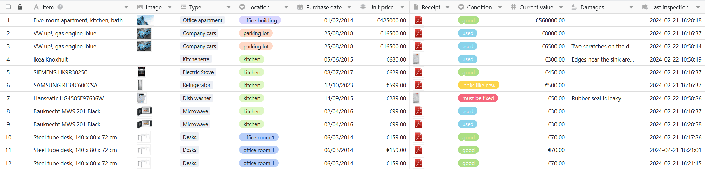
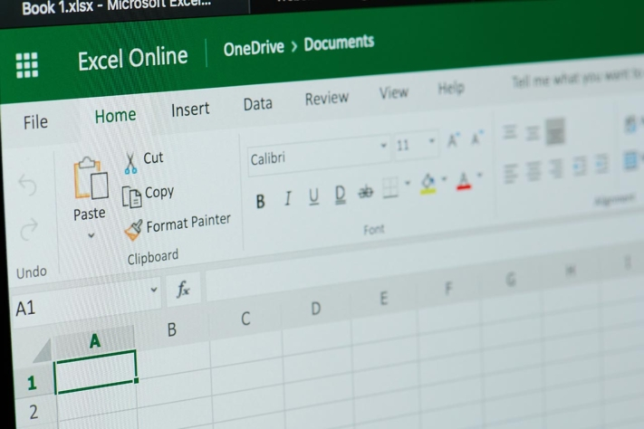

Do you carry out an **inventory** every year or even every month? Then you've come to the right place! In this article, you will learn how to create your **inventory list**, standardize the process and simplify your inventory. You can import an inventory list into Excel or create your own template in Word. You will also find out what advantages a free database like **SeaTable** offers **over Excel and Word**.

## What is an inventory list?

You can use an inventory list to record the stock in your company. This can be a simple inventory list on paper, a complex table in a program such as Excel or a digital inventory list in SeaTable.

## Who has to keep an inventory list?

Every merchant and every company that is obliged to keep double-entry accounts must carry out an inventory. This must be carried out both at the opening of the business and after each financial year. This involves recording the stock and drawing up an inventory.

Use a digital inventory list to record your stock. Image rights: tradol / Adobe Stock

## What is the difference between stocktaking and inventory?

An **inventory** is the complete stock of a company, i.e. all the assets that your company owns. The **inventory** is the process by which you record your assets.

## What counts as a company's inventory?

The assets (fixed and current assets) and liabilities of your company belong to the inventory and therefore to your inventory list. It is best to list both **intangible and tangible assets**. The debts follow in a further inventory list.

- **Fixed assets include assets** that are permanently used for your company's business operations. These can be real estate, machinery, technical equipment, vehicles, office furniture, financial assets or intangible rights and assets such as patents.
- **Current assets are all assets** that are only held in the company for short-term sale, consumption, further processing or repayment. These are usually the basis (e.g. raw materials and energy sources in stock) or the result (e.g. finished goods, bank balances, receivables) of the production process.



## Types of inventory

First of all, the inventory differs according to whether you are recording tangible or intangible assets. For physical inventories, you must carry out a **physical inventory** once a year, in which you count, measure or weigh all the goods in your warehouse, for example. With a **book inventory**, on the other hand, you record the intangible assets, which can be tracked using accounting documents such as bank statements and invoices.

It also makes a difference **when** you create your inventory:

- The most common is the so-called **key date inventory**. As the name suggests, you take stock on a specific date, usually at the end of a financial year. Although this is the most accurate method, it has the disadvantage that the entire effort for the physical inventory is incurred in the period between Christmas and New Year, when many employees are on vacation and not on site.
- This is why there is also the **misplaced inventory**. With this form of stocktaking, you can carry out the inventory flexibly on a day of your choice, which is a maximum of three months before or two months after the balance sheet date. However, as you then have to update or count back the stocks using the receipts and issues in your inventory list, the postponed inventory is less accurate than the key date inventory.
- In contrast, the **perpetual inventory** is an ongoing process with the advantage that the effort is spread evenly throughout the year and a book inventory is sufficient on the balance sheet date. Nevertheless, a physical inventory of all assets is necessary once a year in order to compare the actual stocks with the book stocks. You must then document all additions and disposals precisely in your inventory list in order to update the stocks for accounting purposes.

You should regularly compare your inventory list with the actual stock. Image rights: zephyr_p / Adobe Stock

## Why is it important to create an inventory list?

Creating an inventory list is not only worthwhile for the balance sheet. After all, you always want to keep track of what [assets](https://de.wikipedia.org/wiki/Verm%C3%B6gensgegenstand) your company currently has. An inventory list helps you to always **have** the **currently available, desired or required inventory on your screen**. By listing your assets, you can compare them over a longer period of time - provided you always use the same template for your inventory list.

## What information belongs in the inventory list?

You should include the following items in your inventory list:

- the **assets**
- the **type** or **category**
- the **counted quantity**
- the **condition**
- the **current value**
- the **storage location**
- the **time of recording**

In addition, each item should be given a **unique number** as soon as you enter it in your inventory list. If still available, you can also attach the **receipt** or **invoice** and enter the **date of purchase** and the **unit price** at the time. Optionally, you can also enter information such as the **serial number** of the items, the **term and end date of the warranty** and the **date of the next inventory**.

An example of an inventory list is a table with these columns (click on the image to enlarge):

Your inventory list could look like this.

Now we come to the practical part - how exactly can you create an inventory?

## Creating an inventory - what can Excel do?

One program that many companies already use is Excel. Here you can create an **inventory list for your stocktaking** and use it again and again in subsequent years.

If you already have an inventory list as an Excel template, you can use it again and again with just a few clicks. To do this, duplicate the existing file before opening it in Excel.

Excel spreadsheets are popular for inventory lists. Image copyright: PixieMe / Adobe Stock

If you do not yet have an Excel inventory list, create your own without further ado: Open a new, empty Excel document. Think about **which column headings you need for your inventory list** (e.g. identification number, name, location, quantity and value) and type them in.

Then **format the cells according to the required data types**. For example, do you want to display numbers with two decimal places in a column? How should amounts of money or currencies be displayed? Are there negative values?

Once your formatting is complete, it's time to **link the Excel columns with formulas**. For example, type the heading "Total" into a cell next to the inventory list. You can then use the _\=SUM()_ formula to add up all the values at the end of the table.

Once you are happy with the structure of your inventory list, create your template as follows:

1. Click on **File** > **Save as**.
2. Select a **storage location**, for example This PC.
3. Enter the desired **file name**.
4. In the field below, select the **file type**, for example an Excel workbook with or without macros.
5. Click on **Save**.

### Advantages and disadvantages of Excel

The advantage of creating the inventory in Excel is that many employees are already familiar with the program. Once the inventory list has been created, the stocktaking can begin. However, subsequent changes or additions can be tedious.

One disadvantage of Excel is **that recorded data cannot be accessed in real time by other employees or superiors**. Everyone works on their own spreadsheets or accesses the documents via shared repositories. This can **quickly lead to conflicts between file versions**. Excel spreadsheets can also quickly become **confusing and complex**, while many users are only familiar with the basic functions of the software.

## How to create an inventory list in Word

Word, the word processing program from Microsoft, has probably been used by almost everyone. If you only need a simple table for your inventory list, which you might even want to **print out and fill in by hand when taking stock on site**, Word is ideal.

To do this, open an empty document, click on Insert and then on Table. You now have several options: For example, you can create an (unformatted) table with any number of rows and columns, use a formatted template for the inventory list or integrate an Excel template into your document that offers the functions mentioned above.

Regardless of which option you choose, you also decide in Word which column titles you need for your inventory list (e.g. identification number, item, type, location, quantity and value). You then enter your assets manually. This could look like this (click on the image to enlarge):

Example of an inventory list in Word

### Advantages and disadvantages of Word

The biggest advantage of Word is that tables can be created **quickly** and **intuitively**, which means that even less IT-savvy employees can get to grips with it. You can even insert **images** into individual cells of your inventory list to illustrate the items.

Compared to Excel, however, tables in Word are not suitable for further **calculations and evaluations**, but only for **pure text entry**, where no other data types and formulas are provided for the spreadsheet. This may be sufficient for small companies with little inventory that only need simple lists for their stocktaking.

For larger companies with many items and more complex use cases, we strongly advise against keeping inventory lists in Word (unless you want to drive your accounting department crazy). This is where **databases like SeaTable** come into play, which **make it very easy to keep track of and analyze large amounts of data**.

## Create an inventory list with SeaTable

The no-code database software **SeaTable** already has an [inventory list template](https://seatable.io/en/vorlage/nwkbq-cmrxmcxv1k0sxoaw/) ready for you. To use it **free of charge**, simply [register]() with your e-mail address and create an account. Once you are logged in, proceed as follows:

1. Add the template as a **new base** on your start page. You can find out how to do this [in these instructions](https://seatable.io/en/docs/arbeiten-mit-bases/anlegen-einer-base-mithilfe-einer-vorlage/).
2. Click on the base to **open** it.
3. Read the [base description](https://seatable.io/en/docs/arbeiten-mit-bases/wie-man-einer-base-eine-beschreibung-hinzufuegt/) and get an overview.
4. [Delete the sample data](https://seatable.io/en/docs/arbeiten-mit-zeilen/das-loeschen-von-zeilen/) and fill the tables with your own inventory.

If you want to create your own inventory, you can **add or delete any number of columns in the tables** or [start with a completely new base](https://seatable.io/en/docs/arbeiten-mit-bases/eine-neue-base-erstellen/). You can then [share](https://seatable.io/en/docs/freigaben/base-und-ansichtsfreigaben-im-ueberblick/) your inventory list with all your team members. That's it. Nothing stands in the way of your inventory.

## What are the advantages of SeaTable?

Web-based programs such as SeaTable enable the **collaborative creation and management of inventory lists** with several people. The advantage over Excel is that everyone involved can view the data at the same time and **all changes** are **synchronized in real time**.

For example, you can avoid an **outdated inventory list** being used and managed in parallel by different employees. If, for example, the accounting department needs information from the inventory list, it can retrieve the latest version directly in SeaTable and does not have to wait until different employees have merged their versions.

You can also create [web forms](https://seatable.io/en/docs/webformulare/webformulare/) for stocktaking from tables in SeaTable. There you can guide your employees through the stocktaking process and give them more detailed instructions on what to record and what to look out for.

The **visualization** and **evaluation** of data in SeaTable is even more flexible and easier than in Excel. You can create [statistics](https://seatable.io/en/docs/plugins/anleitung-zum-statistik-plugin/), use [plugins](https://seatable.io/en/docs/plugins/alle-plugins-in-der-uebersicht/) for visualization or filter, sort and group the data using views.

Last but not least, you can save **images** and **files** such as PDF documents in SeaTable. Purchase receipts, invoices or photos of the current status during the inventory can be included in your inventory list.

## Conclusion

Most companies have to keep an inventory list. An inventory list standardizes and simplifies the process, whether in Excel, Word or a database such as SeaTable. How you create a digital inventory list varies from program to program, but follows similar steps.

Think about **what information** you need about your inventory, **who** is involved in the inventory and **how many people** need access to the data. **How** do you want to prepare the data and **which functions** are required for this?

Once you have clarified these basic questions, it's easy to get started. If you would like to use the SeaTable template for your inventory list, [register for free]() and get started right away.
