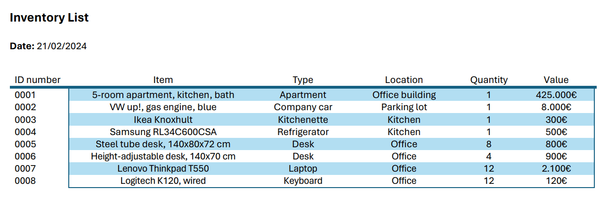
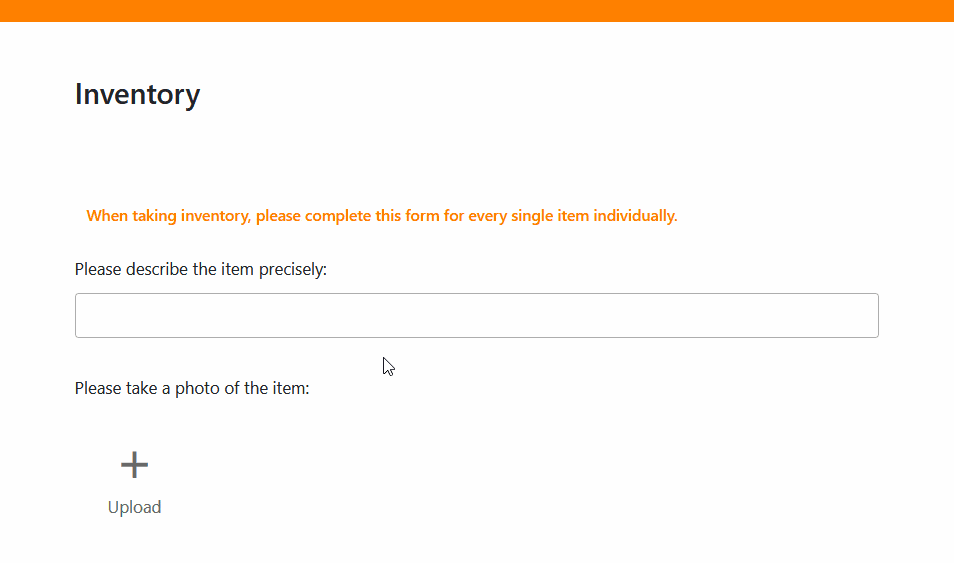

¿Realiza un **inventario** cada año o incluso cada mes? Entonces ha llegado al lugar adecuado. En este artículo, aprenderá a crear su **lista de** inventario, estandarizar el proceso y simplificar su inventario. Puede importar una lista de inventario a Excel o crear su propia plantilla en Word. También descubrirá qué ventajas ofrece una base de datos gratuita como **SeaTable frente a Excel y Word**.

## ¿Qué es una lista de inventario?

Puede utilizar una lista de inventario para registrar las existencias de su empresa. Puede ser una simple lista de inventario en papel, una tabla compleja en un programa como Excel o una lista de inventario digital en SeaTable.

## ¿Quién tiene que llevar una lista de inventario?

Todo comerciante y toda empresa que esté obligada a llevar una contabilidad por partida doble debe realizar un inventario. Debe realizarse tanto en el momento de la apertura de la empresa como después de cada ejercicio. Se trata de registrar las existencias y elaborar un inventario.

Utilice una lista de inventario digital para registrar sus existencias. Derechos de imagen: tradol / Adobe Stock

## ¿Cuál es la diferencia entre inventario e inventario?

Un **inventario** es el stock completo de una empresa, es decir, todos los activos que posee su empresa. El **inventario** es el proceso mediante el cual se registran los activos.

## ¿Qué cuenta como inventario de una empresa?

Los activos (fijos y circulantes) y pasivos de su empresa forman parte del inventario y, por tanto, de su lista de inventario. Lo mejor es enumerar tanto los **activos inmateriales como los materiales**. Las deudas siguen en otra lista de inventario.

- **Los activos fijos incluyen activos** que se utilizan de forma permanente para las operaciones comerciales de su empresa. Pueden ser propiedades, maquinaria, equipos técnicos, vehículos, mobiliario de oficina, activos financieros o derechos y activos intangibles como patentes.
- **Los activos corrientes son todos los activos** que la empresa sólo posee para su venta a corto plazo, su consumo, su transformación posterior o su reembolso. Suelen ser la base (por ejemplo, materias primas y fuentes de energía en existencias) o el resultado (por ejemplo, productos acabados, saldos bancarios, cuentas por cobrar) del proceso de producción.



## Tipos de inventario

En primer lugar, el inventario difiere según se trate de activos materiales o inmateriales. En el caso de los inventarios físicos, debe realizar un **inventario físico** una vez al año, en el que cuente, mida o pese todas las mercancías de su almacén, por ejemplo. Con un **inventario contable**, en cambio, se registran los activos inmateriales, cuyo seguimiento puede hacerse mediante documentos contables como extractos bancarios y facturas.

También influye a **la hora de** crear el inventario:

- El más común es el denominado **inventario de fechas clave**. Como su nombre indica, se hace inventario en una fecha concreta, normalmente al final del ejercicio. Aunque es el método más preciso, tiene el inconveniente de que todo el esfuerzo del inventario físico se realiza en el periodo entre Navidad y Año Nuevo, cuando muchos empleados están de vacaciones y no acuden a las instalaciones.
- Por eso también existe el **inventario extraviado**. Con esta forma de inventario, puede realizarlo con flexibilidad el día que elija, como máximo tres meses antes o dos meses después de la fecha del balance. Sin embargo, como luego hay que actualizar o retrocalcular las existencias utilizando las entradas y salidas de la lista de inventario, el inventario aplazado es menos preciso que el inventario en fecha clave.
- En cambio, el **inventario permanente** es un proceso continuo con la ventaja de que el esfuerzo se reparte uniformemente a lo largo del año y basta con un inventario contable en la fecha del balance. No obstante, es necesario realizar un inventario físico de todos los activos una vez al año para comparar las existencias reales con las existencias contables. A continuación, hay que documentar con precisión todas las altas y bajas en la lista de inventario para actualizar las existencias a efectos contables.

Debe comparar periódicamente su lista de inventario con las existencias reales. Derechos de imagen: zephyr_p / Adobe Stock

## ¿Por qué es importante elaborar una lista de inventario?

Crear una lista de inventario no sólo vale para el balance. Al fin y al cabo, siempre querrá tener constancia de los [activos](https://de.wikipedia.org/wiki/Verm%C3%B6gensgegenstand) que posee actualmente su empresa. Una lista de inventario le ayuda a **tener** siempre **en su pantalla** el **inventario disponible, deseado o necesario en ese momento**. Al enumerar sus activos, puede compararlos durante un periodo de tiempo más largo, siempre que utilice siempre la misma plantilla para su lista de inventario.

## ¿Qué información debe figurar en la lista de inventario?

Debe incluir los siguientes elementos en su lista de inventario:

- los **activos**
- el **tipo** o **categoría**
- la **cantidad contada**
- la **condición**
- el **valor actual**
- el **lugar de almacenamiento**
- el **momento de la grabación**

Además, debe asignar un **número único** a cada artículo en cuanto lo introduzca en su lista de inventario. Si aún está disponible, también puede adjuntar el **recibo** o la **factura** e introducir la **fecha de compra** y el **precio unitario** en ese momento. Opcionalmente, también puede introducir información como el **número de serie** de los artículos, el **plazo y la fecha de finalización de la garantía** y la **fecha del próximo inventario**.

Un ejemplo de lista de inventario es una tabla con estas columnas (haga clic en la imagen para ampliarla):

Tu lista de inventario podría tener este aspecto.

Ahora pasamos a la parte práctica: ¿cómo se crea exactamente un inventario?

## Crear un inventario: ¿qué puede hacer Excel?

Un programa que ya utilizan muchas empresas es Excel. Con él puede crear una **lista de inventario para su inventario** y utilizarla una y otra vez en años sucesivos.

Si ya dispone de una lista de inventario como plantilla de Excel, puede utilizarla una y otra vez con sólo unos clics. Para ello, duplique el archivo existente antes de abrirlo en Excel.

Las hojas de cálculo de Excel son populares para las listas de inventario. Derechos de autor de la imagen: PixieMe / Adobe Stock

Si aún no dispone de una lista de inventario en Excel, cree la suya sin más dilación: abra un documento Excel nuevo y vacío. Piensa **qué encabezados de columna necesitas para tu lista de inventario** (por ejemplo, número de identificación, nombre, ubicación, cantidad y valor) y escríbelos.

A continuación, **formatee las celdas según los tipos de datos requeridos**. Por ejemplo, ¿desea mostrar números con dos decimales en una columna? ¿Cómo deben mostrarse las cantidades de dinero o las divisas? ¿Hay valores negativos?

Una vez completado el formateo, es hora de **vincular las columnas de Excel con fórmulas**. Por ejemplo, escribe el título "Total" en una celda junto a la lista de inventario. A continuación, puedes utilizar la fórmula _\=SUMA()_ para sumar todos los valores al final de la tabla.

Una vez que esté satisfecho con la estructura de su lista de inventario, cree su plantilla de la siguiente manera:

1. Haz clic en **Archivo** > **Guardar como**.
2. Seleccione una **ubicación de almacenamiento**, por ejemplo Este PC.
3. Introduzca el **nombre de archivo** deseado.
4. En el campo inferior, seleccione el **tipo de archivo**, por ejemplo, un libro de Excel con o sin macros.
5. Haga clic en **Guardar**.

### Ventajas e inconvenientes de Excel

La ventaja de crear el inventario en Excel es que muchos empleados ya están familiarizados con el programa. Una vez creada la lista de inventario, se puede empezar a hacer inventario. Sin embargo, los cambios o añadidos posteriores pueden resultar tediosos.

Una desventaja de Excel **es que otros empleados o superiores no pueden acceder en tiempo real a los datos registrados**. Cada uno trabaja en sus propias hojas de cálculo o accede a los documentos a través de carpetas compartidas. Esto puede **dar lugar rápidamente a conflictos entre las versiones de los archivos**. Las hojas de cálculo de Excel también pueden volverse **confusas y complejas** con rapidez, mientras que muchos usuarios sólo están familiarizados con las funciones básicas del programa.

## Cómo crear una lista de inventario en Word

Casi todo el mundo ha utilizado alguna vez Word, el programa de tratamiento de textos de Microsoft. Si sólo necesita una tabla sencilla para su lista de inventario, que incluso puede **imprimir y rellenar a mano al hacer el inventario in situ**, Word es ideal.

Para ello, abra un documento vacío, haga clic en Insertar y luego en Tabla. Ahora tiene varias opciones: Por ejemplo, puede crear una tabla (sin formato) con cualquier número de filas y columnas, utilizar una plantilla formateada para la lista de inventario o integrar en el documento una plantilla de Excel que ofrezca las funciones antes mencionadas.

Independientemente de la opción que elija, decida también en Word qué títulos de columna necesita para su lista de inventario (por ejemplo, número de identificación, artículo, tipo, ubicación, cantidad y valor). A continuación, introduzca sus activos manualmente. Esto podría tener este aspecto (haga clic en la imagen para ampliarla):

Ejemplo de lista de inventario en Word

### Ventajas e inconvenientes de Word

La mayor ventaja de Word es que permite crear tablas de forma **rápida** e **intuitiva**, lo que significa que incluso los empleados con menos conocimientos informáticos pueden familiarizarse con él. Incluso puedes insertar **imágenes** en celdas individuales de tu lista de inventario para visualizar los artículos.

Sin embargo, en comparación con Excel, las tablas de Word no son adecuadas para **cálculos y análisis** posteriores, sino sólo para la **introducción de texto puro**, cuando no se proporcionan otros tipos de datos y fórmulas para la hoja de cálculo. Esto puede ser suficiente para pequeñas empresas con poco inventario que sólo necesiten listas sencillas para su inventario.

Para empresas más grandes con muchos artículos y casos de uso más complejos, desaconsejamos encarecidamente guardar listas de inventario en Word (a menos que quiera volver loco a su departamento de contabilidad). Aquí es donde entran en juego **bases de datos como SeaTable**, que **facilitan enormemente el seguimiento y el análisis de grandes cantidades de datos**.

## Crear una lista de inventario con SeaTable

El software de base de datos sin código **SeaTable** ya tiene preparada para usted una [plantilla de lista de inventario](). Para utilizarla **gratuitamente**, sólo tiene que [registrarse]() con su dirección de correo electrónico y crear una cuenta. Una vez que haya iniciado sesión, proceda como se indica a continuación:

1. Añade la plantilla como **nueva base** en tu página de inicio. Puedes encontrar cómo hacerlo [en estas instrucciones]().
2. Haz clic en la base para **abrirla**.
3. Lea la [descripción básica]() y obtenga una visión general.
4. [Borre los datos de la muestra]() y rellene las tablas con su propio inventario.

Si desea crear su propio inventario, puede **añadir o eliminar cualquier número de columnas en las tablas** o [empezar con una base completamente nueva](). A continuación, puedes [compartir]() tu lista de inventario con todos los miembros de tu equipo. Y ya está. Nada se interpone en el camino de tu inventario.

## ¿Cuáles son las ventajas de SeaTable?

Los programas basados en web, como SeaTable, permiten **crear y gestionar listas de inventario en colaboración** con varias personas. La ventaja sobre Excel es que todos los implicados pueden ver los datos al mismo tiempo y **todos los cambios se sincronizan en tiempo real**.

Por ejemplo, puede evitar que diferentes empleados utilicen y mantengan en paralelo una lista de inventario **obsoleta**. Si, por ejemplo, el departamento de contabilidad necesita información de la lista de inventario, puede recuperar la última versión directamente en SeaTable y no tiene que esperar a que los distintos empleados hayan fusionado sus versiones.

También puede crear [formularios web]() para hacer inventario a partir de tablas en SeaTable. En ellos puede guiar a sus empleados a través del proceso de inventario y darles instrucciones más detalladas sobre lo que deben registrar y en qué deben fijarse.

La **visualización** y **evaluación de** datos en SeaTable es aún más flexible y sencilla que en Excel. Puedes crear [estadísticas](), utilizar [plugins]() de visualización o filtrar, ordenar y agrupar los datos mediante vistas.

Por último, pero no menos importante, puede guardar **imágenes** y **archivos** como documentos PDF en SeaTable. Puede incluir recibos de compra, facturas o fotos del estado actual durante el inventario en su lista de existencias.

## Conclusión:

La mayoría de las empresas tienen que llevar una lista de inventario. Una lista de inventario normaliza y simplifica el proceso, ya sea en Excel, Word o una base de datos como SeaTable. La forma de crear una lista de inventario digital varía de un programa a otro, pero sigue unos pasos similares.

Piense **qué información** necesita sobre su inventario, **quién** participa en él y **cuántas personas** necesitan acceder a los datos. **¿Cómo** quiere preparar los datos y **qué funciones** son necesarias para ello?

Una vez aclaradas estas cuestiones básicas, es fácil empezar. Si desea utilizar la plantilla SeaTable para su lista de inventario, [regístrese gratuitamente]() y empiece de inmediato.
