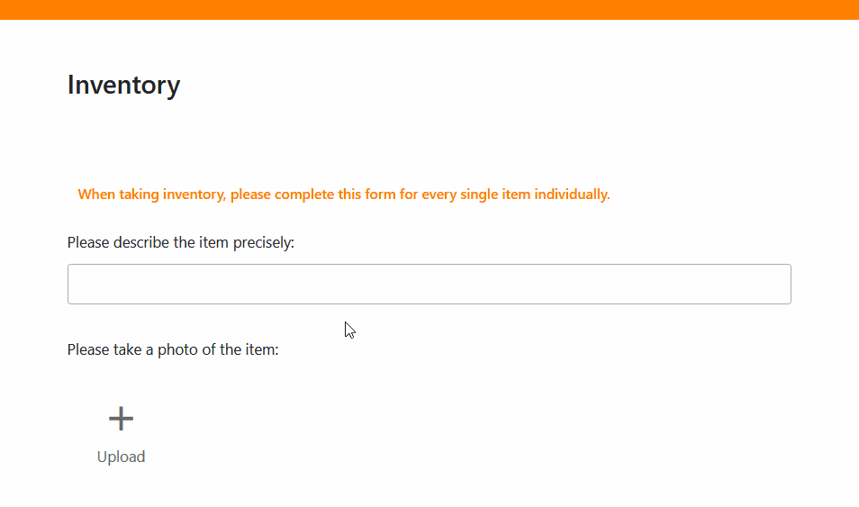

Faz um **inventário** todos os anos ou mesmo todos os meses? Então veio ao sítio certo! Neste artigo, aprenderá a criar a sua **lista de inventário**, a normalizar o processo e a simplificar o seu inventário. Pode importar uma lista de inventário para o Excel ou criar o seu próprio modelo no Word. Descobrirá também as vantagens que uma base de dados gratuita como o **SeaTable** oferece **em relação ao Excel e ao Word**.

## O que é uma lista de inventário?

Pode utilizar uma lista de inventário para registar as existências da sua empresa. Pode ser uma simples lista de inventário em papel, uma tabela complexa num programa como o Excel ou uma lista de inventário digital no SeaTable.

## Quem tem de manter uma lista de inventário?

Todos os comerciantes e todas as empresas que são obrigados a manter uma contabilidade por partidas dobradas devem efetuar um inventário. Este inventário deve ser efectuado aquando da abertura da empresa e após cada exercício financeiro. Trata-se de registar as existências e de elaborar um inventário.

Utilize uma lista de inventário digital para registar o seu stock. Direitos de imagem: tradol / Adobe Stock

## Qual é a diferença entre o inventário e a inventariação?

Um **inventário** é o stock completo de uma empresa, ou seja, todos os bens que a sua empresa possui. O **inventário** é o processo pelo qual se registam os activos.

## O que conta como inventário de uma empresa?

Os activos (fixos e circulantes) e os passivos da sua empresa pertencem ao inventário e, por conseguinte, à sua lista de inventário. É preferível enumerar tanto **os activos incorpóreos como os activos corpóreos**. As dívidas seguem numa outra lista de inventário.

- **Os activos fixos incluem activos** que são permanentemente utilizados para as operações comerciais da sua empresa. Podem ser imóveis, máquinas, equipamento técnico, veículos, mobiliário de escritório, activos financeiros ou direitos e activos incorpóreos, como patentes.
- **Os activos correntes são todos os activos** que só são detidos na empresa para venda, consumo, processamento posterior ou reembolso a curto prazo. São normalmente a base (por exemplo, matérias-primas e fontes de energia em stock) ou o resultado (por exemplo, produtos acabados, saldos bancários, contas a receber) do processo de produção.



## Tipos de inventário

Em primeiro lugar, o inventário difere consoante se trate de um registo de activos corpóreos ou incorpóreos. Para os inventários físicos, é necessário efetuar um **inventário físico** uma vez por ano, no qual se contam, medem ou pesam todas as mercadorias no armazém, por exemplo. Com um **inventário contabilístico**, por outro lado, são registados os activos incorpóreos, que podem ser controlados através de documentos contabilísticos, como extractos bancários e facturas.

Também faz diferença **quando** cria o seu inventário:

- O mais comum é o chamado **inventário de data fixada**. Como o nome sugere, o inventário é feito numa data específica, normalmente no final de um exercício financeiro. Embora este seja o método mais exato, tem a desvantagem de todo o esforço para o inventário físico ser incorrido no período entre o Natal e o Ano Novo, quando muitos empregados estão de férias e não estão no local.
- É por isso que existe também o **inventário extraviado**. Com esta forma de inventário, é possível efetuar o inventário de forma flexível num dia à escolha, que pode ser, no máximo, três meses antes ou dois meses depois da data do balanço. No entanto, como é necessário atualizar ou voltar a calcular as existências com base nas entradas e saídas da lista de inventário, o inventário adiado é menos exato do que o inventário em data fixada.
- Em contrapartida, o **inventário permanente** é um processo contínuo com a vantagem de o esforço ser distribuído uniformemente ao longo do ano e de um inventário contabilístico ser suficiente à data do balanço. No entanto, é necessário proceder a um inventário físico de todos os activos uma vez por ano, a fim de comparar as existências reais com as existências contabilísticas. Em seguida, é necessário documentar com precisão todos os acréscimos e cessões na lista de inventário, a fim de atualizar as existências para efeitos contabilísticos.

Deve comparar regularmente a sua lista de inventário com as existências reais. Direitos de imagem: zephyr_p / Adobe Stock

## Porque é que é importante criar uma lista de inventário?

A criação de uma lista de inventário não é apenas útil para o balanço. Afinal de contas, é sempre desejável manter um registo dos [activos](https://de.wikipedia.org/wiki/Verm%C3%B6gensgegenstand) que a empresa possui atualmente. Uma lista de inventário ajuda-o a **ter** sempre **no seu ecrã** o **inventário disponível, desejado ou necessário**. Ao listar os seus activos, pode compará-los durante um longo período de tempo - desde que utilize sempre o mesmo modelo para a sua lista de inventário.

## Que informações pertencem à lista do inventário?

A lista de inventário deve incluir os seguintes elementos

- os **activos**
- o **tipo** ou **categoria**
- a **quantidade contada**
- a **condição**
- o **valor atual**
- o **local de armazenamento**
- a **hora do registo**

Além disso, deve ser atribuído um **número único** a cada artigo logo que este é introduzido na lista de inventário. Se ainda estiver disponível, pode também anexar o **recibo** ou **fatura** e introduzir a **data de compra** e o **preço unitário** na altura. Opcionalmente, também é possível introduzir informações como o **número de série** dos artigos, o **prazo e a data final da garantia** e a **data do próximo inventário**.

Um exemplo de uma lista de inventário é uma tabela com estas colunas (clique na imagem para a aumentar):

A sua lista de inventário pode ter o seguinte aspeto.

Agora chegamos à parte prática - como é que se pode criar um inventário exatamente?

## Criar um inventário - o que é que o Excel pode fazer?

Um programa que muitas empresas já utilizam é o Excel. Aqui pode criar uma **lista de inventário para o seu inventário** e utilizá-la repetidamente nos anos seguintes.

Se já tiver uma lista de inventário como modelo do Excel, pode utilizá-la várias vezes com apenas alguns cliques. Para tal, duplique o ficheiro existente antes de o abrir no Excel.

As folhas de cálculo do Excel são muito populares para listas de inventário. Direitos de autor: PixieMe / Adobe Stock

Se ainda não tem uma lista de inventário em Excel, crie a sua sem mais demoras: Abra um novo documento Excel vazio. Pense nos **títulos das colunas que precisa para a sua lista de inventário** (por exemplo, número de identificação, nome, localização, quantidade e valor) e escreva-os.

De seguida, **formate as células de acordo com os tipos de dados necessários**. Por exemplo, pretende apresentar números com duas casas decimais numa coluna? Como devem ser apresentadas as quantias de dinheiro ou moedas? Existem valores negativos?

Quando a formatação estiver concluída, é altura de **ligar as colunas do Excel com fórmulas**. Por exemplo, escreva o título "Total" numa célula junto à lista de inventário. Pode então utilizar a fórmula _\=SUM()_ para somar todos os valores no final da tabela.

Quando estiver satisfeito com a estrutura da sua lista de inventário, crie o seu modelo da seguinte forma:

1. Clique em **Ficheiro** > **Guardar como**.
2. Selecione uma **localização de armazenamento**, por exemplo, Este PC.
3. Introduzir o **nome do ficheiro** pretendido.
4. No campo abaixo, seleccione o **tipo de ficheiro**, por exemplo, um livro de trabalho do Excel com ou sem macros.
5. Clique em **Guardar**.

### Vantagens e desvantagens do Excel

A vantagem de criar o inventário em Excel é que muitos empregados já estão familiarizados com o programa. Uma vez criada a lista de inventário, pode iniciar-se a inventariação. No entanto, as alterações ou adições posteriores podem ser entediantes.

Uma desvantagem do Excel é **que os dados registados não podem ser acedidos em tempo real por outros funcionários ou superiores**. Todos trabalham nas suas próprias folhas de cálculo ou acedem aos documentos através de pastas partilhadas. Isto pode **levar rapidamente a conflitos entre versões de ficheiros**. As folhas de cálculo do Excel podem também tornar-se rapidamente **confusas e complexas**, enquanto muitos utilizadores apenas conhecem as funções básicas do software.

## Como criar uma lista de inventário no Word

Quase toda a gente já utilizou o Word, o programa de processamento de texto da Microsoft. Se apenas necessita de um simples quadro para a sua lista de inventário, que pode até querer **imprimir e preencher à mão quando faz o inventário no local**, o Word é ideal.

Para o fazer, abra um documento vazio, clique em Inserir e depois em Tabela. Tem agora várias opções: Por exemplo, pode criar uma tabela (não formatada) com qualquer número de linhas e colunas, utilizar um modelo formatado para a lista de inventário ou integrar um modelo Excel no seu documento que ofereça as funções acima mencionadas.

Independentemente da opção escolhida, o usuário também decide no Word quais títulos de coluna são necessários para a lista de inventário (por exemplo, número de identificação, item, tipo, localização, quantidade e valor). Em seguida, introduz os seus activos manualmente. A lista pode ter o seguinte aspeto (clique na imagem para a aumentar):

Exemplo de uma lista de inventário no Word

### Vantagens e desvantagens do Word

A maior vantagem do Word é o facto de as tabelas poderem ser criadas **de forma rápida** e **intuitiva**, o que significa que mesmo os funcionários com menos conhecimentos de informática podem familiarizar-se com ele. Pode até inserir **imagens** em células individuais da sua lista de inventário para visualizar os artigos.

No entanto, em comparação com o Excel, as tabelas no Word não são adequadas para **cálculos e análises** adicionais, mas apenas para a **introdução de texto puro**, em que não são fornecidos outros tipos de dados e fórmulas para a folha de cálculo. Isto pode ser suficiente para pequenas empresas com poucas existências que apenas necessitem de listas simples para o seu inventário.

Para empresas maiores, com muitos artigos e casos de utilização mais complexos, desaconselhamos vivamente a manutenção de listas de inventário no Word (a menos que queira enlouquecer o seu departamento de contabilidade). É aqui que entram em ação **as bases de dados como o SeaTable**, que **facilitam muito o controlo e a análise de grandes quantidades de dados**.

## Criar uma lista de inventário com o SeaTable

O software de base de dados sem código **SeaTable** já tem um [modelo de lista de inventário]() pronto para si. Para o utilizar **gratuitamente**, basta [registar-se]() com o seu endereço de correio eletrónico e criar uma conta. Uma vez iniciada a sessão, proceda da seguinte forma:

1. Adicione o modelo como uma **nova base** na sua página inicial. Para saber como o fazer, consulte [estas instruções]().
2. Clique na base para a **abrir**.
3. Leia a [descrição de base]() e obtenha uma visão geral.
4. [Eliminar os dados de amostra]() e preencher os quadros com o seu próprio inventário.

Se quiser criar o seu próprio inventário, pode **adicionar ou eliminar qualquer número de colunas nas tabelas** ou [começar com uma base completamente nova](). Pode depois [partilhar]() a sua lista de inventário com todos os membros da sua equipa. E é tudo. Nada impede o seu inventário.

## Quais são as vantagens do SeaTable?

Os programas baseados na Web, como o SeaTable, permitem a **criação e gestão colaborativa de listas de inventário** com várias pessoas. A vantagem em relação ao Excel é que todos os envolvidos podem ver os dados ao mesmo tempo e **todas as alterações** são **sincronizadas em tempo real**.

Por exemplo, é possível evitar que uma **lista de inventário desactualizada** seja utilizada e actualizada em paralelo por diferentes colaboradores. Se, por exemplo, o departamento de contabilidade necessitar de informações da lista de inventário, pode obter a versão mais recente diretamente no SeaTable e não tem de esperar até que diferentes empregados tenham fundido as suas versões.

Também é possível criar [formulários Web]() para o inventário a partir de quadros no SeaTable. Aí pode orientar os seus empregados no processo de inventário e dar-lhes instruções mais pormenorizadas sobre o que registar e o que procurar.

A **visualização** e **a avaliação** dos dados no SeaTable são ainda mais flexíveis e fáceis do que no Excel. Pode criar [estatísticas](), utilizar [plugins]() para visualização ou filtrar, ordenar e agrupar os dados utilizando vistas.

Por último, mas não menos importante, pode guardar **imagens** e **ficheiros**, como documentos PDF, no SeaTable. Pode incluir recibos de compras, facturas ou fotografias do estado atual durante o inventário na sua lista de existências.

## Conclusão

A maioria das empresas tem de manter uma lista de inventário. Uma lista de inventário normaliza e simplifica o processo, seja em Excel, Word ou numa base de dados como o SeaTable. A forma de criar uma lista de inventário digital varia de programa para programa, mas segue passos semelhantes.

Pense nas **informações** de que precisa sobre o seu inventário, **quem** está envolvido no inventário e **quantas pessoas** precisam de ter acesso aos dados. **Como** pretende preparar os dados e **que funções** são necessárias para o efeito?

Depois de esclarecer estas questões básicas, é fácil começar. Se pretender utilizar o modelo SeaTable para a sua lista de inventário, [registe-se gratuitamente]() e comece já a trabalhar.
