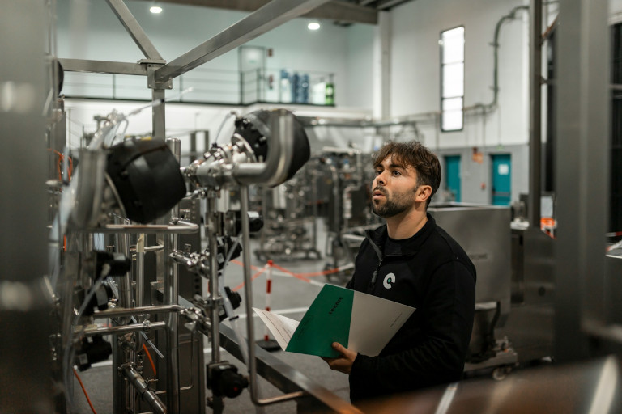

## Was ist ein Investitionsplan?

Bei einer **Investition** binden Sie für eine gewisse Zeit finanzielle Mittel in materiellen oder immateriellen Vermögenswerten – frei verfügbares Geld wird **gebundenes Kapital**. Meist handelt es sich dabei um **Anlagevermögen**, also Dinge, die lange in Ihrem Unternehmen verbleiben, wie zum Beispiel Gebäude, Maschinen oder Patente. Investitionen in das **Umlaufvermögen** können beispielsweise Waren oder Rohstoffe sein, die Sie verarbeiten oder verkaufen und die sich nur kurzfristig in Ihrem Besitz befinden.
  
Ein **Investitionsplan** verschafft Ihnen einen Überblick über alle geplanten Investitionen und gibt Aufschluss darüber, wie viel Geld Sie zu welchem Zeitpunkt in die Hand nehmen wollen. Dafür halten Sie alle Ausgaben fest, die **einmalig zu Beginn** durch die Anschaffung bzw. in der Anlaufphase eines Projekts anfallen. Dahingegen gehören laufende Kosten für den Betrieb und Erhalt nicht in den Investitionsplan, sondern in den **Betriebsmittelplan**. Zusammen mit eventuellen Gründungskosten bilden diese beiden Pläne den **Kapitalbedarfsplan**, der auch Teil Ihrer [Finanzplanung]() oder Ihres Businessplans ist.

  
Nehmen wir an, dass Sie eine neue Anlage in Ihrer Fabrik installieren wollen, um die Produktion zu steigern. Der Bau dieser Anlage kostet geschätzt 100.000 Euro, die in Ihren Investitionsplan für Maschinen einfließen. Zudem benötigen Sie aber noch ausgebildete Fachkräfte, Energie und Rohstoffe, um die Anlage betreiben zu können. Diese laufenden Kosten schlagen sich gemeinsam mit den Anschaffungskosten im Kapitalbedarfsplan nieder.


## Warum ein Investitionsplan für Unternehmen essenziell ist

Wenn Sie ein Unternehmen gründen oder in leitender Position managen, stehen Sie immer wieder vor wichtigen **Investitionsentscheidungen**. Egal, ob Sie neue Maschinen kaufen, [Personal einstellen]() oder die Digitalisierung vorantreiben möchten – jede Entscheidung beeinflusst das zukünftige Wachstum und den Erfolg Ihres Unternehmens. Mit einem durchdachten Investitionsplan steuern Sie vorausschauend Ihre Ausgaben, setzen klare Prioritäten und vermeiden unnötige Risiken.

Des Weiteren entsteht durch Investitionen meist ein hoher **Kapitalbedarf**, den Sie oft nur mit externen Geldgebern wie Banken und Investoren decken können. Eine überzeugende Investitionsplanung zeigt ihnen, dass Sie mit Geld umgehen können, und erhöht Ihre **Kreditwürdigkeit**. Nicht zuletzt kalkulieren Sie bei der Investitionsrechnung auch den potenziellen Nutzen Ihrer Investitionen und ermitteln, ab wann sich Ihr Kapitaleinsatz rentieren wird.

## Investitionsarten einfach erklärt

Je nach Ziel und Zeitpunkt einer Investition lassen sich 4 Investitionsarten unterscheiden:


Eine Erstinvestition, auch Gründungsinvestition genannt, umfasst alle Ausgaben, die Sie für die Erstausstattung Ihres Unternehmens tätigen, um Ihr Business ins Rollen zu bringen. In der Regel ist der Kapitalbedarf bei dieser Art von Investment am höchsten. Dabei wird zwischen echten Investitionen und reinen Gründungskosten wie Anmeldungen bei Behörden unterschieden, die nicht zur Wertsteigerung Ihres Unternehmens beitragen.



Um Erweiterungsinvestitionen handelt es sich bei Ausgaben, mit denen Sie Ihre Kapazitäten ausbauen. Ist beispielsweise die Nachfrage nach Ihren Produkten oder Dienstleistungen gestiegen, sollten Sie in Ihrem Investitionsplan mehr Maschinen oder Personal vorsehen. Eine Erweiterungsinvestition amortisiert sich meist nach kurzer Zeit, da sie mit einer absehbaren Umsatzsteigerung einhergeht.



Von einer Rationalisierungsinvestition erwarten Sie sich vor allem eine Kostenersparnis. Zum Beispiel könnten Sie in Roboter zur Automatisierung und Beschleunigung von Produktionsprozessen investieren, um Personalkosten einzusparen. Im Vergleich zur Erweiterungsinvestition erhöhen Sie damit allerdings nicht die Kapazitäten, sondern hauptsächlich die Effizienz.



Eine Ersatzinvestition ist vonnöten, wenn Sie einen veralteten oder defekten Vermögensgegenstand vollständig ersetzen müssen, um Ihr Business am Laufen zu halten. Dies nennt man auch Reinvestition. Hierbei geht es lediglich darum, den bisherigen Zustand aufrechtzuerhalten oder wiederherzustellen, ohne die Kapazitäten oder die Effizienz Ihres Unternehmens zu verändern.


## Nutzungsdauer und Abschreibung von Investitionsgütern

Wie Sie bereits an den verschiedenen Investitionsarten ablesen können, spielen der **Zeitpunkt der Anschaffung** und die zu erwartende **Nutzungsdauer** von Investitionsgütern eine entscheidende Rolle für Ihre Investitionsplanung. Deshalb erstellen Sie Ihren Investitionsplan nicht nur für die Existenzgründung, sondern für die gesamte Lebensdauer Ihrer Vermögensgegenstände.  
  
Bei einem Investitionsplan für Maschinen definieren Sie beispielsweise für jede Maschine, wie lange Sie diese nutzen möchten und wann Sie diese vermutlich ersetzen müssen. Im Rahmen der Nutzungsdauer sollten Sie demzufolge nicht nur die Anschaffungskosten erwirtschaften, sondern auch **Rücklagen** bilden, um die Maschinen zum gegebenen Zeitpunkt austauschen zu können.

Die hypothetischen Kosten für diese Rücklagen tauchen bei der Bilanzierung (z. B. im Jahresabschluss) als **Abschreibungen** auf. Konkret berücksichtigt eine Abschreibung die **Wertminderung** des Vermögensgegenstands über die gesamte Nutzungsdauer hinweg. Kaufen Sie zum Beispiel eine Maschine für 20.000 Euro, die für 10 Jahre in Ihrem Unternehmen bleiben soll, verringert sich der Wert jedes Jahr um 10 Prozent, also 2.000 Euro, die Sie als Abschreibung in der Gewinn- und Verlustrechnung aufführen.

## Wie Sie einen Investitionsplan erstellen – in 6 Schritten

1. **Definieren Sie Ihre Ziele**: Wollen Sie beispielsweise die Produktionskapazitäten ausbauen, um auf eine gestiegene Nachfrage zu reagieren oder neue Märkte zu erschließen? Dann legt dies einen Investitionsplan für mehr Maschinen nahe. Sprich: Für jede Investition sollte Ihnen klar sein, was Sie damit erreichen möchten. 

2. **Klären Sie die Finanzierung**: Analysieren Sie, wie viel Geld Sie für Ihr Vorhaben benötigen und wie Sie dieses finanzieren können. Ob Eigenkapital, Kredite oder Fördermittel – Sie entscheiden, welche Finanzierung zu Ihrem Investment passt. 

3. **Setzen Sie Prioritäten**: Nicht alles, was wünschenswert ist, ist auch finanzierbar. Legen Sie fest, welche Investitionen höchste Priorität haben und welche Sie zurückstellen können. Bevorzugen Sie Investitionen, die strategisch auf Ihre Ziele einzahlen und direkte Auswirkungen auf Ihr Business haben. 

4. **Kalkulieren Sie Kosten und Nutzen**: Natürlich sollen Ihre Investitionen möglichst schnell Früchte tragen. Berechnen Sie daher für jede Investition sorgfältig, welche Kosten auf Sie zukommen und welchen Nutzen Sie erwarten. Mit einer solchen [Kosten-Nutzen-Analyse]() können Sie unnötige Fehlinvestitionen vermeiden.

5. **Planen Sie den Zeithorizont**: Ein Investitionsplan hilft Ihnen, notwendige Ausgaben zeitlich zu ordnen und die Mittel so einzusetzen, dass die Finanzierung langfristig gesichert ist. Dank eines realistischen Zeitplans, wann Sie welche Investitionsgüter anschaffen, sinkt die Gefahr von [Liquiditätsengpässen](). 
 
6. **Realisieren Sie Ihren Investitionsplan**: Die Finanzierung, der Stellenwert, der Nutzen und der Zeitplan Ihrer Investitionen sind geklärt? Dann steht der Umsetzung Ihrer Investitionsplanung nichts mehr im Weg! Prüfen Sie regelmäßig, ob Ihre Investitionen tatsächlich den gewünschten Erfolg bringen, und passen Sie Ihren Plan gegebenenfalls an.

  

## Investitionsplan Beispiel: Gründung einer Werkstatt

Stellen Sie sich vor, dass Sie Ihre eigene Autowerkstatt gründen möchten und dafür zum Beispiel einen Investitionsplan erstellen müssen. Dabei treffen Sie folgende Investitionsentscheidungen: Sie möchten keine Garage mieten, sondern direkt eine Immobilie mit Werkstatt und Büro kaufen. Natürlich schlägt dann als größter Posten in Ihrem Investitionsplan diese Immobilie zu Buche.  

Als Nächstes benötigen Sie für Ihre Werkstatt eine Hebebühne sowie verschiedene elektrische Geräte und Werkzeuge, die Sie im Investitionsplan unter Maschinen und Anlagen eintragen. Weitere Ausstattungsgegenstände für Werkstatt und Büro könnten eine Einbauküche, Schreibtische, Sitzmöbel, Werkbänke, Regalsysteme, Computer und Telefone sein. Perspektivisch wollen Sie auch in einen eigenen Abschleppwagen, eine zweite Hebebühne und einen Tischkicker für die Pausen investieren.

### Wie sieht ein Investitionsplan aus?

Im oben beschriebenen Beispiel könnte der Investitionsplan einen Aufbau wie diesen haben:  

| **Art der Investition** | **Jahr 1**      | **Jahr 2**      | **Jahr 3**      |
| ----------------------- | --------------- | --------------- | --------------- |
| **Immobilien**          |                 |                 |                 |
| Werkstatt mit Büro      | 350.000         | –               | –               |
| **Maschinen/Anlagen**   |                 |                 |                 |
| Hebebühnen              | 5.000           | –               | 5.000           |
| Elektrische Geräte      | 10.000          | 5.000           | –               |
| Werkzeuge               | 5.000           | –               | 2.000           |
| **Fahrzeuge**           |                 |                 |                 |
| Abschleppwagen          | –               | –               | 70.000          |
| **Mobiliar**            |                 |                 |                 |
| Werkbänke               | 5.000           | –               | –               |
| Einbauküche             | 5.000           | –               | –               |
| Schreibtische           | 1.000           | –               | 500             |
| Sitzmöbel               | 1.200           | –               | –               |
| Regalsysteme            | 500             | –               | –               |
| Tischkicker             | –               | –               | 500             |
| **IT**                  |                 |                 |                 |
| Computer & Monitore     | 2.800           | 700             | 1.000           |
| Telefone & Router       | 1.000           | –               | 500             |
| **Umlaufvermögen**      |                 |                 |                 |
| Basis-Ersatzteile       | 2.000           | 1.000           | 1.000           |
| Benzin, Öle             | 500             | 500             | 500             |
| Handschuhe, Kleidung    | 500             | 300             | 500             |
| Sonstiges               | 500             | 500             | 500             |
| **Investitionssumme**   | **390.000**     | **8.000**       | **82.000**      |

Alle Zahlen in diesem Investitionsplan Beispiel stellen Nettopreise in Euro dar.

  
Beachten Sie, dass insbesondere bei einer Gründung der Kapitalbedarf deutlich höher ist als die Investitionssumme. Hinzu kommen:  
- **Einmalige Gründungskosten** wie Meldegebühren, Beratungskosten oder eine Eröffnungsfeier  
- **Laufende Betriebskosten**, darunter Miete, Nebenkosten, Versicherungen, Internet und Telefonie  
- **Personalkosten** sowie Ihr eigenes Einkommen für den privaten Lebensunterhalt  
- **Werbekosten**, z. B. Corporate Design, Website, Anzeigenschaltung


## Die häufigsten Fehler bei der Investitionsplanung

Folgende Fallstricke sollten Sie vermeiden, damit Ihre Investitionsplanung ein Erfolg wird:

- **Verwechslung mit der Kapitalbedarfsplanung**: Der Investitionsplan deckt nur einen Teil des Kapitalbedarfs ab. Beachten Sie zusätzliche Ausgaben, insbesondere für laufende Betriebs- und Personalkosten.
    
- **Unklare Ziele oder Prioritäten**: Bevor Sie auch nur einen Euro investieren, sollten Sie geklärt haben, wie dringlich bestimmte Investitionen sind und welches Investment am stärksten auf Ihre Unternehmensziele einzahlt. So wissen Sie immer, wofür Sie direkt Geld ausgeben sollten und womit Sie noch warten können.
    
- **Kosten unterschätzen, Nutzen überschätzen**: Seien Sie nicht zu optimistisch, was den Effekt Ihrer Investitionen angeht. Manchmal dauert es länger als gedacht, bis sich die Anschaffungskosten amortisiert haben. Kalkulieren Sie bei den Kosten besser zu viel als zu wenig ein, damit Sie einen Puffer für unvorhergesehene Preissteigerungen haben.
    
- **Bauchgefühl statt Berechnungen**: Auch wenn Sie kein großer Fan der Mathematik sind, sollten Sie die Investitionsrechnung ernsthaft und sorgfältig durchführen. Berechnen Sie beispielsweise die [Rentabilität]() verschiedener Investitionen, um die richtigen Investitionsentscheidungen zu treffen.

## Investitionsplanung Software: So behalten Sie den Überblick über Ihre Investitionen

Während für einen einfachen Investitionsplan noch eine Vorlage in Excel oder Word ausreichen mag, werden die Datenmengen und -strukturen in größeren Unternehmen schnell unüberschaubar und komplex. Damit Sie dennoch den Überblick behalten, bietet sich als Investitionsplanung Software zum Beispiel die No-Code-Datenbank [SeaTable]() an. Die intuitive Benutzeroberfläche erinnert an eine Tabellenkalkulation, SeaTable bietet aber deutlich mehr Funktionen und sogar die Möglichkeit, [eigene Apps zu erstellen]().  
  
Mithilfe von **Formeln und Statistiken**, aber auch **Ansichten und Plugins** (wie z. B. Galerien, Kalender, Kanban-Boards) können Sie Ihre Daten im Handumdrehen auswerten und visualisieren. Zudem unterstützt SeaTable die Zusammenarbeit in Ihrem Unternehmen, zum Beispiel mit seiner **Kommentarfunktion** und der **Echtzeit-Synchronisation** von Änderungen. Über granulare Berechtigungen können Sie indes genau steuern, wer welche Daten sehen und bearbeiten kann. Nicht zuletzt können Sie mit dem **App Builder** individuelle Interfaces und Prozesse gestalten. Für den Investitionsantrag könnten Sie beispielsweise ein **Formular** nutzen, mit dem jeder im Unternehmen seine Wünsche für Anschaffungen einreichen kann.  

Insbesondere für Gründer bedeutet eine professionelle Investitionsplanung Software oft hohe Kosten, bevor überhaupt Einnahmen fließen. Gut, dass SeaTable skalierbar ist: Starten Sie mit der **kostenlosen Version**, die Ihnen bereits alle grundlegenden Funktionen bietet, und zahlen Sie nur für Upgrades, wenn Sie mehr Speicherplatz, Features oder Nutzerkonten benötigen. SeaTable wächst mit Ihren Anforderungen und Ihrem Team!  
  
 
  
Zudem haben Sie die Wahl, ob Sie den Komfort und die Skalierbarkeit der Cloud vorziehen – oder mit [SeaTable Server]() die volle Datenhoheit einer On-Premises-Installation genießen möchten. Wenn Sie die [SeaTable Cloud]() verwenden, sind Ihre Daten übrigens DSGVO-konform in deutschen Rechenzentren gespeichert und vor der Weitergabe an Server in den USA und anderen Ländern geschützt.

## FAQ zum Investitionsplan


Der Investitionsplan ist der Teil Ihres Business- oder Finanzplans, der alle geplanten Ausgaben für die langfristige Anschaffung von Maschinen, Gebäuden oder anderen Vermögenswerten aufführt. Gemeinsam mit dem Betriebsmittelplan dient er dazu, Ihren Kapitalbedarf zu ermitteln.



In der Regel ist ein Investitionsplan eine tabellarische Aufstellung aller geplanten Investitionen. Das Aussehen und der Umfang des Investitionsplans kann sich je nach Komplexität und Größe Ihres Unternehmens unterscheiden. Es kann sich zum Beispiel um einen mehrjährigen Investitionsplan für Maschinen und Anlagen handeln oder um einen Investionsplan zur Existenzgründung.



In Bezug auf eine professionelle Investitionsplanung ist eine Erklärung gar nicht so leicht. In erster Linie geht es darum, Ziele und Prioritäten zu klären, Kosten und Nutzen zu kalkulieren, die Investitionsrechnung gründlich durchzuführen und daraufhin fundierte Entscheidungen zu treffen. Auch der Faktor Zeit spielt eine große Rolle. Insbesondere bei einer Gründung sollte man nicht vergessen, dass der Kapitalbedarf deutlich über die Investitionen hinausgeht. Wenn Sie ausführlichere Informationen rund um die Investitionsplanung und mehr Erklärung haben möchten, finden Sie diese im Artikel.



Mithilfe von Abschreibungen bilden Sie bilanzielle Rücklagen für Ersatzinvestionen. Dabei bezieht sich die Abschreibung auf die Wertminderung von Vermögensgegenständen über deren gesamte Nutzungsdauer hinweg. Wenn Sie beispielsweise 60.000 Euro in ein Firmenfahrzeug investieren, das Sie 20 Jahre lang nutzen möchten, beträgt die jährliche Abschreibung 5 Prozent (ein Zwanzigstel) des Kaufwerts, also 3.000 Euro.
