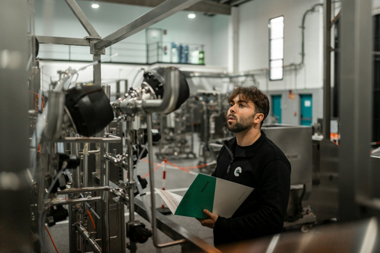

## Что такое инвестиционный план?

С помощью **инвестиций** Вы связываете финансовые ресурсы с материальными или нематериальными активами на определенный период времени – свободно доступные деньги становятся **заложенным капиталом**. Обычно это **постоянные активы**, т.е. то, что остается в Вашей компании надолго, например, здания, машины или патенты. Инвестиции в **оборотные активы** могут быть, например, товарами или сырьем, которые Вы перерабатываете или продаете и которые находятся в Вашем распоряжении лишь короткое время.
  
План **инвестиций** дает Вам обзор всех запланированных инвестиций и предоставляет информацию о том, сколько денег Вы хотите инвестировать и когда. Для этого Вы регистрируете все расходы, которые понесены **в начале** при покупке или на этапе запуска проекта. Текущие расходы на эксплуатацию и обслуживание, с другой стороны, относятся не к инвестиционному плану, а к плану **операционных ресурсов**. Вместе с любыми стартовыми затратами эти два плана образуют **план потребностей в капитале**, который также является частью Вашего [финансового планирования]() или бизнес-плана.


Предположим, что Вы хотите установить новый завод на своей фабрике, чтобы увеличить производство. Строительство этого завода обойдется примерно в 100 000 евро, которые будут включены в Ваш план инвестиций в оборудование. Однако для эксплуатации завода Вам также потребуется квалифицированная рабочая сила, энергия и сырье. Эти текущие расходы отражаются в плане капитальных затрат вместе с затратами на приобретение.


## Почему инвестиционный план необходим компаниям

Если Вы открыли компанию или занимаете руководящую должность, Вы постоянно сталкиваетесь с принятием важных **инвестиционных решений**. Хотите ли Вы купить новое оборудование, [нанять персонал]() или продвинуться в цифровом развитии – каждое решение влияет на будущий рост и успех Вашей компании. Хорошо продуманный инвестиционный план позволит Вам управлять своими расходами с дальновидностью, установить четкие приоритеты и избежать ненужных рисков.

Более того, инвестиции обычно приводят к высокой **потребности в капитале**, которую Вы часто можете покрыть только за счет внешних кредиторов, таких как банки и инвесторы. Убедительное планирование инвестиций показывает им, что Вы умеете обращаться с деньгами, и повышает Вашу **кредитоспособность**. И последнее, но не менее важное: в инвестиционном расчете Вы также рассчитываете потенциальную выгоду от своих инвестиций и определяете, когда Ваши капиталовложения станут прибыльными.

## Виды инвестиций: простое объяснение

В зависимости от цели и сроков инвестирования можно выделить 4 типа инвестиций:


Первоначальные инвестиции, также известные как стартовые инвестиции, включают в себя все расходы, которые Вы делаете для первоначального оснащения Вашей компании, чтобы запустить Ваш бизнес. Как правило, для этого типа инвестиций требуется самый большой капитал. Различают настоящие инвестиции и чисто стартовые расходы, такие как регистрация в органах власти, которые не способствуют увеличению стоимости Вашей компании.



Инвестиции в расширение – это расходы, с помощью которых Вы расширяете свои возможности. Например, если спрос на Ваши товары или услуги вырос, Вам следует включить в свой инвестиционный план увеличение количества оборудования или персонала. Инвестиции в расширение производства обычно амортизируются через некоторое время, поскольку они сопровождаются прогнозируемым увеличением оборота.



Главное, чего Вы ожидаете от рационализаторских инвестиций, – это снижение затрат. Например, Вы можете вложить деньги в роботов, чтобы автоматизировать и ускорить производственные процессы и сэкономить на оплате труда. Однако по сравнению с инвестициями в расширение производства, Вы не увеличиваете мощности, а в основном повышаете эффективность.



Инвестиции на замену необходимы, если Вам нужно полностью заменить устаревший или неисправный актив, чтобы поддерживать Ваш бизнес в рабочем состоянии. Это также известно как реинвестирование. Это просто вопрос поддержания или восстановления прежнего состояния без изменения мощности или эффективности Вашего бизнеса.


## Срок полезного использования и амортизация капитальных товаров

Как Вы уже поняли из различных типов инвестиций, **время приобретения** и ожидаемый **срок полезного использования** капитальных товаров играют решающую роль в Вашем инвестиционном планировании. Поэтому Вы должны составлять свой инвестиционный план не только на начальном этапе, но и на весь срок службы Ваших активов.  
  
Например, в инвестиционном плане для машин Вы определяете для каждой машины, как долго Вы хотите ее использовать и когда Вам, вероятно, придется ее заменить. Таким образом, в течение срока службы Вы должны не только генерировать затраты на приобретение, но и создавать **резервы**, чтобы Вы могли заменить машины, когда придет время.

Гипотетические затраты на эти резервы появляются в балансе (например, в годовом финансовом отчете) как **амортизация**. Точнее, амортизация учитывает **износ** актива в течение всего срока его полезного использования. Например, если Вы покупаете станок за 20 000 евро, который должен оставаться в Вашей компании в течение 10 лет, то каждый год его стоимость уменьшается на 10%, т.е. на 2 000 евро, которые Вы заносите в отчет о прибылях и убытках как амортизацию.

## Как составить инвестиционный план – за 6 шагов

1. **Определите свои цели**: Например, Вы хотите расширить производственные мощности в ответ на растущий спрос или выйти на новые рынки? Тогда это предполагает составление инвестиционного плана для приобретения большего количества машин. Другими словами, Вы должны четко понимать, чего Вы хотите достичь с помощью каждой инвестиции.

2. **Уточните финансирование**: Проанализируйте, сколько денег Вам нужно для реализации Вашего проекта и как Вы можете его финансировать. Собственный капитал, кредиты или субсидии – Вам решать, какое финансирование подходит для Ваших инвестиций.

3. **Установите приоритеты**: Не все, что желательно, может быть профинансировано. Определите, какие инвестиции имеют наивысший приоритет, а какие Вы можете отложить на потом. Отдайте предпочтение инвестициям, которые стратегически способствуют достижению Ваших целей и оказывают непосредственное влияние на Ваш бизнес.

4. **Посчитайте затраты и выгоды**: Естественно, Ваши инвестиции должны принести плоды как можно быстрее. Поэтому тщательно рассчитайте затраты, которые Вы понесете, и выгоды, которые Вы ожидаете от каждой инвестиции. С помощью такого [анализа затрат и выгод]() Вы сможете избежать ненужных и плохих инвестиций.

5. **Планировать временной горизонт**: Инвестиционный план поможет Вам организовать необходимые расходы с точки зрения времени и использовать средства таким образом, чтобы обеспечить финансирование в долгосрочной перспективе. Благодаря реалистичному расписанию того, когда Вы будете приобретать те или иные капитальные товары, снижается риск возникновения [узких мест в ликвидности]().
 
6. **Реализуйте свой инвестиционный план**: Прояснили ли Вы финансирование, значение, выгоду и сроки Ваших инвестиций? Тогда ничто не помешает Вам реализовать свой инвестиционный план! Регулярно проверяйте, действительно ли Ваши инвестиции достигают желаемого успеха, и при необходимости корректируйте свой план.



## Пример инвестиционного плана: Создание мастерской

Представьте, что Вы хотите открыть свой собственный гараж и Вам необходимо составить инвестиционный план, например. Вы принимаете следующие инвестиционные решения: Вместо того чтобы арендовать гараж, Вы хотите купить недвижимость с мастерской и офисом. Естественно, эта недвижимость будет самым крупным пунктом в Вашем инвестиционном плане.  

Далее, для мастерской Вам понадобится подъемная платформа и различные электрические приборы и инструменты, которые Вы внесете в инвестиционный план в раздел "Машины и оборудование". Другие предметы оборудования для мастерской и офиса могут включать в себя оборудованную кухню, столы, сиденья, верстаки, стеллажи, компьютеры и телефоны. В будущем Вы также захотите вложить деньги в собственный грузовик для разбора поломок, вторую подъемную платформу и стол для настольного футбола для перерывов.

### Как выглядит инвестиционный план?

В примере, описанном выше, инвестиционный план может иметь следующую структуру:

| **Тип инвестиций** | **Год 1** | **Год 2** | **Год 3** |
| ----------------------- | --------------- | --------------- | --------------- |
| **Имущество** | | | |
мастерская с офисом | 350,000 | – | – | – | | – |
| **Машины/оборудование** | | | | | |
| подъемные платформы | 5,000 | – | 5,000 |
электрооборудование | 10,000 | 5,000 | – | | – |
| инструменты | 5,000 | – | 2,000 |
**Транспортные средства** | | | | | |
| эвакуаторы | – | – | 70,000 |
| **Мебель** | | | | | | | | |
верстаки | 5,000 | – | – | | – |
кухня | 5,000 | – | – | | – | – |
| письменные столы | 1,000 | – | 500 | |
кресла | 1,200 | – | – | | – |
стеллажи | 500 | – | – | | – | – |
настольный футбол | – | | – | 500 |
| **IT** | | | | |
| компьютеры и мониторы | 2,800 | 700 | 1,000 |
| телефоны и маршрутизаторы | 1,000 | – | 500 |
| **Оборотные активы** | | | | | | | |
основные запасные части | 2,000 | 1,000 | 1,000 | 1,000 |
бензин, масла | 500 | 500 | 500 | 500 | 500 | 500 | 500 |
перчатки, одежда | 500 | 300 | 500 | 500 |
прочее | 500 | 500 | 500 | 500 | 500
**Сумма инвестиций** | **390,000** | **8,000** | **82,000** |

Все цифры в этом примере инвестиционного плана – чистые цены в евро.


Обратите внимание, что потребность в капитале значительно выше, чем сумма инвестиций, особенно для начинающего предприятия. К этому следует добавить.
- **Единовременные стартовые расходы**, такие как регистрационные сборы, оплата услуг консультантов или церемонии открытия
- **Постоянные операционные расходы**, включая аренду, коммунальные услуги, страхование, Интернет и телефонию
- **Расходы на персонал** и Ваши собственные доходы для покрытия личных расходов на проживание
- **Расходы на рекламу**, например, корпоративный дизайн, веб-сайт, размещение рекламы


## Самые распространенные ошибки при планировании инвестиций

Чтобы Ваше инвестиционное планирование было успешным, Вам следует избегать следующих "подводных камней":

- **Путаница с планированием потребностей в капитале**: Инвестиционный план покрывает только часть потребностей в капитале. Примите во внимание дополнительные расходы, особенно на текущие операционные расходы и расходы на персонал.
    
- **Нечеткие цели или приоритеты**: Прежде чем инвестировать хотя бы один евро, Вам следовало бы уточнить, насколько срочны те или иные инвестиции и какие из них в наибольшей степени способствуют достижению Ваших бизнес-целей. Таким образом, Вы всегда будете знать, на что следует потратить деньги немедленно, а с чем можно подождать.
    
- **Недооценивайте затраты, переоценивайте выгоды**: Не будьте слишком оптимистичны в отношении эффекта от Ваших инвестиций. Иногда для амортизации затрат на приобретение требуется больше времени, чем ожидалось. Лучше рассчитать слишком много, чем слишком мало затрат, чтобы у Вас был запас на случай непредвиденного роста цен.
    
- **Чутье вместо расчетов**: Даже если Вы не очень любите математику, Вам следует серьезно и тщательно провести инвестиционные расчеты. Например, рассчитайте [рентабельность]() различных инвестиций, чтобы принять правильное инвестиционное решение.

## Программное обеспечение для планирования инвестиций: как следить за своими инвестициями

Если для простого инвестиционного плана может быть достаточно шаблона в Excel или Word, то в больших компаниях объемы и структуры данных быстро становятся неуправляемыми и сложными. Например, бескодовая база данных [SeaTable]() – идеальное программное обеспечение для планирования инвестиций, которое поможет Вам вести общий обзор. Интуитивно понятный пользовательский интерфейс напоминает электронную таблицу, но SeaTable предлагает значительно больше функций и даже возможность [создавать собственные приложения]().
  
С помощью **формул и статистики**, а также **видов и плагинов** (таких как галереи, календари, доски Kanban), Вы сможете оценить и визуализировать Ваши данные в кратчайшие сроки. SeaTable также поддерживает совместную работу в Вашей компании, например, с помощью функции **комментариев** и **синхронизации** изменений в режиме реального времени. Гранулярные полномочия позволяют Вам контролировать, кто именно может видеть и редактировать те или иные данные. И последнее, но не менее важное: Вы можете использовать **App Builder** для разработки индивидуальных интерфейсов и процессов. Например, Вы можете использовать **форму** для заявок на инвестиции, которую каждый сотрудник компании может использовать для подачи заявок на покупки.  

Для начинающих компаний профессиональное программное обеспечение для планирования инвестиций часто означает высокие затраты до получения дохода. Хорошо, что SeaTable масштабируется: начните с **бесплатной версии**, которая уже предлагает Вам все основные функции, и платите за обновления, только если Вам нужно больше места для хранения, функций или учетных записей пользователей. SeaTable растет вместе с Вашими требованиями и Вашей командой!  
  

  
У Вас также есть выбор: предпочитаете ли Вы удобство и масштабируемость облака – или хотите наслаждаться полным суверенитетом данных при локальной установке с [SeaTable Server](). Если Вы используете [SeaTable Cloud](), Ваши данные хранятся в немецких дата-центрах в соответствии с GDPR и защищены от передачи на серверы в США и других странах.

## Часто задаваемые вопросы об инвестиционном плане


Инвестиционный план – это часть Вашего бизнес- или финансового плана, в которой перечислены все запланированные расходы на долгосрочное приобретение оборудования, зданий или других активов. Вместе с планом оборотного капитала он служит для определения Ваших потребностей в капитале.



Как правило, инвестиционный план представляет собой табличный список всех планируемых инвестиций. Вид и объем инвестиционного плана может варьироваться в зависимости от сложности и размера Вашей компании. Например, это может быть многолетний инвестиционный план для машин и оборудования или инвестиционный план для начинающего бизнеса.



Когда речь заходит о профессиональном планировании инвестиций, объяснить это не так-то просто. Прежде всего, речь идет о том, чтобы прояснить цели и приоритеты, рассчитать затраты и выгоды, провести тщательную оценку инвестиций и затем принять обоснованные решения. Фактор времени также играет важную роль. Особенно при создании компании не следует забывать, что требования к капиталу выходят далеко за рамки инвестиций. Если Вы хотите получить более подробную информацию об инвестиционном планировании и больше объяснений, Вы можете найти это в статье.



Вы используете амортизацию для создания балансовых резервов для замещающих инвестиций. Амортизация относится к уменьшению стоимости активов в течение всего срока их полезного использования. Например, если Вы инвестируете 60 000 евро в служебный автомобиль, который Вы хотите использовать в течение 20 лет, ежегодная амортизация составит 5 процентов (одну двадцатую) от стоимости покупки, т.е. 3 000 евро.
