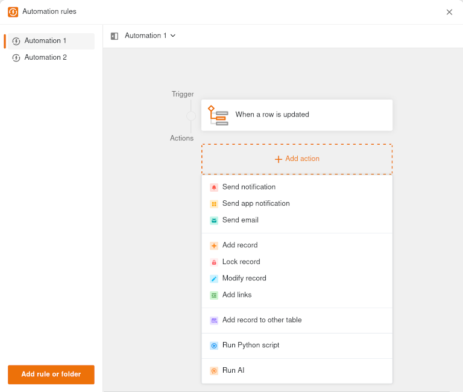

## Los retos de la escasez de competencias en TI

Según estimaciones estadounidenses, en 2030 habrá **una escasez de unos 4,3 millones de trabajadores de TI en todo el mundo**. Aunque la ralentización de la economía mundial ha aliviado algo la situación, la digitalización sigue avanzando, lo que significa que se necesitarán más expertos en TI a largo plazo. En consecuencia, el mercado laboral de las TI ha crecido considerablemente en los últimos años y se ha diferenciado cada vez más.

### Por qué la escasez de competencias en TI perjudica a las empresas

La transformación digital está provocando una creciente demanda de nuevas cualificaciones y especializaciones que nuestro sistema educativo aún no ha sido capaz de cubrir adecuadamente. Para las empresas, este déficit de personal en TI significa que **son menos capaces de innovar y trabajan con menos eficiencia**, ya que la digitalización de sus procesos se retrasa. Además, la falta de personal informático también alberga **peligros para el buen funcionamiento de las operaciones**, ya que los expertos informáticos garantizan la seguridad, integridad y disponibilidad de los sistemas. En caso de emergencia, la escasez de estos especialistas puede paralizar toda la empresa. A largo plazo, la escasez de especialistas en TI plantea por tanto la cuestión de la **competitividad y sostenibilidad** tecnológica y económica de las empresas y sus emplazamientos.

### No hay escasez de especialistas en TI en todas partes

El índice de mano de obra cualificada de Hays muestra que la escasez de especialistas en TI varía enormemente entre **industrias y grupos ocupacionales**. Mientras que la demanda en la industria del automóvil y la ingeniería mecánica ha descendido de forma significativa, otros sectores de la economía siguen buscando desesperadamente especialistas en TI. Además, algunos grupos profesionales como los especialistas en seguridad informática, los desarrolladores de bases de datos y los arquitectos informáticos están muy solicitados, mientras que la demanda de profesiones informáticas tradicionales de desarrollo, administración y soporte está disminuyendo.

Esto podría estar relacionado con el hecho de que algunas tareas en estas áreas pueden ahora simplificarse, acelerarse o ser asumidas completamente por **procesos automatizados, servicios en la nube y herramientas asistidas por IA**. Algunas empresas ya están utilizando la inteligencia artificial para contrarrestar la escasez de especialistas en TI y quieren utilizar la IA para sustituir a los expertos en TI que faltan. Sin embargo, la demanda de especialistas en IA aumentará y surgirán nuevos perfiles laborales.


Otra megatendencia, aún muy desconocida, que podría revolucionar el desarrollo de aplicaciones y contrarrestar realmente la escasez de especialistas en TI es el llamado **desarrollo sin código**. Puede obtener más información al respecto en el transcurso del artículo.


### Problemas a los que se enfrentan las empresas con escasez de especialistas en TI

Muchas empresas se quejan de que los candidatos adecuados no están dispuestos a trasladarse. Esto demuestra que la escasez de especialistas en TI también varía de una región a otra y que las empresas con ubicaciones menos atractivas lo pasan mal. Al mismo tiempo, sin embargo, las propias empresas admiten que no satisfacen los **deseos de trabajo móvil y horarios flexibles**. Aquí queda mucho potencial por explotar, ya que la mayoría de los empleos en [TI]() no requieren la presencia en una oficina. En algunos empleos de TI actuales, es incluso habitual poder trabajar donde y cuando uno quiera.  
  
Sin embargo, la mayor brecha existe entre las **expectativas salariales de los solicitantes** y lo que los empleadores pueden o quieren pagar. La mayoría de los profesionales de TI saben lo que valen, por supuesto, porque en todas partes se dan cuenta de que son un recurso escaso y muy competitivo. A menudo pueden elegir entre varias ofertas de trabajo y escoger la mejor. Por otro lado, los reclutadores suelen tener un [presupuesto]() limitado y necesitan encontrar **profesionales de TI altamente cualificados** que se conformen con un salario medio.

## Soluciones para la escasez de competencias en TI

En términos macroeconómicos, sólo hay una solución para la escasez de competencias: **aumentar el número de profesionales de TI** para satisfacer la demanda. En lugar de esperar alivios e incentivos políticos (por ejemplo, para la inmigración de trabajadores cualificados), las empresas también pueden marcar la diferencia por sí mismas.
  
Algunas ya tienen **la inteligencia artificial en su radar** como solución potencial para contrarrestar la escasez de mano de obra cualificada en TI. Sin embargo, actualmente la IA sólo puede sustituir a los procesos manuales que pueden estandarizarse y automatizarse. En general, es probable que el mayor uso de la IA incluso aumente la demanda de especialistas en TI; sólo disminuirá la demanda de determinados perfiles laborales.

### Entrada lateral sin titulación en TI

Algunas empresas están adoptando el prometedor enfoque de **rebajar los requisitos de titulación académica** para atraer a más especialistas en TI. Según el estudio alemán Bitkom, uno de cada cuatro puestos de trabajo en el sector de las TI va a parar ahora a un trabajador de entrada lateral, lo que significa que la entrada lateral es tan común como la obtención de un título en TI. La mayoría de los que cambian de carrera tienen un título universitario o una formación profesional no especializado en TI, pero han adquirido suficientes conocimientos de TI a través de la formación autodidacta, la formación continua o la experiencia profesional.

Las empresas que no pueden pagar salarios elevados también deberían considerar la posibilidad de dar una oportunidad a los **abandonados de los estudios sin titulación oficial**. Entre ellos se encuentran a menudo los mayores cracks, que sienten pasión por las TI y adquieren mucha experiencia práctica en su tiempo libre.

### Contrate a jóvenes profesionales o fórmelos usted mismo

En lugar de costosos expertos en TI con décadas de experiencia profesional, puede ser suficiente para determinados puestos de TI contratar a **entrantes en la profesión tras una titulación o formación en TI**. Suelen tener experiencia inicial, pero necesitan más orientación y tiempo de familiarización. A cambio, pueden desplegarse con flexibilidad y son bastante más baratos que un especialista en TI en un campo concreto.  
  
A largo plazo, lo más sensato es, naturalmente, **contratar a estudiantes que trabajen en TI o formar a profesionales de TI en su propia empresa**. De este modo, puede vincular a las personas a su empresa al principio de su vida profesional y prepararlas para una carrera posterior en TI con el fin de evitar la escasez de especialistas en TI. La desventaja es que usted invierte mucho esfuerzo internamente en aprendices y estudiantes que al principio sólo puede utilizar para tareas más sencillas.

### Promueva la formación continua de los empleados expertos en TI

Según el [estudio Bitkom](https://www.bitkom.org/Presse/Presseinformation/Deutschland-fehlen-IT-Fachkraefte), casi un tercio de las empresas cuentan con **programas de formación para cualificar a los empleados para nuevas tareas**. Esto la convierte, con diferencia, en la forma más citada para contrarrestar la escasez de especialistas en TI, y tiene mucho sentido. Tras una formación específica, los empleados de los departamentos especializados a menudo pueden asumir por sí mismos tareas que, de otro modo, tendrían que realizar los especialistas en TI.  
  
En particular, **los empleados con afinidad por la tecnología sin conocimientos profundos de TI** -los llamados [desarrolladores ciudadanos]()- pueden hacer una valiosa contribución a la transformación digital en la interfaz entre TI y los departamentos especializados. Conocen al dedillo los procesos empresariales y experimentan dónde se atascan las cosas en el día a día, por lo que pueden aportar la mayor contribución a los proyectos de innovación en cuanto a qué procesos podrían optimizarse, digitalizarse o automatizarse.

## Por qué No Code puede ser la solución

No Code es un enfoque que contrarresta eficazmente la escasez de competencias informáticas al permitir que los usuarios expertos en tecnología sin cualificaciones informáticas formales den forma activa a la transformación digital. Esto supone un cambio de paradigma fundamental: el desarrollo tradicional de software requiere aprender lenguajes de programación y una larga familiarización con las herramientas de desarrollo. **En cambio, con una plataforma sin código, cualquiera -sin conocimientos informáticos ni de programación- puede desarrollar sus propias aplicaciones**. Los elementos prefabricados pueden ensamblarse en soluciones de software siempre nuevas mediante la función de arrastrar y soltar.  
  
De este modo, los empleados de sus departamentos especializados pueden desarrollar **aplicaciones adaptadas a sus procesos**, algo que antes tenían que hacer especialistas en TI con formación específica. Esto descarga al departamento de TI y permite a los departamentos especializados trazar y digitalizar sus procesos exactamente como desean. El hecho de que los departamentos especializados participen directamente en el proceso de desarrollo y se necesiten menos bucles de coordinación y espera aumenta tanto la **velocidad de la transformación digital** como la **precisión de ajuste de las soluciones**. Y por último, pero no por ello menos importante, las empresas necesitan menos especialistas en TI en general, que pueden concentrarse en tareas más exigentes que realmente requieren su experiencia.  
  
Dado que la mayoría de las plataformas sin código son [soluciones en la nube]() que no requieren una infraestructura de servidores propia, también se eliminan muchas tareas que normalmente requieren administradores informáticos. No obstante, los **desarrolladores sin código** están obligados, por supuesto, a implementar y mantener la plataforma sin código y a estar a disposición de los desarrolladores ciudadanos como personas de contacto. Para evitar una TI en la sombra incontrolada, debe existir una **estrategia sin código** centralizada que el departamento de TI debe desarrollar y aplicar. Esto incluye la formación de al menos un desarrollador ciudadano por departamento, una visión transparente de todas las aplicaciones y la comprensión del papel de TI como socio a nivel de los ojos.


Si los departamentos especializados no están satisfechos con los sistemas de TI oficiales, pueden buscar otras soluciones sin el conocimiento del departamento de TI. Esto puede dar lugar a una TI en la sombra en la empresa, que escapa a cualquier control y alberga riesgos importantes en términos de cumplimiento de las TI y de seguridad informática. Un [desarrollo sin código]() transparente puede evitarlo.


### Ventajas de No Code para su empresa

Las plataformas sin código aportan las siguientes ventajas a su empresa:

- **Aceleración de la transformación digital**: No code simplifica la creación de aplicaciones personalizadas. Como resultado, el desarrollo sin código es hasta un 90% más rápido que el desarrollo tradicional, desde el análisis de requisitos hasta la implementación.
    
-  **Democratización de las TI**: En principio, las plataformas sin código permiten a todos los empleados desarrollar aplicaciones de forma independiente. Esto le hace menos dependiente de expertos en TI difíciles de encontrar, que antes eran imprescindibles para cada solución, por pequeña que fuera.
    
-  **Reducir costes**: El uso de No Code puede reducir significativamente los costes de desarrollo al utilizar mano de obra cualificada menos costosa para lograr un resultado comparable o incluso mejor en menos tiempo.
    
-  **Alivio para el departamento informático**: Con No Code, los papeles están claramente distribuidos: los especialistas en TI definen el marco, los departamentos especializados aportan los conocimientos del proceso y crean la solución por sí mismos. De este modo, No Code alivia la carga del departamento de TI, que sólo tiene que gestionar el desarrollo de No Code.
    
-  **Mayor flexibilidad**: En un entorno de trabajo en rápida evolución, las herramientas Sin Código permiten a los departamentos especializados reaccionar rápidamente a los cambios y realizar ellos mismos los ajustes en sus procesos.
    
-  **Procesos automatizados y asistidos por IA**: Las funciones de automatización e IA están integradas en muchas plataformas sin código, lo que le permite sustituir los procesos manuales y minimizar los errores humanos.

## Utilice SeaTable como plataforma sin código

SeaTable facilita la utilización de las ventajas del desarrollo sin código. Comience con la **versión gratuita** y descubra todas las funciones básicas de la solución sin código: [gestión de datos]() intuitiva, visualización y evaluación sencillas (por ejemplo, con vistas y estadísticas) y el **constructor de aplicaciones sin código** integrado, con el que podrá [crear sus propias aplicaciones]() sin tener que escribir ni una sola línea de código.  
  
A diferencia de las soluciones no europeas, SeaTable le ofrece una **protección de datos** segura: Si implementa [SeaTable Cloud]() como plataforma sin código, sus datos se almacenan en centros de datos alemanes que cumplen con la GDPR y están protegidos para que no se transmitan a servidores de EE.UU. y otros países.  
  
Otra ventaja que destaca a [SeaTable como plataforma sin código]() es la **libre elección del tipo de despliegue**. Benefíciese de la comodidad y escalabilidad de la nube SeaTable o conserve el control total y la soberanía de los datos con una instalación local de [SeaTable Server]().



Suscríbase gratuitamente a nuestro **boletín informativo** y reciba periódicamente noticias relevantes y perspectivas del sector.



## Conclusión: mitigar la escasez de competencias informáticas con No Code

En definitiva, las plataformas sin código son el enfoque más prometedor para mitigar la escasez de competencias en TI y acelerar la transformación digital. Aunque no aumentan el número de especialistas en TI disponibles, reducen la necesidad del desarrollo de software tradicional y permiten a los usuarios de los departamentos especializados crear sus propias soluciones. Como resultado, la programación sin código libera al departamento de TI de tareas que también pueden realizar los desarrolladores ciudadanos.  
  
En última instancia, con No Code puede ahorrarse puestos de TI adicionales que de todos modos tendría dificultades para cubrir. Sin embargo, los informáticos profesionales siguen siendo indispensables y pueden concentrarse en tareas más complejas que realmente requieren conocimientos informáticos profundos gracias a No Code.

## Preguntas frecuentes sobre la escasez de competencias informáticas y No Code


La principal razón del elevado salario de los especialistas en TI es la fuerte demanda de determinadas cualificaciones debido a la creciente digitalización. Por ello, en función de la experiencia profesional y la especialización, un informático puede ganar bastante más que la media.



Sí, hay más vacantes en TI que trabajadores cualificados que puedan cubrirlas. Existe una escasez mundial de millones de especialistas en TI. Sin embargo, la magnitud de la escasez de especialistas en TI es significativamente mayor en algunos países, sectores y grupos profesionales que en otros.



No, los empleos de TI no quedarán obsoletos como resultado de No Code y los especialistas profesionales en TI siguen estando muy demandados. No code simplemente está cambiando la descripción del trabajo del desarrollador de software tradicional por la de un desarrollador sin código, que está más implicado en la configuración de plataformas sin código y en el apoyo a los desarrolladores ciudadanos. Esto permite a las empresas compensar la falta de personal informático y acelerar la digitalización.  



Actualmente se buscan especialistas en TI para todos los ámbitos. Sin embargo, la demanda de puestos de TI tradicionales podría disminuir en el futuro debido a la automatización, el No Code y la inteligencia artificial. Los expertos en TI para infraestructuras complejas y críticas para el negocio (por ejemplo, especialistas en seguridad de TI, desarrolladores de bases de datos y arquitectos de TI) seguirán siendo indispensables. También se espera que aumente la demanda de especializaciones en IA, No Code y automatización.

