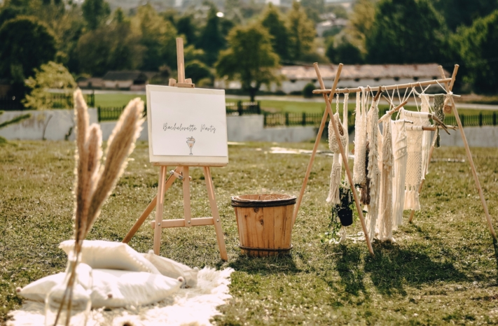
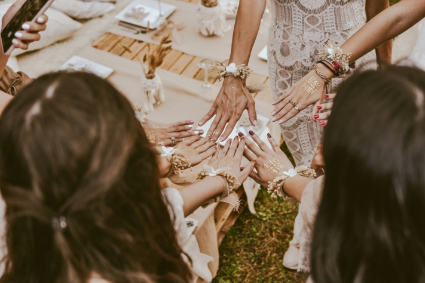
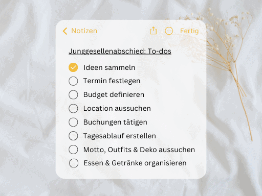
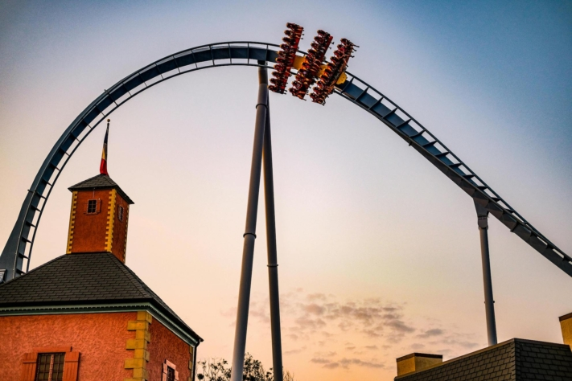
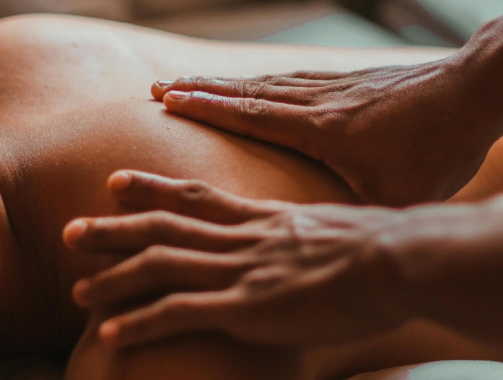
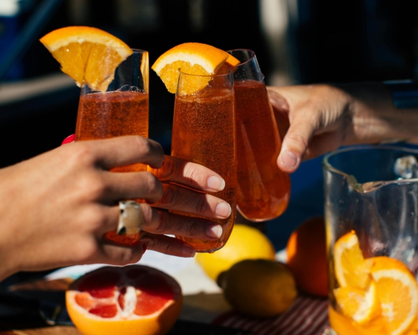

Three things are considered indispensable for the classic stag party: eye-catching **T-shirts**, a **hawker's tray** filled with all kinds of curiosities and a **lively location**. But why shouldn't it be something special? After all, you usually only get married once in your life and the **stag party** can be just as unique and unforgettable as the wedding itself.

Creating this unforgettable event requires careful planning. Would you like to follow in the footsteps of the movie _Hangover_ and travel to Las Vegas? Then you not only need to book **flight tickets** and a **hotel**, but also plan **vacation days**.

In this article, we not only present original ideas for the stag party, but also explain in detail what you need to consider when planning and how best to proceed.

Some cultures have special traditions in connection with stag parties.

## The tradition behind the stag party

The celebration of the stag party has a long and rich tradition dating back to ancient Greece. Even back then, the farewell to bachelorhood was celebrated with great festivities.

Brides and grooms often tend to organize their farewell parties separately. However, this is by no means a must. The decision as to whether the celebrations should be held together or separately is entirely up to the future spouses and their individual preferences.

Some couples celebrate their bachelor and bachelorette parties together, known as a "Jack and Jill Party" or "Stag and Hen Party". This modern twist provides an opportunity for families and friends of both parties to come together to celebrate the couple and symbolically support the start of their lives together.



## What to consider before planning

The **responsibility** for planning the stag party often lies with the **groomsmen and groomswomen**. Whether you announce the big party or **surprise** the bachelors is entirely up to you. But before the planning gets into full swing, there are a few important considerations to bear in mind.

First of all, it is crucial to decide in advance which **friends and relatives** should attend the ceremony. However, this decision should ultimately be made by the future spouses, not by the witnesses alone.

The **cost** of the stag party is usually split between all participants, with the bride and groom invited as guests of honor. It is therefore important to plan and agree the **budget** carefully so that you don't offend anyone or overstretch yourself financially.

For many, the stag party is an important rite of passage from being a bachelor to married life.

Another important aspect is the choice of **time** for the stag party. If it's just a single evening event, it can easily take place at the weekend and the surprise for the guest of honor will be easier.

However, if a short trip is planned that may even require **a vacation**, the surprise is more difficult. In any case, it is advisable to involve your partner in the plans, especially if a surprise is planned, so that they can make the necessary arrangements in the background.

## The ultimate checklist for the stag party

Organizing a stag party can be an exciting but challenging task. Between **finding a date**, making **bookings** and **planning the day's schedule**, it's easy to forget something. To ensure that you leave nothing to chance and plan every detail perfectly, a comprehensive checklist is essential.

These are the essential steps to ensure that the stag party is a complete success:

You should tick off these points for the perfect stag party.

## Ideas for a unique stag party

Whether you're looking for a fun activity or a luxurious location, the following ideas offer dazzling nightlife, breathtaking thrills or well-deserved relaxation that will make your stag or hen party an absolute highlight.

### City trips

Spacer

- Cologne
- Hamburg
- Berlin
- Munich

Spacer

- Frankfurt
- Düsseldorf
- Stuttgart
- Leipzig

City trips can quickly become expensive as they include accommodation, meals and activities.

### Short vacation

Spacer

- Las Vegas
- Majorca
- Budapest
- Barcelona

Spacer

- Prague
- Amsterdam
- Ibiza
- Dublin

More and more stag and hen parties are taking place over an entire weekend instead of just one night.

### Adrenaline and adventure

Spacer

- Bungee jumping
- Jet ski or canoe tour
- Climbing park
- Amusement park

Spacer

- Laser tag or paintball
- Karting or quad biking
- Flight simulator
- Survival training

Many theme parks offer special group discounts, making them an affordable option.

### Relaxation and wellness

Spacer

- Spa
- Yoga retreat
- Meditation course
- Thermal bath

Spacer

- Herb hike
- Wine tasting
- Flotation tanks
- Whirlpool party

In recent years, a trend towards healthier stag parties has emerged, with activities such as yoga and wellness taking center stage.

### Creative courses

Spacer

- Sushi cooking course
- Pottery workshop
- Cocktail mixing
- Photography excursion

Spacer

- Street art workshop
- Goldsmith course
- Kintsugi course
- Drink-and-paint session

Some opt for alternative activities during the stag party, such as cooking classes, cocktail nights or even humanitarian work.

## Involve the bride and groom

A stag party can look very different. For some, a party vacation is the ultimate, for others it sounds more like an absolute nightmare. To ensure that this special day really is a wonderful experience for the bride and groom, it is best to observe the following rules:

1. **Have personal conversations:** Have personal conversations with the bride or groom to find out what kind of stag party they would like. This exchange will allow you to get a precise idea of their individual ideas and wishes.
2. **Take preferences and interests into account**Take into account the personal preferences and interests of the bachelor or bachelorette to create a very special experience. Whether it's a relaxing spa break, an exciting day of adventure or an exuberant celebration - the most important thing is that the bride or groom feels at ease.
3. **Plan special surprises:** Plan special surprises for the bride or groom during the stag party. These could be personal gifts, unexpected guests or unique experiences that will give the day a special touch and make it unforgettable.

The stag party is often planned as a surprise for the bride or groom.

## Tips for a successful stag party

A stag party should be an unforgettable day full of fun and joy that everyone will remember for a long time to come. To make this a success, there are a few important points to bear in mind. Here are some valuable tips to help you organize the perfect stag party.

- First of all, it is essential to be prepared for **bad weather** be prepared for bad weather. Even if you are hoping for sunshine and blue skies, the weather can be unpredictable. It is therefore advisable to have an indoor backup plan or to have weatherproof clothing and umbrellas ready so that you can enjoy the day even if it rains.
- Another important point is the **scheduling**. Make sure that the bride or groom has no other commitments on the day of the stag party. Early communication of the date and regular checks will ensure that there are no unexpected clashes.
- Don't forget to keep the **memories** capture them. Especially in today's digital era, it's as easy as it is popular to document the special moments in the form of photos and videos. Hire someone from the group or perhaps even hire a professional photographer to create high-quality memories.

Some stag parties have specific themes or colors.

- **Surprises** are the salt in the soup of a stag party, but should be used in moderation. Too many surprises can quickly become overwhelming. Make sure that the planned activities are well coordinated and suit the tastes of the guest of honor.
- After all **flexibility** is the be-all and end-all. Despite careful planning, unexpected events can occur. Be prepared to adapt the plan spontaneously and find alternatives so that the day runs smoothly despite minor obstacles and is an unforgettable experience for everyone involved.

## Online planner for the perfect stag or hen party

Are you facing the challenge of planning the ultimate stag party for your best friend? No need to worry! With SeaTable's [free template](), you can realize your planning effortlessly.

The template can be easily adapted to your needs by deleting the sample entries and entering your own data. In SeaTable, you can organize and visualize data so clearly that you always have an overview of activities, to-dos, guests and finances.

But SeaTable doesn't just support witnesses to the marriage: the future spouses can also use SeaTable as a free [wedding planner]() to make the most beautiful day of their lives perfect. To register for free, enter your e-mail address [here]().
