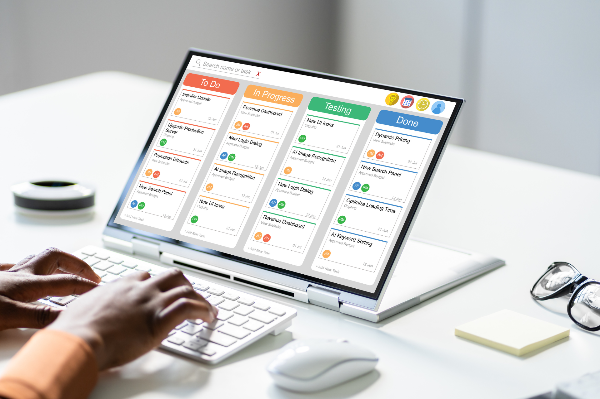

## Kanban - an agile workflow management method

Kanban is a very popular [agile method]() to **visualize** and optimize work processes. With a Kanban board, you can make your team's work transparent, easily identify bottlenecks and set priorities. The **entry barrier is very low** and you can integrate this method into your processes without any special preparation or restructuring. However, to really get the most out of it, we recommend that you also familiarize yourself with the [Kanban principles]().

## What should you look out for when choosing the right Kanban tool?

Kanban is a method that is easy to implement and does not require any special technical setups. Nevertheless, you should not make a hasty decision for or against a **digital Kanban board**. Available additional functions, the price, user-friendliness and flexibility are important factors that will ultimately have an impact on your satisfaction and the acceptance of the new software in the team. This is because some Kanban board tools differ significantly from one another. We recommend considering these criteria in particular to ensure that the tool is ultimately **optimally suited to the requirements of your team** and project.

\- **Task management functions:** Can you define subtasks, create checklists, set deadlines and alerts and assign tasks (automatically) to employees?

\- **WIP limits:** Work in Progress limits are an important element in actively preventing your available resources from being overloaded. Can you define and control limits in the tool?

\- **Real-time collaboration:** Can you actually see the current status of tasks, or only with a time delay? Does the tool offer integrated chat and notification functions for a quick exchange?

\- **Integrations:** Can existing tools such as calendars, email or messenger services be seamlessly integrated?

\- **Reporting:** Can you evaluate your processes, record important metrics and create reporting dashboards?

\- **Price and scalability:** How far can you get with Kanban Board freeware and can you scale without needing a new tool?

\- **User-friendliness:** Does your team need onboarding or is the tool intuitive to use?

\- **Security and data protection:** Does the tool offer access restrictions and two-factor authentication? Is it data protection compliant or could you run into data protection issues?

## 15 Kanban board freeware solutions in comparison

### SeaTable

The **no-code platform SeaTable** is a database-based cloud solution for numerous use cases. Users appreciate the **flexibility** in the implementation of individual customizations as well as the **user-friendly interface**. SeaTable combines database functions with the simplicity of a spreadsheet and already offers numerous functions in the free plan: various views such as timeline, calendar and Kanban; **third-party integrations; notifications and deadline alerts, chat functions; dashboards** and a **universal app builder**. Teams collaborate with each other in real time. Kanban boards can be created with just a few clicks and tasks can be moved simply by **drag-and-drop**. Automations are included from the Plus plan onwards, WIP limits can be set up via the integrated scripts. Teams can use the **Free plan with up to 25 users**, there is no limit for Kanban boards. SeaTable stores all data **only on servers in Germany** and also scores highly in terms of data protection and data security. A special feature: SeaTable also offers an on-premises solution.



**Advantages:** Intuitive use, real-time collaboration, highly flexible, scalable, can be used as a cloud or on-premises solution, flexible WIP limits via scripts

**Disadvantages:** Automations only from Enterprise plan upwards

**Price:** Extensive basic version free of charge for up to 25 users; then from €7 per user/month

### ClickUp

ClickUp is a popular project and communication management tool. The Kanban boards in ClickUp are customizable and allow you to create **individually adaptable workflows.** Integrated automation rules, chat functions, deadline warnings and user-defined fields for status control as well as the possibility to set WIP limits round off this Kanban tool freeware. The **high complexity**, which makes it difficult for beginners in particular to get started quickly, and recurring performance problems must be rated negatively. ClickUp stores all data on servers in the USA and is therefore not convincing in terms of data protection.

**Advantages:** Flexible, integrated dashboards, comment function, tool integrations

**Disadvantages:** Steep learning curve for beginners, occasional performance problems, compromises in data protection

**Price:** Free with limited functions for max. 5 projects; extended plans from €6.68 per user/month

### Trello

Trello is a well-known and simple tool that is used in particular by small teams and individuals. The intuitive card and board interfaces allow users to get started quickly. However, the **Kanban functions are unsatisfactory overall**, in particular the lack of WIP limits restricts functionality. Added to this are the overall limited basic functions and the **limit of 10 boards in the free plan.** Further functions, such as automation or analyses, are subject to a charge. Trello also stores all data in the USA.

**Advantages:** User-friendly, quick to learn

**Disadvantages:** Limited scalability for complex workflows, limited to 10 boards in the free plan, lack of WIP limits

**Price:** Free in the basic version; premium options from €5 per user/month

### Monday.com

Monday.com is also a project management tool that is particularly known for its list view. Tasks can also be automated here. However, if you are looking for a Kanban solution, this is probably not the right tool for you. Mondays **Kanban functions are limited** and are restricted to the fact that you can create a board. You can neither create reports nor set WIP limits. As Kanban board freeware, this solution is not at all convincing with its limitation to two users for free use.

**Advantages:** Intuitive use, automation, flexible views

**Disadvantages:** Higher costs, complex with complicated processes, no real Kanban functions

**Price:** Free for 2 users; otherwise from €16 per user/month

### MeisterTask

MeisterTask is a flexible workflow management tool from Austria that focuses on simplifying complex workflows through automation and real-time collaboration. Thanks to its **user-friendly interface and intuitive usability** you will quickly be able to create your first board. MeisterTask offers automation and can be flexibly customized. However, third-party integrations and reporting are only available to a limited extent in the Free plan. The **Free plan is limited to 3 projects** and is therefore only suitable for occasional use.

**Advantages:** flexible and scalable, automation, real-time collaboration

**Disadvantages:** WIP limits only in the Pro version, limited integrations and reporting functions in the Free plan

**Price:** Free to use for 3 projects, thereafter €13.50 per user/month

### Kanban Tool

The Polish software Kanban-Tool is one of the older free Kanban tools and impresses above all with its ease of use. A big **plus point is the time monitoring function**, with which you can record important metrics such as lead time. In terms of real-time collaboration, however, the tool can only be recommended to a limited extent,** especially larger teams will quickly reach their limits here.

**Advantages:** Easy to use, time monitoring, real-time updates, WIP limits

**Disadvantages:** Limited use for larger teams, outdated user interface, limited integrations, automation only from Enterprise

**Price:** Free for two users and two boards, team plan from €6 per user/month

### Asana

Asana is one of the best-known workflow management tools on the market and offers other visualization functions in addition to Kanban. The ability to divide tasks into manageable subtasks is particularly practical. The tool offers integrated automation rules and notification functions, but only **limited analysis and reporting functions**, so you cannot record any performance metrics. You also cannot set WIP limits.

**Advantages:** multiple integrations, good collaboration tool, automations, notifications

**Disadvantages:** Limited reports and automations in the free version, no WIP limits

**Price:** Free for up to 10 users; extended plans from €10.99 per user/month

### Jira

Jira is the standard tool for software developers to map agile task and [project management](). You can create **Kanban columns with WIP limits**. However, performance metrics can only be recorded with **paid add-ons**. Overall, Jira offers a convincing overall functional package. However, due to its **complexity and elaborate configuration**, it can quickly become overwhelming, especially for users outside of IT. One plus point is the optional data residency from the Plus version onwards.

**Advantages:** Agile methods, versatile integrations, detailed error tracking

**Disadvantages:** Complex setup, challenging for non-technical users, paid add-ons for performance analysis

**Price:** Free up to 10 users without data residency; Plus version from around €6.50 per user/month

### Zoho Projects

The Indian software Zoho Projects combines task and time management with chat and comment functions. The tool is well suited for decentralized teams, but comes with limitations as a **digital Kanban board.** The tool offers real-time collaboration, a flexible column view and the option of assigning subtasks to a task. However, WIP limits are missing completely, while alerts and **notifications cannot be used** in the free version. The **limit of two projects** in the free version means that even small teams quickly reach their limits.

**Advantages:** Real-time communication, subtasks, flexibly customizable

**Disadvantages:** limited tool integration in the free plan, no WIP limits, somewhat more complex user interface

**Price:** Free up to 3 users and 2 projects; Plus from €4 per user/month

### Microsoft Planner

If you already use the Microsoft Suite or Microsoft Teams, then Microsoft Planner is a good choice as Kanban Board freeware. Compared to other tools, however, Microsoft's solution is not convincing, as apart from basic functions such as real-time collaboration, task assignment and notifications, it lacks **advanced functions**, e.g. WIP limits or flexible dashboards. Overall, Microsoft Planner can only be customized to a limited extent.

**Advantages:** Seamless Microsoft integration, easy to use

**Disadvantages:** Limited customization, limited Kanban functions

**Price:** Free for Microsoft 365 users, otherwise from €8.60 per user/month

### Businessmap

Businessmap (formerly Kanbanize) is a Bulgarian software solution that is particularly suitable for visualizing complex processes. In addition to real-time collaboration, automation and WIP limits, Businessmap offers the option of creating extended process maps alongside Kanban boards. One disadvantage, however, is the **complexity of the tool**, which makes it difficult for new users to get started. As Kanban Board freeware, Businessmap is only suitable for small projects or to try out Kanban once, as there is **only a fourteen-day trial version** available

**Advantages:** Process cards next to Kanban, integrated chat function, WIP limits, automations

**Disadvantages:** very expensive, steep learning curve

**Price:** 14-day trial version, then from € 161 for at least 15 users/month

### Airtable

Like SeaTable, Airtable combines spreadsheet and database functions. Users can organize their data in a Kanban view and move tasks using drag-and-drop. The basic functionalities do not differ significantly from SeaTable. However, the **option to combine Kanban with timelines is missing**, as this view is not included in the free version of AirTable. As an American company with a server location in the USA, this solution is also not fully convincing in terms of **data protection law.** AirTable does **not offer integrated WIP limits**, but users can control limits or use scripts via automations. Unlike SeaTable, however, **Python scripts, for example,** are not integrated.

**Advantages:** Linking of data records, automation, basic Kanban functions

**Disadvantages:** No WIP limit, rather expensive, server location in the USA, no timeline view in the free subscription

**Price:** Free with basic functions for 5 users; otherwise from approx. 17 € per user/month.

### KanbanFlow

KanbanFlow is a simple workflow tool for Kanban boards. A unique selling point is the combination with **time recording according to the Pomodoro method**. With its strong focus on Kanban, the tool is primarily aimed at beginners who **only need basic functions**. Although this makes it very easy to get started, this free Kanban tool reaches its limits as soon as requirements increase. Free users have to do without integrations and additional security through two-factor authentication.

**Advantages:** Good for beginners, integrated Pomodoro timer, prioritization, easy to use

**Disadvantages:** no integrations in the free plan, no 2FA, limited reporting

**Price:** Free with limited functions; Premium from around €4.25 per user/month

### Wrike

Wrike offers a combination of Kanban boards, Gantt charts and comprehensive reporting. However, free users have to do without Gantt charts, timelines, dashboards and real-time reporting. The tool only offers a **limited chat function,** which is a particular problem for larger teams. Although an unlimited number of users can work with the free plan, this does not compensate for the **overall limited functions**. Anyone looking for simple free Kanban software will find a better overall package with other providers.

**Advantages:** Simple Kanban boards, WIP limits, integration with numerous third-party tools

**Disadvantages:** steep learning curve, no advanced Kanban functions or metrics, limited chat function

**Price:** Free with basic functions; otherwise from around €8.50 per user/month

## Which Kanban board freeware is best?

If you are looking for the right Kanban solution for your company, you are spoiled for choice. Numerous providers offer free tools that differ in terms of their functions, usability and scalability. You should consider the last point in particular when deciding on a Kanban tool freeware. When limited to a few users or a few boards, teams quickly reach a point where they have to switch to a paid plan. If you are looking for the **most user-friendly, flexible and scalable solution** to create a Kanban board for free, then **SeaTable is the clear favorite**.

## FAQ - Kanban Board Freeware


To use your digital Kanban board efficiently, your free Kanban software should enable these functions: WIP limits to avoid overload and slippage; automations to reduce manual tasks; integrated task assignments, prioritization and progress overview, reporting and integrations with calendars, chats and other project management apps.



All Kanban board tools are suitable for creating a simple Kanban board. However, many Kanban tool freeware providers limit the functions, the number of available boards or the number of users. It is therefore worth comparing not only the Kanban Board free tariffs, but also the paid tariffs. This allows you to scale your usage without having to change your digital Kanban board as soon as your requirements increase.



With free Kanban tools, it is also important to pay attention to data security. There are differences between providers here. Pay attention to criteria such as SSL encryption, the server location and general GDPR compliance. If data security is particularly important to you, you should consider an on-premises Kanban tool such as SeaTable Server.

