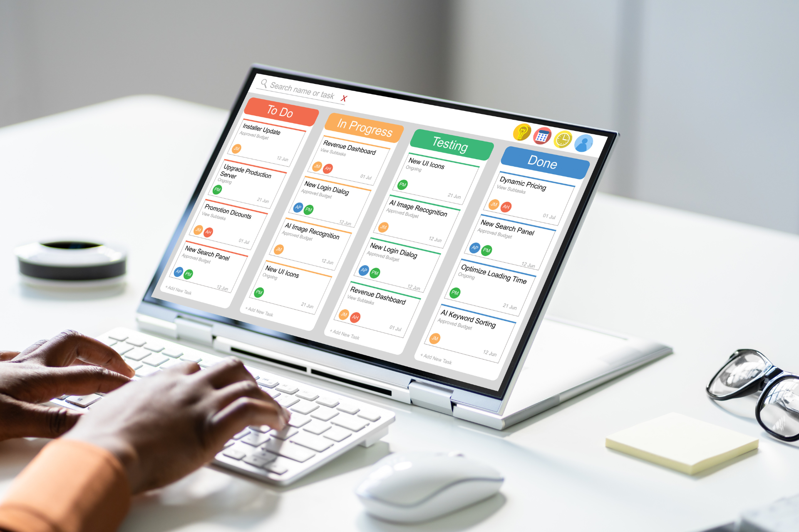

## Канбан - метод управления рабочими процессами в стиле agile

Канбан - это очень популярный [agile-метод]() для **визуализации** и оптимизации рабочих процессов. С помощью доски Канбан Вы можете прозрачно координировать работу своей команды, легко выявлять узкие места и устанавливать приоритеты. **Входной барьер очень низок**, и Вы можете интегрировать этот метод в свои процессы без какой-либо специальной подготовки или реорганизации. Однако, чтобы действительно извлечь из него максимум пользы, мы рекомендуем Вам также ознакомиться с [принципами Канбан]().

## На что Вам следует обратить внимание при выборе подходящего инструмента Kanban?

Канбан - это метод, который легко внедрить и который не требует специальных технических настроек. Тем не менее, не стоит принимать поспешных решений в пользу или против **цифровой доски Канбан**. Доступные дополнительные функции, цена, удобство использования и гибкость - важные факторы, которые в конечном итоге повлияют на Вашу удовлетворенность и принятие нового программного обеспечения в команде. Это связано с тем, что некоторые инструменты Kanban board значительно отличаются друг от друга. Мы рекомендуем рассмотреть эти критерии в особенности, чтобы убедиться, что инструмент в конечном итоге **оптимизирован под требования Вашей команды** и проекта.

\- **Функции управления задачами:** Можете ли Вы определять подзадачи, создавать контрольные списки, устанавливать сроки и оповещения, а также (автоматически) назначать задачи сотрудникам?

\- **Лимиты на незавершенные работы:** Лимиты на незавершенные работы - это важный элемент активного предотвращения перегрузки имеющихся у Вас ресурсов. Можете ли Вы определять и контролировать лимиты в этом инструменте?

\- **Взаимодействие в реальном времени:** Можете ли Вы видеть текущий статус задач или только с задержкой по времени? Предлагает ли инструмент интегрированные функции чата и уведомлений для быстрого обмена информацией?

\- **Интеграции:** Можно ли легко интегрировать существующие инструменты, такие как календари, электронная почта или службы обмена сообщениями?

\- **Отчетность:** Можете ли Вы анализировать свои процессы, записывать важные показатели и создавать панели отчетности?

\- **Цена и масштабируемость:** Как далеко Вы сможете продвинуться с бесплатным Kanban Board и сможете ли Вы масштабировать систему без необходимости приобретения нового инструмента?

\- **Удобство использования:** Нуждается ли Ваша команда в обучении или инструмент интуитивно понятен в использовании?

\- **Безопасность и защита данных:** Предлагает ли инструмент ограничения доступа и двухфакторную аутентификацию? Соответствует ли он требованиям защиты данных или у Вас могут возникнуть проблемы с защитой данных?

## 15 бесплатных решений для Kanban Board в сравнении

### SeaTable

Платформа **без кода SeaTable** - это облачное решение на основе базы данных для множества вариантов использования. Пользователи ценят **гибкость** в реализации индивидуальных настроек и **дружественный интерфейс**. SeaTable сочетает в себе функции базы данных с простотой электронной таблицы и уже в бесплатном плане предлагает множество функций: различные представления, такие как временная шкала, календарь и Kanban; **интеграция с третьими сторонами; уведомления и оповещения о сроках, функции чата; приборные панели** и **универсальный конструктор приложений**. Команды сотрудничают друг с другом в режиме реального времени. Доски Канбан можно создать всего несколькими щелчками мыши, а задачи можно перемещать простым **перетаскиванием**. Автоматизация включена, начиная с плана Enterprise и выше, лимиты WIP могут быть установлены с помощью встроенных скриптов. Команды могут использовать **бесплатный план с 25 пользователями**, для Kanban-досок ограничений нет. SeaTable хранит все данные **только на серверах в Германии**, а также имеет высокие оценки в плане защиты и безопасности данных. Особенность: SeaTable также предлагает локальное решение.



**Преимущества:** Интуитивно понятное использование, совместная работа в реальном времени, высокая гибкость, масштабируемость, возможность использования как облачного, так и локального решения, гибкие ограничения WIP с помощью скриптов

**Недостатки:** Автоматизация только в планах Enterprise и выше.

**Цена:** расширенная базовая версия бесплатно для 25 пользователей; далее - от €7 за пользователя/месяц

### ClickUp

ClickUp - это популярный инструмент управления проектами и коммуникациями. Канбан-доски в ClickUp настраиваются и позволяют Вам создавать **индивидуально адаптируемые рабочие процессы**. Встроенные правила автоматизации, функции чата, предупреждения о крайних сроках и пользовательские поля для контроля состояния, а также возможность устанавливать лимиты WIP завершают работу с этим бесплатным инструментом Канбан. Негативную оценку заслуживают **высокая сложность**, затрудняющая быстрое начало работы, в частности, для новичков, и повторяющиеся проблемы с производительностью. ClickUp хранит все данные на серверах в США и поэтому не убедителен в плане защиты данных.

**Преимущества:** гибкость, интегрированные приборные панели, функция комментариев, интеграция инструментов

**Недостатки:** сложная кривая обучения для новичков, периодические проблемы с производительностью, компромиссы в защите данных

**Цена:** бесплатно с ограниченными функциями для максимум 5 проектов; расширенные тарифные планы от €6,68 за пользователя/месяц

### Trello

Trello - это хорошо известный и простой инструмент, который особенно часто используется небольшими командами и отдельными людьми. Интуитивно понятные интерфейсы карточек и досок позволяют пользователям быстро приступить к работе. Однако **функции Канбан в целом неудовлетворительны**. В частности, отсутствие лимитов WIP ограничивает функциональность. К этому следует добавить общую ограниченность базовых функций и **ограничение до 10 досок в бесплатном тарифе**. Дополнительные функции, такие как автоматизация или анализ, являются платными. Trello также хранит все данные в США.

**Преимущества:** Удобство в использовании, быстрота освоения

**Недостатки:** Ограниченная масштабируемость для сложных рабочих процессов, ограничение на 10 досок в бесплатном плане, отсутствие ограничений на WIP

**Цена:** Бесплатно в базовой версии; премиум-варианты от €5 за пользователя/месяц

### Monday.com

Monday.com - это инструмент управления проектами, который особенно известен своим представлением списка. Задачи здесь также можно автоматизировать. Однако если Вы ищете решение для Kanban, этот инструмент, вероятно, Вам не подойдет. Понедельник **Функции Канбан ограничены** и сводятся к тому, что Вы можете создать доску. Вы не можете ни создавать отчеты, ни устанавливать лимиты WIP. Как бесплатное решение Kanban board, это решение совсем не убедительно с его ограничением на двух пользователей для бесплатного использования.

**Преимущества:** интуитивное использование, автоматизация, гибкие представления

**Недостатки:** высокая стоимость, сложность для сложных процессов, отсутствие реальных функций Канбан

**Цена:** бесплатно для 2 пользователей; в остальных случаях - от €16 за пользователя/месяц

### MeisterTask

MeisterTask - это гибкий инструмент управления рабочими процессами из Австрии, который делает акцент на упрощении сложных рабочих процессов за счет автоматизации и совместной работы в режиме реального времени. Благодаря **дружественному интерфейсу и интуитивному удобству использования** Вы быстро сможете создать свою первую доску. MeisterTask предлагает автоматизацию и может быть гибко настроен. Однако интеграция с третьими сторонами и отчетность доступны только в ограниченном объеме в бесплатном плане. План **Бесплатный ограничен 3 проектами** и поэтому подходит только для эпизодического использования.

**Преимущества:** гибкость и масштабируемость, автоматизация, совместная работа в реальном времени

**Недостатки:** Ограничения по WIP только в версии Pro, ограниченное количество интеграций и функций отчетности в бесплатном плане

**Цена:** Бесплатное использование в течение 3 проектов, затем €13,50 за пользователя/месяц

### Kanban Tool

Польская программа Kanban-Tool является одним из самых старых бесплатных инструментов Kanban и впечатляет прежде всего простотой использования. Большим **плюсом является функция мониторинга времени**, с помощью которой Вы можете регистрировать такие важные показатели, как время выполнения заказа. Однако в плане совместной работы в режиме реального времени инструмент **рекомендуется лишь в ограниченной степени**. Особенно большие команды быстро достигнут своего предела.

**Преимущества:** Простота использования, контроль времени, обновления в реальном времени, лимиты WIP

**Недостатки:** ограниченное применение для больших команд, устаревший пользовательский интерфейс, ограниченное количество интеграций, автоматизация только на уровне Enterprise и выше

**Цена:** бесплатно для двух пользователей и двух досок, командный план от €6 за пользователя/месяц

### Asana

Asana - один из самых известных инструментов управления рабочими процессами на рынке, который помимо Канбан предлагает и другие функции визуализации. Особенно практичной является возможность организации задач в управляемые подзадачи. Инструмент предлагает встроенные правила автоматизации и функции уведомлений, но только **ограниченные функции анализа и отчетности**, поэтому Вы не можете регистрировать какие-либо показатели эффективности. Вы также не можете установить лимиты WIP.

**Преимущества:** множество интеграций, хороший инструмент для совместной работы, автоматизация, уведомления

**Недостатки:** ограниченное количество отчетов и автоматики в бесплатной версии, отсутствие лимитов WIP

**Цена:** бесплатно для 10 пользователей; расширенные тарифные планы от €10,99 за пользователя/месяц

### Jira

Jira - это стандартный инструмент разработчиков программного обеспечения для составления карт agile-задач и [управления проектами](). Вы можете создать **Канбан-колонки с лимитами WIP**. Однако показатели эффективности можно регистрировать только с помощью **платных дополнений**. В целом, Jira предлагает убедительный общий функциональный пакет. Однако из-за **сложности и сложной конфигурации** она может быстро стать непосильной, особенно для пользователей, не связанных с ИТ. Одним из плюсов является опциональное хранение данных, начиная с версии Plus.

**Преимущества:** гибкие методы, разнообразные интеграции, детальное отслеживание ошибок

**Недостатки:** сложная настройка, трудность для нетехнических пользователей, платные дополнения для анализа производительности

**Цена:** бесплатно до 10 пользователей без сохранения данных; версия Plus - около €6,50 за пользователя/месяц

### Zoho Projects

Индийское программное обеспечение Zoho Projects сочетает в себе управление задачами и временем с функциями чата и комментариев. Инструмент хорошо подходит для децентрализованных команд, но имеет ограничения в виде **цифровой доски Канбан**. Инструмент предлагает совместную работу в режиме реального времени, гибкий вид столбцов и возможность назначать подзадачи для задачи. Однако лимиты WIP полностью отсутствуют, а оповещения и **уведомления не могут быть использованы в бесплатной версии**. Ограничение в два проекта** в бесплатной версии означает, что даже небольшие команды быстро достигнут своего предела.

**Преимущества:** Общение в реальном времени, подзадачи, гибкая настройка

**Недостатки:** ограниченная интеграция инструментов в бесплатной версии, отсутствие ограничений на WIP, несколько более сложный пользовательский интерфейс

**Цена:** Бесплатно до 3 пользователей и 2 проектов; Плюс от €4 за пользователя/месяц

### Microsoft Planner

Если Вы уже пользуетесь Microsoft Suite или Microsoft Teams, то Microsoft Planner - это бесплатное программное обеспечение для Kanban Board. Однако по сравнению с другими инструментами решение от Microsoft выглядит неубедительно, поскольку помимо базовых функций, таких как совместная работа в режиме реального времени, назначение задач и уведомления, ему не хватает **продвинутых функций**, например, лимитов WIP или гибких панелей. В целом, Microsoft Planner настраивается лишь в ограниченной степени.

**Преимущества:** Бесшовная интеграция с Microsoft, простота использования

**Недостатки:** Ограниченная настройка, ограниченные функции Kanban

**Цена:** бесплатно для пользователей Microsoft 365, в остальных случаях - от €8,60 за пользователя/месяц

### Businessmap

Businessmap (ранее Kanbanize) - это болгарское программное решение, которое особенно подходит для визуализации сложных процессов. Помимо совместной работы в режиме реального времени, автоматизации и ограничения WIP, Businessmap предлагает возможность создания расширенных карт процессов наряду с досками Канбан. Однако одним из недостатков является **сложность инструмента**, из-за которой новичкам трудно начать работу. Поскольку Kanban Board является бесплатной программой, Businessmap подходит только для небольших проектов или для того, чтобы попробовать Kanban один раз, поскольку существует **только четырнадцатидневная пробная версия**.

**Преимущества:** Карточки процессов рядом с Kanban, встроенная функция чата, лимиты WIP, автоматизация

**Недостатки:** очень дорого, сложная кривая обучения

**Цена:** 14-дневная пробная версия, затем от €161 за минимум 15 пользователей/месяц

### Airtable

Как и SeaTable, Airtable сочетает в себе функции электронных таблиц и баз данных. Пользователи могут организовывать данные в виде Kanban и перемещать задачи с помощью drag-and-drop. Основные функциональные возможности не сильно отличаются от SeaTable. Однако возможность объединить Kanban с **графиками** отсутствует, поскольку этот вид не включен в бесплатную версию AirTable. Как американская компания с сервером, расположенным в США, это решение также **не вполне убедительно с точки зрения защиты данных**. AirTable **не предлагает встроенных лимитов WIP**, но пользователи могут управлять лимитами с помощью автоматики или скриптов. Однако, в отличие от SeaTable, **скрипты на языке Python, например, не интегрированы**.

**Преимущества:** Связывание записей данных, автоматизация, базовые функции Kanban

**Недостатки:** нет лимита WIP, довольно дорогой, сервер расположен в США, нет просмотра временной шкалы в бесплатной подписке

**Цена:** Бесплатно с базовыми функциями для 5 пользователей; в остальных случаях - примерно 17 € за пользователя в месяц.

### KanbanFlow

KanbanFlow - это простой инструмент рабочего процесса для Kanban-досок. Уникальным преимуществом является сочетание с **записью времени по методу Помодоро**. Ориентируясь на Kanban, инструмент в первую очередь предназначен для новичков, которым **нужны только базовые функции**. Несмотря на то, что это делает его очень легким для начала работы, этот бесплатный инструмент Kanban достигает своих пределов, как только требования возрастают. Бесплатным пользователям приходится обходиться без интеграций и дополнительной безопасности с помощью двухфакторной аутентификации.

**Преимущества:** хорошо подходит для новичков, встроенный таймер Pomodoro, расстановка приоритетов, простота использования

**Недостатки:** отсутствие интеграций в бесплатном тарифе, отсутствие 2FA, ограниченная отчетность

**Цена:** Бесплатно с ограниченными функциями; Премиум - около €4,25 за пользователя/месяц

### Wrike

Wrike предлагает сочетание досок Канбан, диаграмм Ганта и комплексной отчетности. Однако бесплатным пользователям приходится обходиться без диаграмм Ганта, графиков, панелей мониторинга и отчетов в реальном времени. Инструмент предлагает только **ограниченную функцию чата**, что является особой проблемой для больших команд. Хотя с бесплатным планом может работать неограниченное количество пользователей, это не компенсирует **ограниченные функции**. Тот, кто ищет простое бесплатное программное обеспечение Kanban, найдет более подходящий пакет у других поставщиков.

**Преимущества:** Простые доски Канбан, лимиты WIP, интеграция с многочисленными сторонними инструментами

**Недостатки:** крутая кривая обучения, отсутствие расширенных функций и метрик Канбан, ограниченная функция чата

**Цена:** бесплатно с базовыми функциями; в остальных случаях - от €8,50 за пользователя/месяц

## Какая бесплатная программа для создания Kanban-досок лучше?

Если Вы ищете подходящее Kanban-решение для своей компании, Вы избалованы выбором. Многочисленные поставщики предлагают бесплатные инструменты, которые различаются по своим функциям, удобству использования и масштабируемости. При принятии решения в пользу бесплатного Kanban-инструмента Вам следует обратить особое внимание на последний пункт. Когда возможности ограничены несколькими пользователями или несколькими досками, команды быстро приходят к тому, что им приходится переходить на платный тарифный план. Если Вы ищете **самое удобное, гибкое и масштабируемое решение** для создания доски Канбан бесплатно, то **SeaTable - явный фаворит**.

## FAQ - Kанбан-доска-инструментов


Чтобы эффективно использовать Вашу цифровую Kanban-доску, Ваше бесплатное программное обеспечение Kanban должно включать в себя следующие функции: Лимиты WIP, чтобы избежать перегрузок и отставания; автоматизация для сокращения ручных задач; интегрированные назначения задач, расстановка приоритетов и обзор прогресса, отчетность и интеграция с календарями, чатами и другими приложениями для управления проектами.



Все инструменты Kanban board подходят для создания простой доски Kanban. Однако многие поставщики бесплатных Kanban-инструментов ограничивают функции, количество доступных досок или число пользователей. Поэтому стоит сравнивать не только бесплатные, но и платные тарифы на Kanban Board. Это позволит Вам масштабировать использование, не меняя цифровую Kanban-доску, как только Ваши требования возрастут.



При использовании бесплатных инструментов Kanban также важно обращать внимание на безопасность данных. Здесь существуют различия между поставщиками. Обращайте внимание на такие критерии, как SSL-шифрование, расположение сервера и общее соответствие GDPR. Если безопасность данных для Вас особенно важна, Вам стоит обратить внимание на локальный Kanban-инструмент, например, SeaTable Server.
