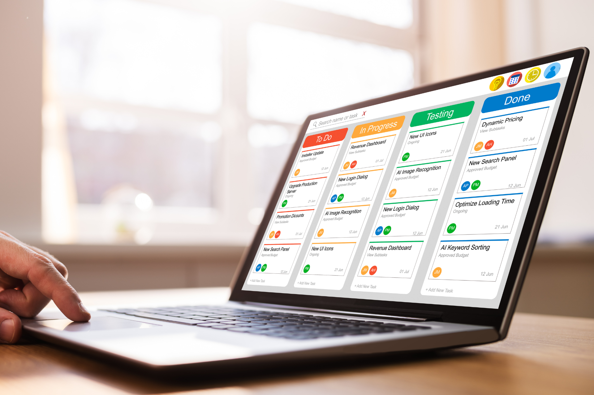
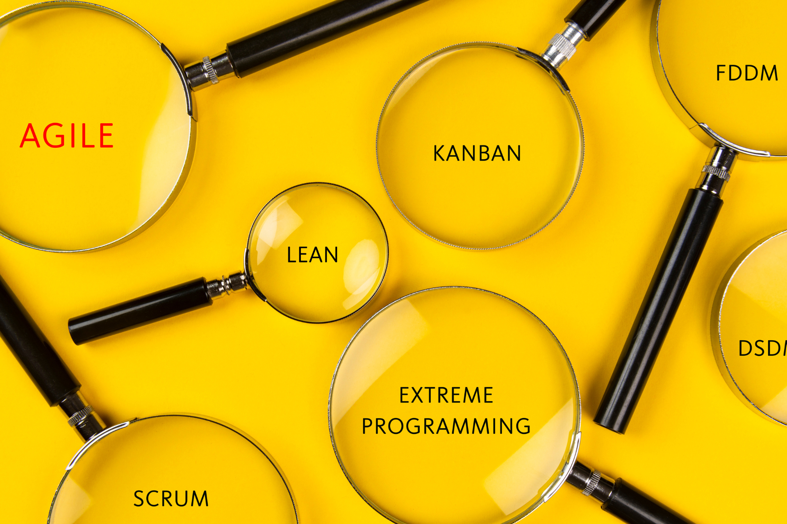

## Was ist die Kanban Methode?

Kanban ist eine **Prozessmanagement-Methode** zur Steuerung von Arbeitsprozessen, um Engpässe im Team zu vermeiden und die verfügbaren Ressourcen optimal einzusetzen. Im Kern handelt es sich um eine Form des visuellen Projektmanagements, in deren Mittelpunkt Kanban Boards stehen. Ein Kanban Board stellt den nach Spalten sortierten Prozess dar, jede Spalte bildet einen Prozessschritt ab – etwa „To Do“, „In Arbeit“ und „Erledigt“. Aus einer Warteliste oder einem Backlog können jederzeit neue Aufgaben hinzugefügt werden. Jede Aufgabe wird als Karte auf dem Board platziert und bewegt sich von links nach rechts von einer Spalte zur nächsten bis sie erledigt ist. Die Kanban-Methode ist als **Pull-Methode** im [Aufgabenmanagement]() beliebt, da sie flexibel und leicht anpassbar ist und eine kontinuierliche Prozessoptimierung ermöglicht, ohne jedoch ein starres Konstrukt vorzugeben.

### Wann wurde das Kanban System entwickelt?

Kanban (zusammengesetzt aus jap. Kàn=Karte und Bàn=Tafel) ist ursprünglich eine Methode aus dem Fertigungsprozess und wurde in der heute bekannten Form 1947 bei Toyota entwickelt. Der Ingenieur Taiichi Ohno suchte nach einer Methode, um die im Vergleich zu US-amerikanischen Unternehmen niedrigere Produktivität bei Toyota zu verbessern. Das Kanban Modell führte zu einem Umdenken im Produktionsprozess, indem das Unternehmen begann, die Produktion an der tatsächlichen Nachfrage zu orientieren, statt an kalkulierten Planungen. Papierkarten auf einer Tafel zeigten an, dass ein Teil oder ein Produkt benötigt wurde und lösten dadurch erst den Produktionsprozess aus. Durch diese Umstellung konnte Toyota die Lagerbestände drastisch reduzieren und gleichzeitig seine Wettbewerbsfähigkeit durch eine an der Nachfrage orientierte Just-in-time-Produktion steigern. Anfang der 2000er wurde Kanban auch in der Softwareentwicklung eingeführt und ist seitdem als Methode eines modernen Aufgaben- und Prozessmanagements insbesondere wegen der sehr einfachen Implementierung weit verbreitet.

### Ist Kanban eine agile Methode?

Die Kanban-Methode zählt zu den [agilen Projektmanagement-Methoden]() und fördert eine transparente, situativ anpassbare und effiziente Arbeitsweise. In der Softwareentwicklung ist sie neben Scrum noch immer eine der verbreitetsten Methoden für agiles Arbeiten. Kanban als Projektmanagement Methode findet inzwischen in nahezu jedem Bereich Anwendung, z. B. im Marketing, der Produktentwicklung oder der Content Creation.

### Wie unterscheidet sich Kanban von Scrum?

Kanban als agiles Projektmanagement Framework ist weit verbreitet, jedoch nur eine von vielen agilen Methoden. Schauen wir uns einmal den Unterschied zwischen **Kanban und Scrum** an:

- Ein ganz **wesentlicher Unterschied** gegenüber Scrum ist, dass Kanban klassischerweise auf feste Kanban Management Rollen oder Rituale verzichtet, während Scrum klar definierte Rollen und Rituale vorsieht.

- Kanban bildet einen **kontinuierlichen Arbeitsablauf** ab, bei dem Aufgaben jederzeit aus dem Backlog in den laufenden Prozess überführt werden können, Scrum hingegen nutzt zeitlich begrenzte Sprints.

- Bei Kanban werden **WIP-Limits** (Work in Progress) für parallele Aufgaben festgelegt, bei Scrum wird die Arbeit pro Sprint geplant.

- **Prioritäten können bei Kanban flexibel angepasst werden,** während Scrum keine Änderungen während eines Sprints zulässt.

- Das **Kanban-Board bildet den fortlaufenden Status ab,** das Scrum-Board wird nach jedem Sprint zurückgesetzt.

- Kanban ist eine Methode zur **Förderung und Visualisierung** einer flexiblen, kontinuierlichen Arbeitsweise, Scrum folgt einem strukturierten Ablauf mit festen Zeitabschnitten und klaren Verantwortlichkeiten.

## Wie funktioniert die Kanban Methode?

Kanban Projekte basieren auf dem Pull-Prinzip: Teammitglieder nehmen sich eigenständig Aufgaben, wenn sie dafür Kapazitäten haben, anstatt von oben Tasks zugewiesen zu bekommen. Durch die Visualisierung aller Aufgaben in Spalten sind Workload und Prozessforschritt jederzeit **transparent und nachvollziehbar.** Teams nutzen üblicherweise ein gemeinsames Board, auf dem Aufgaben den einzelnen Teammitgliedern zugeordnet werden. Nun kann sich ein Mitarbeiter natürlich trotzdem mehr Aufgaben aus dem Backlog nehmen, als er realistischerweise bearbeiten kann. Um das zu vermeiden wird die maximale Anzahl der gleichzeitig in Arbeit befindlichen Arbeitsschritte durch das WIP-Limit begrenzt. Team- und Projektleiter **erkennen Engpässe und Ressourcenkonflikte** so schneller und können **ihre Prozesse entsprechend optimieren.**

## Was sind die 4 Kanban Prinzipien?

Wenn Sie darüber nachdenken, die Kanban-Methode in Ihrem Unternehmen oder Team einzuführen, sollten Sie die **vier Kanban Grundprinzipien** verstehen:

\- Beginnen Sie mit dem, was Sie ohnehin schon tun

\- Einigen Sie sich auf allmähliche, schrittweise Veränderungen

\- Berücksichtigen Sie bestehende Prozesse, Rollen und Verantwortlichkeiten

\- Fördern Sie Initiative auf allen Ebenen

### 1\. Beginnen Sie mit dem, was Sie ohnehin schon tun

Jede Veränderung im Prozess oder der Methode bedeutet für Ihr Team auch, sich an etwas Neues zu gewöhnen. Nur selten funktioniert das auf Anhieb ohne Reibereien. Und Sie möchten auch keinen Prozess ersetzen, der bereits effizient funktioniert. Hier spielt Kanban eine seiner größten Stärken aus. Denn da es sich im Kern um eine Prozess-Visualisierung handelt, können Sie das Modell mühelos **zusätzlich zu Ihren bestehenden Prozessen und Systemen** nutzen. Diese haben im Kanban-Modell ausdrücklich ihren Wert. Und wenn Sie neben Ihrer bisherigen Methode Kanban nutzen, werden Sie schnell erkennen, was funktioniert, wo es Probleme gibt und an welcher Stelle Ihre Prozesse verbessert werden können.

### 2\. Einigen Sie sich auf allmähliche, schrittweise Veränderungen

Schnelle, tiefgreifende Änderungen rufen regelmäßig Widerstand hervor – und funktionieren am Ende womöglich nicht. Als flexible Methode ist Kanban darauf ausgelegt, **Prozesse in kleinen Schritten zu optimieren.** Drehen Sie immer nur an einzelnen Stellschrauben und fördern Sie eine Feedback-Kultur, um gemeinsam zu positiven Veränderungen zu gelangen.

### 3\. Berücksichtigen Sie bestehende Prozesse, Rollen und Verantwortlichkeiten

Kanban zielt darauf ab, bestehende Arbeitsabläufe zu verbessern und nicht zu zerstören. Da Kanban **ohne feste Verantwortlichkeiten** auskommt und auch kein Kanban Management vorsieht, können Sie Kanban als agile Methode ohne Umstrukturierungen einführen. Es bedarf in Ihrem Team oder Unternehmen keiner besonderen Voraussetzungen für Kanban.

### 4\. Fördern Sie Initiative auf allen Ebenen

Kanban fördert den **Austausch und die Eigenverantwortung** der Mitarbeiter. Als flexible Methode agiert es nicht von oben nach unten, sondern auf und zwischen allen Ebenen. Ermutigen Sie Ihr Team, Meinungen zu äußern, neue Ideen einzubringen und die Initiative zu ergreifen.

## Was sind die 6 Kanban Praktiken?

Die Umsetzung der Kanban Prinzipien sollte reibungslos erfolgen, ohne laufende Prozesse zu stören. Im Prinzip benötigen Sie lediglich ein Kanban Board und können sofort loslegen. Damit alleine garantieren Sie indes keine effektive Einführung von Kanban. Neben den vier Kanban Prinzipien sollten Sie auch diese sechs zentralen Kanban Praktiken, auch Kanban-Werte genannt, kennen und anwenden:

### 1\. Visualisieren Sie den Workflow
Legen Sie Karten auf Ihrem Kanban-Board an und schieben Sie diese von links nach rechts durch die Spalten. So haben Sie jederzeit den Überblick über alle Aufgaben und sehen sofort, wenn eine Aufgabe hakt.

### 2\. Limitieren Sie laufende Arbeiten (WIP-Limits)
Kanban ist als agile Methode auf dem Prinzip aufgebaut, dass Aufgaben sich zügig durch den Prozess bewegen, statt wochenlang "In Bearbeitung" zu sein. Definieren Sie daher ein WIP-Limit und ermutigen Sie Ihr Team, sich auf wenige wichtige Aufgaben zu fokussieren, statt auf Multitasking zu setzen, bei dem alles parallel und langsamer erledigt wird. WIP-Limits sind ein zentrales Element bei Kanban, wenn Ihr Board nicht einfach nur eine in Spalten strukturierte [To-Do-Liste]() sein soll.

### 3\. Managen Sie den Arbeitsfluss
Bei Kanban geht es darum, den Arbeitsablauf zu verwalten, nicht die Mitarbeiter. Beobachten Sie daher regelmäßig den Fortschritt und optimieren Sie den Aufgabenfluss auf Ihrem Board.

### 4\. Machen Sie Regeln explizit
Stellen Sie sicher, dass alle Beteiligten den Aufbau und Zweck des Kanban Boards und ihre eigene Rolle im Prozess verstehen. Definieren und kommunizieren Sie Regeln und Verantwortlichkeiten.

### 5\. Bauen Sie Feedbackschleifen ein
Wenn Sie Kanban als agile Methode nutzen möchten, um Ihre Produktivität zu erhöhen und effizienter zu werden, sind Feedbackrunden (in der Kanban-Terminologie: Kadenzen) mit Ihrem Team unbedingt erforderlich. Besprechen Sie regelmäßig gemeinsam den Stand der Aufgaben und welche Schwierigkeiten und Unklarheiten bestehen. Daraus können Sie dann weitere Optimierungen ableiten.

### 6\. Verbessern Sie den Prozess kontinuierlich
Kanban lebt von der kontinuierlichen Verbesserung. Sammeln Sie Feedback nicht nur ein, sondern nutzen Sie es. Testen Sie auch ruhig eine Kombination aus Kanban und anderen agilen Methoden, wie z. B. Scrum.

## Wie werden Kanban-Prozesse ausgewertet?

"Was man nicht messen kann, kann man nicht lenken": Das Zitat des Ökonomen Peter Drucker gilt auch im Prozessmanagement und für Kanban-Methoden. Doch anhand welcher Kennzahlen können Sie die Effizienz Ihrer Prozesse im Kanban Verfahren bewerten? Als **wichtige Metriken im Zusammenhang mit der Kanban-Methode** werden in der Regel diese vier genannt:

\- **Durchsatz:**  Die Anzahl der Elemente, die einen Prozess durchlaufen. Der durchschnittliche Durchsatz berechnet sich aus Quotient von durchschnittlichem WIP und durchschnittlicher Zyklusdauer. Der Durchsatz Ihres Teams gibt Aufschluss über die Produktivität Ihres Prozesses.

\- **WIP:** die Menge an Aufgaben, die in Bearbeitung sind. Der WIP alleine sagt noch nichts aus, sondern muss im Verhältnis zur verfügbaren Arbeitszeit in Ihrem Team betrachtet werden.

\- **Zyklusdauer:** beschreibt die Zeit, die Ihr Team für eine Aufgabe benötigt. Ein Zyklus beginnt, sobald jemand aktiv an der Aufgabe arbeitet und endet mit ihrer Fertigstellung.

\- **Vorlaufzeit:** bezeichnet die Dauer, die eine Aufgabe benötigt, um einmal durch das Board zu laufen – von ihrer Erstellung bis zur Fertigstellung.

## Wie können Sie die Kanban Methode anwenden?

Lassen Sie uns einmal konkret verdeutlichen, wie Sie das Kanban Verfahren anwenden. Dem ersten Grundprinzip folgend, wählen Sie einen beliebigen bestehenden Workflow aus. Im Prinzip können Sie Ihr Kanban Board auch auf einem Whiteboard mit Haftnotizen erstellen oder sich etwas in Excel basteln. Transparenter und flexibler ist jedoch ein digitales Board, wie es die meisten [Work Management Systeme]() zum Teil bereits kostenfrei anbieten. Folgen Sie dabei diesen einfachen Schritten: 

1\. Erstellen Sie ein leeres Board: Das Board ist das Fundament mit dem Sie später arbeiten. Überlegen Sie in Ruhe, welche Arbeitsschritte Sie abbilden möchten, statt das Board gleich mit Ihrem gesamten Backlog zu fluten. Wenn Sie eine No-Code Lösung wie SeaTable nutzen, können Sie das Kanban Plugin nutzen.

2\. Erstellen Sie Spalten, um Ihre Prozesse visuell abzubilden: Üblicherweise stehen die einzelnen Spalten für verschiedene Prozessschritte oder Aufgabenstatus, aber im Grunde sind Sie hier völlig frei. Für den Anfang arbeiten Sie am besten mit ***Backlog, In Bearbeitung, Pausiert*** und ***Erledigt.*** Wichtig ist, dass alle, die mit dem Board arbeiten, ein gemeinsames Verständnis über den Aufbau haben.

3\. Erstellen Sie Aufgaben: Legen Sie nun Aufgaben als Kanban Karten an. Werden Sie hier gerade am Anfang nicht zu kleinteilig. Die meisten Tools erlauben Ihnen zusätzliche Unteraufgaben festzulegen, bei SeaTable z. B. in Form von **Checkboxen** innerhalb der Aufgabenbeschreibung.

4\. Legen Sie Regeln und Automationen fest: Ihr Board ist einsatzbereit. Nun müssen Sie nur noch festlegen, nach welchen Regeln Aufgaben aus dem Backlog genommen und an die Mitarbeiter verteilt werden und an welchen Stellen z. B. Feedback oder Freigaben eingeholt werden müssen. SeaTable bietet Ihnen eine **integrierte Chat-Funktion und automatisierte Benachrichtigungen.**

{{< warning headline="Workflow Management Tool SeaTable" text="Die **No-Code-Lösung SeaTable** bietet alle Funktionen, die Sie für ein modernes Workflow Management brauchen und ist dabei so **intuitiv wie eine Tabellenkalkulation.** Arbeiten Sie kollaborativ in Echtzeit zusammen, erstellen Sie **Automatisierungen** für schlanke Prozesse, flexible Dashboards für Analysen und Reports und **visualisieren Sie Ihre Aufgaben** in Kanban-Ansichten, Kalendern und Timelines. Mit integrierten Benachrichtigungen sowie der **Kommentarfunktion** können Sie die gesamte Kommunikation zu einer Aufgabe in SeaTable abbilden. Mit dem **Universal App Builder** erstellen Sie individuelle Frontends. Starten Sie mit der **kostenlosen Version**, die Ihnen bereits alle wichtigen Funktionen bietet und skalieren Sie schrittweise. SeaTable eignet sich als **DSGVO-konforme,** ausschließlich auf Servern in Deutschland gehostete Lösung insbesondere für Teams, die Wert auf hohen Datenschutz, **Kollaboration in Echtzeit,** integrierte Automatisierungen und **maximale Flexibilität und Skalierbarkeit** legen." />}}

Testen Sie SeaTables **exemplarische Kanban-Board-Vorlage** und passen Sie diese einfach an.



## Auf einen Blick: Welche Vorteile bietet die Kanban Methode?

Wie Sie sehen, ist Kanban eine recht einfache und doch wirkmächtige Methode. Mit dem Kanban Modell werden Teams flexibler und schneller und halten Kapazitäten und Arbeitsbelastung im Gleichgewicht. Die wichtigsten Vorteile sind, noch einmal zusammengefasst:

\- **Transparenz:** Sie können jederzeit den aktuellen Stand Ihrer Aufgaben und der laufenden Aufgaben Ihres Teams einsehen und entsprechend handeln. Den größten Effekt erzielen Sie, wenn Sie ein Tool mit Echtzeit-Kollaboration nutzen.

\- **Flexibilität:** Das Kanban Framework basiert auf dem Prinzip ständiger Anpassungen. Zum einen können Sie in Kanban flexibel auf von außen kommende Veränderungen reagieren. Gleichzeitig ist das Kanban Modell so anpassungsfähig, dass Sie Ihre Prozesse optimieren und verändern können.

\- **Effizienzsteigerung:** Die Kanban Methode fördert Effizienz, indem sich Teams auf wenige priorisierte Aufgaben konzentrieren. WIP-Limits verhindern, dass sich Mitarbeiter in zu vielen parallel bearbeiteten Aufgaben verzetteln.

\- **Erhöhte (Kunden-)Zufriedenheit:** Kanban basiert auf der Idee, dass Arbeitsressourcen dort eingesetzt werden, wo sie aktuell benötigt werden. Als Methode hilft es dabei, Zeit und Arbeitskraft effizient einzusetzen, Ressourcenverschwendung zu reduzieren und sich auf das Wesentliche zu konzentrieren. Kundenanforderungen können schneller umgesetzt werden, die Mitarbeiterzufriedenheit steigt durch klare Schwerpunktsetzung.

\- **Einfachheit:** Ein Kanban System ist schnell implementiert und benötigt keine komplexen Kanban Management Rollen oder strikte Zeitpläne.

## FAQ – Kanban Methode



Nein, zwar wird Kanban in der Softwareentwicklung häufig genutzt, kann jedoch auch in jedem anderen Bereich für das Aufgabenmanagement genutzt werden, regelmäßig finden Sie z. B. Kanban im Projektmanagement.





Da es keiner besonderen Voraussetzungen für Kanban bedarf, ist diese Methode grundsätzlich für Unternehmen und Teams unterschiedlicher Größe, aber auch Einzelpersonen geeignet. Kleine Teams, die häufig bereits agil und eigenverantwortlich arbeiten, profitieren von der Struktur und Transparenz, die das Kanban Modell bietet. Unternehmen, die agile Methoden bisher noch nicht nutzen, können mit Kanban ein agiles Projektmanagement einführen, ohne gleich in bestehende Prozesse und Strukturen einzugreifen. Unternehmen mit starren Strukturen und Hierarchien werden indes bei der Umsetzung der Kanban Grundprinzipien Probleme haben und das Kanban System eher nicht nutzen.





Es gibt kein allgemeingültiges WIP-Limit. Grundsätzlich sollte sich das Limit an der Kapazität des Teams und der Bedeutung einzelner Arbeitsschritte orientieren, um Überlastungen zu vermeiden und einen reibungslosen Workflow zu ermöglichen.

