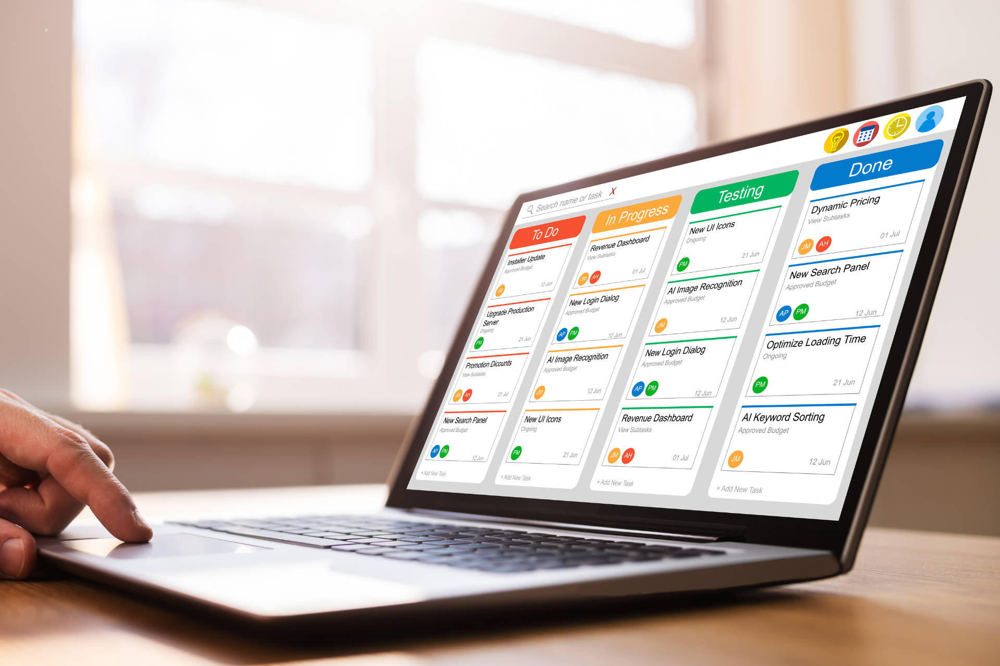

## ¿Qué es el método Kanban?

Kanban es un **método de gestión de procesos** para controlar los procesos de trabajo con el fin de evitar cuellos de botella en el equipo y hacer un uso óptimo de los recursos disponibles. En esencia, es una forma de gestión visual de proyectos centrada en los tableros Kanban. Un tablero Kanban representa el proceso ordenado por columnas, en el que cada columna representa un paso del proceso, como "Por hacer", "En curso" y "Hecho". En cualquier momento pueden añadirse nuevas tareas desde una lista de espera o un backlog. Cada tarea se coloca en el tablero como una tarjeta y se desplaza de izquierda a derecha de una columna a la siguiente hasta que se completa. El método Kanban es popular como **método pull** en [gestión de tareas]() porque es flexible y fácilmente adaptable y permite optimizar continuamente los procesos sin imponer una construcción rígida.

### ¿Cuándo se desarrolló el sistema Kanban?

Kanban (compuesto del japonés Kàn=tarjeta y Bàn=tablero) es originalmente un método del proceso de fabricación y se desarrolló en su forma actual en Toyota en 1947. El ingeniero Taiichi Ohno buscaba un método para mejorar la productividad en Toyota, que era inferior a la de las empresas estadounidenses. El modelo Kanban condujo a un replanteamiento del proceso de producción, ya que la empresa empezó a basar la producción en la demanda real en lugar de en una planificación calculada. Unas tarjetas de papel colocadas en un tablero indicaban que se necesitaba una pieza o un producto y ponían en marcha el proceso de producción. Este cambio permitió a Toyota reducir drásticamente los inventarios y, al mismo tiempo, aumentar su competitividad gracias a la producción justo a tiempo basada en la demanda. A principios de la década de 2000, Kanban se introdujo también en el desarrollo de software y desde entonces se ha utilizado ampliamente como método de gestión moderna de tareas y procesos, sobre todo debido a su sencillísima aplicación.

### ¿Es Kanban un método ágil?

El método Kanban es uno de los [métodos ágiles de gestión de proyectos]() y promueve una forma de trabajar transparente, adaptable a las situaciones y eficaz. En el desarrollo de software, sigue siendo uno de los métodos más extendidos de trabajo ágil junto con Scrum. Kanban como método de gestión de proyectos se utiliza actualmente en casi todos los ámbitos, por ejemplo, en marketing, desarrollo de productos o creación de contenidos.

### ¿En qué se diferencia Kanban de Scrum?

Kanban se utiliza ampliamente como marco ágil de gestión de proyectos, pero es sólo uno de los muchos métodos ágiles. Echemos un vistazo a la diferencia entre **Kanban y Scrum**:

- Una **diferencia esencial** con respecto a Scrum es que Kanban prescinde clásicamente de roles o rituales fijos de gestión Kanban, mientras que Scrum prevé roles y rituales claramente definidos.

- Kanban es un **flujo de trabajo continuo** en el que las tareas pueden transferirse del backlog al proceso en curso en cualquier momento, mientras que Scrum utiliza sprints limitados en el tiempo.

- Con Kanban, se establecen **límites WIP** (trabajo en curso) para las tareas paralelas, mientras que con Scrum, el trabajo se planifica por sprints.

- **Las prioridades pueden ajustarse de forma flexible** con Kanban, mientras que Scrum no permite ningún cambio durante un sprint.

- El **tablero Kanban muestra el estado en curso,** el tablero Scrum se restablece después de cada sprint.

- Kanban es un método para **promover y visualizar** una forma de trabajo flexible y continua, mientras que Scrum sigue un proceso estructurado con periodos de tiempo fijos y responsabilidades claras.

## ¿Cómo funciona el método Kanban?

Los proyectos Kanban se basan en el principio pull: los miembros del equipo asumen las tareas de forma independiente si tienen capacidad para ello, en lugar de que se les asignen tareas desde arriba. Al visualizar todas las tareas en columnas, la carga de trabajo y el progreso del proceso son **transparentes y trazables en todo momento.** Los equipos suelen utilizar un tablero compartido en el que se asignan las tareas a los distintos miembros del equipo. Por supuesto, un empleado puede tomar más tareas del backlog de las que puede trabajar de forma realista. Para evitarlo, el número máximo de pasos de trabajo en curso en un momento dado está limitado por el límite WIP. Esto permite a los jefes de equipo y de proyecto **identificar más rápidamente los cuellos de botella y los conflictos de recursos** y **optimizar sus procesos en consecuencia.**

## ¿Cuáles son los 4 principios Kanban?

Si está pensando en introducir el método Kanban en su empresa o equipo, debe comprender los **cuatro principios básicos de Kanban**:

\- Empiece con lo que ya está haciendo de todos modos

\- Acuerde cambios graduales, paso a paso

\- Tenga en cuenta los procesos, funciones y responsabilidades existentes

\- Fomentar la iniciativa a todos los niveles

### 1\. Empiece por lo que ya está haciendo

Todo cambio de proceso o método significa también que su equipo tiene que acostumbrarse a algo nuevo. Esto rara vez funciona de inmediato sin fricciones. Y no querrá sustituir un proceso que ya funciona eficazmente. Aquí es donde Kanban juega uno de sus mayores puntos fuertes. Dado que se trata esencialmente de una visualización de procesos, puede utilizar fácilmente el modelo **además de sus procesos y sistemas existentes**. Éstos tienen explícitamente su valor en el modelo Kanban. Y si utiliza Kanban junto con su método existente, reconocerá rápidamente lo que funciona, dónde hay problemas y dónde pueden mejorarse sus procesos.

### 2\. Acuerde cambios graduales, paso a paso

Los cambios rápidos y radicales suelen provocar resistencia, y puede que al final no funcionen. Como método flexible, Kanban está diseñado para optimizar **los procesos en pequeños pasos.** Realice sólo ajustes individuales y promueva una cultura de retroalimentación para lograr juntos cambios positivos.

### 3\. Tenga en cuenta los procesos, funciones y responsabilidades existentes

Kanban pretende mejorar los flujos de trabajo existentes, no destruirlos. Dado que Kanban no requiere responsabilidades fijas ni una gestión Kanban, puede introducir Kanban como método ágil sin necesidad de reestructurarlo. Su equipo o su empresa no necesitan ningún requisito previo especial para Kanban.

### 4\. Fomente la iniciativa a todos los niveles

Kanban promueve el **intercambio y la responsabilidad personal** de los empleados. Como método flexible, no funciona de arriba abajo, sino en y entre todos los niveles. Anime a su equipo a expresar opiniones, aportar nuevas ideas y tomar la iniciativa.

## ¿Cuáles son las 6 prácticas Kanban?

Los principios Kanban deben aplicarse sin problemas y sin interrumpir los procesos en curso. En principio, todo lo que necesita es un tablero Kanban y puede empezar inmediatamente. Sin embargo, esto por sí solo no garantiza una introducción eficaz de Kanban. Además de los cuatro principios kanban, también debe conocer y aplicar estas seis prácticas kanban centrales, también conocidas como valores kanban:

### 1\. Visualice el flujo de trabajo
Cree tarjetas en su tablero Kanban y desplácelas de izquierda a derecha por las columnas. Esto le proporciona una visión general de todas las tareas en todo momento y le permite ver inmediatamente si una tarea está atascada.

### 2\. Limite el trabajo en curso (WIP limits)
Como método ágil, Kanban se basa en el principio de que las tareas se mueven rápidamente a través del proceso en lugar de estar "en curso" durante semanas. Por lo tanto, defina un límite WIP y anime a su equipo a centrarse en unas pocas tareas importantes en lugar de la multitarea, en la que todo se hace en paralelo y a un ritmo más lento. Los límites WIP son un elemento clave de Kanban si quiere que su tablero sea algo más que una [lista de tareas]() pendientes estructurada en columnas.

### 3\. Gestionar el flujo de trabajo
Kanban consiste en gestionar el flujo de trabajo, no a los empleados. Por lo tanto, supervise regularmente el progreso y optimice el flujo de tareas en su tablero.

### 4\. Haga explícitas las reglas
Asegúrese de que todos los implicados comprenden la estructura y el propósito del tablero Kanban y su propio papel en el proceso. Defina y comunique las reglas y responsabilidades.

### 5\. Construya bucles de retroalimentación
Si desea utilizar Kanban como método ágil para aumentar su productividad y ser más eficiente, los bucles de retroalimentación (en terminología Kanban: cadencias) con su equipo son esenciales. Comenten juntos con regularidad el estado de las tareas y cualquier dificultad o ambigüedad. De ello podrá derivar nuevas optimizaciones.

### 6\. Mejore el proceso continuamente
Kanban prospera con la mejora continua. No se limite a recoger opiniones, utilícelas. No dude en probar una combinación de Kanban y otros métodos ágiles, como Scrum.

## ¿Cómo se evalúan los procesos Kanban?

"No se puede gestionar lo que no se puede medir": La cita del economista Peter Drucker también se aplica a la gestión de procesos y a los métodos Kanban. Pero, ¿qué ratios puede utilizar para evaluar la eficacia de sus procesos Kanban? Estas cuatro suelen citarse como **métricas importantes en relación con el método Kanban**:

\- **Rendimiento:** El número de artículos que pasan por un proceso. El rendimiento medio se calcula dividiendo el WIP medio por el tiempo de ciclo medio. El rendimiento de su equipo proporciona información sobre la productividad de su proceso.

\- **WIP:** la cantidad de tareas que se están procesando. El WIP por sí solo no dice nada, pero debe considerarse en relación con el tiempo de trabajo disponible en su equipo.

\- **Duración del ciclo:** describe el tiempo que su equipo necesita para una tarea. Un ciclo comienza en cuanto alguien trabaja activamente en la tarea y termina cuando ésta se completa.

\- **Tiempo de espera:** describe el tiempo que tarda una tarea en pasar una vez por el tablero, desde su creación hasta su finalización.

## ¿Cómo puede utilizar el método Kanban?

Veamos con más detalle cómo puede aplicar el método Kanban. Siguiendo el primer principio básico, seleccione cualquier flujo de trabajo existente. En principio, también puede crear su tablero Kanban en una pizarra blanca con notas adhesivas o hacer algo en Excel. Sin embargo, un tablero digital es más transparente y flexible, como ya ofrecen la mayoría de los [sistemas de gestión del trabajo](), en algunos casos de forma gratuita. Siga estos sencillos pasos:

1\. Cree un tablero vacío: El tablero es la base sobre la que trabajará más adelante. Tómese su tiempo para pensar qué pasos de trabajo desea mapear en lugar de inundar el tablero con todo su backlog. Si utiliza una solución sin código como SeaTable, puede utilizar el plugin Kanban.

2\. Cree columnas para visualizar sus procesos: Por lo general, las columnas individuales representan diferentes pasos del proceso o estados de la tarea, pero básicamente usted es completamente libre aquí. Para empezar, lo mejor es trabajar con ***Backlog, En curso, En pausa*** y ***Completado.*** Es importante que todos los que trabajen con el tablero tengan una comprensión común de la estructura.

3\. Cree tareas: Cree ahora las tareas como tarjetas Kanban. No sea demasiado detallista aquí, sobre todo al principio. La mayoría de las herramientas le permiten definir subtareas adicionales, por ejemplo en SeaTable en forma de **casillas de verificación** dentro de la descripción de la tarea.

4\. Defina reglas y automatizaciones: su tablero está listo para ser utilizado. Ahora sólo tiene que definir las reglas según las cuales las tareas se toman del backlog y se distribuyen a los empleados y en qué puntos, por ejemplo, deben obtenerse comentarios o aprobaciones. SeaTable le ofrece una **función de chat integrada y notificaciones automatizadas**.

{{< warning headline="Herramienta de gestión del flujo de trabajo SeaTable" text="La **solución No-Code SeaTable** ofrece todas las funciones que necesita para una gestión moderna del flujo de trabajo y es tan **intuitiva como una hoja de cálculo.** Trabaje en colaboración en tiempo real, cree **automatizaciones** para procesos ajustados, cuadros de mando flexibles para análisis e informes y **visualice sus tareas** en vistas Kanban, calendarios y líneas de tiempo. Con las notificaciones integradas y la **función de comentario**, puede mapear toda la comunicación relativa a una tarea en SeaTable. Con el **Universal App Builder** puede crear frontends individuales. Comience con la **versión gratuita**, que ya le ofrece todas las funciones importantes, y amplíela paso a paso. Como solución **que cumple con la directiva GDPR** alojada exclusivamente en servidores en Alemania, SeaTable es especialmente adecuada para equipos que valoran la alta protección de datos, la **colaboración en tiempo real**, la automatización integrada y la **máxima flexibilidad y escalabilidad**." />}}

Pruebe la **plantilla de tablero Kanban ejemplar** de SeaTable y personalícela fácilmente.



## De un vistazo ¿Cuáles son las ventajas del método Kanban?

Como puede ver, Kanban es un método muy sencillo pero potente. Con el modelo Kanban, los equipos se vuelven más flexibles y rápidos y mantienen en equilibrio la capacidad y la carga de trabajo. Una vez más, resumimos las ventajas más importantes:

\- **Transparencia:** Puede ver el estado actual de sus tareas y de las tareas en curso de su equipo en cualquier momento y actuar en consecuencia. Conseguirá el mayor efecto si utiliza una herramienta con colaboración en tiempo real.

\- **Flexibilidad:** El marco Kanban se basa en el principio de los ajustes constantes. Por un lado, Kanban le permite reaccionar con flexibilidad a los cambios externos. Al mismo tiempo, el modelo Kanban es tan adaptable que puede optimizar y modificar sus procesos.

\- **Eficiencia:** El método Kanban fomenta la eficiencia al permitir que los equipos se centren en un número reducido de tareas prioritarias. Los límites de trabajo en curso evitan que los empleados se atasquen en demasiadas tareas paralelas.

\- **Aumento de la satisfacción (del cliente):** Kanban se basa en la idea de que los recursos de trabajo se utilizan donde se necesitan en ese momento. Como método, ayuda a utilizar el tiempo y la mano de obra de forma eficaz, a reducir el despilfarro de recursos y a centrarse en lo esencial. Los requisitos de los clientes pueden aplicarse con mayor rapidez y la satisfacción de los empleados aumenta gracias a un enfoque claro.

\- **Simplicidad:** Un sistema Kanban se implanta rápidamente y no requiere complejas funciones de gestión Kanban ni calendarios estrictos.

## FAQ - Método Kanban



No, aunque Kanban se utiliza a menudo en el desarrollo de software, también puede utilizarse en cualquier otro ámbito para la gestión de tareas, por ejemplo, encontrará Kanban regularmente en la gestión de proyectos.





Dado que no existen requisitos especiales para Kanban, este método es generalmente adecuado para empresas y equipos de diferentes tamaños, pero también para individuos. Los equipos pequeños, que a menudo ya trabajan de forma ágil e independiente, se benefician de la estructura y la transparencia que ofrece el modelo Kanban. Las empresas que aún no utilizan métodos ágiles pueden utilizar Kanban para introducir la gestión ágil de proyectos sin interferir en los procesos y estructuras existentes. Sin embargo, las empresas con estructuras y jerarquías rígidas tendrán problemas para aplicar los principios básicos de Kanban y es menos probable que utilicen el sistema Kanban.





No existe un límite WIP universal. En principio, el límite debe basarse en la capacidad del equipo y en la importancia de cada paso del trabajo para evitar sobrecargas y permitir un flujo de trabajo fluido.

