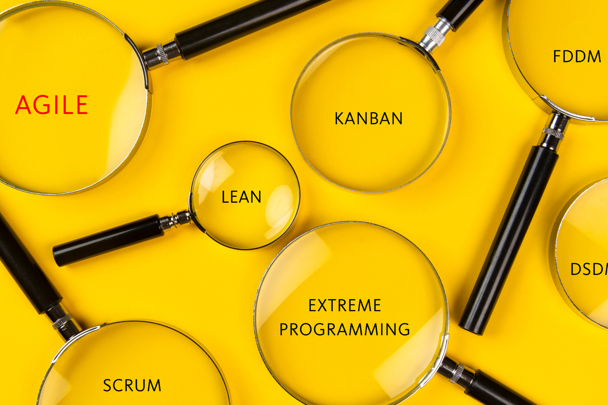

## Qu'est-ce que la méthode Kanban ?

Kanban est une **méthode de gestion des processus** permettant de contrôler les processus de travail afin d'éviter les goulets d'étranglement au sein de l'équipe et d'utiliser au mieux les ressources disponibles. Il s'agit essentiellement d'une forme de gestion visuelle de projet centrée sur les tableaux Kanban. Un tableau Kanban représente le processus trié par colonnes, chaque colonne représentant une étape du processus - telle que "À faire", "En cours" et "Terminé". De nouvelles tâches peuvent être ajoutées à tout moment à partir d'une liste d'attente ou d'un carnet de commandes. Chaque tâche est placée sur le tableau sous forme de carte et se déplace de gauche à droite d'une colonne à l'autre jusqu'à ce qu'elle soit terminée. La méthode Kanban est populaire en tant que **méthode de traction** dans la [gestion des tâches]() parce qu'elle est flexible et facilement adaptable et qu'elle permet une optimisation continue des processus sans imposer une construction rigide.

### Quand le système Kanban a-t-il été développé ?

Le système Kanban (composé des mots japonais Kàn=carte et Bàn=tableau) est à l'origine une méthode issue du processus de fabrication et a été développé sous sa forme actuelle chez Toyota en 1947. L'ingénieur Taiichi Ohno cherchait une méthode pour améliorer la productivité chez Toyota, qui était inférieure à celle des entreprises américaines. Le modèle Kanban a permis de repenser le processus de production, car l'entreprise a commencé à baser la production sur la demande réelle plutôt que sur une planification calculée. Des cartes en papier placées sur un tableau indiquaient qu'une pièce ou un produit était nécessaire et déclenchaient le processus de production. Ce changement a permis à Toyota de réduire considérablement ses stocks tout en augmentant sa compétitivité grâce à une production en flux tendu basée sur la demande. Au début des années 2000, le Kanban a également été introduit dans le développement de logiciels et a depuis été largement utilisé comme méthode de gestion moderne des tâches et des processus, notamment en raison de sa grande simplicité de mise en œuvre.

### Le Kanban est-il une méthode agile ?

La méthode Kanban est l'une des [méthodes agiles de gestion de projet]() et promeut une méthode de travail transparente, adaptable à la situation et efficace. Dans le domaine du développement de logiciels, c'est encore l'une des méthodes les plus répandues pour le travail agile, avec Scrum. En tant que méthode de gestion de projet, Kanban est aujourd'hui utilisé dans presque tous les domaines, par exemple dans le marketing, le développement de produits ou la création de contenu.

### En quoi Kanban diffère-t-il de Scrum ?

Kanban est largement utilisé comme cadre de gestion de projet agile, mais ce n'est qu'une des nombreuses méthodes agiles. Examinons les différences entre **Kanban et Scrum** :

- Une **différence essentielle** par rapport à Scrum est que Kanban se dispense classiquement de rôles ou de rituels de gestion Kanban fixes, alors que Scrum prévoit des rôles et des rituels clairement définis.

- Kanban est un **flux de travail continu** dans lequel les tâches peuvent être transférées du backlog au processus en cours à tout moment, alors que Scrum utilise des sprints limités dans le temps.

- Avec Kanban, des **limites de travail en cours** (work in progress) sont fixées pour les tâches parallèles, alors qu'avec Scrum, le travail est planifié par sprint.

- Les **priorités peuvent être ajustées de manière flexible** avec Kanban, alors que Scrum ne permet aucun changement au cours d'un sprint.

- Le **tableau Kanban affiche l'état d'avancement des travaux**, tandis que le tableau Scrum est remis à zéro après chaque sprint.

- Kanban est une méthode pour **promouvoir et visualiser** une méthode de travail flexible et continue, tandis que Scrum suit un processus structuré avec des périodes de temps fixes et des responsabilités claires.

## Comment fonctionne la méthode Kanban ?

Les projets Kanban sont basés sur le principe de la traction : les membres de l'équipe prennent en charge des tâches de manière autonome s'ils en ont la capacité, au lieu de se voir attribuer des tâches d'en haut. En visualisant toutes les tâches en colonnes, la charge de travail et l'avancement du processus sont **transparents et traçables à tout moment.** Les équipes utilisent généralement un tableau partagé sur lequel les tâches sont attribuées à chaque membre de l'équipe. Les équipes utilisent généralement un tableau partagé sur lequel les tâches sont assignées à chaque membre de l'équipe. Bien entendu, un employé peut toujours prendre plus de tâches de l'arriéré que ce qu'il peut réellement faire. Pour éviter cela, le nombre maximum d'étapes de travail en cours à un moment donné est limité par la limite de l'encours de travail. Les chefs d'équipe et de projet peuvent ainsi **identifier plus rapidement les goulets d'étranglement et les conflits de ressources** et **optimiser leurs processus en conséquence**.

## Quels sont les 4 principes Kanban ?

Si vous envisagez d'introduire la méthode Kanban dans votre entreprise ou votre équipe, vous devez comprendre les **quatre principes Kanban de base** :

\- Commencez par ce que vous faites déjà de toute façon

\- Mettez-vous d'accord sur des changements graduels, étape par étape.

\- Prenez en compte les processus, les rôles et les responsabilités existants

\- Encourager l'initiative à tous les niveaux

### 1\. Commencez par ce que vous faites déjà

Tout changement de processus ou de méthode signifie également que votre équipe doit s'habituer à quelque chose de nouveau. Il est rare que cela fonctionne immédiatement sans friction. Et vous ne voulez pas remplacer un processus qui fonctionne déjà efficacement. C'est là que Kanban déploie l'un de ses plus grands atouts. Comme il s'agit essentiellement d'une visualisation de processus, vous pouvez facilement utiliser le modèle **en plus de vos processus et systèmes existants**. Ceux-ci ont explicitement leur valeur dans le modèle Kanban. Et si vous utilisez Kanban parallèlement à votre méthode existante, vous reconnaîtrez rapidement ce qui fonctionne, où il y a des problèmes et où vos processus peuvent être améliorés.

### 2\. Convenez de changements graduels, étape par étape.

Les changements rapides et radicaux suscitent souvent des résistances - et risquent de ne pas fonctionner en fin de compte. En tant que méthode flexible, Kanban est conçu pour optimiser les **processus par petites étapes.** Ne procédez jamais à des ajustements individuels et encouragez une culture du retour d'information afin de parvenir ensemble à des changements positifs.

### 3\. Tenez compte des processus, des rôles et des responsabilités existants

Kanban vise à améliorer les flux de travail existants, et non à les détruire. Comme Kanban n'exige pas de responsabilités fixes ni de gestion Kanban, vous pouvez introduire Kanban en tant que méthode agile sans restructuration. Votre équipe ou votre entreprise n'a pas besoin de conditions préalables particulières pour adopter Kanban.

### 4\. Encouragez l'initiative à tous les niveaux

Kanban encourage l'échange et la responsabilité personnelle des employés. En tant que méthode flexible, elle ne fonctionne pas du haut vers le bas, mais à tous les niveaux et entre eux. Encouragez votre équipe à exprimer ses opinions, à apporter de nouvelles idées et à prendre des initiatives.

## Quelles sont les 6 pratiques Kanban ?

Les principes Kanban doivent être mis en œuvre en douceur, sans perturber les processus en cours. En principe, tout ce dont vous avez besoin, c'est d'un tableau Kanban et vous pouvez commencer immédiatement. Toutefois, cela ne suffit pas à garantir une introduction efficace de Kanban. Outre les quatre principes Kanban, vous devez également connaître et appliquer les six pratiques Kanban centrales, également connues sous le nom de valeurs Kanban :

### 1\. Visualisez le flux de travail
Créez des cartes sur votre tableau Kanban et déplacez-les de gauche à droite dans les colonnes. Vous aurez ainsi une vue d'ensemble de toutes les tâches à tout moment et pourrez voir immédiatement si une tâche est bloquée.

### 2\. Limiter le travail en cours (limites du travail en cours)
En tant que méthode agile, le Kanban est basé sur le principe que les tâches évoluent rapidement dans le processus au lieu de rester "en cours" pendant des semaines. Par conséquent, définissez une limite de travail en cours et encouragez votre équipe à se concentrer sur quelques tâches importantes au lieu de faire du multitâche, où tout est fait en parallèle et à un rythme plus lent. Les limites d'avancement sont un élément clé de Kanban si vous voulez que votre tableau soit plus qu'une simple [liste de tâches]() structurée en colonnes.

### 3\. Gérer le flux de travail
Kanban permet de gérer le flux de travail, et non les employés. Par conséquent, surveillez régulièrement les progrès et optimisez le flux des tâches sur votre tableau.

### 4\. Rendre les règles explicites
Assurez-vous que toutes les personnes concernées comprennent la structure et l'objectif du tableau Kanban, ainsi que leur propre rôle dans le processus. Définissez et communiquez les règles et les responsabilités.

### 5\. Intégrez des boucles de rétroaction
Si vous souhaitez utiliser Kanban comme méthode agile pour accroître votre productivité et devenir plus efficace, il est essentiel de mettre en place des boucles de retour d'information (dans la terminologie Kanban : les cadences) avec votre équipe. Discutez régulièrement de l'état d'avancement des tâches et des difficultés et ambiguïtés éventuelles. Vous pourrez alors en tirer des optimisations supplémentaires.

### 6\. Améliorez le processus en permanence
Kanban se nourrit de l'amélioration continue. Ne vous contentez pas de recueillir des commentaires, utilisez-les. N'hésitez pas à tester une combinaison de Kanban et d'autres méthodes agiles, telles que Scrum.

## Comment les processus Kanban sont-ils évalués ?

"Vous ne pouvez pas gérer ce que vous ne pouvez pas mesurer " : Cette citation de l'économiste Peter Drucker s'applique également à la gestion des processus et aux méthodes Kanban. Mais quels chiffres clés pouvez-vous utiliser pour évaluer l'efficacité de vos processus Kanban ? Ces quatre chiffres sont généralement cités comme **mesures importantes en rapport avec la méthode Kanban** :

\- **Débit:** Le nombre d'éléments qui passent par un processus. Le débit moyen est calculé en divisant l'encours moyen par le temps de cycle moyen. Le débit de votre équipe fournit des informations sur la productivité de votre processus.

\- **WIP:** la quantité de tâches en cours de traitement. Le WIP seul ne dit rien, mais doit être considéré en relation avec le temps de travail disponible dans votre équipe.

\- **Durée du cycle:** décrit le temps dont votre équipe a besoin pour une tâche. Un cycle commence dès que quelqu'un travaille activement sur la tâche et se termine lorsqu'elle est achevée.

\- **Durée d'exécution:** décrit le temps nécessaire pour qu'une tâche passe par le tableau une fois - de sa création à son achèvement.

## Comment pouvez-vous utiliser la méthode Kanban ?

Examinons de plus près comment vous pouvez appliquer la méthode Kanban. En suivant le premier principe de base, sélectionnez n'importe quel flux de travail existant. En principe, vous pouvez également créer votre tableau Kanban sur un tableau blanc avec des notes autocollantes ou créer quelque chose dans Excel. Toutefois, un tableau numérique est plus transparent et plus flexible, comme le proposent déjà la plupart des [systèmes de gestion du travail](), parfois gratuitement. Suivez ces étapes simples :

1\. Créez un tableau vide : Le tableau est la base avec laquelle vous travaillerez par la suite. Prenez le temps de réfléchir aux étapes de travail que vous souhaitez cartographier au lieu d'inonder le tableau avec l'ensemble de votre carnet de commandes. Si vous utilisez une solution sans code telle que SeaTable, vous pouvez utiliser le plugin Kanban.

2\. Créez des colonnes pour visualiser vos processus : En général, les colonnes individuelles représentent les différentes étapes du processus ou l'état d'avancement des tâches, mais vous êtes totalement libre dans ce domaine. Pour commencer, il est préférable de travailler avec ***Backlog, In progress, Paused*** et ***Completed.*** Il est important que toutes les personnes travaillant avec le tableau aient une compréhension commune de la structure.

3\. Créez des tâches : Créez maintenant des tâches sous forme de cartes Kanban. Ne soyez pas trop détaillé, surtout au début. La plupart des outils vous permettent de définir des sous-tâches supplémentaires, par exemple dans SeaTable sous la forme de **coches** dans la description de la tâche.

4\. Définir les règles et les automatismes : votre tableau est prêt à être utilisé. Il ne vous reste plus qu'à définir les règles selon lesquelles les tâches sont extraites de l'arriéré et distribuées aux employés et à quels moments, par exemple, un retour d'information ou des approbations doivent être obtenus. SeaTable vous offre une **fonction de chat intégrée et des notifications automatisées**.

{{< warning headline="Outil de gestion du flux de travail SeaTable" text="La **solution No-Code SeaTable** offre toutes les fonctions dont vous avez besoin pour une gestion moderne du flux de travail et est aussi **intuitive qu'une feuille de calcul.** Travaillez en collaboration en temps réel, créez des **automations** pour des processus allégés, des tableaux de bord flexibles pour des analyses et des rapports et **visualisez vos tâches** dans des vues Kanban, des calendriers et des échéances. Grâce aux notifications intégrées et à la **fonction de commentaire**, vous pouvez cartographier toutes les communications relatives à une tâche dans SeaTable. Avec le **App Builder**, vous pouvez créer des frontends individuels. Commencez par la **version gratuite**, qui vous offre déjà toutes les fonctions importantes, et augmentez progressivement. En tant que solution **conforme au RGPD** hébergée exclusivement sur des serveurs en Allemagne, SeaTable convient particulièrement aux équipes qui accordent une grande importance à la protection des données, à la **collaboration en temps réel**, à l'automatisation intégrée et à la **flexibilité et l'évolutivité maximales**." />}}

Essayez le **modèle de tableau Kanban exemplaire** de SeaTable et personnalisez-le facilement.



## En un coup d'œil : Quels sont les avantages de la méthode Kanban ?

Comme vous pouvez le constater, Kanban est une méthode très simple mais puissante. Grâce au modèle Kanban, les équipes deviennent plus flexibles et plus rapides et maintiennent l'équilibre entre la capacité et la charge de travail. Les avantages les plus importants sont, une fois de plus, résumés :

\- **Transparence:** Vous pouvez voir à tout moment l'état d'avancement de vos tâches et des tâches en cours de votre équipe et agir en conséquence. Vous obtiendrez les meilleurs résultats si vous utilisez un outil de collaboration en temps réel.

\- **Flexibilité:** Le cadre Kanban est basé sur le principe des ajustements constants. D'une part, Kanban vous permet de réagir avec souplesse aux changements externes. D'autre part, le modèle Kanban est tellement adaptable que vous pouvez optimiser et modifier vos processus.

\- **Efficacité:** La méthode Kanban favorise l'efficacité en permettant aux équipes de se concentrer sur un petit nombre de tâches classées par ordre de priorité. Les limites de l'encours empêchent les employés de s'enliser dans un trop grand nombre de tâches parallèles.

\- **Augmentation de la satisfaction (des clients):** La méthode Kanban repose sur l'idée que les ressources de travail sont utilisées là où elles sont nécessaires. Cette méthode permet d'utiliser efficacement le temps et la main-d'œuvre, de réduire les gaspillages et de se concentrer sur l'essentiel. Les exigences des clients peuvent être mises en œuvre plus rapidement et la satisfaction des employés augmente grâce à une orientation claire.

\- **Simplicité:** Un système Kanban est rapidement mis en œuvre et ne nécessite pas de rôles de gestion Kanban complexes ou de calendriers stricts.

## FAQ - Méthode Kanban



Non, bien que Kanban soit souvent utilisé dans le développement de logiciels, il peut également être utilisé dans tout autre domaine pour la gestion des tâches, par exemple, vous trouverez régulièrement Kanban dans la gestion de projet.





Comme il n'y a pas d'exigences particulières pour Kanban, cette méthode convient généralement aux entreprises et aux équipes de différentes tailles, mais aussi aux individus. Les petites équipes, qui travaillent souvent déjà de manière agile et indépendante, bénéficient de la structure et de la transparence offertes par le modèle Kanban. Les entreprises qui n'utilisent pas encore de méthodes agiles peuvent utiliser Kanban pour introduire la gestion de projet agile sans interférer avec les processus et les structures existants. Toutefois, les entreprises dotées de structures et de hiérarchies rigides éprouveront des difficultés à mettre en œuvre les principes Kanban de base et seront moins susceptibles d'utiliser le système Kanban.





Il n'existe pas de limite universelle pour les travaux en cours. En principe, la limite doit être basée sur la capacité de l'équipe et l'importance des différentes étapes de travail afin d'éviter les surcharges et de permettre un flux de travail fluide.

