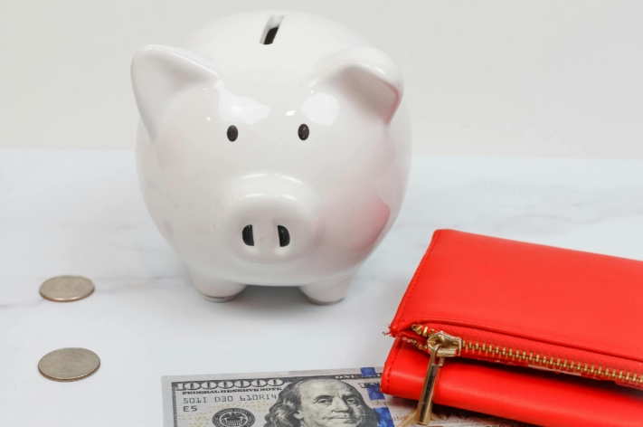

Actualmente se habla mucho de las **deudas de Klarna** en las redes sociales y, sin embargo, a menudo se subestiman. La comodidad de la **compra a plazos de K** larna atrae sobre todo a los más jóvenes a una espiral de deudas que parece no tener fin. Tal vez sus facturas de Klarna se estén acumulando y usted, como muchos otros, se enfrente a una montaña de deudas. Pero no te preocupes, con un poco de disciplina puedes salir de deudas.

En esta entrada del blog, analizaremos en profundidad el fenómeno de la deuda Klarna y le proporcionaremos **consejos** prácticos y **estrategias** sobre cómo salir de las dificultades financieras.

Las compras en línea se han convertido en el método de compra preferido por muchos consumidores.

## Qué es Klarna

Klarna es un **proveedor sueco de servicios financieros** que ofrece servicios de pago en línea y soluciones para procesar **compras en línea**. La empresa ofrece a sus clientes una amplia gama de opciones, como **transferencia bancaria instantánea**, **pago a plazos** y **compra a cuenta**.

Con su lema _"Compra ahora. Paga después"_, Klarna ha conseguido un enorme alcance, animando a muchos consumidores a realizar compras en tiendas online sin tener que pagar inmediatamente. Los operadores de tiendas en línea, a su vez, tienen la ventaja de que Klarna asume los **impagos** de los compradores morosos, de modo que los comerciantes electrónicos reciben su dinero en cualquier caso.

La opción de comprar a plazos puede tentarle a comprar más de lo que realmente puede permitirse.

## Cómo surgen las deudas de Klarna

Las deudas de Klarna surgen en cuanto usted opta por las modalidades de pago **compra a cuenta** o **financiación Klarna** (compra a plazos). En este caso, Klarna te presentará el importe de los productos adquiridos y deberás reembolsarlo en un plazo determinado.

El atractivo del **modelo "compre ahora y pague después**" le tienta más rápidamente que los métodos de pago habituales a hacer compras precipitadas para las que quizá ni siquiera tenga presupuesto. Si pagas a menudo con la compra a plazos de Klarna, también corres el riesgo de **perder** la **cuenta** de tus gastos.

Si no dispone de liquidez suficiente en la fecha de vencimiento, **las comisiones por demora** y los **elevados intereses deudores** pueden hacer que su deuda Klarna crezca rápidamente. De este modo, puedes caer en la trampa de la deuda más rápido de lo que parece a primera vista.

## Grupo destinatario de la venta a plazos Klarna

La compra a plazos de Klarna es utilizada por un variado abanico de personas, entre las que se encuentran, según una [encuesta](https://de.statista.com/infografik/29303/anteil-der-befragten-verschiedener-generationen-die-klarna-bnpl-nutzen/), principalmente los más jóvenes de **la Generación Z** y los **millennials**. Este grupo de edad aprecia la comodidad y flexibilidad de los servicios de pago de Klarna, especialmente la opción de pagar más tarde. Muchos jóvenes comparten sus deudas con Klarna en las redes sociales bajo el hashtag _#KlarnaSchulden_.

Distribución de los usuarios de la compra a plazos de Klarna por generación

Sorprendentemente, un estudio del [Schufa Youth Finance Monitor](https://www.schufa.de/themenportal/analyse-schufa-jugend-finanzmonitor-2022/) muestra que las jóvenes recurren a la opción de comprar ahora y pagar después con mucha más frecuencia que sus compañeros varones. La mitad de las encuestadas afirma haber aplazado ya una compra de este modo al menos una vez, frente a solo el 38% de los adolescentes varones.

## ¿Qué ocurre si tiene deudas con Klarna?

Si ha dejado de pagar a Klarna, primero recibirá **tres record** atorios con un recargo de 1,20 euros cada uno. Si no puede pagar antes de la fecha de vencimiento del último recordatorio, Klarna iniciará **un procedimiento de cobro de** la deuda. A partir de ese momento, ya no podrá pagar con Klarna hasta que se haya saldado su deuda.

Si aun así no puede hacer frente al pago, el importe puede fraccionarse en más **plazos** para que pueda reembolsarlo. En este caso, sin embargo, tenga en cuenta que los préstamos a plazos de Klarna ya no son gratuitos y conllevan un tipo de interés del **11,95 por ciento**.

## Riesgos y efectos de la deuda de Klarna

Las deudas de Klarna no sólo conllevan la carga inmediata de **responsabilidades financieras**, sino también riesgos a largo plazo que a menudo se pasan por alto. Además de los ya mencionados **gastos** de recordatorio e intereses, que se suman a su deuda, hay otras **consecuencias** que debe tener en cuenta. Si su caso pasa a manos de una agencia de cobros, también se informará a **Schufa**. Una anotación negativa en el Schufa puede rebajar considerablemente su **calificación crediticia**, lo que hace más difícil pedir nuevos préstamos, pero también, por ejemplo, encontrar piso.

Además, las deudas de Klarna pueden **dificultar** futuras **compras en línea**. Además de bloquear su cuenta de Klarna, otros proveedores de servicios también pueden denegarle el acceso hasta que salde sus deudas. Otro aspecto que no debe descuidarse es la **tensión psicológica** que conllevan las deudas. La constante presión financiera puede provocar estrés, ansiedad y preocupación, lo que puede afectar significativamente a su calidad de vida y bienestar.

Planificando y priorizando conscientemente tus gastos, puedes mantener tus finanzas bajo control.

## Cómo deshacerse de sus deudas con Klarna

Ante la deuda de Klarna, muchos se sienten impotentes y abrumados. Pero hay pasos concretos que puedes dar para salir de esta situación. Siguiendo algunos puntos importantes y obteniendo una visión general de tus finanzas, podrás encontrar la manera de salir de la trampa de la deuda.

1. **Reducir el gasto:** El primer paso para reducir la deuda de Klarna es dejar de hacer compras a través de Klarna. Es importante que reduzcas al mínimo tus gastos y seas consciente de que cada compra adicional solo aumentará la carga de tu deuda.
2. **Obtenga una visión general de sus deudas:** Es esencial tener una visión precisa de tus deudas. Anota no solo el importe de tus deudas, sino también con qué proveedores tienes deudas y a qué tipo de interés.
3. **Crear un plan presupuestario:** Con esta visión de conjunto, ya puedes crear un plan presupuestario detallado. Enumera todos tus ingresos y gastos e identifica las áreas en las que puedes reducir gastos. Piense también en cómo puede aumentar sus ingresos. Un plan presupuestario sólido es crucial para tener las finanzas bajo control.
4. **Pague sus deudas:** Ahora puede hacer frente a sus deudas con el superávit financiero que consiga reduciendo gastos o aumentando ingresos. Negocie con Klarna y acuerde unas condiciones de pago que le resulten aceptables. Dé prioridad a las deudas con tipos de interés más altos para minimizar los costes por intereses a largo plazo.

Si se siente completamente abrumado y no tiene una visión clara de sus finanzas, no tema buscar ayuda profesional. El **asesoramiento sobre deudas** puede ayudarte a desarrollar un plan para volver a tener tus finanzas bajo control y gestionar tu deuda con Klarna a largo plazo.

Los asesores de deudas pueden negociar con los acreedores para acordar planes de pago.

## Cómo evitar las deudas

Para evitar futuras deudas y crear una base financiera sólida, debe aplicar algunas estrategias de eficacia probada. Un **presupuesto** elaborado con regularidad y un **seguimiento coherente** de sus gastos son esenciales. Esto te permitirá tener una visión general de tu situación financiera y minimizar los gastos innecesarios.

También es aconsejable no dejarse influir demasiado por las promesas publicitarias y las ofertas tentadoras. A menudo se anuncian productos o servicios que en realidad no son necesarios. Tome **decisiones racionales** y compre sólo lo que realmente necesite. Además, reservar unos **ahorros** para gastos imprevistos puede aumentar su seguridad financiera y evitarle tener que recurrir a préstamos o pagos a plazos en caso de emergencia.

Una planificación presupuestaria cuidadosa es crucial para garantizar la seguridad financiera.

Klarna también ofrece la opción de establecer presupuestos para mantener tus gastos bajo control. Alternativamente, puedes optar por no pagar a plazos y pagar solo **por adelantado** o mediante **transferencia bancaria instantánea** para asegurarte de que solo gastas el dinero que ya tienes.

## Libro de presupuesto de SeaTable

Un **libro de presupuesto** bien estructurado es extremadamente útil para registrar y analizar sus gastos en detalle. SeaTable ofrece una [plantilla]() gratuita que te permite mantener tus asuntos financieros bajo control sin perder el **hilo**.

Con el [planificador de presupuestos]() de SeaTable, puedes registrar fácilmente todos tus gastos e ingresos y calcular tu presupuesto. Distingue entre **gastos puntuales** y **gastos regulares** para tener una visión clara. Tanto si se trata de servicios de streaming mensuales como de actividades de ocio espontáneas, puede introducirlo todo en su planificador de presupuestos. Así podrás analizar tu **comportamiento de consumo** e **identificar** tu **potencial de ahorro**.

Gracias al práctico **calendario**, también puede controlar la fecha de vencimiento de determinados gastos para no incumplir ningún plazo de pago y no verse sorprendido por domiciliaciones inesperadas.

Despídase de sus deudas de Klarna gestionando sus finanzas de forma eficaz y llevando un control de sus gastos. Solo tienes que [registrarte gratuitamente en SeaTable](), crear una nueva base de datos utilizando la plantilla e introducir tus propios datos.
