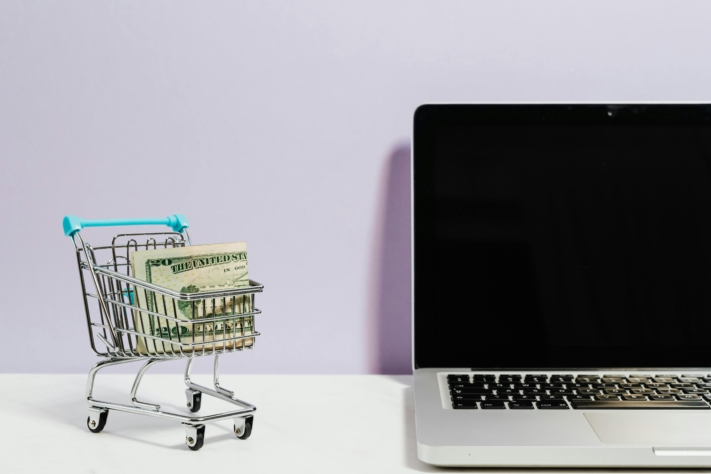

Les **dettes Klarna** sont abondamment thématisées dans les médias sociaux et pourtant souvent sous-estimées. Le confort de l'**achat à tempérament Klarna** attire surtout les jeunes dans une spirale de dettes apparemment sans fin. Peut-être que chez vous aussi, les factures Klarna s'accumulent et que vous vous retrouvez comme beaucoup d'autres devant une montagne de dettes. Mais ne vous inquiétez pas, avec un peu de discipline, vous pourrez vous sortir de vos dettes.

Dans cet article de blog, nous allons nous pencher en détail sur le phénomène des dettes Klarna et vous présenter **des conseils** et des **stratégies** pratiques pour vous sortir de vos difficultés financières.

Les achats en ligne sont devenus la méthode d'achat préférée de nombreux consommateurs.

## Ce qu'est Klarna

Klarna est un **prestataire de services financiers suédois** qui propose des services de paiement en ligne et des solutions de règlement des **achats en ligne**. L'entreprise met à la disposition de ses clients un large répertoire de possibilités, entre autres le **virement immédiat**, le **paiement en plusieurs fois** et l **'achat sur facture**.

Avec son slogan " _Achetez maintenant. Payez plus tard._ Klarna a atteint une énorme portée et encourage ainsi de nombreux consommateurs à effectuer des achats dans des boutiques en ligne sans devoir payer immédiatement. De leur côté, les gérants de boutiques en ligne ont l'avantage que Klarna prend en charge les **défauts de paiement** des acheteurs en retard, de sorte que les e-commerçants reçoivent leur argent quoi qu'il arrive.

La possibilité d'acheter en plusieurs fois peut vous inciter à acheter plus que ce que vous pouvez réellement vous permettre.

## Comment naissent les dettes de Klarna

Les dettes de Klarna apparaissent dès que vous optez pour les méthodes de paiement **Achat sur facture** ou **Klarna Financement** (achat en plusieurs fois). Dans ce cas, Klarna vous avance le montant des produits achetés et vous devez rembourser le montant dans un certain délai.

La tentation du **modèle Buy now, pay later** incite plus vite que les méthodes de paiement habituelles à faire des achats irréfléchis pour lesquels on n'a peut-être même pas de budget. Si vous payez plus souvent avec Klarna Ratenkauf, vous risquez en outre de **perdre** **le contrôle** de vos dépenses.

Si vous ne disposez pas de suffisamment de liquidités à la date d'échéance, les **frais de retard** et **les intérêts débiteurs élevés** peuvent rapidement faire augmenter la dette de Klarna. Ainsi, vous vous retrouvez plus rapidement endetté qu'il n'y paraît à première vue.

## Le groupe cible pour l'achat à tempérament Klarna

L'achat en plusieurs fois Klarna est utilisé par un éventail varié de personnes, dont, selon une [enquête](https://de.statista.com/infografik/29303/anteil-der-befragten-verschiedener-generationen-die-klarna-bnpl-nutzen/), surtout les jeunes de la **génération Z** et **les millennials**. Ce groupe d'âge apprécie la commodité et la flexibilité des services de paiement Klarna, notamment la possibilité de payer plus tard. Sous le hashtag _#KlarnaSchulden_, de nombreux jeunes partagent leurs dettes Klarna sur les médias sociaux.

Répartition des utilisateurs de l'achat à tempérament Klarna par génération

Il est remarquable qu'une étude du [Moniteur financier pour les jeunes de Schufa](https://www.schufa.de/themenportal/analyse-schufa-jugend-finanzmonitor-2022/) montre que les adolescentes utilisent nettement plus souvent l'option Buy-now-pay-later que leurs camarades masculins. La moitié des jeunes femmes interrogées déclarent avoir déjà reporté au moins une fois un achat de cette manière, contre 38 % seulement des jeunes hommes.

## Que se passe-t-il si l'on a des dettes envers Klarna

Si vous avez omis d'effectuer un paiement à Klarna, vous recevrez d'abord **trois rappels** avec des frais de 1,20 euro chacun. Si vous ne pouvez pas payer avant la date d'échéance du dernier rappel, Klarna entame une **procédure de recouvrement**. À partir de ce moment, vous ne pourrez plus payer avec Klarna jusqu'à ce que votre dette soit réglée.

Si vous ne pouvez toujours pas effectuer le paiement, le montant peut être réparti sur d'autres **versements** afin de vous permettre de rembourser. Dans ce cas, il faut toutefois noter que les crédits à tempérament de Klarna ne sont plus gratuits et qu'ils sont rémunérés à un taux d'intérêt de **11,95%**.

## Risques et conséquences de la dette Klarna

Les dettes Klarna ne comportent pas seulement le fardeau immédiat des **obligations financières**, mais aussi des risques à long terme qui sont souvent négligés. Outre les **coûts** déjà mentionnés dus aux frais de rappel et aux intérêts qui augmentent encore votre dette, il y a d'autres **conséquences** auxquelles vous devez penser. Si votre cas est confié à une société de recouvrement, la **Schufa** en sera également informée. Une inscription négative dans la Schufa peut réduire considérablement votre **solvabilité**, ce qui rend plus difficile l'obtention de nouveaux crédits, mais aussi, par exemple, la recherche d'un logement.

En outre, les dettes Klarna peuvent rendre les futurs **achats en ligne plus difficiles**. Outre le blocage de votre compte Klarna, d'autres prestataires de services peuvent également vous refuser l'accès jusqu'à ce que vos dettes soient réglées. Un aspect à ne pas négliger est également le **stress psychologique** qu'engendrent les dettes. La pression financière constante peut entraîner du stress, de l'anxiété et des soucis qui affectent considérablement votre qualité de vie et votre bien-être.

En planifiant et en hiérarchisant consciemment vos dépenses, vous pouvez garder le contrôle de vos finances.

## Comment se débarrasser de ses dettes Klarna

Confrontés aux dettes Klarna, beaucoup se sentent impuissants et dépassés. Pourtant, il existe des mesures concrètes que vous pouvez prendre pour vous sortir de cette situation. En suivant quelques points importants et en faisant le point sur vos finances, vous pouvez vous sortir du piège de l'endettement.

1. **Réduire les dépenses :** La première étape pour réduire les dettes Klarna est de ne plus faire d'achats via Klarna. Il est important de minimiser ses dépenses et de prendre conscience que chaque achat supplémentaire ne fait qu'augmenter le poids de la dette.
2. **Obtenir une vue d'ensemble des dettes :** Il est indispensable d'avoir un aperçu précis de vos dettes. Notez non seulement le montant de vos dettes, mais aussi auprès de quels fournisseurs vous êtes endetté et à quel taux d'intérêt.
3. **Créer un budget :** Grâce à cette vue d'ensemble, vous pouvez maintenant établir un budget détaillé. Listez toutes vos recettes et dépenses et identifiez les domaines dans lesquels vous pouvez réduire les dépenses. De même, réfléchissez à la manière dont vous pouvez augmenter vos revenus. Un plan budgétaire solide est essentiel pour maîtriser vos finances.
4. **Rembourser les dettes :** Avec l'excédent financier que vous obtenez en réduisant vos dépenses ou en augmentant vos revenus, vous pouvez maintenant vous attaquer à vos dettes. Négociez avec Klarna et convenez des modalités de remboursement qui vous conviennent. Ce faisant, donnez la priorité aux dettes dont les taux d'intérêt sont plus élevés afin de minimiser les frais d'intérêt à long terme.

Si vous vous sentez complètement dépassé et que vous n'avez pas une vision claire de vos finances, n'hésitez pas à faire appel à une aide professionnelle. Un **conseiller en matière de dettes** peut vous aider à élaborer un plan pour reprendre le contrôle de vos finances et gérer les dettes Klarna à long terme.

Les conseillers en matière de dettes peuvent négocier avec les créanciers afin de convenir de plans de paiement.

## Comment éviter les dettes

Pour éviter de vous endetter à l'avenir et établir une base financière solide, vous devriez appliquer quelques stratégies éprouvées. Un **budget** établi régulièrement et un **suivi cohérent** de vos dépenses sont indispensables à cet égard. Cela vous permettra de garder une vue d'ensemble de votre situation financière et de minimiser les dépenses inutiles.

Il est également conseillé de ne pas trop se laisser influencer par les promesses publicitaires et les offres alléchantes. Souvent, on fait la promotion de produits ou de services qui ne sont en fait pas nécessaires. Prenez **des décisions rationnelles** et n'achetez que ce dont vous avez vraiment besoin. En outre, la constitution d'une **épargne de secours** pour les dépenses imprévues peut augmenter votre sécurité financière et vous éviter de devoir recourir à des crédits ou à des paiements échelonnés en cas de coup dur.

Une planification budgétaire minutieuse est essentielle pour garantir la sécurité financière.

Klarna elle-même vous offre en outre la possibilité de définir des budgets afin de garder le contrôle de vos dépenses. Vous pouvez également renoncer aux paiements échelonnés et ne payer que par **paiement anticipé** ou **par virement immédiat**, pour être sûr de ne dépenser que l'argent que vous possédez déjà.

## Livre de comptes de SeaTable

Un **livre de comptes** bien structuré est extrêmement utile pour enregistrer et analyser vos dépenses en détail. SeaTable propose un [modèle](https://seatable.io/fr/modele/kqecvuxbrganzgw0w1skgq/) gratuit qui vous permet de garder le contrôle de vos affaires financières sans perdre le **fil**.

Avec le [planificateur de budget](https://seatable.io/fr/modele/kqecvuxbrganzgw0w1skgq/) de SeaTable, vous pouvez facilement saisir toutes vos dépenses et recettes et calculer votre budget. Faites la distinction entre les **dépenses ponctuelles** et les **dépenses régulières** afin d'avoir une vue d'ensemble claire. Qu'il s'agisse de services de streaming prélevés mensuellement ou d'activités de loisirs spontanées, vous pouvez tout inscrire dans votre planificateur de budget. De cette manière, vous pouvez **analyser** vos **habitudes de consommation** et **identifier** votre **potentiel d'économies**.

Grâce au **calendrier** pratique, vous pouvez également garder un œil sur la date d'échéance de certaines dépenses afin de ne pas manquer une échéance de paiement et de ne pas être surpris par des prélèvements imprévus.

Dites adieu à vos dettes Klarna en gérant efficacement vos finances et en gardant un œil sur vos dépenses. Pour cela, il vous suffit de [vous inscrire gratuitement sur SeaTable](https://seatable.io/fr/enregistrement/), de créer une nouvelle base de données à l'aide du modèle et d'y ajouter ensuite vos propres données.
