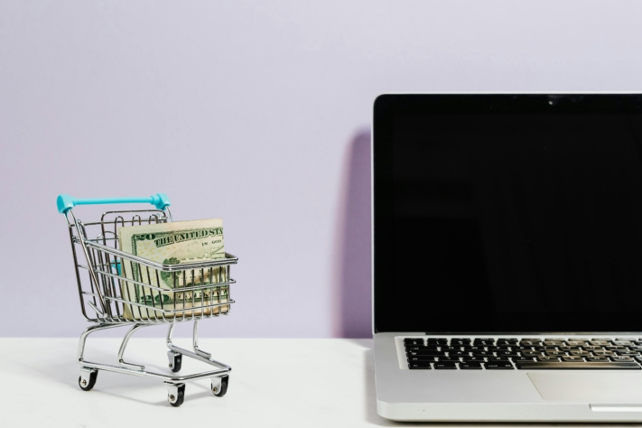
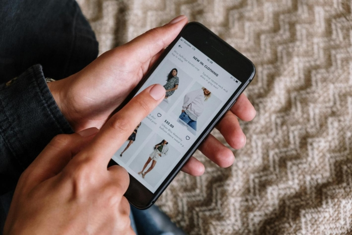
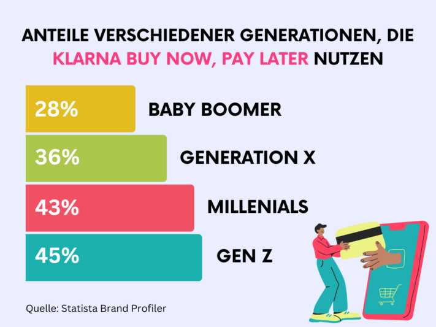
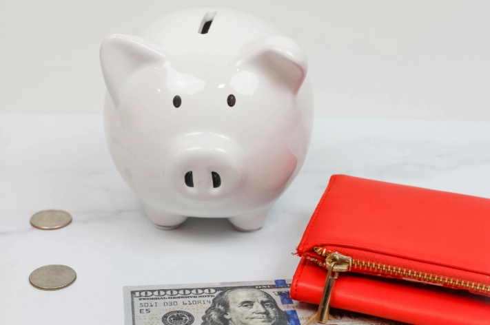

**Долги Klarna** сегодня активно обсуждаются в социальных сетях, но их часто недооценивают. Удобство **покупки в рассрочку Klarna** заманивает молодых людей, особенно тех, кто, кажется, бесконечно влезает в долговую спираль. Возможно, ваши счета за Klarna накапливаются, и вы, как и многие другие, столкнулись с горой долгов. Но не волнуйтесь, с помощью небольшой дисциплины вы сможете выбраться из долгов.

В этой статье мы подробно рассмотрим феномен долгов Klarna и дадим вам практические **советы** и **стратегии** по выходу из финансовых затруднений.

Онлайн-шопинг стал предпочтительным способом покупки для многих потребителей.

## Что такое Klarna

Klarna - **шведский поставщик финансовых услуг**, предлагающий услуги онлайн-платежей и решения для обработки **покупок в Интернете**. Компания предлагает своим клиентам широкий спектр возможностей, включая **мгновенный банковский перевод**, **оплату в рассрочку** и **покупку по счету**.

Благодаря своему слогану _"Покупай сейчас. Pay later._ ", Klarna достигла огромного охвата, побуждая многих потребителей совершать покупки в интернет-магазинах без необходимости немедленной оплаты. В свою очередь, операторы интернет-магазинов имеют преимущество в том, что Klarna берет на себя **платежные обязательства** покупателей, не оплативших покупки, так что продавцы электронной коммерции всегда получают свои деньги.

Возможность покупки в рассрочку может соблазнить вас купить больше, чем вы на самом деле можете себе позволить.

## Как возникают долги Klarna

Долги Klarna возникают, как только вы выбираете способы оплаты - **покупку по счету** или **финансирование Klarna** (покупка в рассрочку). В этом случае Klarna предъявляет вам сумму за приобретенные товары, и вы должны погасить ее в течение определенного срока.

Привлекательность **модели "купи сейчас, заплати потом**" быстрее, чем при обычных способах оплаты, склоняет вас к необдуманным покупкам, на которые у вас может даже не быть бюджета. Если вы часто оплачиваете покупки в рассрочку в Klarna, вы также рискуете **потерять** **контроль** над своими расходами.

Если в назначенный срок у вас не окажется достаточной ликвидности, **штрафы за просрочку платежа** и **высокие дебетовые проценты** могут привести к тому, что ваш долг перед Klarna будет стремительно расти. Таким образом, вы можете попасть в долговую яму быстрее, чем кажется на первый взгляд.

## Целевая группа для покупки в рассрочку в Klarna

Услугами рассрочки Klarna пользуются самые разные люди, в том числе, согласно [опросу](https://de.statista.com/infografik/29303/anteil-der-befragten-verschiedener-generationen-die-klarna-bnpl-nutzen/), в основном молодые представители **поколения Z** и **миллениалы**. Эта возрастная группа ценит удобство и гибкость платежных услуг Klarna, особенно возможность платить позже. Многие молодые люди рассказывают о своих долгах Klarna в социальных сетях под хэштегом _#KlarnaSchulden_.

Распределение пользователей рассрочки Klarna по поколениям

Примечательно, что, согласно исследованию [Schufa Youth Finance Monitor](https://www.schufa.de/themenportal/analyse-schufa-jugend-finanzmonitor-2022/), молодые люди женского пола используют опцию "купить сейчас - заплатить потом" значительно чаще, чем их сверстники мужского пола. Половина респондентов женского пола заявили, что хотя бы раз откладывали покупку таким образом, в то время как среди подростков мужского пола таких всего 38 процентов.

## Что произойдет, если у вас появятся долги Klarna

Если вы пропустили платеж в пользу Klarna, то сначала вы получите **три напоминания** с платой 1,20 евро за каждое. Если вы не сможете заплатить в срок, указанный в последнем напоминании, Klarna начнет **процедуру взыскания долга**. С этого момента вы больше не сможете оплачивать услуги Klarna до тех пор, пока ваш долг не будет погашен.

Если вы все равно не можете внести платеж, сумму можно распределить на несколько **взносов**, чтобы вы смогли погасить кредит. Однако в этом случае обратите внимание, что рассрочка Klarna больше не является бесплатной и имеет процентную ставку **11,95 %**.

## Риски и последствия долговых обязательств Klarna

Долги Klarna несут в себе не только непосредственное бремя **финансовых обязательств**, но и долгосрочные риски, которые часто упускаются из виду. Помимо вышеупомянутых **расходов** на напоминания и процентов, которые увеличивают ваш долг, существуют и другие **последствия**, которые вам следует учитывать. Если ваше дело будет передано агентству по сбору долгов, **Schufa** также будет проинформирована. Негативная запись в Schufa может значительно снизить ваш **кредитный рейтинг**, что затруднит не только получение новых кредитов, но и, например, поиск квартиры.

Кроме того, долги Klarna могут **затруднить** будущие **покупки в Интернете**. Помимо блокировки вашего счета в Klarna, другие поставщики услуг могут отказать вам в доступе до тех пор, пока вы не погасите задолженность. Еще один аспект, которым не стоит пренебрегать, - это **психологическое напряжение**, которое несут с собой долги. Постоянное финансовое давление может привести к стрессу, беспокойству и тревоге, что может существенно повлиять на качество вашей жизни и самочувствие.

Осознанно планируя и расставляя приоритеты, вы сможете держать свои финансы под контролем.

## Как избавиться от долгов Klarna

Столкнувшись с долгом Klarna, многие чувствуют себя беспомощными и подавленными. Однако есть конкретные шаги, которые вы можете предпринять, чтобы выйти из этой ситуации. Выполнив несколько важных пунктов и проанализировав свои финансы, вы сможете найти выход из долговой ямы.

1. **Сократите расходы:** Первый шаг к сокращению долга Klarna - прекратить совершать покупки через Klarna. Важно минимизировать свои расходы и осознать, что каждая дополнительная покупка только увеличит вашу долговую нагрузку.
2. **Составьте обзор ваших долгов:** Точный обзор ваших долгов крайне важен. Запишите не только сумму долга, но и то, перед какими поставщиками вы имеете задолженность и по какой процентной ставке.
3. **Создайте бюджетный план:** На основе этого обзора вы можете составить подробный бюджетный план. Перечислите все свои доходы и расходы и определите области, в которых вы можете сократить расходы. Вы также должны подумать о том, как увеличить свои доходы. Надежный бюджетный план имеет решающее значение для того, чтобы взять свои финансы под контроль.
4. **Расплатитесь с долгами:** Теперь вы можете погасить свои долги за счет финансового профицита, полученного благодаря сокращению расходов или увеличению доходов. Проведите переговоры с Klarna и согласуйте приемлемые для вас условия погашения. Отдайте предпочтение долгам с более высокими процентными ставками, чтобы минимизировать процентные расходы в долгосрочной перспективе.

Если вы чувствуете себя совершенно подавленным и не имеете четкого представления о своих финансах, не бойтесь обратиться за профессиональной помощью. **Консультации по вопросам долгов** помогут вам разработать план, который поможет вам вернуть финансы под контроль и управлять долгом Klarna в долгосрочной перспективе.

Консультанты по работе с долгами могут вести переговоры с кредиторами, чтобы договориться о планах выплат.

## Как избежать долгов

Чтобы избежать будущих долгов и создать прочный финансовый фундамент, вам следует применять некоторые проверенные стратегии. Очень важно регулярно составлять **бюджет** и **следить** за своими расходами. Это позволит вам держать под контролем свое финансовое положение и свести к минимуму ненужные траты.

Также не стоит поддаваться чрезмерному влиянию рекламных обещаний и заманчивых предложений. Часто рекламируются товары или услуги, которые на самом деле вам не нужны. Принимайте **рациональные решения** и покупайте только то, что вам действительно необходимо. Кроме того, откладывая **средства** на непредвиденные расходы, вы можете повысить свою финансовую безопасность и избежать необходимости прибегать к кредитам или рассрочкам в экстренных случаях.

Тщательное планирование бюджета имеет решающее значение для обеспечения финансовой безопасности.

Klarna также предлагает возможность установить бюджет, чтобы контролировать свои расходы. Кроме того, вы можете отказаться от рассрочки и платить только **авансом** или **мгновенным банковским переводом**, чтобы тратить только те деньги, которые у вас уже есть.

## Бюджетная книга от SeaTable

Хорошо структурированная **бюджетная книга** чрезвычайно полезна для подробного учета и анализа ваших расходов. SeaTable предлагает бесплатный [шаблон](), который позволит вам держать свои финансовые дела под контролем, не сбиваясь с **пути**.

С помощью [планировщика бюджета]() SeaTable вы можете легко записывать все свои расходы и доходы и рассчитывать бюджет. Разграничьте **разовые** и **регулярные** расходы, чтобы получить четкую картину. Будь то ежемесячные потоковые сервисы или спонтанный досуг - все можно занести в планировщик бюджета. Это позволит вам проанализировать свое **потребительское поведение** и **определить потенциал экономии**.

Благодаря практичному **календарю** вы также сможете следить за датой оплаты определенных расходов, чтобы не пропустить сроки платежей и не столкнуться с неожиданными прямыми дебетованиями.

Попрощайтесь с долгами Klarna, эффективно управляя своими финансами и отслеживая расходы. Все, что вам нужно сделать, - это [бесплатно зарегистрироваться в SeaTable](), создать новую базу данных, используя шаблон, а затем ввести свои собственные данные.
