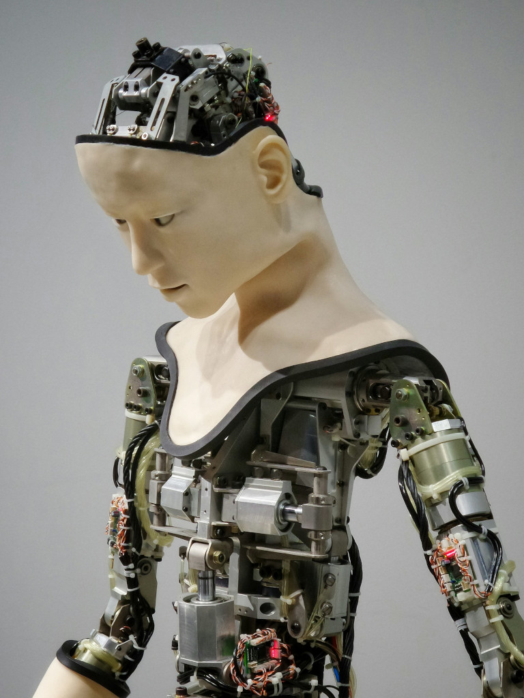
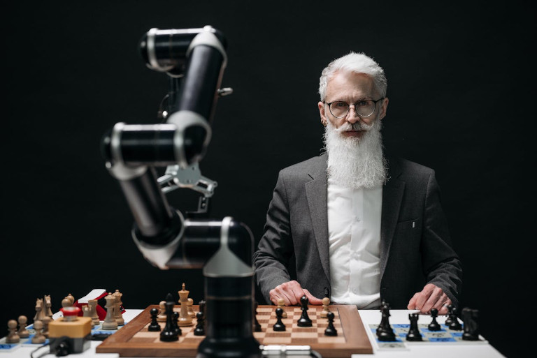
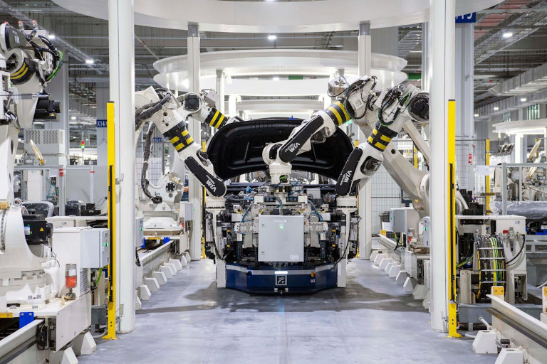
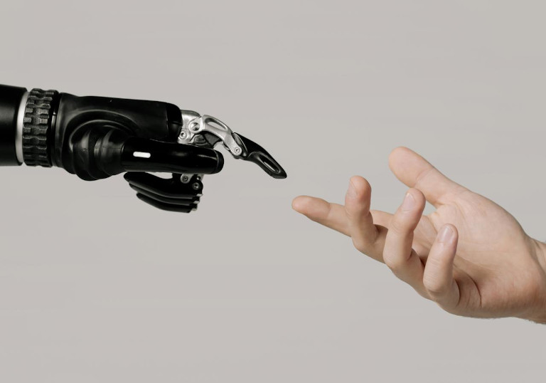
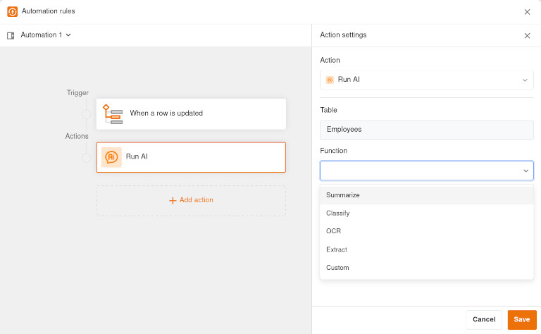

A inteligência artificial (IA) está a revolucionar a vida no século XXI. Está a mudar a forma como trabalhamos, obtemos informação e tomamos decisões. Quase nenhum outro tema está a ser discutido com tanta intensidade nos negócios, na política, na ciência e na sociedade. Enquanto alguns celebram o progresso tecnológico, outros vêem riscos consideráveis.

Para garantir que pode ter uma palavra a dizer no debate sobre a inteligência artificial e que a sua empresa não perde o contacto com o tema da IA, vale a pena obter uma visão bem fundamentada, que o artigo seguinte oferece.

### Principais conclusões

*   A inteligência artificial é baseada em **algoritmos**, ou seja, instruções claras para resolver problemas específicos. É **treinada com grandes quantidades de dados** para reconhecer padrões e derivar regras. Desta forma, aprende o que faz mais sentido e em que condições.
*   A IA generativa pode gerar novos conteúdos (por exemplo, criar textos, imagens ou vídeos) seguindo as regras que aprendeu, calculando **probabilidades estatísticas** a partir dos dados de treino e selecionando gradualmente outros elementos que melhor correspondam ao pedido.
*   Ao contrário dos seres humanos, os sistemas de IA fracos não podem realmente **pensar**. Não têm consciência, nem emoções, nem moral, nem intuição.
*   Quer se trate do planeamento de rotas, da correção de textos ou da apresentação personalizada de publicidade - a inteligência artificial já está **omnipresente** na vida quotidiana e profissional. Desempenha também um papel importante na investigação (por exemplo, modelização do clima, deteção precoce do cancro).
*   Uma visão geral dos problemas que a inteligência artificial pode causar: invenção de factos (alucinação), amplificação da discriminação, actividades fraudulentas, deepfakes, aumento do consumo de energia, riscos de proteção de dados e dependência de empresas tecnológicas.

## O que é a inteligência artificial?

Até à data, não existe uma definição normalizada de inteligência artificial. No entanto, de um ponto de vista económico, pode dizer-se que a inteligência artificial é a capacidade de os sistemas informáticos ou as máquinas realizarem determinadas tarefas que normalmente requerem a inteligência humana. Na sua essência, o desenvolvimento atual da IA consiste em **recriar as capacidades humanas utilizando métodos estatísticos e algoritmos**. Estes incluem, entre outros:

*   processar informação e armazená-la como conhecimento
*   analisar dados e reconhecer padrões
*   compreender e gerar linguagem humana
*   resolver problemas, tomar decisões e agir socialmente

### Como é que a inteligência artificial difere da inteligência natural?

A inteligência natural é criada por processos neuronais no cérebro humano. Está indissociavelmente ligada à **consciência, emoções, criatividade, moralidade e responsabilidade**. Os seres humanos podem transferir conhecimentos de forma flexível para novas situações, atuar de forma **intuitiva** e compreender as relações, mesmo quando apenas existe pouca informação disponível.

A inteligência artificial, por outro lado, funciona **baseada em dados**. Necessita de grandes quantidades de dados para imitar a inteligência humana, não tem consciência do que está a fazer e não pensa, mas calcula probabilidades estatísticas. Não tem emoções, moral ou intuição.

## Que tipos de inteligência artificial existem?

A inteligência artificial é geralmente classificada como **inteligência artificial forte e fraca**.

### IA fraca

Atualmente, a inteligência artificial refere-se quase sempre à IA fraca. É especializada na execução de **tarefas recorrentes e claramente definidas** particularmente bem.

No entanto, a IA fraca não consegue pensar, desenvolver intenções ou refletir sobre si própria. Não tem criatividade e não aprende de forma autónoma, mas tem de ser treinada. A sua capacidade de aprendizagem limita-se geralmente à aplicação de algoritmos (instruções claras para resolver determinados problemas) e ao reconhecimento de padrões em grandes quantidades de dados. Isto é particularmente útil na [automatização de processos]() e no **processamento de linguagem e imagem**.

### IA forte

A chamada IA forte que emula totalmente o pensamento humano **ainda não existe**. Uma IA forte não só executaria tarefas individuais mediante instruções, mas poderia teoricamente **aprender e desenvolver-se de forma independente**, encontrar soluções criativas em contextos completamente novos, formular objectivos e seguir estratégias.

É questionável se uma tal forma hipotética de inteligência artificial poderia desenvolver a **consciência**. Muito provavelmente, não teria quaisquer emoções reais, mas apenas **emoções simuladas** e **nenhuma intuição**, uma vez que as suas decisões continuariam a basear-se em cálculos. Uma IA forte poderia seguir regras morais, mas não sentir responsabilidade moral como um ser humano.

## O teste de Turing como critério para a inteligência artificial

Um marco importante na história da IA é o **teste de Turing**, que foi desenvolvido em 1950 pelo matemático britânico Alan Turing. Inicialmente, propôs um jogo para descobrir se uma máquina ou um computador pode enganar um interrogador humano de forma abrangente e, por conseguinte, se possui a capacidade de pensar ao nível dos seres humanos.

Este teste foi mais tarde reduzido na sua complexidade, de modo que hoje em dia o seguinte esquema de teste é conhecido como teste de Turing: um sujeito humano conduz **uma conversa com dois parceiros de diálogo desconhecidos** através de um teclado e um ecrã. Um interlocutor é um **humano**, o outro uma **máquina**. Se a pessoa testada não conseguir reconhecer de forma fiável qual dos dois é a máquina através de perguntas intensivas, a máquina passou no teste de Turing. Podemos, portanto, atribuir uma inteligência artificial fraca à máquina logo que esta apresente um comportamento de comunicação equiparável ao de um ser humano.

## O que é a inteligência artificial atualmente?

Os modelos modernos de IA – especialmente os Large Language Models (LLM) – aproximam-se muito desta definição de inteligência artificial em determinados cenários. [As versões mais recentes do ChatGPT já passaram o teste de Turing](https://www.spiegel.de/wissenschaft/technik/kuenstliche-intelligenz-chatgpt-besteht-turing-test-zu-menschlichem-verhalten-a-0af83891-e0ce-46cc-baf5-e0dae4caadee). Podem simular a comunicação humana num chat baseado em texto de forma tão hábil que a maioria das pessoas já não consegue distingui-los de uma pessoa real e é até muito mais provável que os confunda com humanos do que com parceiros de conversa humanos reais.

No entanto, o modelo de IA do ChatGPT não é inteligente no sentido em que engana e manipula deliberadamente as pessoas. Apenas calcula de forma fiável a probabilidade de quais as respostas que os parceiros de conversação mais provavelmente querem ouvir e qual o comportamento social considerado apropriado numa determinada situação. Por outras palavras, passar no teste de Turing não significa que uma máquina realmente **pensa**, mas apenas que imita o comportamento humano de forma convincente.

## Tecnologias típicas no domínio da IA

Os sistemas de IA, como os chatbots e os assistentes de voz, utilizam procedimentos básicos para imitar o comportamento humano. Estas tecnologias de IA incluem

-   **Aprendizagem automática (Machine Learning)**: Os sistemas de IA aprendem a resolver problemas específicos utilizando algoritmos estatísticos e uma grande quantidade de dados de treino.
-   **Aprendizagem profunda (Deep Learning)**: As redes neuronais artificiais com numerosas camadas permitem o processamento de dados de entrada particularmente complexos, por exemplo, no reconhecimento facial e da fala.
-   **Processamento de linguagem natural (PNL)**: Os computadores processam e analisam a linguagem natural utilizando algoritmos, por exemplo, para correção ou geração de texto.
-   **Visão computacional**: Os computadores processam e analisam imagens utilizando algoritmos, por exemplo, para reconhecer padrões e objectos e criar mundos virtuais.

## Onde é utilizada a inteligência artificial?

É quase certo que já utilizou a **inteligência artificial na sua vida quotidiana** – consciente ou inconscientemente. Seja para o planeamento de rotas em sistemas de navegação, recomendações de compra em lojas online ou autocorreção e autocompletamento de textos: A IA treinada está a ser utilizada em todo o lado, calculando a solução mais provável para si a partir de inúmeros dados em segundo plano.

Na **investigação médica**, a inteligência artificial já está a ser utilizada para melhorar os diagnósticos e as análises de imagens, por exemplo, na deteção precoce do cancro. Os investigadores podem também utilizar a inteligência artificial para simular cenários com base em determinados pressupostos, por exemplo, para calcular o aquecimento global utilizando **modelos climáticos** ou para utilizar os recursos de forma eficiente na agricultura. Isto mostra claramente que as tecnologias de IA são de grande utilidade para a sociedade.

## Áreas de aplicação da IA na economia

A inteligência artificial é também utilizada em muitas empresas. Como o desempenho dos sistemas de IA tem aumentado rapidamente nos últimos anos, a inteligência artificial pode analisar enormes quantidades de dados num curto espaço de tempo e reconhecer correlações que são quase impossíveis de apreender pelos humanos. A IA ajuda a **tomar decisões mais informadas**, reconhecendo os desenvolvimentos numa fase inicial e simulando cenários. No trabalho de escritório, em particular, muitas tarefas recorrentes também podem ser **automatizadas** com a ajuda da IA. Eis alguns exemplos de diferentes áreas:

### Indústria e produção

*   Previsão da procura e das vendas para otimizar as [cadeias de abastecimento]()
*   Manutenção preditiva e assistência técnica de máquinas
*   Robótica e linhas de produção automatizadas

### Marketing e vendas

*   [Abordagem personalizada do cliente]() aquando da apresentação de publicidade
*   Criação mais rápida de conteúdos com IA generativa
*   Análise de grupos-alvo específicos para o [plano de marketing]()

### RH e desenvolvimento do pessoal

*   Entrevistas normalizadas com assistentes virtuais
*   Análise das qualificações e dos perfis de personalidade dos [candidatos]()
*   Previsões das [necessidades de pessoal]() em determinados cenários

### Administração geral

*   Resumir ou redigir relatórios, e-mails, etc.
*   Criar [orçamentos](), [confirmações de encomendas]() e [facturas]()
*   Responder a [pedidos de assistência]()

## IA generativa

A IA generativa é provavelmente a área de aplicação mais conhecida da inteligência artificial atualmente. Só se tornou popular nos últimos anos graças aos **chatbots e assistentes de IA**, como o ChatGPT, o Google Gemini, o Microsoft Copilot, o Amazon Alexa, o DeepSeek, o Midjourney e o Perplexity. No entanto, nesta altura, ...

*   a inteligência artificial pode escrever textos
*   a inteligência artificial pode parafrasear e traduzir textos
*   a inteligência artificial pode criar imagens
*   a inteligência artificial pode criar um vídeo
*   a inteligência artificial pode criar música

### Como é que a inteligência artificial funciona nestes casos?

**A inteligência artificial generativa explicada de forma simples**: Ao aprender com grandes quantidades de dados e derivar regras, pode criar novos conteúdos que seguem essas regras. Não cria nada original ou criativo no verdadeiro sentido da palavra, mas calcula probabilidades quanto ao que faz sentido a seguir. Tal como acontece com todos os tipos de inteligência artificial existentes, trata-se, portanto, de uma IA fraca.

* **A IA generativa baseada no texto funciona com a tokenização**: O modelo linguístico divide o texto em tokens (por exemplo, caracteres, palavras e frases), calcula uma probabilidade para cada token possível e decide qual o token que melhor corresponde estatisticamente à descrição do texto introduzido (o chamado prompt). Ao fazê-lo, aplica as regras da respectiva língua.  
  
* **A IA pode criar imagens utilizando modelos de difusão**: O modelo começa com uma imagem completamente ruidosa e aleatória, da qual vai removendo gradualmente o ruído. Um codificador faz corresponder a descrição do texto com elementos de imagem adequados que estavam contidos no material de treino do modelo. Os pixéis são alterados até ser criada uma imagem nítida que se ajusta estatisticamente bem ao pedido.  
  
Como pode ver, a IA generativa está fortemente orientada para a formulação da descrição do texto introduzido. Por conseguinte, um prompt deve fornecer ao modelo de IA uma descrição precisa com contexto, especificações de formato e estilos, de modo a obter o melhor resultado possível. Por conseguinte, a **prompting** é uma competência fundamental quando se lida com a IA moderna.

## As vantagens da IA num relance

Algumas das vantagens dos sistemas de IA para as empresas já foram mencionadas ao longo deste artigo. Aqui tem uma visão geral dos pontos mais importantes:

*   Automatização de tarefas baseadas em regras
*   Análise mais rápida e abrangente de grandes quantidades de dados
*   Base melhorada para a tomada de decisões
*   Evitar erros humanos
*   Resultados consistentes e disponibilidade 24 horas por dia

## Que riscos acarreta a inteligência artificial?

Estamos ainda muito longe do cenário de terror de uma inteligência artificial hostil que se apodera do mundo no futuro e se volta contra os humanos. Até ao momento, existe apenas uma **IA fraca que necessita de instruções e de formação por parte dos humanos** e que não irá simplesmente ganhar vida própria. No entanto, a inteligência artificial comporta o risco de conduzir a resultados indesejáveis ou mesmo de ser utilizada indevidamente para fins criminosos.  

Os maiores problemas em torno da inteligência artificial são


Podem ocorrer interpretações erradas e conclusões incorrectas num sistema de IA se o modelo de IA contiver dados incorrectos ou desactualizados ou ligar dados que não estão relacionados. A frequência com que isto acontece depende essencialmente da qualidade, da atualidade e da quantidade dos dados de treino. No caso dos chatbots, as respostas geradas pela IA baseiam-se por vezes em dados de formação que têm vários meses ou anos. Consequentemente, os modelos de IA muitas vezes não conseguem categorizar as notícias actuais, o que torna indispensável o jornalismo real. Examine sempre de forma crítica se o conteúdo gerado pela IA pode estar correto e obtenha informações adicionais de meios de comunicação social fiáveis.



ChatGPT, Gemini, Copilot e Perplexity parecem convincentes, mesmo que afirmem coisas completamente falsas. De acordo com um [estudo da UER](https://www.ebu.ch/Report/MIS-BBC/NI_AI_2025.pdf), uma média de 45% das suas respostas contém erros ou factos inventados. As chamadas alucinações surgem porque a IA não tem conhecimento factual. Embora possa gerar sequências de palavras estatisticamente plausíveis, não pode verificar se uma afirmação é verdadeira. Inventa informações em falta e, por vezes, até nomeia fontes que não existem de todo. Por conseguinte, aplica-se o seguinte: nunca confie cegamente nas respostas geradas pela IA e verifique as informações importantes utilizando fontes fiáveis.



A IA aprende padrões humanos a partir de dados, alguns dos quais reflectem preconceitos e modelos existentes. Este facto pode resultar em decisões discriminatórias, por exemplo, quando se candidata a um emprego ou concede empréstimos. Num [caso bem conhecido](https://www.heise.de/news/Amazon-KI-zur-Bewerbungspruefung-benachteiligte-Frauen-4189356.html), um algoritmo de candidatura discriminou involuntariamente as mulheres. Como no sector das TI trabalham mais homens do que mulheres e a empresa tinha contratado maioritariamente homens nos dez anos anteriores, a IA filtrou as candidaturas de mulheres com base nestes dados de formação. Para que, no futuro, a inteligência artificial possa tomar decisões mais objectivas do que os humanos, deve ser treinada com conjuntos de dados equilibrados.



Os textos, imagens e vídeos gerados por IA podem agora parecer muito realistas e ser utilizados especificamente para enganar as pessoas. Os chamados deepfakes utilizam a inteligência artificial para falsificar rostos e vozes em vídeos ou fotografias. Por exemplo, a inteligência artificial pode criar um vídeo em que as celebridades fazem declarações que nunca disseram na realidade. É difícil reconhecer a inteligência artificial neste caso. Actores desleais podem gerar imagens de inteligência artificial enganosamente reais e utilizá-las para manipular identidades, enganar sistemas biométricos ou conduzir campanhas de desinformação. As informações falsas e as inverdades estão a espalhar-se rapidamente nas redes sociais graças à inteligência artificial, porque muitos utilizadores as partilham sem as verificar e os algoritmos favorecem os conteúdos controversos.



Para treinar sistemas de IA que utilizam algoritmos de aprendizagem e grandes quantidades de dados, são necessários processadores de computador dispendiosos com elevada capacidade de computação. Um único centro de dados de IA pode consumir tanta eletricidade como uma grande cidade. Como grande parte desta eletricidade ainda é produzida a partir de combustíveis fósseis, o [impacto ambiental da IA](https://www.tagesschau.de/wirtschaft/energie/kuenstliche-intelligenz-energieverbrauch-100.html) também é um problema. Conceitos inteligentes no local que utilizem o calor residual dos centros de dados, por exemplo, podem atenuar estes efeitos.



A utilização da inteligência artificial exige grandes quantidades de dados, que podem também conter muitas informações sensíveis e pessoais. Por exemplo, os operadores das redes sociais recolhem grandes quantidades de dados dos utilizadores que podem ser posteriormente utilizados para apresentar publicidade personalizada, a fim de influenciar decisões de voto ou de compra. É, por isso, problemático que a maior parte destes dados esteja nas mãos de alguns gigantes tecnológicos dos EUA e da China. Os próprios modelos de IA também são predominantemente provenientes dos EUA, o que conduz a um elevado nível de dependência tecnológica. Os modelos linguísticos de fonte aberta da Mistral AI são uma alternativa europeia.


## Melhores práticas para lidar com a IA nas empresas

De acordo com um [inquérito da EY](https://www.ittbusiness.at/article/europaeische-unternehmen-profitieren-zunehmend-von-kuenstlicher-intelligenz), mais de metade das empresas europeias já estão a obter benefícios mensuráveis através da utilização da IA – incluindo o aumento da produtividade, a poupança de tempo, a redução de custos e a redução de erros.

Para aproveitar as oportunidades económicas e utilizar a inteligência artificial de forma sensata e segura na sua empresa, alguns princípios já provaram o seu valor:
  
- **Controlo humano**: A inteligência artificial deve apoiar as decisões, mas não tomá-las sozinha. Não deve simplesmente acreditar nos resultados, mas sempre examiná-los e verificá-los.  
- **Transparência**: Comunique claramente aos seus empregados as condições de enquadramento para a utilização da IA. Isto ajudá-lo-á a evitar a criação de uma [TI sombra]() sobre a qual nada sabe. A utilização da IA também deve ser clara para os clientes.
- **Formação contínua**: A experiência em IA está a tornar-se cada vez mais um fator de sucesso. Torne os seus funcionários aptos para a ação e esclareça com eles as seguintes questões: como funciona a inteligência artificial e onde é utilizada a inteligência artificial?
- **Soberania dos dados**: Se pretende utilizar a IA sem comprometer a [proteção de dados](), vale a pena executar um modelo de IA nos seus próprios servidores ou, pelo menos, utilizar [plataformas de nuvem]() na UE.
- **Conformidade**: Certifique-se de que os sistemas de IA da sua empresa cumprem todas as leis e diretrizes de conformidade aplicáveis, especialmente a Lei da IA da UE, porque em caso de dúvida será responsabilizado.

### O que é a Lei da IA da UE?

O regulamento de IA da União Europeia é a primeira lei do mundo para a regulamentação abrangente da inteligência artificial. Entrou em vigor a 1 de agosto de 2024 e será totalmente aplicável a partir de 2 de agosto de 2026. A Lei da IA da UE categoriza os sistemas de IA em quatro classes de risco, às quais se aplicam regras diferentes:
- **Risco inadmissível**: São proibidos, por exemplo, a pontuação social, a monitorização biométrica em tempo real ou o controlo de comportamentos manipuladores, por não serem compatíveis com a proteção dos direitos fundamentais.
- **Risco elevado**: A utilização da IA é estritamente regulamentada em domínios como os procedimentos de candidatura, os empréstimos e os diagnósticos médicos. Existem requisitos elevados em termos de qualidade dos dados, transparência, controlo humano e documentação.
- **Risco limitado**: Assim que os seres humanos interagem com a IA (por exemplo, chatbots), devem ser informados desse facto e os conteúdos gerados pela IA devem ser rotulados como tal.
- **Risco mínimo**: As aplicações de IA, como os filtros de spam, os corretores ortográficos ou as sugestões automáticas de texto nos motores de busca, não estão sujeitas a quaisquer obrigações adicionais.

Os fornecedores e operadores dos sistemas são responsáveis por quaisquer infracções à lei e danos causados por aplicações de IA até 15 milhões de euros ou 3 por cento do seu volume de negócios anual global.

## Utilize a inteligência artificial de forma segura com SeaTable

Enquanto plataforma de IA sem código, SeaTable permite automatizações suportadas por IA com as quais pode organizar a sua [gestão de dados]() de forma mais eficiente. Analisar, modificar e expandir registos de dados, traduzir textos e extrair informações relevantes de documentos – tudo isto é possível com as funções de IA.

E sem quaisquer linhas de preocupação no que diz respeito à proteção de dados: para além do Gemma 3, o SeaTable suportará no futuro outros modelos de IA de vários fornecedores que são operados em centros de dados alemães em conformidade com o RGPD. Além disso, a troca de dados entre o [SeaTable Cloud]() e os modelos linguísticos é encriptada.
  
Para um controlo total, os auto-hospedadores também podem, obviamente, utilizar modelos de IA na sua própria infraestrutura. [SeaTable AI](https://admin.seatable.com/installation/components/seatable-ai/), um componente do [SeaTable Server](), baseia-se no LiteLLM e, por conseguinte, suporta a ligação de um grande número de modelos com uma API compatível com OpenAI.



Subscreva a nossa **newsletter** e mantenha-se atualizado sobre como pode utilizar a inteligência artificial na sua organização!



## Conclusão: A IA é uma ferramenta – não um substituto da inteligência humana

A inteligência artificial é provavelmente a tecnologia mais poderosa do nosso tempo. Pode otimizar, automatizar e acelerar processos, calcular com grandes quantidades de dados e fornecer novos conhecimentos - o que a torna extremamente valiosa para as empresas. No entanto, a inteligência artificial ainda está a milhas de distância de ser um ser pensante. Pode imitar as capacidades humanas, mas tem de ser desenvolvida, treinada e controlada por humanos.

A utilização responsável da IA determinará se esta se torna uma vantagem ou um problema. Se, no futuro, utilizar a inteligência artificial como uma ferramenta para o seu trabalho, deve proceder de forma sensata, transparente e de acordo com as regras. Isto permitir-lhe-á beneficiar de uma maior eficiência e de ganhos de produtividade a longo prazo.

## Perguntas frequentes sobre a IA


A visão original da IA era uma inteligência forte capaz de pensar como um humano, aprender de forma autónoma e agir de forma intencional. Estamos ainda muito longe disso. Os actuais sistemas de IA são especializados em determinadas tarefas, dependem de dados de treino e não têm consciência ou compreensão real. Em suma: a IA já consegue imitar de forma convincente algumas capacidades humanas, mas não é inteligente no sentido humano.



A inteligência artificial funciona com base em algoritmos, ou seja, instruções claras para resolver problemas específicos. É treinada com muitos dados para reconhecer padrões e deduzir regras. Desta forma, aprende o que é estatisticamente mais provável numa determinada situação.



A inteligência artificial generativa pode gerar novos conteúdos seguindo as regras que aprendeu, calculando probabilidades a partir dos dados de treino e selecionando gradualmente a opção que estatisticamente melhor corresponde ao pedido de cada elemento adicional.



As áreas de aplicação da inteligência artificial são diversas. Vão desde a investigação médica e a modelação climática até à inteligência artificial na vida quotidiana e aos sistemas de IA nas empresas. Nestas, a inteligência artificial é utilizada na produção, na administração, nos [recursos humanos](), no [marketing](), no apoio ao cliente e noutras áreas.



Para além das inúmeras oportunidades, a inteligência artificial pode também causar-nos dificuldades no futuro. Estas incluem problemas com a tecnologia de IA, como a invenção de factos (alucinação) ou dados incorrectos e desactualizados, mas também problemas sociais e legais, como deepfakes, actividades fraudulentas, aumento da discriminação, elevado consumo de energia, riscos de proteção de dados e dependência de alguns grandes fornecedores de tecnologia.

