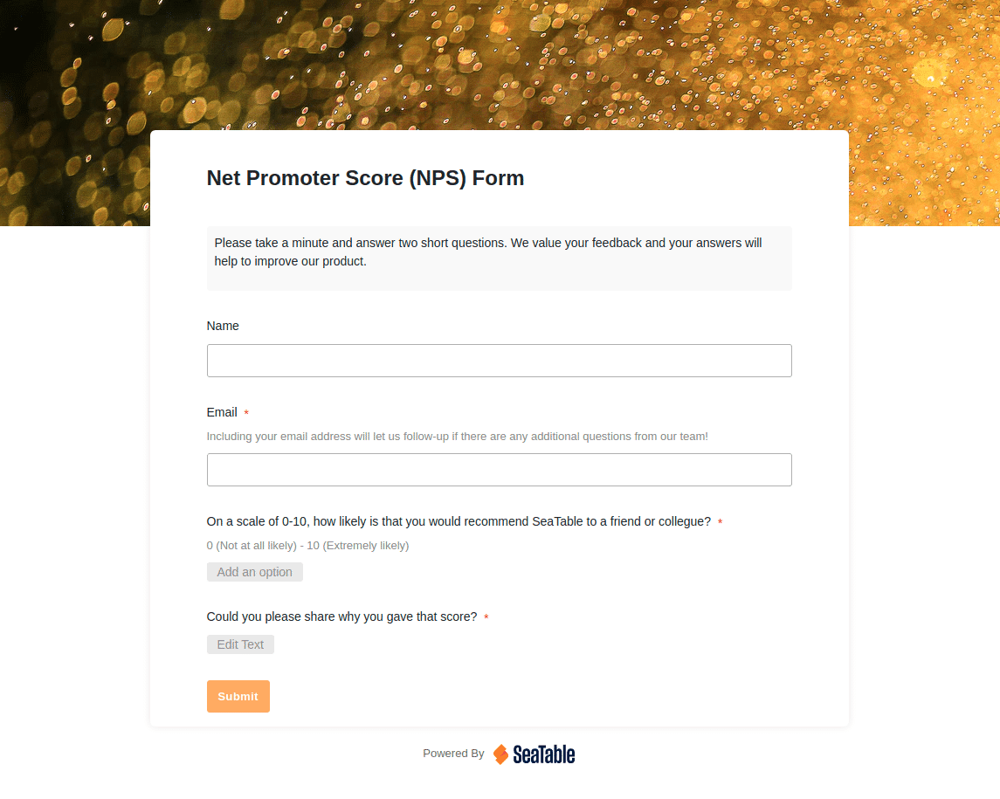
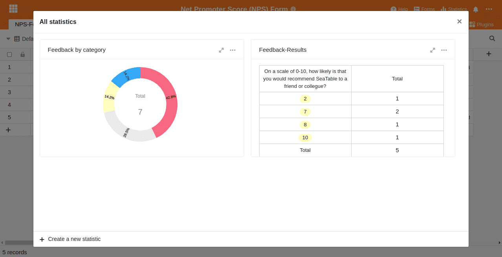
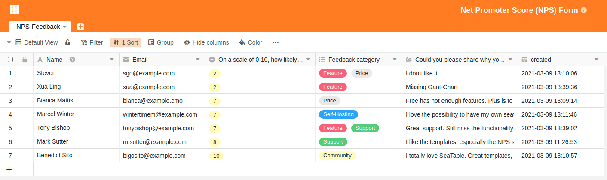

Ist ein Kunde zufrieden, so wird dieser erneut bei Ihnen einkaufen und Ihr Unternehmen wahrscheinlich sogar weiterempfehlen. Löst Ihr Produkt das Problem des Kunden nicht wie erwartet, so haben Sie einen Kunden verloren und es hagelt im schlimmsten Fall schlechte Bewertungen. Die mangelnde Kundenzufriedenheit könnte dann wiederum andere potenzielle Neukunden abschrecken und zu Umsatzeinbußen führen.

Um das zu vermeiden, ist das Messen der Kundenzufriedenheit eine wichtige Aufgabe eines jeden Unternehmens. Kundenzufriedenheit kann man sowohl vor dem Markteintritt abfragen oder auch nachdem das Produkt schon auf dem Markt ist. Sie sollten das Messen der Kundenzufriedenheit zu einem regelmäßigen Punkt auf Ihrer Agenda machen. Denn die Welt, in der wir leben, verändert sich ständig und mit ihr auch die Bedürfnisse Ihrer Kunden. Ihr Ziel sollte es sein, die sogenannte User Experience ständig zu steigern. Dafür muss die Stimme des Kunden gehört werden. Aber wie?

## Wie man Kundenzufriedenheit misst

Um die Kundenzufriedenheit steigern zu können, müssen Sie über die aktuelle Kundenzufriedenheit und vor allem über negatives Feedback Bescheid wissen. Sie müssen also mit dem Kunden in Kontakt treten und qualitative Daten erheben. Dafür gibt es zahlreiche Methoden, zum Beispiel personalisierte und anonyme Fragebögen, Tiefeninterviews, Gruppeninterviews, den Net-Promoter-Score und viele mehr.

Egal für welche Methode Sie sich entscheiden, Sie benötigen immer ein Tool, um das Kundenfeedback einzuholen, zu messen und im Anschluss auszuwerten. Dieser Vorgang sollte unkompliziert und ohne großen Aufwand jederzeit wiederholt werden können. Gleichzeitig muss die Auswertung auch bei großen Datenmengen übersichtlich bleiben. Diese Auswertung nennt man häufig auch _User Experience Research_ oder _UX Research_.

Mit SeaTable geben wir Ihnen das perfekte Tool an die Hand. SeaTable hilft Ihnen mit einfach zu teilenden [Webformularen]() bei der Erhebung und mit [Statistikfunktionen]() beim Auswerten und Priorisieren des Kundenfeedbacks. Wir haben sogar ein [Template]() vorbereitet, das Ihnen erste Inspiration geben soll und mit dem Sie die folgenden drei Schritte durchführen können. Schauen Sie doch einfach mal rein.

## Schritt 1: Daten zur Kundenzufriedenheit erheben

Wir haben bereits erfahren, dass es [einige Methoden](https://www.userlike.com/de/blog/methoden-kundenzufriedenheit-messen) gibt, um die Kundenzufriedenheit zu messen. Im Folgenden möchten wir die zwei bewährtesten Methoden herausgreifen und genauer betrachten:

### Erhebung des NPS (Net-Promoter-Score)

“Wie wahrscheinlich ist es, dass Sie unser Produkt an einen Freund weiterempfehlen würden?” Wir alle kennen diesen Satz und haben ihn wahrscheinlich auch schon das ein oder andere Mal beantwortet. Das ist der _Net-Promoter-Score (NPS)_. Mit diesem will man die Wahrscheinlichkeit ermitteln, dass ein Käufer, Kunde oder Interessent das gekaufte oder präferierte Produkt an einen Freund oder Bekannten weiterempfiehlt. Für die Antwort steht eine Skala von 0 (sehr unwahrscheinlich) bis 10 (sehr wahrscheinlich) zur Verfügung.

Üblicherweise fragt man zusätzlich noch ab, warum der jeweilige Wert ausgewählt wurde. Das Gute daran ist, dass die Frage eben nicht nur auf ein Gefühl abzielt (“Wie fanden Sie unser Produkt?”), sondern auf eine Verhaltensabsicht. Für viele ist diese Frage viel leichter zu beantworten. Der NPS ist auch deswegen so beliebt, da die Antwort meist genauer und ehrlicher ausfällt als eine reine Gefühlsabfrage. Mit einer schlechten Produktempfehlung an einen Freund würde der Käufer ja schließlich die eigene Reputation aufs Spiel setzen – und wer will das schon? Zudem lässt Sie die Frage nach dem “Warum” besser verstehen, warum das jeweilige Kundenfeedback positiv oder negativ ausgefallen ist.

Ein mit SeaTable erstellter NPS-Fragebogen. Probieren Sie unser [NPS-Template]() einfach aus.

### Berechnung des NPS (Net-Promoter-Score)

Die anschließende Berechnung des Net-Promoter-Scores ist einfach. Die antwortenden Kunden teilt man zunächst in zwei Kategorien: die _Promoter_, manchmal auch Fans genannt, und die _Detractors, häufig auch als Kritiker bezeichnet. Dabei sind Promoter diejenigen, die mit 10 oder 9 geantwortet haben, und die Kritiker jene, die 0 bis 6 angegeben haben. Personen mit einer 7 oder 8 werden als Passive bezeichnet._

Man nimmt nun die Prozentzahl der Promoter und subtrahiert die Prozentzahl der Kritiker. Heraus kommt Ihr NPS als Wert zwischen -100 und 100. Ein positiver NPS-Wert zeigt, dass Sie mehr zufriedene Kunden als unzufriedene Kunden haben. Natürlich kommt es auf Ihre Branche an, was ein guter NPS-Wert für Ihr Unternehmen ist, aber üblicherweise wird ein NPS-Wert von 30 oder besser als sehr gut bezeichnet.

### Vor- und Nachteile des Net-Promoter-Scores

NPS-Umfragen sind benutzerfreundlich und intuitiv.

Der NPS-Wert ist eine klare Messgröße.

Der NPS zielt valide auf die Zufriedenheit der Kunden ab.

Gute Vergleichbarkeit von NPS-Werten (im Zeitverlauf oder mit Konkurrenten)

Der NPS allein liefert keine Gründe für die Unzufriedenheit.

Der NPS ist nur belastbar, wenn die Stichprobe groß genug ist.

### Online-Interviews zur Messung der Kundenzufriedenheit

Die klassische Online-Umfrage kennt mit Sicherheit jeder. Diese erlaubt Ihnen tiefe Einblicke in die Meinung Ihrer Kunden. Hierbei werden meist geschlossene Fragen gestellt, die Antworten erfolgen z. B. auf einer Skala von 1 bis 5. Auch die NPS-Skala von 0 bis 10 können Sie ganz leicht als einzelne Frage in eine Online-Umfrage einbauen. So könnten Sie versuchen, neben dem NPS-Wert noch zusätzliche Informationen zu bekommen.

**Als Inspiration folgen einige Beispielfragen:** 

1. Wie zufrieden oder unzufrieden sind Sie insgesamt mit unserem Unternehmen?
2. Wie gut entsprechen unsere Produkte Ihrem Bedarf?
3. Wie würden Sie die Qualität unserer Produkte einstufen?
4. Wie würden Sie das Preis-Leistungs-Verhältnis unserer Produkte einstufen?
5. Wie gut haben wir bislang auf Ihre Fragen oder Bedenken zu unseren Produkten reagiert?
6. Wie lange sind Sie schon Kunde unseres Unternehmens?

Ihrer Fantasie sind hier wirklich keine Grenzen gesetzt. Achten Sie jedoch darauf, dass mit jeder zusätzlichen Frage typischerweise die Absprungrate der befragten Personen steigt.

### Vor- und Nachteile von Online-Umfragen

Umfragen sind schnell erstellt.

Umfragen sind nur mit geringen Kosten verbunden.

Die Daten stehen Ihnen schnell zur Verfügung.

Die Antworten sind meist ehrlich, da man freiwillig an der Umfrage teilnimmt.

Höhere Abbruchraten sind normal (je länger die Umfrage dauert).

Personen können mehrfach teilnehmen und das Ergebnis verfälschen.

Es gibt kulturelle Unterschiede bei der Bewertung. Dies wird wichtig, wenn Sie international operieren. Eine Untersuchung in der [Psychological Science](https://www.jstor.org/stable/40063010?seq=1#page_scan_tab_contents) hat ergeben, dass Menschen aus individualistischen Ländern häufiger die extremen Pole einer Skala wählen als solche aus kollektivistischen Ländern.

### Passendes Tool zur Erhebung der Kundenzufriedenheit

Egal für welche Methode Sie sich entscheiden, sorgen Sie dafür, dass Sie ein Tool verwenden, mit dem Sie alle Ihre Feedbacks speichern und verwalten können. SeaTable kann Ihnen z. B. dabei helfen, das gewünschte Kundenfeedback einzuholen. Erstellen Sie einfach Ihre Wunschumfrage mit unserem Webformular. In [diesem Artikel]() wird Ihnen der gesamte Prozess der Erstellung eines solchen Formulars und die anschließende Auswertung noch einmal genauer erklärt. Wenn Sie direkt loslegen wollen, schauen Sie dort vorbei.

Die Erstellung eines Formulars wird in SeaTable zum Kinderspiel

Darüber hinaus sollten Sie sich von Anfang an Gedanken darüber machen, wie Sie den Prozess der Feedbackerhebung automatisieren oder so einfach wie möglich gestalten können. Nur wenn Sie einen konstanten Strom an regelmäßigen neuen Kundenfeedbacks bekommen, können Sie die nächsten beiden Schritte angehen und an der Verbesserung Ihres Produktes arbeiten.

## Schritt 2: Die erhobenen Daten auswerten

Nachdem Sie von Ihren Kunden das gewünschte Feedback bekommen haben, müssen Sie die für Sie relevanten Informationen herausfiltern. Verwenden Sie Kategorien, um die Datensätze aus Ihrem Fragebogen sinnvoll zu gruppieren. Sobald Sie das Feedback also eingesammelt und entsprechend geclustert haben, können Sie damit anfangen, aus dem Kundenfeedback Erkenntnisse zu gewinnen.

### Analysieren Sie Schwächen und Potenziale

Angenommen, Sie möchten Verbesserungen an Ihrem Produkt vornehmen, die aktuellen Schwachstellen ermitteln und herausbekommen, warum Ihre Kunden Ihr Produkt nicht weiterempfehlen. Dafür können Sie eine neue [Ansicht]() anlegen, um die Umfrageergebnisse zu [filtern](), zu [sortieren]() und zu [gruppieren](). Suchen Sie nach den Antworten mit einem niedrigen NPS-Wert und ordnen Sie das Feedback nach relevanten Kategorien. Für jede gewünschte Analyse können Sie eine eigene Ansicht anlegen und so jederzeit in Sekunden darauf zurückgreifen.

Lassen Sie sich nur die Einträge anzeigen, die Sie sehen möchten. Dank der Filter und Ansichten von SeaTable ein Kinderspiel.

### Visualisieren Sie Ihre Daten zur Kundenzufriedenheit

Neben der Möglichkeit, sich die Antworten der Kundenzufriedenheitsbefragung in der Tabellenansicht anzusehen, können Sie die Statistikfunktion von SeaTable z. B. zur Visualisierung der Häufigkeitsverteilungen verwenden. So ist es ein Leichtes, sich schnell einen Überblick über die neuesten Zahlen zu verschaffen.

Statistische Auswertung der NPS Befragung in SeaTable

Auf diese Weise können Sie mit SeaTable genau die Aspekte des Kundenfeedbacks betrachten, auf die Sie sich konzentrieren wollen. Sie möchten sich auf die Feedbacks mit niedrigen NPS-Werten oder auf eine spezielle Kategorie konzentrieren? Da alle Informationen in SeaTable erfasst und strukturiert werden, ist es ein Leichtes, sich die Kritikpunkte Ihrer Kunden anzusehen, die Sie in Zukunft verbessern wollen. Sie entscheiden, welche Informationen für Sie relevant sind und was Sie daraus in Schritt 3 machen wollen.

## Schritt 3: Die Kundenzufriedenheit steigern

Jeder Kunde hat andere Kritikpunkte an Ihrem Produkt oder Ihrer Dienstleistung. Widerstehen Sie dennoch der Versuchung, sich jeden einzelnen Kritikpunkt zu Herzen zu nehmen und es allen recht machen zu wollen. Das wird nicht funktionieren und Sie langfristig auch nicht weiterbringen. Sie müssen das Kundenfeedback priorisieren und die wirklich wichtigen Punkte herausarbeiten.

Wenn Sie eine Priorität festlegen möchten, sollten Sie mehrere Dimensionen betrachten. Nur weil ein Feedback den niedrigsten NPS-Wert erhalten hat, muss das nicht zwangsläufig der wichtigste Punkt mit der höchsten Priorität sein. Teilen Sie Ihr qualitatives Feedback in Kategorien ein und versuchen Sie dann die folgenden zwei Dimensionen zu betrachten:

- Wie häufig wurde eine Kategorie genannt?
- Welche Kategorie hat den schlechtesten NPS-Wert?

Um die wichtigsten Punkte mit der größten Wirkung zu erkennen, müssen Sie sich auf die Kategorien fokussieren, die am häufigsten genannt werden und einen tendenziell schlechten NPS-Wert haben.

NPS-Bewertung in SeaTable

Auf diesem Screenshot kann man gut erkennen, dass die Kategorien _Feature_ und _Price_ häufig vorkommen und tendenziell schlechte Bewertungen bekommen. Dies kann ein Indiz dafür sein, dass sich Ihre Kunden ein besseres Preis-Leistungs-Verhältnis wünschen. Es gilt nun, aus diesen Kundenfeedbacks entsprechende Handlungen abzuleiten und an dieser Kritik zu arbeiten. SeaTable hilft Ihnen mit Filtern, Gruppierungen und Sortierungen, aus der großen Datenmenge die zentralen Probleme zu ermitteln. Anschließend können Sie an einer Lösung der Kundenprobleme arbeiten. Das Ergebnis ist eine gesteigerte User Experience!

## Zur Steigerung der Kundenzufriedenheit sollten Sie Ihre Kunden verstehen

Nur ein Unternehmen, welches die Wünsche seiner Kunden ernst nimmt, kann auf lange Sicht erfolgreich sein. Dafür ist es jedoch von zentraler Bedeutung, dass Sie verstehen, was Ihre Kunden bewegt. Nutzen Sie qualitative Befragungen und etablieren Sie Prozesse, um für einen konstanten Strom von Kundenfeedbacks zu sorgen. Mithilfe von NPS und qualitativen Fragebögen können Sie diese Informationen ermitteln.

Passen Sie auf, dass Sie vor lauter Informationen nicht die wichtigen Themen aus den Augen verlieren. Priorisieren Sie deshalb Ihre Informationen und leiten Sie daraus Handlungsoptionen ab. Nehmen Sie sich Zeit, mit negativem Feedback umzugehen.

Wenn Sie vorhaben, die User Experience Ihrer Kunden dauerhaft zu verbessern, dann probieren Sie SeaTable aus. SeaTable gibt Ihnen das [notwendige Rüstzeug]() an die Hand, um die Zufriedenheit Ihrer Kunden zu steigern. Warten Sie nicht auf morgen, sondern etablieren Sie schon heute einen festen Prozess zur Erhebung Ihrer Kundenzufriedenheit!
