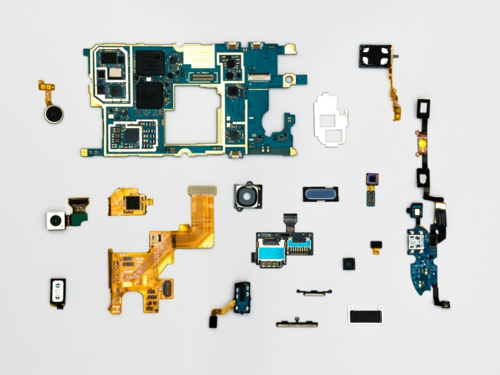

Многие школьники и студенты попадают в водоворот проволочек и учебы в последнюю минуту. Возможно, вы тоже откладываете учебу до тех пор, пока в последнюю ночь перед экзаменом вам не придется часами зубрить, чтобы получить необходимые знания. Но не волнуйтесь, есть лучший способ: составьте эффективный **план обучения**!

Будь то **экзамены на уровень A** или в **университет** - хорошо продуманный план подготовки может стать разницей между успехом и неудачей. В этой статье мы расскажем вам в 7 простых шагах, как составить учебный план, чтобы начать следующий этап экзаменов с меньшим стрессом.

## 1\. Определите и визуализируйте цель обучения

Если вы хотите составить план обучения, то прежде всего вам следует четко определить цель обучения. Определите, какой именно **материал** вам нужно освоить и к какому **сроку**. Убедитесь, что ваши цели **реалистичны**, а содержание **актуально**, чтобы вы не испытывали стресса на этапе обучения.

Четко сформулированная цель обучения - это отправная точка для успешного плана обучения.

Чтобы отслеживать свой прогресс в процессе обучения, ваши цели должны быть **измеримыми**. Полезный метод - представить себе желаемые результаты в конкретных терминах, будь то оценка или определенный уровень знаний. Это даст вам четкое представление о том, к чему вы стремитесь, и создаст дополнительную мотивацию для достижения этой цели.

## 2\. собирать и структурировать учебный материал

Прежде чем составлять план обучения, необходимо собрать и структурировать весь учебный материал. Начните с **полного обзора** всех актуальных тем и отсеивания **несущественной информации**. Запишите источники важного материала, например, **учебники**, **слайды лекций**, **специализированные статьи** или собственные **заметки** с уроков.

Собирая учебные материалы, обратите внимание на их качество.

Затем важно систематически структурировать все собранные материалы, чтобы сохранить общую картину. Для этого можно использовать табличную организацию по **тематическим блокам** или **карты ума**, чтобы не забыть о релевантном контенте.

## 3\. разделить на более мелкие учебные единицы и расставить приоритеты

Теперь, когда вы определили все важные для экзамена темы, пришло время разбить их на **небольшие учебные пакеты**. Это позволит вам эффективнее усваивать и обрабатывать учебный материал. Разбив его на управляемые блоки, вы не дадите себе почувствовать, что перегружены обилием материала, и не потеряете концентрацию.

Более мелкие единицы облегчают обработку и понимание.

Также рекомендуется оценить **уровень сложности** отдельных учебных разделов и расставить приоритеты в соответствии с ними. Таким образом, вы сможете эффективно сконцентрировать свое время и энергию на тех темах, которые представляют наибольшую сложность или имеют особое значение для экзамена. Четкое **ранжирование** учебного материала поможет вам расставить приоритеты и обеспечить оптимальное использование ограниченных ресурсов.

## 4\. найти подходящий метод обучения

Составляя план обучения, стоит также рассмотреть различные методы обучения и выбрать тот, который **подходит** вам больше всего. Методы обучения - это стратегии, направленные на достижение максимального успеха в обучении путем закрепления знаний. Учитывая разнообразие доступных методов, важно выбрать те, которые лучше всего соответствуют вашим **индивидуальным потребностям**, и, возможно, комбинировать различные методы.

Полезно пробовать разные методы обучения.

Чтобы выбрать подходящий метод обучения, прежде всего учитывайте свои предпочтения и стили обучения. Возможно, вы предпочитаете наглядные пособия, такие как **учебные видеоролики** и **графики**, а может быть, вам лучше дается **активное слушание** и **обсуждение**. Экспериментируйте с различными методами, чтобы понять, какие из них наиболее эффективны для вас.

К числу проверенных методов обучения можно отнести следующие:

### Метод локусов

С помощью [метода loci](https://de.wikipedia.org/wiki/Loci-Methode) вы связываете информацию с хорошо известными вам местами. Представьте, что вы изучаете список словарных слов. Каждое слово ассоциируется у вас с определенным местом в вашем доме. Когда вы захотите повторить словарный запас позже, вы мысленно пройдетесь по своему дому и вспомните слова, которые вы связали с определенными местами.

### Принцип Парето

[Принцип Парето](https://de.wikipedia.org/wiki/Paretoprinzip) гласит, что вы можете достичь примерно 80 процентов успеха в обучении, сосредоточившись на наиболее важных 20 процентах материала. Например, вы можете обнаружить, что изучение наиболее важных концепций или формул по предмету принесет вам наибольшую пользу, а остальной материал будет менее важен. Сосредоточившись на главном, вы сможете более эффективно использовать учебное время и добиться лучших результатов. Этот принцип может пригодиться вам уже при составлении плана обучения.

### Система Лейтнера

По [системе Лейтнера](https://de.wikipedia.org/wiki/Lernkartei) вы раскладываете индексные карточки по разным стопкам или лоткам в зависимости от того, насколько хорошо вы усвоили информацию на них. Допустим, у вас есть коробка с 5 отделениями, в которой вы каждый день перебираете свои карточки. Если вы правильно ответили на карточку, она перемещается на одно отделение вперед, пока не попадет в отделение с успешно усвоенной информацией. Если вы ответили неправильно, она возвращается в первое отделение. Таким образом, вы больше концентрируетесь на более сложных карточках, а более легкие приходится повторять реже.

### Техника Pomodoro

[Техника Pomodoro](https://de.wikipedia.org/wiki/Pomodoro-Technik) заключается в разделении работы на интервалы продолжительностью около 25 минут, известные как "помодоро", с последующими короткими перерывами. Например, вы напряженно работаете над задачей в течение 25 минут, а затем делаете 5-минутный перерыв. После четырех "помодоро" сделайте более длительный перерыв - от 15 до 30 минут. Этот метод помогает сохранить концентрацию и снизить утомляемость.

### Мнемоники

[Мнемоника](https://de.wikipedia.org/wiki/Mnemotechnik) - это метод, который помогает вам лучше запоминать информацию, связывая ее с легко запоминающимися образами, историями или структурами. Например, вы можете придумать историю, чтобы запомнить список дат, или использовать аббревиатуру, чтобы запомнить последовательность информации.

## 5\. оценка усилий и составление расписания

Теперь, когда вы структурировали учебный материал, пришло время составить подробное расписание учебных занятий. Этот план поможет вам эффективно достигать целей обучения и поддерживать здоровый баланс между **учебой**, **повседневной жизнью** и **свободным временем**.

Подробное расписание помогает организовать учебный процесс и уложиться в сроки.

При составлении расписания необходимо учитывать несколько важных аспектов. Во-первых, важно предусмотреть **буферные** и **крайние сроки**. Буферное время позволит вам лучше справляться с непредвиденными обстоятельствами или дополнительной нагрузкой, не выбивая из колеи ваш учебный план. Четкие сроки помогут вам не сбиться с пути и не потеряться.

Используйте календарь, чтобы планировать не только время учебы, но и повседневные дела и досуг. Это поможет вам составить сбалансированный график, в котором будет достаточно места для отдыха и расслабления. Не забывайте о **регулярных перерывах в учебе**. Это поможет повысить эффективность и предотвратить появление симптомов усталости.

Будьте реалистами и ставьте перед собой достижимые цели. При необходимости скорректируйте свой план обучения, чтобы обеспечить достижение поставленных целей.

## 6\. мотивация

Приближается этап обучения, а вы не можете преодолеть свое нежелание? Даже если это трудно, постарайтесь с энтузиазмом отнестись к предмету и придерживаться плана обучения, чтобы избежать нехватки времени и угрызений совести.

Важным аспектом мотивации является **личная значимость** учебного материала. Ваш мозг с большей вероятностью сохранит информацию в долгосрочной памяти, если вы воспринимаете ее как значимую и интересную. Поэтому удовольствие от учебы может творить чудеса! Даже если вы не всегда с энтузиазмом относитесь к такому предмету, как расчет процентов, вы должны хотя бы понимать, что он вам пригодится в жизни. Это сделает обучение не только более эффективным, но и более полезным.

Также полезно **связывать** информацию с уже имеющимися знаниями. Поэтому постарайтесь установить связь между учебным материалом и вашими предыдущими знаниями. Практика делает совершенным: **применяя** абстрактный учебный материал на конкретных примерах, вы сможете закрепить свои знания.

На мотивацию могут влиять различные факторы.

Если вы не забываете о своих целях в учебе, вы можете быть уверены, что находитесь на правильном пути и приближаетесь к успеху. Вознаграждайте себя за усилия, будь то **небольшое свободное время**, особое **угощение** или другое лакомство. Расслабляющие занятия, такие как **спорт**, **культурные мероприятия** или **общение**, - это важный баланс между повседневной учебой и поддержанием психического здоровья.

## 7\. размышление

Рефлексия - важнейший этап в процессе обучения, поскольку она позволяет оценить свой прогресс, переосмыслить план обучения и внести необходимые **коррективы**. Зафиксируйте свой прогресс, регулярно пересматривая уровень своих знаний. Подумайте, сможете ли вы еще достичь целей, которые поставили перед собой, или необходимо скорректировать курс. Возможно, ваши методы обучения или цели изменились в процессе обучения - важно признать это и скорректировать свой план обучения соответствующим образом.

Рефлексия по поводу учебного плана позволяет постоянно совершенствовать обучение.

Обращайте внимание на отклонения от первоначального плана обучения и анализируйте их причины. Возможно, вам трудно придерживаться графика или вы легко отвлекаетесь. Определите возможные камни преткновения и подумайте, как вы можете их преодолеть, будь то **повышение дисциплины**, **совершенствование методов управления временем** или **уменьшение количества отвлекающих факторов**.

## Создайте план обучения с помощью SeaTable

Готовы ли вы к следующему экзаменационному периоду? Если нет, то сейчас самое время попробовать **бесплатный учебный план** SeaTable. Создав свой собственный учебный план, вы сможете **упорядочить** все **учебные материалы**. От базовых понятий до сложных тем - все можно структурировать в одном месте. Кроме того, вы можете сохранить **контактные данные своих учителей и преподавателей**, чтобы при необходимости связаться с ними напрямую.

Этот план обучения поможет вам получить **представление обо всем учебном материале** и спланировать **реальные периоды времени** для изучения. Это позволит вам эффективно использовать свое время и гарантировать, что у вас будет достаточно времени для выполнения каждой задачи. Еще одно преимущество плана обучения - возможность расставить **приоритеты** в соответствии с актуальностью всего материала. Вы можете легко **отслеживать прогресс в обучении** и работать конкретно над своими пробелами, просто отмечая основные и подтемы, которые вы уже изучили. **Гибкость** плана обучения позволяет вам в любой момент скорректировать время обучения и цели обучения.

Расслабьтесь и избавьтесь от лишнего стресса! [Зарегистрируйтесь]() бесплатно, создайте свой индивидуальный план обучения с помощью [шаблона]() и почувствуйте, насколько легким может быть обучение.
